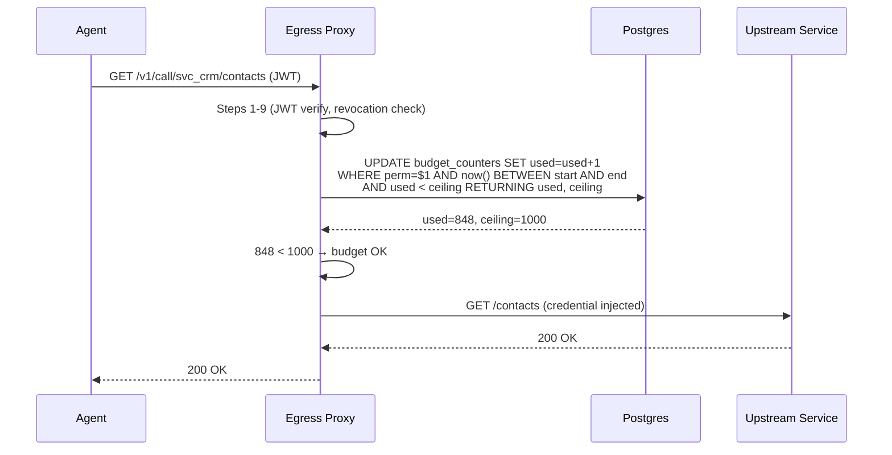
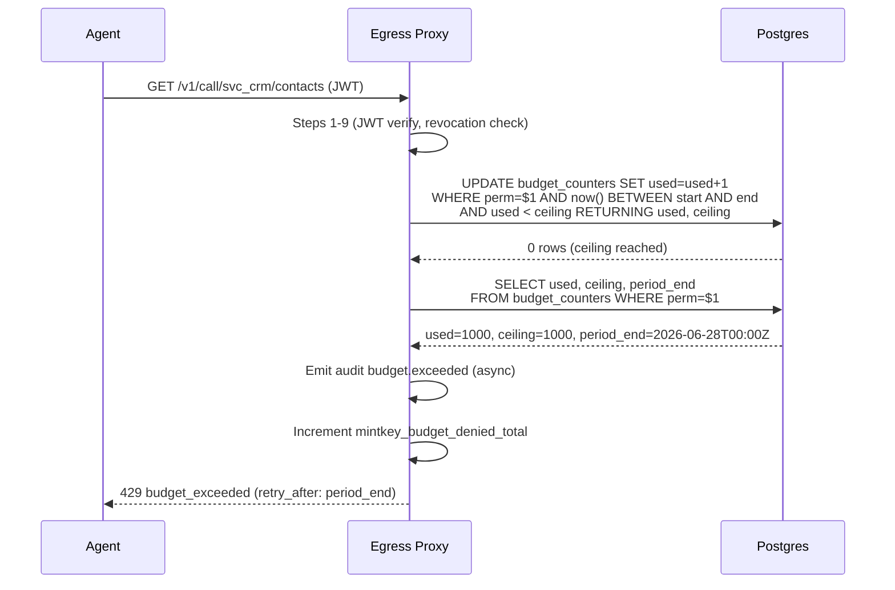
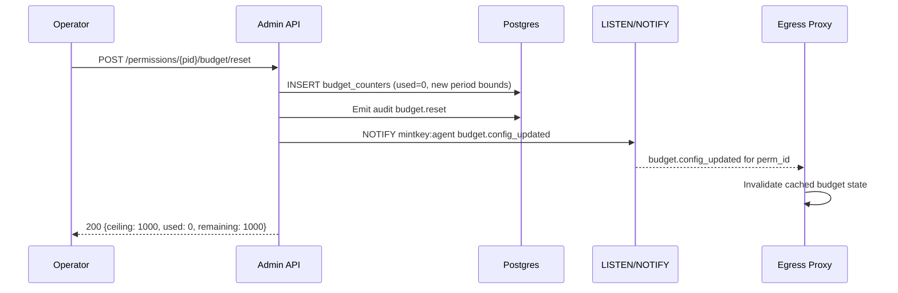

# Agent Budgets — Design

## Architecture Decision

Per [P-011](../../../docs/architecture/proposal/P-011-agent-budgets.md) Option B: separate `budget_counters` table with atomic `UPDATE...RETURNING` in Postgres. Budget configuration lives in `permission_grants.constraints.budget`. No extra infrastructure.

## Data Model

### §1 — Schema: `budget_counters` table (Liquibase changeset)

```yaml
# apps/admin-api/db/changelog/019-budget-counters.yaml
databaseChangeLog:
  - changeSet:
      id: "019-budget-counters"
      author: mintkey
      changes:
        - createTable:
            tableName: budget_counters
            columns:
              - column:
                  name: permission_id
                  type: UUID
                  constraints:
                    nullable: false
                    foreignKeyName: fk_budget_counters_permission
                    references: permission_grants(id)
                    deleteCascade: true
              - column:
                  name: period_start
                  type: TIMESTAMPTZ
                  constraints:
                    nullable: false
              - column:
                  name: period_end
                  type: TIMESTAMPTZ
                  constraints:
                    nullable: false
              - column:
                  name: ceiling
                  type: INTEGER
                  constraints:
                    nullable: false
              - column:
                  name: used
                  type: INTEGER
                  defaultValueNumeric: 0
                  constraints:
                    nullable: false
              - column:
                  name: tenant_id
                  type: UUID
                  constraints:
                    nullable: false
                    foreignKeyName: fk_budget_counters_tenant
                    references: tenants(id)
        - addPrimaryKey:
            tableName: budget_counters
            columnNames: permission_id, period_start
            constraintName: pk_budget_counters

  - changeSet:
      id: "019-budget-counters-rls"
      author: mintkey
      changes:
        - sql:
            sql: |
              ALTER TABLE budget_counters ENABLE ROW LEVEL SECURITY;
              CREATE POLICY tenant_isolation ON budget_counters
                USING (
                  tenant_id = current_setting('app.current_tenant', true)::uuid
                  OR current_setting('app.platform_admin_view', true) = 'on'
                );
      rollback:
        - sql:
            sql: |
              DROP POLICY IF EXISTS tenant_isolation ON budget_counters;
              ALTER TABLE budget_counters DISABLE ROW LEVEL SECURITY;

  - changeSet:
      id: "019-budget-counters-index"
      author: mintkey
      changes:
        - createIndex:
            indexName: idx_budget_counters_active
            tableName: budget_counters
            columns:
              - column:
                  name: permission_id
              - column:
                  name: period_end
                  descending: true
            unique: false
```

### §2 — Constraints schema extension

Add `budget` to the closed `Constraints` schema (ADR-0016.4):

```yaml
Constraints:
  properties:
    # ... existing rate_limit, time_window, request_path_prefix, source_ip_allowlist
    budget:
      type: object
      additionalProperties: false
      description: |
        Call-count ceiling per period. When exhausted, the proxy returns
        429 budget_exceeded without calling upstream. FR-1, FR-2.
      properties:
        ceiling:
          type: integer
          minimum: 1
          description: Maximum calls allowed within a single period.
        period:
          type: string
          enum: [hourly, daily, weekly, monthly]
          description: Reset cadence. Periods are aligned to UTC boundaries.
        alert_thresholds:
          type: array
          items:
            type: integer
            minimum: 1
            maximum: 100
          default: [50, 80, 100]
          description: |
            Percentage thresholds that trigger budget.threshold_reached
            audit events. Default: 50%, 80%, 100%.
      required: [ceiling, period]
```

### §3 — Period boundary alignment (UTC)

| Period   | Start                    | End                           |
|----------|--------------------------|-------------------------------|
| hourly   | Top of the hour          | +1 hour                       |
| daily    | 00:00:00Z                | +24 hours                     |
| weekly   | Monday 00:00:00Z         | +7 days                       |
| monthly  | 1st of month 00:00:00Z  | 1st of next month 00:00:00Z  |

All boundaries are UTC. No timezone-aware budget periods in v1 (keep simple; operators can use `time_window` constraint for time-of-day restrictions).

## Component Design

### §4 — Proxy plugin: budget enforcement (Go)

Extends the 10-step JWT verification flow (ADR-0006) with a new step 10:

```
Steps 1–9: [existing JWT verification, revocation check]

Step 10 — Budget check (FR-2, FR-3):
  a. Extract permission_id from the grant lookup (already resolved in step 6).
  b. If grant has no budget constraint → skip to step 11.
  c. Atomic increment:
     UPDATE budget_counters
     SET used = used + 1
     WHERE permission_id = $1
       AND now() BETWEEN period_start AND period_end
       AND used < ceiling
     RETURNING used, ceiling;
  d. If 0 rows affected:
     - Check if a counter row exists for current period:
       SELECT used, ceiling, period_end FROM budget_counters
       WHERE permission_id = $1 AND now() BETWEEN period_start AND period_end;
     - If exists and used >= ceiling → return 429 budget_exceeded (FR-2).
     - If not exists → create counter row (lazy init, FR-4), then retry (c).
  e. If used crosses an alert_threshold → emit audit event async (FR-7).
  f. Record metric: mintkey_budget_used gauge.

Step 11: Proceed to credential lookup (existing step 10).
```

**Lazy counter initialization**: On the first request of a new period, the proxy upserts:

```sql
INSERT INTO budget_counters (permission_id, period_start, period_end, ceiling, used, tenant_id)
VALUES ($1, $2, $3, $4, 1, $5)
ON CONFLICT (permission_id, period_start) DO UPDATE
SET used = budget_counters.used + 1
WHERE budget_counters.used < budget_counters.ceiling
RETURNING used, ceiling;
```

This handles both initialization and increment atomically.

### §5 — Admin API: budget endpoints (Python/FastAPI)

```
GET  /v1/tenants/{tid}/agents/{aid}/permissions/{pid}/budget
POST /v1/tenants/{tid}/agents/{aid}/permissions/{pid}/budget/reset
```

**GET /budget** (FR-9):
- Returns current period status: `{ceiling, period, used, remaining, period_start, period_end, alert_thresholds}`.
- If no budget configured: 404.

**POST /budget/reset** (FR-5):
- Closes the current counter row (marks it final).
- Creates a new counter row for the current period with `used = 0` and the same ceiling.
- Emits `budget.reset` audit event.
- Fires change-channel notification.
- Returns the new budget status.

**Budget config via PATCH on permission grant** (FR-6):
- Operator PATCHes `constraints.budget` on the grant.
- Admin API validates, persists, upserts counter row if ceiling changed.
- Emits `budget.config_updated` audit event.
- Fires change-channel notification.

### §6 — Change-channel propagation (FR-10)

Budget events ride the existing `mintkey:agent` channel:

```json
{
  "event_id": "change_01HX...",
  "event_type": "budget.config_updated",
  "tenant_id": "tenant_01HX...",
  "target_id": "perm_01HX...",
  "payload": {
    "ceiling": 1000,
    "period": "daily"
  },
  "at": "2026-06-27T14:00:00Z"
}
```

The proxy subscriber receives this and:
1. Invalidates any cached budget state for that permission_id.
2. Next request will read fresh counter from Postgres.

No new channel needed — reuses `mintkey:agent`.

### §7 — Audit events (FR-7)

Four new audit event types added to the `AuditEventType` enum:

| Event type | Actor | Target | Payload |
|---|---|---|---|
| `budget.threshold_reached` | system | permission | `{permission_id, used, ceiling, threshold_pct, period_start, period_end}` |
| `budget.exceeded` | agent | permission | `{permission_id, used, ceiling, period_end, denied_jti}` |
| `budget.config_updated` | operator | permission | `{permission_id, old_ceiling, new_ceiling, old_period, new_period}` |
| `budget.reset` | operator | permission | `{permission_id, previous_used, previous_ceiling, new_period_start}` |

`budget.threshold_reached` is emitted by the proxy (Go `audit.Emit`). `budget.exceeded` is also proxy-emitted. `budget.config_updated` and `budget.reset` are emitted by the Admin API (Python audit helper).

### §8 — MCP surface: `describe_service` extension (FR-8)

The `your_constraints` object in `describe_service` output gains a `budget` field:

```yaml
your_constraints:
  rate_limit: 100
  time_window: 60
  budget:
    ceiling: 1000
    period: "daily"
    used: 847
    remaining: 153
    period_end: "2026-06-28T00:00:00Z"
    alert_thresholds: [50, 80, 100]
```

The MCP server reads this from the `budget_counters` table (joined with the grant's constraints). If no budget is configured, the `budget` field is `null`.

### §9 — Observability (NFR-5)

**Prometheus metrics** (emitted by the proxy plugin):

| Metric | Type | Labels | Description |
|---|---|---|---|
| `mintkey_budget_used` | Gauge | permission_id, agent_id, service_id, tenant_id | Current period usage |
| `mintkey_budget_ceiling` | Gauge | permission_id, agent_id, service_id, tenant_id | Current period ceiling |
| `mintkey_budget_denied_total` | Counter | permission_id, agent_id, service_id, tenant_id | Total denied requests |

**Grafana dashboard panel**: Budget consumption heatmap — shows % used per agent×service, color-coded by threshold proximity.

**Alert rule** (in `infra/observability/alert_rules.yml`):
```yaml
- alert: BudgetNearExhaustion
  expr: mintkey_budget_used / mintkey_budget_ceiling > 0.9
  for: 1m
  labels:
    severity: warning
  annotations:
    summary: "Agent budget > 90% for {{ $labels.agent_id }} on {{ $labels.service_id }}"
```

### §10 — Error response format

```json
{
  "error": "budget_exceeded",
  "detail": "Call budget exhausted for this period.",
  "permission_id": "perm_01HX5J9F8V8H8V0CG3F2Y5J6P1",
  "budget": {
    "ceiling": 1000,
    "used": 1000,
    "period": "daily",
    "period_end": "2026-06-28T00:00:00Z"
  },
  "retry_after": "2026-06-28T00:00:00Z"
}
```

HTTP status: **429 Too Many Requests** (reuses standard status; `error` field distinguishes from rate_limit).

## Sequence Diagram — Happy Path



## Sequence Diagram — Budget Exhausted



## Sequence Diagram — Operator Resets Budget



## Security Considerations

1. **Budget counter is server-side only** — agents cannot manipulate their own counters.
2. **RLS on budget_counters** — tenant isolation is structural (NFR-3).
3. **No credential exposure on 429** — the error response contains only budget metadata, no credential or upstream information.
4. **Audit trail** — every budget denial is auditable, supporting incident investigation.

## Testing Strategy

| Test type | What it validates | Location |
|---|---|---|
| Unit (Go) | Atomic increment logic, period boundary calculation, threshold detection | `apps/proxy-plugin/internal/budget/` |
| Unit (Python) | Budget config validation, period alignment, reset logic | `apps/admin-api/tests/unit/` |
| Integration | End-to-end budget enforcement via proxy with real Postgres | `tests/integration/test_budget_enforcement.py` |
| Architecture | `budget_counters` has RLS policy, cascade FK | `tests/architecture/test_rls_coverage.py` |
| Acceptance | S-SEC-3 extended: agent cannot exceed budget | `tests/acceptance/test_budget_circuit_break.py` |
