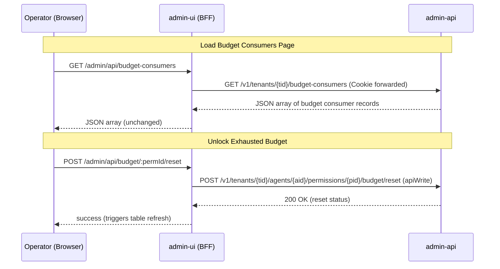
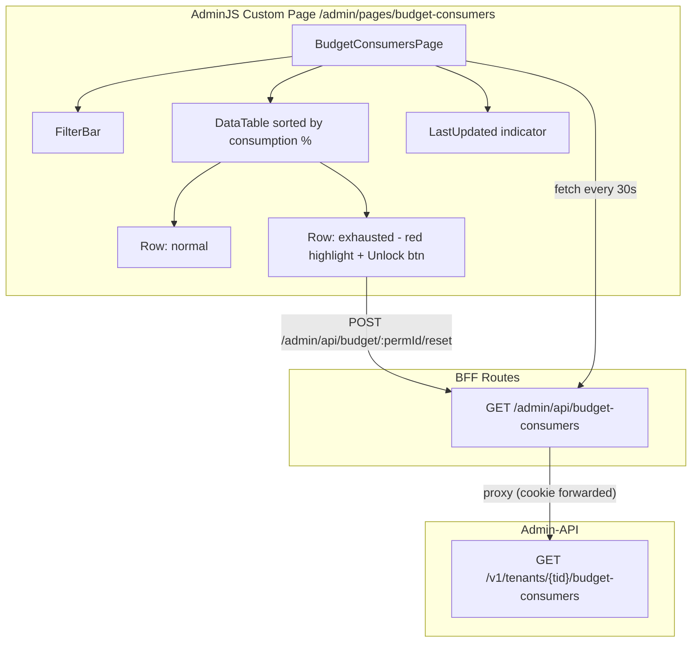

# Design Document: Budget Consumers Dashboard

## Overview

A dedicated AdminJS custom page showing a live table of all budget-configured permission grants ranked by consumption percentage. The page auto-polls every 30 seconds, supports client-side filtering, and offers inline unlock (reset) for exhausted budgets.

The design follows the established BFF pattern (ADR-0019): a new admin-api aggregation endpoint performs the server-side join, a BFF route proxies it, and a React custom page renders the data. No new dependencies are introduced.

## Architecture



### Component Placement



## Components and Interfaces

### Admin-API: Aggregation Endpoint

**File:** `apps/admin-api/src/admin_api/api/budget_consumers.py`

**Router:** `GET /v1/tenants/{tenant_id}/budget-consumers`

SQL logic (single query, RLS-scoped):

```python
@router.get("")
async def list_budget_consumers(
    tenant_id: UUID,
    session: AsyncSession = Depends(get_db_session),
) -> JSONResponse:
    await set_tenant_context(session, tenant_id)

    result = await session.execute(text("""
        SELECT
            pg.id AS permission_id,
            a.id AS agent_id,
            a.name AS agent_name,
            s.id AS service_id,
            s.name AS service_name,
            (pg.constraints->'budget'->>'ceiling')::int AS ceiling,
            pg.constraints->'budget'->>'period' AS period,
            COALESCE(bc.used, 0) AS used,
            COALESCE(
                (SELECT COUNT(*) FROM audit_events ae
                 WHERE ae.event_type = 'token.issued'
                   AND ae.payload->>'permission_id' = pg.id::text
                   AND ae.created_at > NOW() - INTERVAL '30 minutes'
                   AND ae.tenant_id = :tid),
                0
            ) AS requests_last_30_min,
            bc.period_start,
            bc.period_end
        FROM permission_grants pg
        JOIN agents a ON a.id = pg.agent_id AND a.tenant_id = :tid
        JOIN services s ON s.id = pg.service_id AND s.tenant_id = :tid
        LEFT JOIN budget_counters bc ON bc.permission_id = pg.id
            AND NOW() BETWEEN bc.period_start AND bc.period_end
        WHERE pg.tenant_id = :tid
          AND pg.constraints->'budget' IS NOT NULL
          AND (pg.constraints->'budget'->>'ceiling') IS NOT NULL
        ORDER BY
            CASE WHEN COALESCE(bc.used, 0) >= (pg.constraints->'budget'->>'ceiling')::int
                 THEN 0 ELSE 1 END,
            COALESCE(bc.used, 0)::float / NULLIF((pg.constraints->'budget'->>'ceiling')::int, 0) DESC NULLS LAST
    """), {"tid": str(tenant_id)})

    rows = result.fetchall()
    # Transform to response format with wire IDs
    ...
```

**Response schema:**

```typescript
interface BudgetConsumerRecord {
  permission_id: string;   // perm_<ULID>
  agent_id: string;        // agent_<32hex>
  agent_name: string;
  service_id: string;      // svc_<ULID>
  service_name: string;
  consumption_percentage: number;  // Math.round((used / ceiling) * 100)
  used: number;
  ceiling: number;
  period: "hourly" | "daily" | "weekly" | "monthly";
  period_start: string | null;  // ISO 8601 UTC
  period_end: string | null;    // ISO 8601 UTC
  requests_last_30_min: number;
}
```

The endpoint computes `consumption_percentage` server-side: `round((used / ceiling) * 100)`. Results are pre-sorted by consumption percentage descending (exhausted first).

### BFF Route

**File:** `apps/admin-ui/src/routes/budget-consumers.ts`

```typescript
export async function budgetConsumersHandler(req: Request, res: Response): Promise<void> {
  const adminUser = req.session?.adminUser as { tenantId: string } | undefined;
  if (!adminUser?.tenantId) {
    res.status(401).json({ title: "Unauthorized", detail: "No session" });
    return;
  }

  const cookie = req.headers.cookie ?? "";
  try {
    const upstream = await fetch(
      `${ADMIN_API_URL}/v1/tenants/${adminUser.tenantId}/budget-consumers`,
      { headers: { Cookie: cookie } }
    );
    const body = await upstream.text();
    res.status(upstream.status).type("application/json").send(body);
  } catch (err: unknown) {
    const message = err instanceof Error ? err.message : "Upstream error";
    res.status(502).json({ title: "BFF proxy error", detail: message });
  }
}
```

Mounted in `src/index.ts` alongside existing budget routes:

```typescript
app.get("/admin/api/budget-consumers", budgetConsumersHandler);
```

### React Custom Page Component

**File:** `apps/admin-ui/src/components/pages/BudgetConsumersPage.tsx`

Registered via `componentLoader.add()` in `components/index.ts` and wired as an AdminJS page in the AdminJS options (`pages` config).

**Registration (components/index.ts):**

```typescript
BudgetConsumersPage: componentLoader.add("BudgetConsumersPage", "./pages/BudgetConsumersPage"),
```

**AdminJS page config (index.ts):**

```typescript
pages: {
  "budget-consumers": {
    component: Components.BudgetConsumersPage,
    label: "Budget Consumers",
    icon: "Activity",
  },
},
```

**Component responsibilities:**

1. **Data fetching** — `fetch('/admin/api/budget-consumers')` on mount + interval every 30s
2. **Sorting** — Pre-sorted by API; client preserves order
3. **Filtering** — Client-side: threshold %, agent name substring, service name substring; all applied as logical AND
4. **Unlock action** — POST to existing `/admin/api/budget/:permId/reset`; refresh on success
5. **Visual indicators** — Red row highlight + "Unlock" button when `used >= ceiling`
6. **Last updated** — Timestamp of last successful fetch
7. **Empty state** — Message when zero records
8. **Cleanup** — `clearInterval` on unmount

**Filter logic (pure function):**

```typescript
export function filterConsumers(
  records: BudgetConsumerRecord[],
  filters: { threshold?: number; agentName?: string; serviceName?: string }
): BudgetConsumerRecord[] {
  return records.filter((r) => {
    if (filters.threshold != null && r.consumption_percentage <= filters.threshold) return false;
    if (filters.agentName && !r.agent_name.toLowerCase().includes(filters.agentName.toLowerCase())) return false;
    if (filters.serviceName && !r.service_name.toLowerCase().includes(filters.serviceName.toLowerCase())) return false;
    return true;
  });
}
```

**Exhausted state determination (pure function):**

```typescript
export function isExhausted(record: BudgetConsumerRecord): boolean {
  return record.used >= record.ceiling;
}
```

## Data Models

### BudgetConsumerRecord (wire format, shared between API and UI)

```typescript
interface BudgetConsumerRecord {
  permission_id: string;
  agent_id: string;
  agent_name: string;
  service_id: string;
  service_name: string;
  consumption_percentage: number;
  used: number;
  ceiling: number;
  period: "hourly" | "daily" | "weekly" | "monthly";
  period_start: string | null;
  period_end: string | null;
  requests_last_30_min: number;
}
```

### FilterState (component-internal)

```typescript
interface FilterState {
  threshold: number | null;   // show only rows with consumption_percentage > threshold
  agentName: string;          // case-insensitive substring match
  serviceName: string;        // case-insensitive substring match
}
```

## Error Handling

| Scenario | Component | Behavior |
|---|---|---|
| BFF returns 401 (session expired) | BudgetConsumersPage | Existing `requireSession` redirects to login |
| BFF returns 502 (admin-api unreachable) | BudgetConsumersPage | Show "Unable to load data" with retry; retain previous data if polling |
| Admin-api returns 500 | BFF route | Forward 500 unchanged; page shows error |
| Network failure (fetch throws) | BFF route | Return 502 with detail message |
| POST /reset returns 404 | BudgetConsumersPage | Inline error "Budget not found — may have been removed" |
| POST /reset returns 5xx | BudgetConsumersPage | Inline error "Reset failed — try again" |
| Poll fails after initial load | BudgetConsumersPage | Retain previous data; update "Last updated" to show stale indicator |

## Correctness Properties

*A property is a characteristic or behavior that should hold true across all valid executions of a system — essentially, a formal statement about what the system should do. Properties serve as the bridge between human-readable specifications and machine-verifiable correctness guarantees.*

### Property 1: Aggregation endpoint returns only budget-configured grants with complete fields

*For any* tenant with a mix of permission grants (some with budget constraints, some without), the aggregation endpoint SHALL return only those grants that have a budget constraint configured, and each returned record SHALL contain all required fields: agent_name, service_name, consumption_percentage, used, ceiling, period, and requests_last_30_min.

**Validates: Requirements 2.1, 2.2, 2.3, 2.5**

### Property 2: Tenant isolation on aggregation endpoint

*For any* two distinct tenants each with budget-configured grants, querying the aggregation endpoint as tenant A SHALL return zero records belonging to tenant B.

**Validates: Requirements 2.6**

### Property 3: BFF URL construction from session

*For any* valid operator session containing a tenant_id, the BFF handler SHALL construct an upstream URL of the form `/v1/tenants/{tenantId}/budget-consumers` using the tenant_id extracted from the session.

**Validates: Requirements 3.2**

### Property 4: BFF proxy fidelity

*For any* admin-api response (HTTP status 200-599) with any JSON body, the BFF budget-consumers handler SHALL return the identical HTTP status code and body to the caller without modification.

**Validates: Requirements 3.3, 3.4**

### Property 5: Consumption percentage computation

*For any* valid (used, ceiling) pair where ceiling > 0, the computed consumption_percentage SHALL equal `Math.round((used / ceiling) * 100)`.

**Validates: Requirements 4.2**

### Property 6: Descending sort by consumption percentage

*For any* array of budget consumer records returned by the endpoint or displayed in the table, each record's consumption_percentage SHALL be greater than or equal to the next record's consumption_percentage (descending order).

**Validates: Requirements 4.3**

### Property 7: Filter composition (logical AND)

*For any* combination of active filters (threshold, agentName, serviceName) and any dataset, a record is visible if and only if it passes ALL active filters: consumption_percentage > threshold AND agent_name contains agentName (case-insensitive) AND service_name contains serviceName (case-insensitive).

**Validates: Requirements 5.1, 5.2, 5.3, 5.4**

### Property 8: Exhausted state determination

*For any* budget consumer record, the exhausted visual state (red highlight and "Unlock" button visibility) SHALL be applied if and only if `used >= ceiling`.

**Validates: Requirements 6.1, 6.5, 8.1, 8.2**

## Testing Strategy

### Unit Tests (vitest)

**Pure utility functions:**
- `filterConsumers()`: specific examples with various filter combinations + empty data
- `isExhausted()`: boundary cases (used == ceiling, used == ceiling - 1, used > ceiling)
- Consumption percentage formatting: edge cases (ceiling=0 guard, used=0)

**React component tests (vitest + @testing-library/react):**
- BudgetConsumersPage: renders table columns, empty state, exhausted row styling, filter bar
- Unlock button: appears only on exhausted rows, triggers POST on click

### Property-Based Tests (vitest + fast-check)

Minimum 100 iterations per property. Tag format: `// Feature: budget-consumers-dashboard, Property N: <text>`

- **Property 5**: Generate random `{ used: nat(), ceiling: nat(min=1) }` pairs → verify percentage computation
- **Property 6**: Generate random arrays of records → sort → verify descending invariant
- **Property 7**: Generate random records + random filter state → apply filterConsumers → verify each visible row passes all filters AND each filtered-out row fails at least one
- **Property 8**: Generate random `{ used: nat(), ceiling: nat(min=1) }` → verify isExhausted matches `used >= ceiling`

### Integration Tests (vitest + supertest)

BFF route tested with supertest against the Express app with admin-api mocked (nock):

- GET /admin/api/budget-consumers → proxies correctly with tenant from session
- GET /admin/api/budget-consumers → returns 401 without session
- GET /admin/api/budget-consumers → returns 502 when admin-api is down
- Proxy fidelity: various status codes forwarded unchanged

### Admin-API Tests (pytest + httpx)

- Aggregation endpoint returns correct records for seeded data
- Tenant isolation: multi-tenant seed, verify no cross-tenant leakage
- Empty result: tenant with no budget-configured grants returns `[]`
- requests_last_30_min computation with seeded audit events
