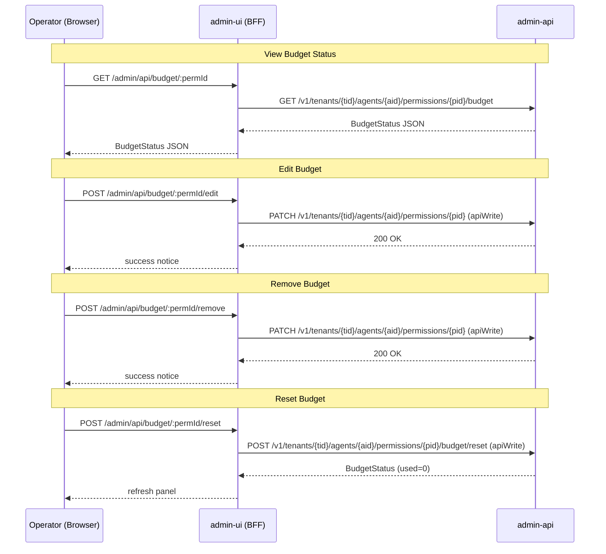
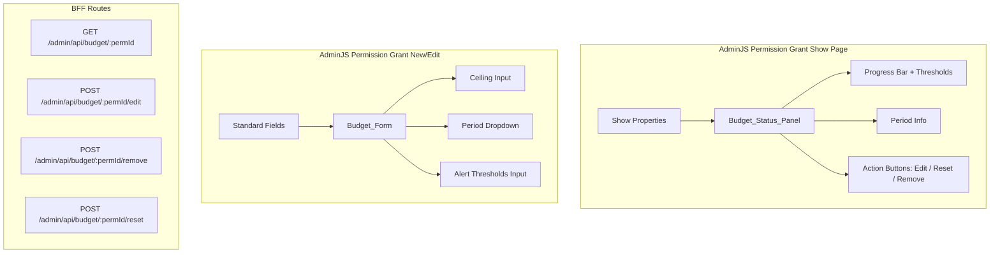

# Design Document: Budget Management UI

## Overview

This feature adds budget management capabilities to the AdminJS-based admin console. Operators can view budget status, create/edit/remove budget constraints on permission grants, and reset budget counters mid-period — all through the existing admin-ui BFF pattern.

The admin-api already exposes the necessary endpoints (GET /budget, POST /budget/reset, PATCH /permissions/{pid}). This design covers the BFF route handlers that proxy those calls, the React components that render budget UI, and the AdminJS resource configuration changes needed to wire them together.

**Key constraint:** The admin-ui holds no direct DB connection — all writes flow through admin-api via `apiWrite()` with session + signed JWT per ADR-0019.

## Architecture



### Component Placement



## Components and Interfaces

### React Components

#### BudgetStatusPanel (`components/sections/BudgetStatusPanel.tsx`)

Rendered on the permission grant show page via a virtual property (same pattern as `CredentialShowPanel`). Fetches budget data from the BFF on mount and displays:

- **Progress bar** showing `used / ceiling` with percentage label
- **Threshold markers** positioned at each `alert_threshold` percentage
- **Period info**: period type (daily/hourly/weekly/monthly), period_start, period_end in human-readable format
- **Exhaustion indicator**: red color when `used >= ceiling`
- **Action buttons**: "Edit Budget", "Reset Budget", "Remove Budget"
- **Empty state**: "No budget configured" when no budget exists or API returns 404

```typescript
interface BudgetStatus {
  ceiling: number;
  period: "hourly" | "daily" | "weekly" | "monthly";
  used: number;
  remaining: number;
  period_start: string; // ISO 8601
  period_end: string;   // ISO 8601
  alert_thresholds: number[];
}
```

**Fetch pattern:** Uses `window.fetch("/admin/api/budget/{permId}")` on mount (same-origin BFF route, session cookie forwarded automatically).

#### BudgetForm (`components/actions/BudgetForm.tsx`)

Used in two contexts:
1. **Create mode** — embedded in the permission grant `new` action form (optional fields)
2. **Edit mode** — rendered when the `editBudget` custom action fires (pre-populated)

Fields:
- `ceiling`: number input, min=1, required when budget is being set
- `period`: dropdown select (`hourly | daily | weekly | monthly`), required when budget is being set
- `alert_thresholds`: text input accepting comma-separated integers (1-100), optional (defaults to `[50, 80, 100]`)

**Client-side validation** (runs before submission):
- `ceiling` must be a positive integer (>= 1)
- Each threshold value must be an integer in [1, 100]
- If ceiling or period is provided, both are required

#### Utility: `formatPeriod(period, periodStart, periodEnd)` 

Pure function in `components/utils/budget-format.ts`. Converts ISO dates + period enum to human-readable display strings (e.g. "Daily: Jun 15, 2026 00:00 UTC - Jun 16, 2026 00:00 UTC").

#### Utility: `validateBudgetInput(ceiling, period, thresholds)`

Pure function in `components/utils/budget-validate.ts`. Returns `{ valid: boolean; errors: string[] }`.

### BFF Route Handlers

Mounted in `index.ts` after `requireSession` middleware (same pattern as the OAuth2 authorize passthrough). All routes are under `/admin/api/budget/`.

#### GET `/admin/api/budget/:permId`

1. Extract `tenantId` from `req.session.adminUser`
2. Fetch the permission record to get `agent_id` (via admin-api list or a dedicated lookup)
3. Proxy to `GET /v1/tenants/{tid}/agents/{aid}/permissions/{pid}/budget`
4. Forward response status + body unchanged

#### POST `/admin/api/budget/:permId/edit`

1. Extract `tenantId` from session, parse body `{ ceiling, period, alert_thresholds }`
2. Look up permission record for `agent_id`
3. Call `apiWrite(PATCH /v1/tenants/{tid}/agents/{aid}/permissions/{pid}, { constraints: { budget: { ceiling, period, alert_thresholds } } })` with operator session
4. Forward response

#### POST `/admin/api/budget/:permId/remove`

1. Extract `tenantId` from session
2. Look up permission record for `agent_id`
3. Call `apiWrite(PATCH /v1/tenants/{tid}/agents/{aid}/permissions/{pid}, { constraints: { budget: null } })` with operator session
4. Forward response

#### POST `/admin/api/budget/:permId/reset`

1. Extract `tenantId` from session
2. Look up permission record for `agent_id`
3. Call `apiWrite(POST /v1/tenants/{tid}/agents/{aid}/permissions/{pid}/budget/reset)` with operator session
4. Forward response

### AdminJS Resource Config Changes

In `resources/permissions.ts`:

1. **Register `editBudget` custom action** — `actionType: "record"`, `isVisible: true`, `component: Components.BudgetForm`, handler delegates to the BFF route
2. **Add `BudgetStatusPanel` to show page** — via a virtual property `_budgetPanel` with `components: { show: Components.BudgetStatusPanel }` (same pattern as `CredentialShowPanel`)
3. **Keep generic `edit` disabled** — `isVisible: false` unchanged
4. **Include `BudgetForm` fields in `new` action** — extend the existing `new` handler to parse budget fields from payload and include them in `constraints.budget`

### Admin-API Extension: Budget Removal

The existing `PATCH /v1/tenants/{tid}/agents/{aid}/permissions/{pid}` handler uses `model_dump(exclude_none=True)` which means `budget: None` (Python) gets excluded from the merged constraints. To support removal, the PATCH handler needs a small extension:

**Required change:** When `body.constraints.budget` is explicitly `None` (not absent/unset), the handler should delete the `budget` key from the stored constraints and clean up the associated `budget_counters` rows.

This requires distinguishing between "field not sent" (keep existing) and "field sent as null" (remove). Pydantic supports this via sentinel values or explicit `json_schema_extra`. The recommended approach:

```python
# In PermissionPatchRequest, allow explicit null:
budget: Optional[BudgetConfig] | None = Field(default=..., json_schema_extra={"nullable": True})
```

Or simpler: check if `"budget"` key is present in the raw request body (via `model_fields_set`):

```python
if "budget" in body.constraints.model_fields_set and body.constraints.budget is None:
    # Explicit removal — delete budget key from constraints
    new_constraints.pop("budget", None)
    # Clean up counter rows
    await session.execute(text("DELETE FROM budget_counters WHERE permission_id = :pid"), {"pid": perm_db_id})
```

## Data Models

### BudgetStatus (BFF response / component prop)

```typescript
interface BudgetStatus {
  ceiling: number;
  period: "hourly" | "daily" | "weekly" | "monthly";
  used: number;
  remaining: number;
  period_start: string; // ISO 8601 UTC
  period_end: string;   // ISO 8601 UTC
  alert_thresholds: number[]; // e.g. [50, 80, 100]
}
```

### BudgetFormData (form state)

```typescript
interface BudgetFormData {
  ceiling: string;         // raw input (validated to integer >= 1)
  period: string;          // "hourly" | "daily" | "weekly" | "monthly" | ""
  alert_thresholds: string; // raw input, e.g. "50, 80, 100"
}
```

### BudgetEditRequest (BFF POST body)

```typescript
interface BudgetEditRequest {
  ceiling: number;
  period: "hourly" | "daily" | "weekly" | "monthly";
  alert_thresholds?: number[];
}
```

### Permission Record (from admin-api, relevant fields)

```typescript
interface PermissionRecord {
  id: string;           // perm_<ULID>
  agent_id: string;     // agent_<32hex>
  tenant_id: string;
  constraints: {
    budget?: {
      ceiling: number;
      period: string;
      alert_thresholds?: number[];
    };
    // ... other constraint types
  };
}
```

## Correctness Properties

*A property is a characteristic or behavior that should hold true across all valid executions of a system — essentially, a formal statement about what the system should do. Properties serve as the bridge between human-readable specifications and machine-verifiable correctness guarantees.*

### Property 1: Progress bar percentage accuracy

*For any* valid BudgetStatus where ceiling > 0 and 0 <= used <= ceiling, the computed progress bar percentage should equal `Math.round((used / ceiling) * 100)`.

**Validates: Requirements 1.2**

### Property 2: Period formatter produces valid output

*For any* valid period string (one of "hourly", "daily", "weekly", "monthly") and any valid ISO 8601 period_start and period_end timestamps, the `formatPeriod` function should return a non-empty string containing the period type and both date representations.

**Validates: Requirements 1.3**

### Property 3: Threshold marker positioning

*For any* valid alert_thresholds array (each element an integer in [1, 100]), each rendered threshold marker's position percentage should equal the threshold value itself (since thresholds are already expressed as percentages of ceiling).

**Validates: Requirements 1.4**

### Property 4: Budget form serialization round-trip

*For any* valid budget form input (ceiling: positive integer, period: valid enum value, alert_thresholds: array of integers in [1, 100]), serializing the form data into a request body and parsing it back should produce the original values. Additionally, when pre-populating the form from a BudgetStatus, the form fields should reflect the exact values.

**Validates: Requirements 2.2, 3.1**

### Property 5: Budget validation rejects all invalid inputs

*For any* ceiling value that is not a positive integer (zero, negative, float, NaN, non-numeric string) OR *for any* threshold value outside the integer range [1, 100], the `validateBudgetInput` function should return `{ valid: false }` with a non-empty errors array.

**Validates: Requirements 2.4, 2.5**

### Property 6: BFF proxy fidelity

*For any* admin-api response (HTTP status 200-599) with any JSON body, the BFF budget handlers should return the same HTTP status code and the same JSON body to the caller, without modification.

**Validates: Requirements 6.1, 6.5**

### Property 7: BFF URL construction from session

*For any* valid session containing a `tenantId` string and any valid `permId` path parameter, the BFF handler should construct an upstream URL containing `/v1/tenants/{tenantId}/agents/{agentId}/permissions/{permId}` where agentId is extracted from the permission record.

**Validates: Requirements 6.4**

## Error Handling

| Scenario | Component | Behavior |
|---|---|---|
| BFF GET /budget returns 404 (no budget) | BudgetStatusPanel | Display "No budget configured" with option to create |
| BFF GET /budget returns 5xx | BudgetStatusPanel | Display "Unable to load budget status" with retry button |
| BFF POST edit returns 422 (validation) | BudgetForm | Display admin-api error message inline |
| BFF POST edit returns 404 (grant gone) | BudgetForm | Display "Permission grant not found" and redirect |
| BFF POST remove returns 422 (null not supported) | BudgetStatusPanel | Display informational message per Req 4.4 |
| BFF POST reset returns 404 (no budget) | BudgetStatusPanel | Display error; budget was removed concurrently |
| Network failure (fetch throws) | All components | Display "Network error — please try again" |
| Session expired (401 from BFF) | All components | Admin-ui redirects to login (existing requireSession) |

**Error passthrough principle:** BFF handlers forward admin-api error responses (status + body) unchanged. The React components parse the `title` field from the error body for display.

## Testing Strategy

### Test-Driven Development (TDD)

All code is developed test-first per the project's TDD discipline.

### Unit Tests (vitest)

**Pure utility functions:**
- `budget-format.ts`: formatPeriod, formatDate — concrete examples + edge cases (midnight boundaries, month transitions)
- `budget-validate.ts`: validateBudgetInput — specific invalid/valid examples

**React component tests:**
- BudgetStatusPanel: renders progress bar, thresholds, empty state, exhaustion state
- BudgetForm: renders fields, validates input, submits correctly

### Property-Based Tests (vitest + fast-check)

Property-based testing library: **fast-check** (standard choice for JS/TS per the vitest ecosystem).

Each property test runs a minimum of 100 iterations and is tagged with its design property reference.

- **Property 1**: Generate random `{ used, ceiling }` pairs → verify percentage calculation
- **Property 2**: Generate random periods + ISO dates → verify formatPeriod output
- **Property 3**: Generate random threshold arrays → verify marker positions
- **Property 4**: Generate random valid budget configs → verify serialization preserves values
- **Property 5**: Generate random invalid inputs → verify all rejected
- **Property 6**: Generate random HTTP statuses + bodies → verify BFF passthrough
- **Property 7**: Generate random tenant IDs + perm IDs → verify URL construction

Tag format: `// Feature: budget-management-ui, Property N: <property_text>`

### Integration Tests (vitest + supertest)

BFF route handlers tested with supertest against the Express app with admin-api mocked (nock or msw):

- GET /admin/api/budget/:permId → proxies correctly, handles 404/500
- POST /admin/api/budget/:permId/edit → calls PATCH with correct body
- POST /admin/api/budget/:permId/remove → calls PATCH with `{ budget: null }`
- POST /admin/api/budget/:permId/reset → calls POST to reset endpoint
- Session extraction: verifies tenant_id comes from session, not URL

### Admin-API Tests (pytest + httpx)

For the budget removal extension:
- PATCH with `{ constraints: { budget: null } }` removes budget from constraints
- PATCH with budget:null also cleans up budget_counters rows
- Audit event `budget.config_updated` emitted with removal payload
