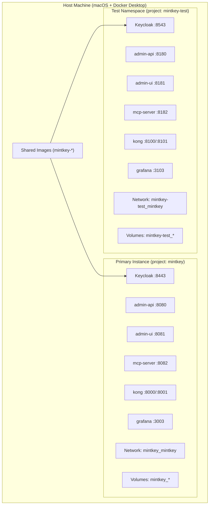

# Design Document: Dev-Test Namespace

## Overview

This design delivers a parallel, isolated Mintkey development/testing environment using Docker Compose's multi-file override mechanism. The test namespace (`mintkey-test`) runs simultaneously alongside the primary instance (`mintkey`) on the same machine, sharing built images but isolating ports, volumes, networks, and data.

The implementation consists of three new files:
1. `docker-compose.test.yml` — override file remapping all 16 host ports by +100 and pinning image names
2. `.env.test` — environment file with offset public URLs for SSO/OIDC flows
3. Three Makefile targets — `dev-test`, `dev-test-down`, `dev-test-logs`

Plus documentation in `docs/DEV-TEST.md`.

### Key Design Decisions

1. **Docker Compose multi-file override** — the test namespace layers `docker-compose.test.yml` on top of the primary `docker-compose.yml` using `-f` flags, requiring zero changes to the primary file.
2. **Explicit `image:` pinning** — locally-built services get `image: mintkey-<service>` in the override to prevent Docker Compose from generating `mintkey-test-<service>` tags and triggering rebuilds.
3. **`--env-file .env.test`** — overrides the `MINTKEY_*_PUBLIC_URL` variables so all OIDC redirect URIs and cross-service links resolve to offset ports.
4. **`--project-name mintkey-test`** — Docker Compose auto-prefixes volumes and networks, providing isolation without explicit volume/network renaming.
5. **`extra_hosts` with offset port** — `jaeger-auth` needs `localhost:host-gateway` to reach Keycloak at the test namespace's offset port (8543).

## Architecture



### Isolation Boundaries

| Resource | Primary Instance | Test Namespace | Mechanism |
|----------|-----------------|----------------|-----------|
| Project name | `mintkey` | `mintkey-test` | `--project-name` flag |
| Host ports | Base ports | Base + 100 | `docker-compose.test.yml` port overrides |
| Volumes | `mintkey_*` | `mintkey-test_*` | Auto-prefixed by project name |
| Network | `mintkey_mintkey` | `mintkey-test_mintkey` | Auto-created by project name |
| Images | `mintkey-<svc>` | Same `mintkey-<svc>` | Explicit `image:` in override |
| Env vars | `.env` (or defaults) | `.env.test` | `--env-file` flag |

## Components and Interfaces

### 1. Docker Compose Override File (`docker-compose.test.yml`)

The override file contains only the deltas needed for the test namespace:

**Port remapping** — every service with a `ports:` directive gets its host port shifted by +100:

| Service | Primary Port | Test Port | Binding |
|---------|-------------|-----------|---------|
| keycloak | 8443 | 8543 | `0.0.0.0` |
| admin-api | 8080 | 8180 | `0.0.0.0` |
| admin-ui | 8081 | 8181 | `0.0.0.0` |
| mcp-server | 8082 | 8182 | `0.0.0.0` |
| broker | 8083 | 8183 | `0.0.0.0` |
| vault-adapter (gRPC) | 8084 | 8184 | `0.0.0.0` |
| vault-adapter (HTTP) | 8087 | 8187 | `0.0.0.0` |
| kong-syncer | 8085 | 8185 | `0.0.0.0` |
| kong (proxy) | 8000 | 8100 | `0.0.0.0` |
| kong (admin) | 8001 | 8101 | `127.0.0.1` |
| proxy-plugin | 8086 | 8186 | `0.0.0.0` |
| mock-backend | 8999 | 9099 | `0.0.0.0` |
| otel-collector | 4317 | 4417 | `0.0.0.0` |
| jaeger-auth | 16686 | 16786 | `0.0.0.0` |
| grafana | 3003 | 3103 | `0.0.0.0` |
| cAdvisor | 8088 | 8188 | `0.0.0.0` |

**Image pinning** — for each locally-built service, the override sets `image: mintkey-<service>` to lock the image name to the primary project's tag:

```yaml
services:
  seed-job:
    image: mintkey-seed-job
    ports: []  # no host port (one-shot job)
  vault-adapter:
    image: mintkey-vault-adapter
    ports:
      - "8184:8084"
      - "8187:8087"
  admin-api:
    image: mintkey-admin-api
    ports:
      - "8180:8080"
  # ... etc for all 10 locally-built services
```

**`extra_hosts` for jaeger-auth** — the `localhost:host-gateway` mapping is inherited from the primary compose file. The override only needs to remap the port. The `MINTKEY_KEYCLOAK_PUBLIC_URL` env var (from `.env.test`) already points to port 8543, so the `--oidc-issuer-url` and `--redirect-url` command args resolve correctly via variable interpolation.

### 2. Environment File (`.env.test`)

Contains all public URL variables pointing to offset ports:

```dotenv
# Dev-test namespace — offset public URLs for SSO/OIDC flows.
# Loaded via: docker compose --env-file .env.test

MINTKEY_KEYCLOAK_PUBLIC_URL=http://localhost:8543
MINTKEY_ADMIN_API_PUBLIC_URL=http://localhost:8180
MINTKEY_ADMIN_UI_PUBLIC_URL=http://localhost:8181
MINTKEY_MCP_PUBLIC_URL=http://localhost:8182
MINTKEY_PROXY_PUBLIC_URL=http://localhost:8100
MINTKEY_GRAFANA_PUBLIC_URL=http://localhost:3103
MINTKEY_JAEGER_PUBLIC_URL=http://localhost:16786
```

These variables are interpolated by Docker Compose into the service environment blocks in the primary `docker-compose.yml` (which uses `${MINTKEY_*_PUBLIC_URL:-default}` syntax). The seed-job reads `MINTKEY_ADMIN_API_PUBLIC_URL`, `MINTKEY_GRAFANA_PUBLIC_URL`, and `MINTKEY_JAEGER_PUBLIC_URL` to patch Keycloak redirect URIs.

### 3. Makefile Targets

```makefile
dev-test:
	docker compose -f docker-compose.yml -f docker-compose.test.yml \
		--env-file .env.test --project-name mintkey-test up -d
	@echo ""
	@echo "Test namespace started."
	@echo "  admin-api:  http://localhost:8180"
	@echo "  admin-ui:   http://localhost:8181"
	@echo "  Keycloak:   http://localhost:8543"
	@echo "  Grafana:    http://localhost:3103"
	@echo ""
	@echo "Bootstrap password: $$(docker run --rm \
		-v mintkey-test_bootstrap_secrets:/secrets alpine \
		cat /secrets/admin_password 2>/dev/null || echo 'not yet seeded')"

dev-test-down:
	docker compose --project-name mintkey-test down

dev-test-logs:
	docker compose --project-name mintkey-test logs -f
```

### 4. Documentation (`docs/DEV-TEST.md`)

A markdown file documenting:
- Concept explanation (parallel namespace via Docker Compose override)
- Port offset rule (primary + 100)
- Complete port mapping table (16 services × 2 columns)
- Usage instructions (`make dev-test`, `make dev-test-down`, `make dev-test-logs`)
- How to verify health and access services
- Troubleshooting (port conflicts, verifying primary is unaffected)

## Data Models

This feature introduces no new data models or database schema changes. Each namespace has its own isolated set of Docker volumes:

| Volume | Primary | Test Namespace |
|--------|---------|----------------|
| postgres_data | `mintkey_postgres_data` | `mintkey-test_postgres_data` |
| vault_data | `mintkey_vault_data` | `mintkey-test_vault_data` |
| vault_kek | `mintkey_vault_kek` | `mintkey-test_vault_kek` |
| bootstrap_secrets | `mintkey_bootstrap_secrets` | `mintkey-test_bootstrap_secrets` |
| grafana_data | `mintkey_grafana_data` | `mintkey-test_grafana_data` |
| broker_wal | `mintkey_broker_wal` | `mintkey-test_broker_wal` |
| proxy_wal | `mintkey_proxy_wal` | `mintkey-test_proxy_wal` |

The test namespace's seed-job bootstraps its own Keycloak realm, admin credentials, and OIDC clients independently — writing to `mintkey-test_bootstrap_secrets` and `mintkey-test_postgres_data`.

## Error Handling

| Failure Mode | Detection | Behavior |
|---|---|---|
| Port conflict (test port already in use) | Docker Compose exits non-zero with bind error | Error message includes the port number and service name; operator resolves the conflict manually |
| Primary images not built | Docker Compose detects missing image | Falls back to building from `docker-compose.yml` build contexts; caches under `mintkey-<service>` tag |
| `.env.test` missing | `--env-file .env.test` flag fails | Docker Compose exits with "file not found" error before starting any containers |
| `docker-compose.test.yml` missing | `-f docker-compose.test.yml` flag fails | Docker Compose exits with "file not found" error |
| Seed-job fails (Keycloak not ready) | `restart: on-failure:3` + `depends_on` condition | Seed-job retries up to 3 times; if Keycloak never becomes healthy, seed-job exits non-zero and dependent services won't start |
| Volume permission error | Container fails to write to volume | Standard Docker error; operator checks Docker Desktop disk permissions |

No custom error handling code is needed — Docker Compose's built-in error reporting and the existing service healthchecks/restart policies handle all failure modes.

## Correctness Properties

This feature is infrastructure configuration (Docker Compose YAML, environment files, Makefile targets). It has no pure functions, parsers, or business logic suitable for property-based testing. The correctness properties are expressed as integration-test assertions rather than executable PBT properties:

### Property 1: Port isolation invariant

For every service S with a host port P in the primary instance, the test namespace binds S to host port P+100. No port number is shared between the two namespaces when both are running simultaneously.

**Validates: Requirements 2.1, 2.2, 2.3**

### Property 2: Volume isolation invariant

Tearing down one namespace's volumes (via `docker compose --project-name <name> down --volumes`) does not delete, corrupt, or modify the other namespace's volumes. The surviving namespace's services continue operating without re-seeding.

**Validates: Requirements 3.2, 3.3, 3.4**

### Property 3: Network isolation invariant

No container in one namespace can establish a TCP connection to any container in the other namespace. DNS resolution of cross-namespace service names fails.

**Validates: Requirements 4.2, 4.3**

### Property 4: Image identity invariant

Both namespaces use byte-identical Docker images. Starting the test namespace when primary images are already built never triggers a Docker build step.

**Validates: Requirements 6.2, 6.3**

### Property 5: Functional parity invariant

Every service that reaches healthy state in the primary instance also reaches healthy state in the test namespace within the same timeout (180 seconds). SSO, MCP discovery, and proxied calls all function correctly at the offset ports.

**Validates: Requirements 10.1, 10.2, 10.3, 10.4**

## Testing Strategy

### Why Property-Based Testing Does NOT Apply

This feature is entirely Docker Compose configuration (declarative YAML), environment files, Makefile shell targets, and documentation. There are:
- No pure functions with input/output behavior
- No parsers, serializers, or data transformations
- No business logic with a meaningful input space
- No code that benefits from randomized input generation

The feature is infrastructure configuration — the correct testing approach is integration tests and smoke tests with concrete examples.

### Testing Approach

**Integration tests** (require Docker; run against the live stack):

1. **Namespace isolation test** — start both namespaces, verify containers have correct project-name prefixes, verify volumes are correctly prefixed, verify networks are separate.
2. **Port binding test** — start both namespaces, verify all 16 test ports respond on the expected port numbers.
3. **Network isolation test** — from a test-namespace container, attempt to reach a primary-namespace container by IP/hostname; verify connection fails.
4. **Volume isolation test** — tear down test namespace with `--volumes`, verify primary volumes still exist and primary services still run.
5. **SSO flow test** — access admin-ui at port 8181, verify Keycloak redirect goes to port 8543 (not 8443).
6. **Image sharing test** — build images via primary, start test namespace, verify no "Building" output in compose logs.

**Smoke tests** (quick verification):

1. **`make dev-test` smoke** — run the target, verify all services reach healthy state within 180s.
2. **`make dev-test-down` smoke** — run the target, verify test containers are removed, primary containers unaffected.
3. **Primary unaffected test** — start test namespace, verify primary namespace health endpoints still respond on original ports.

**Static validation**:

1. **YAML syntax** — `docker compose -f docker-compose.yml -f docker-compose.test.yml config` validates the merged configuration.
2. **Port arithmetic** — verify every test port = primary port + 100 (can be a simple script or unit test parsing the YAML).
3. **Env file completeness** — verify `.env.test` contains all 7 required `MINTKEY_*_PUBLIC_URL` variables with correct offset port values.

### Test Execution

```sh
# Validate merged compose config (no Docker required)
docker compose -f docker-compose.yml -f docker-compose.test.yml \
  --env-file .env.test config > /dev/null

# Start test namespace and verify health
make dev-test
docker compose --project-name mintkey-test ps --format json | \
  python3 -c "import json,sys; data=json.loads(sys.stdin.read()); \
  assert all(s['Health']=='healthy' for s in data if 'Health' in s)"

# Verify port offset correctness
curl -sf http://localhost:8180/v1/health  # admin-api test
curl -sf http://localhost:8181/health     # admin-ui test
curl -sf http://localhost:3103/api/health # grafana test

# Verify primary unaffected
curl -sf http://localhost:8080/v1/health  # admin-api primary
curl -sf http://localhost:8081/health     # admin-ui primary

# Tear down test namespace
make dev-test-down
```

