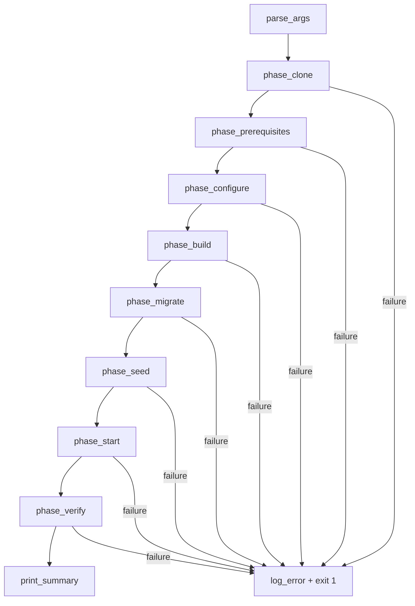
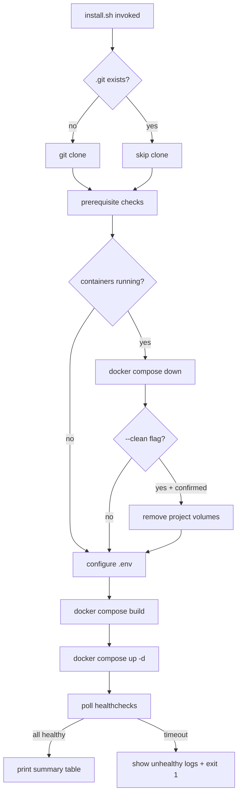

# Design Document: Developer Install Script

## Overview

The developer install script (`install.sh`) is a single Bash file that automates the full "clone to running stack" workflow for Mintkey. It orchestrates eight sequential phases: clone, prerequisite validation, interactive configuration, container build, database migration, seeding, stack startup, and health verification.

The script targets developers and self-hosters deploying from source on Linux (Ubuntu 22.04+, Debian 12+, Fedora 38+) and macOS 13+. It produces a fully running 15-service Docker Compose stack with all seeding complete and health-verified.

### Design Decisions

1. **Single-file Bash script** — no external dependencies beyond Docker, Docker Compose, and Git. Avoids requiring Python/Node/Go on the host for the installer itself.
2. **Phase-based architecture** — each phase is an isolated function with clear entry/exit conditions, enabling idempotent re-runs and targeted error recovery.
3. **Bash 4.0 minimum** — ensures compatibility with macOS (via Homebrew bash) and all target Linux distros without relying on newer features.
4. **Log-to-file by default** — all command output streams to a timestamped log file while the user sees only phase progress indicators.

## Architecture

The script follows a linear pipeline architecture with early-exit on failure:



### Idempotent Re-run Flow



## Components and Interfaces

### Internal Functions

| Function | Responsibility |
|----------|---------------|
| `main()` | Entry point; calls `parse_args` then each phase in order |
| `parse_args()` | Parses `--non-interactive`, `--clean`, `--help`, env-var overrides |
| `phase_clone()` | Clones repo if `.git` absent; skips otherwise |
| `phase_prerequisites()` | Validates Docker ≥ 24, `docker compose` v2, Git, Docker daemon |
| `phase_configure()` | Interactive prompts or env-var defaults; writes `.env` from `.env.example` |
| `phase_build()` | Runs `DOCKER_BUILDKIT=1 docker compose build` |
| `phase_migrate()` | Handled by Docker Compose dependency graph (Liquibase depends_on postgres healthy) |
| `phase_seed()` | Handled by Docker Compose dependency graph (seed-job depends_on liquibase + keycloak) |
| `phase_start()` | Runs `docker compose up -d`; one-shot jobs run via depends_on |
| `phase_verify()` | Polls `docker inspect --format` for healthcheck status on all 15 long-running services |
| `print_summary()` | Displays service URL table and bootstrap admin password path |
| `log()` | Writes timestamped messages to log file + stdout/stderr |
| `die()` | Prints error to stderr with remediation hint, exits non-zero |
| `prompt()` | Reads user input with validation, retry logic, and timeout |
| `detect_os()` | Returns `ubuntu`, `debian`, `fedora`, or `macos` for platform-specific hints |
| `generate_token()` | Produces 32-byte hex via `openssl rand -hex 32` |

### External Interfaces

| Interface | Direction | Description |
|-----------|-----------|-------------|
| GitHub API / git | Outbound | Clone `https://github.com/WeLikeCode/mintkey.git` |
| Docker CLI | Local | `docker compose build`, `docker compose up -d`, `docker compose down`, `docker inspect` |
| `.env.example` | Input | Template for environment variable generation |
| `.env` | Output | Generated configuration file with user inputs + random tokens |
| `install-*.log` | Output | Timestamped log file with full command output |
| stdout/stderr | Output | Progress indicators (stdout) and errors (stderr) |

### CLI Interface

```
Usage: install.sh [OPTIONS]

Options:
  --non-interactive    Use defaults/env-vars for all prompts; abort if required values missing
  --clean              Remove Docker volumes before rebuild (prompts for confirmation)
  --help               Show this help message

Environment variables (for --non-interactive):
  MINTKEY_DOMAIN           Required. Public-facing domain or IP (e.g., 192.168.1.50)
  MINTKEY_ADMIN_EMAIL      Required. Platform admin email address
  MINTKEY_TENANT_NAME      Optional. Initial tenant name (default: t_default)
  MINTKEY_HEALTH_TIMEOUT_SECONDS  Optional. Health poll timeout (default: 120)

Note: Windows is not supported. Use WSL2 on Windows (future release).
```

## Data Models

### Configuration State

The script's primary data artifact is the `.env` file. It is generated by:

1. Reading `.env.example` as a template
2. Replacing `REPLACE_WITH_*` placeholders with `openssl rand -hex 32` output
3. Substituting public URL variables with the user-provided domain/IP
4. Writing the admin email into the appropriate variable

### Generated `.env` Variables (user-provided or derived)

| Variable | Source | Validation |
|----------|--------|------------|
| `MINTKEY_BROKER_SERVICE_TOKEN` | `openssl rand -hex 32` | 64 hex chars |
| `MINTKEY_PROXY_SERVICE_TOKEN` | `openssl rand -hex 32` | 64 hex chars |
| `MINTKEY_MCP_SERVICE_TOKEN` | `openssl rand -hex 32` | 64 hex chars |
| `MINTKEY_MCP_PUBLIC_URL` | Derived from user domain | Valid URL |
| `MINTKEY_PROXY_PUBLIC_URL` | Derived from user domain | Valid URL |
| `MINTKEY_KEYCLOAK_PUBLIC_URL` | Derived from user domain | Valid URL |
| `MINTKEY_ADMIN_API_PUBLIC_URL` | Derived from user domain | Valid URL |
| `MINTKEY_ADMIN_UI_PUBLIC_URL` | Derived from user domain | Valid URL |
| `MINTKEY_GRAFANA_PUBLIC_URL` | Derived from user domain | Valid URL |
| `MINTKEY_JAEGER_PUBLIC_URL` | Derived from user domain | Valid URL |

### Validation Rules

| Field | Rule |
|-------|------|
| Domain/IP | Non-empty string; no whitespace; no trailing slash |
| Admin email | Matches `^[^@]+@[^@]+\.[^@]+$` (basic RFC-like check) |
| Tenant name | Matches `^t_[a-z0-9_]{1,61}$` (3–64 chars total, `t_` prefix, lowercase alphanum + underscore) |

### Log File Format

```
install-20240115-143022.log
```

Content: raw stdout+stderr from every command invocation, prefixed with ISO 8601 timestamps.

## Correctness Properties

*A property is a characteristic or behavior that should hold true across all valid executions of a system — essentially, a formal statement about what the system should do. Properties serve as the bridge between human-readable specifications and machine-verifiable correctness guarantees.*

### Property 1: Email validation correctness

*For any* string, the email validation function SHALL accept it if and only if it matches the pattern `^[^@]+@[^@]+\.[^@]+$` (local-part@domain with at least one dot in the domain part). All other strings SHALL be rejected.

**Validates: Requirements 3.2**

### Property 2: Tenant name validation correctness

*For any* string, the tenant name validation function SHALL accept it if and only if it matches `^t_[a-z0-9_]{1,61}$` (3–64 total characters, `t_` prefix, followed by lowercase alphanumeric and underscores). All other strings SHALL be rejected.

**Validates: Requirements 3.3**

### Property 3: Template substitution completeness

*For any* `.env.example` template containing one or more `REPLACE_WITH_*` placeholder strings, and any valid set of configuration inputs (domain, admin email, tenant name), the generated `.env` file SHALL contain no remaining `REPLACE_WITH_*` placeholder strings, and every generated token value SHALL be exactly 64 hexadecimal characters.

**Validates: Requirements 3.4**

### Property 4: Domain/IP validation correctness

*For any* string, the domain validation function SHALL accept it if and only if it is non-empty, contains no whitespace characters, and has no trailing slash. All other strings SHALL be rejected.

**Validates: Requirements 3.1**

### Property 5: Docker version comparison correctness

*For any* Docker version string in the format `Docker version X.Y.Z, build <hash>` (where X is a non-negative integer), the version check function SHALL accept versions where the major version is ≥ 24 and reject versions where the major version is < 24.

**Validates: Requirements 2.1**

### Property 6: Summary table URL construction

*For any* valid domain or IP address (non-empty, no whitespace, no trailing slash), the summary table SHALL contain URLs for all 7 services (Admin UI :8081, Admin API :8080, MCP Server :8082, Kong proxy :8000, Keycloak :8443, Grafana :3003, Jaeger :16686) constructed as `http://<domain>:<port>`.

**Validates: Requirements 3.1, 7.5**

### Property 7: Non-interactive missing value detection

*For any* subset of required environment variables (`MINTKEY_DOMAIN`, `MINTKEY_ADMIN_EMAIL`) that are absent when `--non-interactive` is set, the script SHALL list exactly the missing variable names in its error output and exit non-zero.

**Validates: Requirements 3.7**

## Error Handling

### Error Strategy

Each phase function returns a non-zero exit code on failure. The `main()` function wraps each phase call with error handling that:

1. Captures the exit code
2. Logs the failure to the log file
3. Prints a formatted error to stderr with:
   - Phase name (e.g., `[BUILD]`)
   - Human-readable description
   - Suggested remediation
4. Exits with code 1

### Phase-Specific Error Handling

| Phase | Failure Mode | Remediation Hint |
|-------|-------------|------------------|
| Clone | Network timeout / invalid URL | "Check network connectivity and try again" |
| Prerequisites | Missing tool | Platform-specific install command |
| Prerequisites | Docker daemon not running | "Start Docker Desktop / `sudo systemctl start docker`" |
| Configure | Invalid input (3 retries) | "Provide a valid value matching: <rule>" |
| Configure | Missing env vars (non-interactive) | "Set environment variables: <list>" |
| Build | Docker build failure | "Check Dockerfile syntax. Last 50 lines of build output above." |
| Migrate | Liquibase failure | "Check database connectivity. Migration logs above." |
| Seed | Seed-job timeout (60s) | "Ensure Keycloak is healthy. Seed-job logs above." |
| Start | Compose up failure | "Check Docker resources (disk, memory). Compose output above." |
| Verify | Health timeout | "Services failed to start: <list>. Check logs with `docker compose logs <svc>`" |

### Log File Failure

If the log file cannot be created (permissions, disk full), the script prints a warning to stderr and continues without file logging. This is non-fatal — the user still sees progress on the terminal.

### Signal Handling

The script traps `SIGINT` and `SIGTERM` to:
1. Print a message indicating interruption
2. Clean up any partial state (e.g., stop a running `docker compose build`)
3. Exit with code 130 (SIGINT) or 143 (SIGTERM)

## Testing Strategy

### Unit Tests (Bash — using `bats-core`)

The script's pure functions (validation, parsing, formatting) are testable in isolation using [bats-core](https://github.com/bats-core/bats-core):

- `validate_email` — example-based tests for valid/invalid emails
- `validate_tenant_name` — example-based tests for valid/invalid names
- `validate_domain` — example-based tests for valid/invalid domains
- `parse_docker_version` — example-based tests for version string parsing
- `detect_os` — mocked `/etc/os-release` and `uname` tests
- `generate_env_file` — verify template substitution output
- `format_error` — verify stderr formatting
- `should_use_color` — verify TTY/NO_COLOR logic (4 combinations: TTY+color, TTY+NO_COLOR, pipe+color, pipe+NO_COLOR)
- `get_install_command` — verify platform-specific install commands for each OS × tool combination
- `check_prerequisites` — verify all failures are aggregated (not short-circuited)

### Property-Based Tests (using `hypothesis` via Python wrapper)

Since Bash lacks a native PBT library, property tests are implemented as Python tests using `hypothesis` that invoke the Bash validation functions via subprocess (sourcing the script in a subshell).

**Library:** `hypothesis` (Python)
**Minimum iterations:** 100 per property
**Tag format:** `# Feature: developer-install-script, Property N: <property_text>`

Properties to implement:

| # | Property | Strategy |
|---|----------|----------|
| 1 | Email validation correctness | Generate random strings (ASCII + unicode); verify accept/reject matches regex `^[^@]+@[^@]+\.[^@]+$` |
| 2 | Tenant name validation correctness | Generate random strings; verify accept/reject matches regex `^t_[a-z0-9_]{1,61}$` |
| 3 | Template substitution completeness | Generate `.env.example` templates with 1–10 `REPLACE_WITH_*` placeholders; verify output has zero placeholders and all tokens are 64 hex chars |
| 4 | Domain/IP validation correctness | Generate random strings (with/without whitespace, trailing slashes); verify accept/reject matches rules |
| 5 | Docker version comparison | Generate version strings with major versions 1–30; verify accept iff major ≥ 24 |
| 6 | Summary table URL construction | Generate valid domains/IPs; verify output contains all 7 service URLs with correct ports |
| 7 | Non-interactive missing value detection | Generate random subsets of required env vars to unset; verify error lists exactly the missing ones |

### Integration Tests

End-to-end tests run in a CI environment (GitHub Actions) with Docker available:

- Fresh clone + full install → all services healthy
- Re-run (idempotent) → same end state
- `--clean` flag → volumes removed, fresh install
- `--non-interactive` with env vars → unattended install
- Prerequisite failure scenarios (mocked missing tools)
- Health timeout scenario (service deliberately unhealthy)
- Signal handling (SIGINT during build phase)

### Static Analysis

- `shellcheck` — lint the script for common Bash pitfalls
- `bash -n install.sh` — syntax check without execution (run on Bash 4.0, 5.0, 5.2)
- Verify no Bash 4.1+ features used (`shellcheck --shell=bash` + grep for known 4.1+ patterns like `${var@Q}`, `wait -n`, `mapfile -d`)

