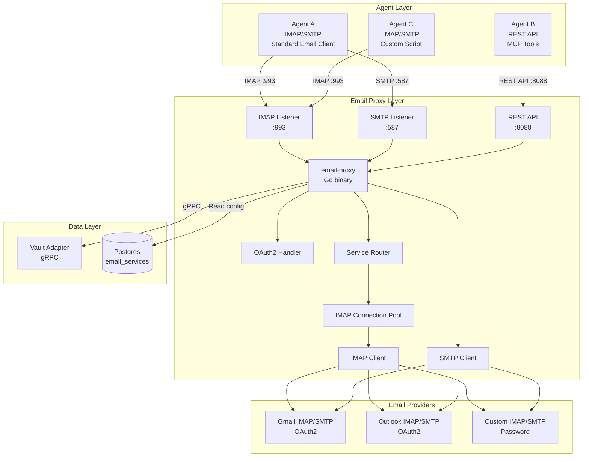
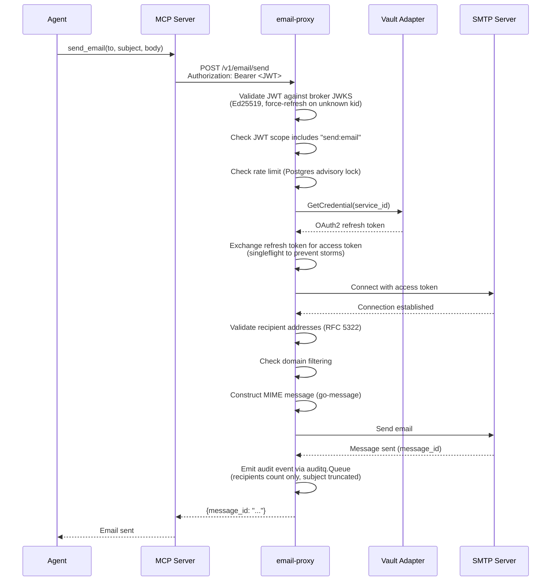
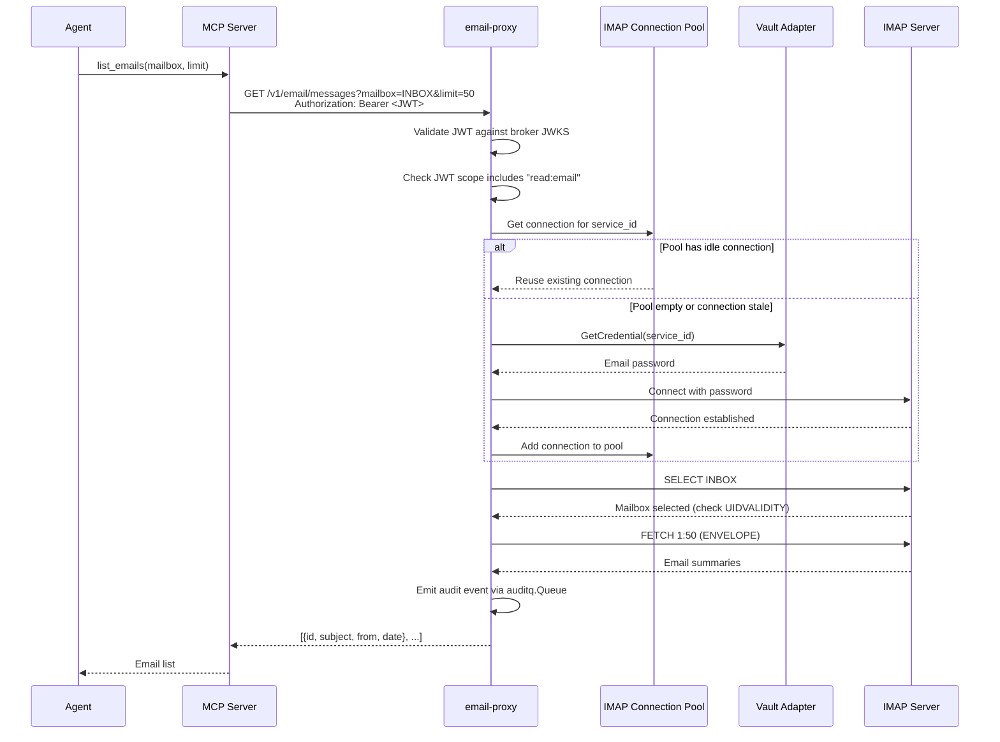
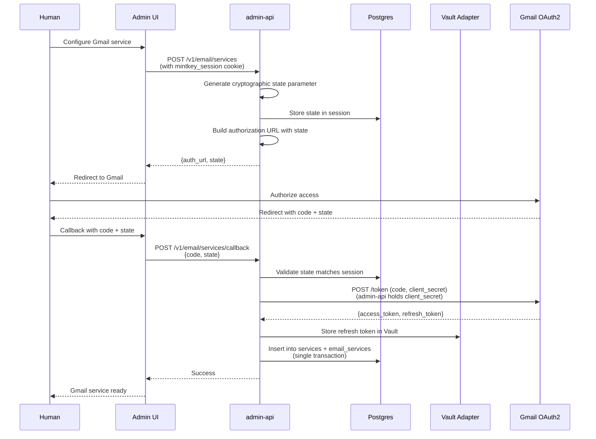

# Email Proxy Design

## Overview
The email proxy is a Go service that enables agents to send and receive emails via a REST API while handling IMAP/SMTP protocols internally. It follows the same architecture pattern as the SSH proxy (ADR-0021): separate binary, credential isolation, full audit trail.

## Architecture

### Component Diagram



**Hybrid Approach:**

The email proxy supports **both** transparent protocol handling AND REST API:

1. **Transparent Protocol (IMAP/SMTP)**: Agents connect with standard email clients (Thunderbird, mutt, etc.) on ports 993 (IMAP) and 587 (SMTP). The proxy bridges connections to the backend.

2. **REST API**: Agents call REST API endpoints on port 8088 for simpler integration via MCP tools.

Both approaches use the same credential fetching and protocol handling internally.

**Why Both?**
- **Maximum flexibility**: Agents choose the approach that fits their needs
- **Consistency**: Transparent protocol matches SSH proxy pattern
- **Simplicity**: REST API is easier for basic operations
- **Future-proofing**: Supports both current and future agent architectures

### Sequence Diagrams

#### Send Email Flow (with brokered JWT)



#### List Emails Flow (with connection pooling)



#### OAuth2 Setup Flow (with CSRF protection)



## Data Models

### Email Service Configuration

```typescript
interface EmailService {
  id: string;                    // svc_...
  tenant_id: string;             // tenant_...
  name: string;                  // "Company Gmail"
  provider: "gmail" | "outlook" | "custom";
  auth_scheme: "email_password" | "email_oauth2" | "email_app_password";
  
  // IMAP configuration
  imap_host: string;             // "imap.gmail.com"
  imap_port: number;             // 993
  imap_ssl: boolean;             // true
  
  // SMTP configuration
  smtp_host: string;             // "smtp.gmail.com"
  smtp_port: number;             // 587
  smtp_ssl: boolean;             // true
  
  // Connection pool configuration
  pool_size: number;             // 5 (default)
  pool_idle_timeout: number;     // 300 seconds (default)
  
  // Rate limiting
  rate_limit_per_hour: number;   // 100
  
  // Domain restrictions
  allowed_domains: string[];     // ["@company.com"]
  
  // Status
  status: "active" | "inactive" | "error";
  last_error?: string;
  last_error_at?: string;        // ISO 8601
  
  created_at: string;            // ISO 8601
  updated_at: string;            // ISO 8601
}
```

### Email Message

```typescript
interface EmailMessage {
  id: string;                    // Unique message ID (IMAP UID)
  mailbox: string;               // "INBOX"
  subject: string;
  from: EmailAddress;
  to: EmailAddress[];
  cc?: EmailAddress[];
  bcc?: EmailAddress[];
  date: string;                  // ISO 8601
  body_type: "plain" | "html" | "both";
  body: string | {text: string, html: string};  // Depends on body_type
  attachments: Attachment[];
  flags: string[];               // ["\\Seen", "\\Flagged"]
  size: number;                  // Bytes
}

interface EmailAddress {
  name?: string;                 // "John Doe"
  email: string;                 // "john@example.com"
}

interface Attachment {
  id: string;                    // Unique attachment ID
  filename: string;
  mime_type: string;
  size: number;                  // Bytes
  data?: string;                 // Base64-encoded (only in read_email response)
}
```

### Mailbox

```typescript
interface Mailbox {
  name: string;                  // "INBOX"
  message_count: number;
  unread_count: number;
  flags: string[];               // ["\\HasNoChildren"]
}
```

## REST API Design

### Endpoints

#### List Mailboxes
```
GET /v1/email/mailboxes
Authorization: Bearer <JWT>

Response 200:
{
  "mailboxes": [
    {
      "name": "INBOX",
      "message_count": 150,
      "unread_count": 5,
      "flags": ["\\HasNoChildren"]
    }
  ]
}
```

#### List Emails
```
GET /v1/email/messages?mailbox=INBOX&limit=50&after=<cursor>
Authorization: Bearer <JWT>

Response 200:
{
  "messages": [
    {
      "id": "msg_01HX...",
      "subject": "Meeting tomorrow",
      "from": {"name": "John Doe", "email": "john@example.com"},
      "date": "2026-06-01T10:00:00Z",
      "unread": true,
      "size": 2048
    }
  ],
  "next_cursor": "msg_01HX..."
}
```

#### Read Email
```
GET /v1/email/messages/{id}
Authorization: Bearer <JWT>

Response 200:
{
  "id": "msg_01HX...",
  "mailbox": "INBOX",
  "subject": "Meeting tomorrow",
  "from": {"name": "John Doe", "email": "john@example.com"},
  "to": [{"email": "agent@example.com"}],
  "date": "2026-06-01T10:00:00Z",
  "body": "Let's meet at 2pm...",
  "attachments": [
    {
      "id": "att_01HX...",
      "filename": "agenda.pdf",
      "mime_type": "application/pdf",
      "size": 102400,
      "data": "JVBERi0xLjQK..."
    }
  ],
  "flags": ["\\Seen"]
}
```

#### Send Email
```
POST /v1/email/send
Authorization: Bearer <JWT>
Content-Type: application/json

{
  "to": ["recipient@example.com"],
  "cc": ["cc@example.com"],
  "subject": "Meeting tomorrow",
  "body": "Let's meet at 2pm...",
  "attachments": [
    {
      "filename": "agenda.pdf",
      "mime_type": "application/pdf",
      "data": "JVBERi0xLjQK..."
    }
  ]
}

Response 200:
{
  "message_id": "msg_01HX..."
}
```

#### Search Emails
```
POST /v1/email/search
Authorization: Bearer <JWT>
Content-Type: application/json

{
  "query": "meeting",
  "mailbox": "INBOX",
  "limit": 50
}

Response 200:
{
  "messages": [...],
  "next_cursor": "..."
}
```

#### Delete Email
```
DELETE /v1/email/messages/{id}
Authorization: Bearer <JWT>

Response 204: No Content
```

#### Move Email
```
POST /v1/email/messages/{id}/move
Authorization: Bearer <JWT>
Content-Type: application/json

{
  "mailbox": "Archive"
}

Response 200:
{
  "message_id": "msg_01HX...",
  "mailbox": "Archive"
}
```

#### Mark Email Flags
```
POST /v1/email/messages/{id}/flags
Authorization: Bearer <JWT>
Content-Type: application/json

{
  "flags": ["\\Seen", "\\Flagged"]
}

Response 200:
{
  "message_id": "msg_01HX...",
  "flags": ["\\Seen", "\\Flagged"]
}
```

#### Download Attachment
```
GET /v1/email/attachments/{id}
Authorization: Bearer <JWT>

Response 200:
{
  "id": "att_01HX...",
  "filename": "agenda.pdf",
  "mime_type": "application/pdf",
  "size": 102400,
  "data": "JVBERi0xLjQK..."
}
```

## MCP Tools Design

### Tool Definitions

```yaml
tools:
  - name: list_mailboxes
    description: List available mailboxes
    requires_permission: read:email
    input_schema:
      type: object
      properties: {}
    output_schema:
      type: object
      properties:
        mailboxes:
          type: array
          items:
            type: object
            properties:
              name: {type: string}
              message_count: {type: integer}
              unread_count: {type: integer}

  - name: list_emails
    description: List recent emails in a mailbox
    requires_permission: read:email
    input_schema:
      type: object
      properties:
        mailbox: {type: string, default: "INBOX"}
        limit: {type: integer, default: 50, maximum: 200}
        after: {type: string}
    output_schema:
      type: object
      properties:
        messages:
          type: array
          items:
            type: object
            properties:
              id: {type: string}
              subject: {type: string}
              from: {type: object}
              date: {type: string}
              unread: {type: boolean}
        next_cursor: {type: string}

  - name: read_email
    description: Read full email with attachments
    requires_permission: read:email
    input_schema:
      type: object
      properties:
        id: {type: string}
      required: [id]
    output_schema:
      type: object
      properties:
        id: {type: string}
        subject: {type: string}
        from: {type: object}
        to: {type: array}
        date: {type: string}
        body_type: {type: string, enum: ["plain", "html", "both"]}
        body: {type: [string, object]}
        attachments: {type: array}

  - name: send_email
    description: Send email with optional attachments
    requires_permission: send:email
    input_schema:
      type: object
      properties:
        to: {type: array, items: {type: string}}
        cc: {type: array, items: {type: string}}
        bcc: {type: array, items: {type: string}}
        subject: {type: string}
        body: {type: string}
        attachments:
          type: array
          items:
            type: object
            properties:
              filename: {type: string}
              mime_type: {type: string}
              data: {type: string}
      required: [to, subject, body]
    output_schema:
      type: object
      properties:
        message_id: {type: string}

  - name: search_emails
    description: Search emails by query
    requires_permission: read:email
    input_schema:
      type: object
      properties:
        query: {type: string}
        mailbox: {type: string}
        limit: {type: integer, default: 50}
      required: [query]
    output_schema:
      type: object
      properties:
        messages: {type: array}
        next_cursor: {type: string}

  - name: delete_email
    description: Delete email (move to Trash)
    requires_permission: delete:email
    input_schema:
      type: object
      properties:
        id: {type: string}
      required: [id]
    output_schema:
      type: object
      properties: {}

  - name: move_email
    description: Move email to different mailbox
    requires_permission: write:email
    input_schema:
      type: object
      properties:
        id: {type: string}
        mailbox: {type: string}
      required: [id, mailbox]
    output_schema:
      type: object
      properties:
        message_id: {type: string}
        mailbox: {type: string}

  - name: download_attachment
    description: Download email attachment
    requires_permission: read:email
    input_schema:
      type: object
      properties:
        id: {type: string}
      required: [id]
    output_schema:
      type: object
      properties:
        id: {type: string}
        filename: {type: string}
        mime_type: {type: string}
        size: {type: integer}
        data: {type: string}

  - name: mark_email
    description: Mark email with flags (read/unread/flagged)
    requires_permission: write:email
    input_schema:
      type: object
      properties:
        id: {type: string}
        flags:
          type: array
          items:
            type: string
            enum: ["\\Seen", "\\Flagged", "\\Answered", "\\Deleted"]
      required: [id, flags]
    output_schema:
      type: object
      properties:
        message_id: {type: string}
        flags: {type: array}
```

## Implementation Details

### Directory Structure

```
apps/email-proxy/
├── cmd/email-proxy/main.go
├── internal/
│   ├── config/config.go
│   ├── pool/
│   │   ├── pool.go              # IMAP connection pool
│   │   └── pool_test.go
│   ├── imap/
│   │   ├── client.go
│   │   ├── client_test.go
│   │   ├── mailbox.go
│   │   └── message.go
│   ├── smtp/
│   │   ├── client.go
│   │   ├── client_test.go
│   │   └── send.go
│   ├── oauth2/
│   │   ├── gmail.go
│   │   ├── outlook.go
│   │   ├── provider.go
│   │   └── singleflight.go     # Prevent concurrent refresh storms
│   ├── api/
│   │   ├── server.go
│   │   ├── handlers.go
│   │   ├── middleware.go        # JWT validation via JWKS
│   │   └── routes.go
│   ├── auth/
│   │   ├── jwt.go               # Brokered JWT validation (Ed25519)
│   │   ├── jwks.go              # JWKS fetching and caching
│   │   └── permissions.go       # Permission checking
│   ├── security/
│   │   ├── injection.go         # IMAP/SMTP injection prevention
│   │   ├── rfc5322.go           # Address parsing and validation
│   │   └── ratelimit.go         # Postgres advisory lock rate limiting
│   ├── audit/
│   │   ├── emit.go              # Use auditq.Event struct (not raw bytes)
│   │   └── emit_test.go
│   ├── metrics/
│   │   ├── metrics.go
│   │   └── metrics_test.go
│   └── trace/
│       ├── trace.go
│       └── trace_test.go
├── go.mod                        # module: github.com/mintkey/mintkey/services/email-proxy
├── go.sum
└── Dockerfile
```

**Import path conventions** (follow SSH proxy pattern exactly):
- Module: `github.com/mintkey/mintkey/services/email-proxy`
- Internal packages: `github.com/mintkey/mintkey/services/email-proxy/internal/*`
- Shared packages: `github.com/mintkey/mintkey/packages/go/auditq`, `/ulid`, `/vault/v1`, `/otelinit`
- Go version: 1.26.0+ (matches workspace)

### Configuration

```go
type Config struct {
  Port              int           // 8088
  VaultAddr         string        // vault-adapter:8200
  VaultIdentityID   string        // env: MINTKEY_VAULT_EMAIL_PROXY_IDENTITY_ID
  VaultIdentityToken string       // env: MINTKEY_VAULT_EMAIL_PROXY_IDENTITY_TOKEN
  DatabaseURL       string        // postgres://... (for reading config + rate limiting)
  JWKSEndpoint      string        // http://broker:8083/.well-known/jwks.json
  AdminAPIURL       string        // http://admin-api:8080 (for audit emission)
  AdminAPIToken     string        // service token for audit API
  AuditWALPath      string        // WAL path for audit queue
  ServiceIdentityID string        // svcid_email_proxy
  ServiceIdentitySecret string    // Boot secret for Vault Adapter auth
  MaxAttachmentSize int64         // 25MB
  MaxMessageSize    int64         // 50MB
  DefaultRateLimit  int           // 100/hour
  DefaultPoolSize   int           // 5 connections per service
  DefaultPoolIdleTimeout time.Duration // 5 minutes
  IMAPTimeout       time.Duration // 30s
  SMTPTimeout       time.Duration // 30s
  TLSEnabled        bool          // true in production
  TLSCertFile       string        // /path/to/cert.pem
  TLSKeyFile        string        // /path/to/key.pem
  OTelEndpoint      string        // otel-collector:4317
  Env               string        // "dev", "staging", "production"
}
```

**Key configuration decisions:**
- **VaultIdentityID/Token**: Service identity for authenticating to Vault Adapter via `ValidateServiceIdentity`
- **JWKSEndpoint**: Email proxy validates brokered JWTs against broker's JWKS (Ed25519)
- **DatabaseURL**: Email proxy reads config directly from Postgres (like kong-syncer)
- **AuditWALPath**: Audit queue WAL for crash recovery
- **OTelEndpoint**: OpenTelemetry collector endpoint

### Error Handling

All errors returned as JSON:

```json
{
  "error": "invalid_credentials",
  "message": "Email service credentials are invalid or expired",
  "details": {
    "service_id": "svc_01HX...",
    "provider": "gmail"
  }
}
```

Error codes:
- `invalid_credentials` - Email credentials invalid
- `oauth2_token_expired` - OAuth2 refresh token expired (triggers `email.service.auth_expired` audit event)
- `mailbox_not_found` - Mailbox doesn't exist
- `message_not_found` - Message doesn't exist
- `attachment_not_found` - Attachment doesn't exist
- `rate_limit_exceeded` - Rate limit exceeded (shared across instances via Postgres advisory locks)
- `domain_blocked` - Domain not in allowed list (validated via RFC 5322 parser)
- `permission_denied` - Agent lacks required permission (checked via JWT scope)
- `provider_error` - Email provider returned error (sanitized before logging)
- `injection_detected` - IMAP/SMTP injection attempt detected (logged as security event)
- `invalid_address` - Malformed email address (RFC 5322 validation failed)

**Error sanitization:**
- Provider-specific errors sanitized before logging (no credentials, no internal URLs)
- Email body and attachment content never included in error messages
- Search queries never logged (only length and mailbox)

### Security Considerations

1. **JWT Validation (SEC-01)**: Email proxy validates brokered JWTs against broker's JWKS endpoint (Ed25519), not a shared secret. Force-refresh JWKS on unknown `kid` per ADR-0016.2.

2. **TLS Termination (SEC-02)**: Port 8088 requires TLS termination in production:
   - **Preferred**: Kong TCP route with TLS termination
   - **Alternative**: mTLS between MCP server and email proxy
   - **Development**: Plain HTTP acceptable with documented trust boundary
   - All agent JWTs and email content encrypted in transit

3. **IMAP/SMTP Injection Prevention (SEC-03)**:
   - Use parameterized IMAP SEARCH via `go-imap`'s `imap.NewSearchCriteria()` with proper escaping
   - Use `go-message` to construct MIME messages with proper header encoding
   - Validate and reject `\r\n` in header values (subject, from, to, cc, bcc)
   - Reject malformed RFC 5322 addresses
   - Log injection attempts as security events

4. **OAuth2 CSRF Protection (SEC-04)**:
   - Generate cryptographic `state` parameter (32 bytes, base64url-encoded)
   - Store `state` in session (admin-api manages session)
   - Validate `state` on callback matches session
   - Reject callback if `state` mismatch or missing

5. **Domain Filtering (SEC-05)**:
   - Parse recipient addresses with RFC 5322 parser (`go-message/mail`)
   - Extract domain from parsed `addr-spec` (part after `@` in `mailbox` production)
   - Reject addresses that don't parse cleanly
   - Configurable allowlist per service
   - Log blocked domains as audit events

6. **Service Identity (SEC-06)**:
   - Email proxy authenticates to Vault Adapter via `ValidateServiceIdentity`
   - Config includes `ServiceIdentityID` and `ServiceIdentitySecret`
   - Boot secret provisioned via same mechanism as other data-plane components (e.g., ssh-proxy, proxy-plugin)

7. **Rate Limiting (SEC-07)**:
   - Per-agent and per-service rate limits
   - **Shared state via Postgres advisory locks** (already in stack) for cross-instance enforcement
   - Advisory lock key: `hashtext('email_rate_limit:' || agent_id || ':' || service_id)`
   - Emit `email.rate_limit.exceeded` audit event on limit
   - Fallback to per-instance limits if Postgres unavailable

8. **Audit Sanitization (SEC-08)**:
   - Search queries: log length and mailbox, not query text (prevent PII/credential leakage)
   - Email content: never log body or attachment data
   - Recipients: log count only, not addresses
   - Subject: truncate to 100 chars
   - Error messages: sanitize provider-specific errors before logging

9. **Connection Pooling (ARCH-02)**:
   - Per-service IMAP connection pool with configurable size (default: 5 connections)
   - Idle timeout: 5 minutes (configurable)
   - Credentials fetched once per pool connection, zeroed when connection recycled
   - UIDVALIDITY tracking: detect mailbox recreation, invalidate cached UIDs
   - Compatible with ADR-0014.4 (no persistent credential cache beyond connection lifetime)

10. **Audit Hash Chain (ARCH-05)**:
    - Write audit events via `auditq.Queue` → admin-api → Postgres (same as SSH proxy)
    - Include `prev_hash` + `hash` per event, per-tenant chain (ADR-0014.7)
    - **New target_type enum values**: `email_service`, `email_message`, `email_attachment`
    - **New event types**: `email.sent`, `email.received`, `email.deleted`, `email.moved`, `email.searched`, `email.attachment.downloaded`, `email.service.registered`, `email.service.auth_expired`, `email.rate_limit.exceeded`, `email.domain.blocked`, `email.message.flags_updated`

11. **OAuth2 Expiration Handling (REQ-02)**:
    - Detect OAuth2 refresh token expiration on refresh failure
    - Emit `email.service.auth_expired` audit event with service_id and error_reason
    - Update service status to `error` in database
    - Admin UI displays error badge on email service
    - Admin UI shows "Re-authorize" button to restart OAuth2 flow
    - Operator can re-authorize without deleting and recreating service

### Testing Strategy

1. **Unit Tests**: IMAP/SMTP client operations, OAuth2 flows, API handlers, JWT validation, connection pooling, rate limiting, injection prevention, RFC 5322 parsing

2. **Integration Tests**: End-to-end email send/receive with mock providers, OAuth2 flow with mock provider, credential rotation, rate limiting across instances, UIDVALIDITY handling

3. **Acceptance Tests**: Full docker-compose stack with real email providers (test accounts), attachment handling, search functionality, TLS termination, audit hash chain verification

4. **Architecture Tests**: No plaintext credentials in logs, audit events emitted for all operations, rate limiting enforced, domain filtering enforced, JWT validation via JWKS (not shared secret), search query sanitization

5. **Security Tests (Red Team)**:
   - Send email containing known credential fingerprint, verify it doesn't appear in logs, audit events, or span attributes
   - Attempt IMAP/SMTP injection via malformed search queries and email headers
   - Attempt domain filtering bypass via malformed addresses
   - Attempt rate limiting bypass by distributing requests across instances
   - Concurrent OAuth2 token refresh (10 goroutines), verify singleflight prevents storms

6. **Performance Tests**: Load test with 100 concurrent operations, measure latency percentiles (p50, p95, p99), verify connection pooling reduces overhead by 80%

### Testing Strategy

1. **Unit Tests**: IMAP/SMTP client operations, OAuth2 flows, API handlers
2. **Integration Tests**: End-to-end email send/receive with mock providers
3. **Acceptance Tests**: Full docker-compose stack with real email providers
4. **Architecture Tests**: No plaintext credentials in logs, audit events emitted

## Deployment

### Docker Compose

```yaml
email-proxy:
  build:
    context: .
    dockerfile: apps/email-proxy/Dockerfile
  ports:
    - "8088:8088"
  environment:
    - VAULT_ADDR=vault-adapter:8200
    - ADMIN_API_ADDR=admin-api:8080
    - JWT_SECRET=${JWT_SECRET}
    - MAX_ATTACHMENT_SIZE=26214400
    - DEFAULT_RATE_LIMIT=100
  depends_on:
    - vault-adapter
    - admin-api
```

### Grafana Dashboard

Metrics to track:
- Email operations per minute (send, receive, delete, move)
- OAuth2 token refresh rate
- Error rates by provider
- Attachment upload/download rates
- Rate limit violations
- Domain blocks

## Future Enhancements (Phase 2)

1. **Email Templates**: Pre-defined templates with variable substitution
2. **Webhook Notifications**: Real-time notifications for new emails
3. **Email Rules**: Auto-forward, auto-reply, filtering rules
4. **Advanced Search**: Full-text search, date range, sender/recipient filters
5. **Attachment Virus Scanning**: Scan attachments before delivery
6. **Email Encryption**: PGP/S/MIME support
7. **Email Signatures**: Configurable signatures per service
