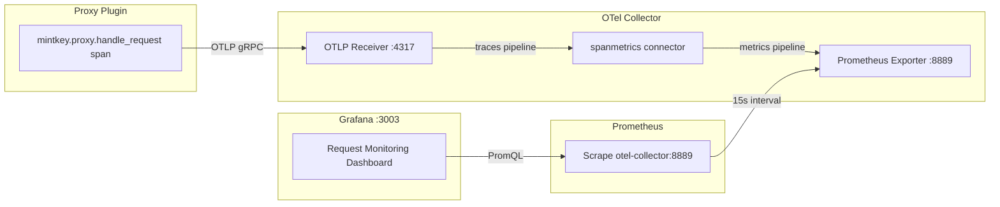

# Design Document: Grafana Request Monitoring

## Overview

This feature adds a pre-baked Grafana dashboard that visualizes proxied request traffic using metrics derived from existing OTel spans. The implementation requires two artifacts:

1. **OTel Collector spanmetrics connector** — added to `otel-collector-config.yaml` to derive Prometheus counter and histogram metrics from `mintkey.proxy.handle_request` spans.
2. **Grafana dashboard JSON** — provisioned at `grafana/provisioning/dashboards/request-monitoring.json`, auto-loaded by the existing dashboard provider.

No proxy plugin code changes are required. The spanmetrics connector extracts dimensions (`mintkey_actor_id`, `mintkey_service_id`, `mintkey_outcome`) from span attributes already emitted by the proxy plugin.

## Architecture

### End-to-End Data Flow



### Pipeline Topology Change

The spanmetrics connector acts as both an exporter (from the traces pipeline) and a receiver (into the metrics pipeline). This is the standard OTel Collector connector pattern.

**Current state:**
```
traces:   otlp → [batch, attributes/redact, redaction] → [otlphttp/jaeger, debug]
metrics:  otlp → [batch] → [prometheus]
```

**Proposed state:**
```
traces:   otlp → [batch, attributes/redact, redaction] → [otlphttp/jaeger, debug, spanmetrics]
metrics:  otlp, spanmetrics → [batch] → [prometheus]
```

The `spanmetrics` connector appears as an exporter in the traces pipeline and as a receiver in the metrics pipeline.

## Components and Interfaces

### 1. Spanmetrics Connector Configuration

Added to `otel-collector-config.yaml` under the `connectors:` top-level key:

```yaml
connectors:
  spanmetrics:
    namespace: mintkey_proxy
    metrics_flush_interval: 15s
    histogram:
      explicit:
        buckets: [5ms, 10ms, 25ms, 50ms, 75ms, 100ms, 250ms, 500ms, 750ms, 1000ms, 2500ms, 5000ms, 10000ms]
    dimensions:
      - name: mintkey.actor_id
        default: "unknown"
      - name: mintkey.service_id
        default: "unknown"
      - name: mintkey.outcome
        default: "unknown"
    dimensions_cache_size: 1000
    aggregation_temporality: AGGREGATION_TEMPORALITY_CUMULATIVE
    metrics_expiration: 5m
    include:
      match_type: strict
      span_names:
        - "mintkey.proxy.handle_request"
```

**Design decisions:**

- **`namespace: mintkey_proxy`** — produces metrics named `mintkey_proxy_calls_total` (counter) and `mintkey_proxy_duration_milliseconds_*` (histogram). The namespace avoids collision with other metrics.
- **`include` filter** — only processes `mintkey.proxy.handle_request` spans (Requirement 7.6). All other spans pass through the traces pipeline unaffected.
- **`default: "unknown"`** — handles missing attributes for unauthenticated denials (Requirements 7.4, 7.5).
- **`metrics_flush_interval: 15s`** — aligns with Prometheus scrape interval for consistent data.
- **`metrics_expiration: 5m`** — stops emitting stale time series after 5 minutes of inactivity.
- **`aggregation_temporality: CUMULATIVE`** — required for Prometheus compatibility.

### 2. Pipeline Wiring

The traces pipeline adds `spanmetrics` as an exporter. The metrics pipeline adds `spanmetrics` as a receiver:

```yaml
service:
  pipelines:
    traces:
      receivers:  [otlp]
      processors: [batch, attributes/redact, redaction]
      exporters:  [otlphttp/jaeger, debug, spanmetrics]
    metrics:
      receivers:  [otlp, spanmetrics]
      processors: [batch]
      exporters:  [prometheus]
```

### 3. Grafana Dashboard Structure

The dashboard JSON at `grafana/provisioning/dashboards/request-monitoring.json` contains:

| Element | Type | Purpose |
|---------|------|---------|
| Template variable: `agent` | Query | Populates from `mintkey_actor_id` label values |
| Template variable: `service` | Query | Populates from `mintkey_service_id` label values |
| Panel 1: Request Rate | Time Series | `rate()` of calls_total by service |
| Panel 2: Request Count | Stat | `increase()` of calls_total by service |
| Panel 3: Outcome Breakdown | Time Series (stacked) | `rate()` by outcome |
| Panel 4: Agent-Service Matrix | Table | Top-N agent×service pairs by count |

#### Template Variables

```json
{
  "templating": {
    "list": [
      {
        "name": "agent",
        "type": "query",
        "query": "label_values(mintkey_proxy_calls_total, mintkey_actor_id)",
        "datasource": { "type": "prometheus", "uid": "${DS_PROMETHEUS}" },
        "includeAll": true,
        "allValue": ".*",
        "current": { "text": "All", "value": "$__all" }
      },
      {
        "name": "service",
        "type": "query",
        "query": "label_values(mintkey_proxy_calls_total, mintkey_service_id)",
        "datasource": { "type": "prometheus", "uid": "${DS_PROMETHEUS}" },
        "includeAll": true,
        "allValue": ".*",
        "current": { "text": "All", "value": "$__all" }
      }
    ]
  }
}
```

**Datasource UID:** The provisioned datasource at `grafana/provisioning/datasources/prometheus.yaml` does not set an explicit UID. Grafana auto-assigns one. The dashboard uses `"uid": "${DS_PROMETHEUS}"` — a Grafana built-in variable that resolves to the default datasource. Since Prometheus is configured as `isDefault: true`, this works without hardcoding a UID.

Alternatively, we add `uid: prometheus` to the datasource provisioning YAML and reference it directly. This is more robust. The design chooses this approach:

```yaml
# grafana/provisioning/datasources/prometheus.yaml (addition)
datasources:
  - name: Prometheus
    type: prometheus
    access: proxy
    url: http://prometheus:9090
    isDefault: true
    editable: false
    uid: prometheus   # ← explicit UID for dashboard references
```

Dashboard panels then reference `"uid": "prometheus"` directly.

#### Panel PromQL Queries

**Panel 1 — Request Rate (Time Series):**
```promql
rate(mintkey_proxy_calls_total{mintkey_actor_id=~"$agent", mintkey_service_id=~"$service"}[$__rate_interval])
```
Legend: `{{mintkey_service_id}}`

**Panel 2 — Request Count (Stat):**
```promql
increase(mintkey_proxy_calls_total{mintkey_actor_id=~"$agent", mintkey_service_id=~"$service"}[$__range])
```
Legend: `{{mintkey_service_id}}`

When no data exists for a service, the stat panel displays `0` via `"noValue": "0"` in the panel field config.

**Panel 3 — Outcome Breakdown (Time Series, stacked bar):**
```promql
sum by (mintkey_outcome) (rate(mintkey_proxy_calls_total{mintkey_actor_id=~"$agent", mintkey_service_id=~"$service"}[$__rate_interval]))
```
Legend: `{{mintkey_outcome}}`

Color overrides in field config:
- `success` → green (`#73BF69`)
- `client_error` → yellow (`#FADE2A`)
- `server_error` → red (`#F2495C`)
- `denied` → orange (`#FF9830`)
- `error` → dark red (`#C4162A`)

**Panel 4 — Agent-Service Matrix (Table):**
```promql
topk(50, sum by (mintkey_actor_id, mintkey_service_id) (increase(mintkey_proxy_calls_total{mintkey_actor_id=~"$agent", mintkey_service_id=~"$service"}[$__range])))
```

Table transformations:
- Organize fields: `mintkey_actor_id` → "Agent", `mintkey_service_id` → "Service", `Value` → "Requests"
- Sort by "Requests" descending
- Filter: rows with 0 requests are excluded by `topk` (only non-zero series returned)

### 4. Dashboard JSON Skeleton

```json
{
  "__inputs": [],
  "uid": "mintkey-request-monitoring",
  "title": "Request Monitoring",
  "tags": ["mintkey", "proxy"],
  "timezone": "browser",
  "schemaVersion": 39,
  "version": 1,
  "refresh": "30s",
  "time": { "from": "now-1h", "to": "now" },
  "templating": { "list": ["...agent and service vars..."] },
  "panels": ["...4 panels as described above..."]
}
```

The full JSON will be generated during implementation. Key structural decisions:
- `schemaVersion: 39` — matches Grafana 10.3.x
- `refresh: 30s` — default auto-refresh (2× the Prometheus scrape interval)
- `uid: mintkey-request-monitoring` — stable UID for bookmarking/linking

## Data Models

### Metrics Produced by Spanmetrics Connector

| Metric Name | Type | Labels | Description |
|-------------|------|--------|-------------|
| `mintkey_proxy_calls_total` | Counter | `mintkey_actor_id`, `mintkey_service_id`, `mintkey_outcome`, `span_name`, `span_kind`, `status_code` | Total span count |
| `mintkey_proxy_duration_milliseconds_bucket` | Histogram | Same + `le` | Duration distribution |
| `mintkey_proxy_duration_milliseconds_sum` | Histogram (sum) | Same | Total duration |
| `mintkey_proxy_duration_milliseconds_count` | Histogram (count) | Same | Same as calls_total |

The `span_name`, `span_kind`, and `status_code` labels are automatically added by the spanmetrics connector. Since we filter to a single span name, `span_name` is always `mintkey.proxy.handle_request`.

### Grafana Dashboard Model

The dashboard is a single JSON file conforming to Grafana's dashboard JSON schema (v39). It references:
- Datasource: `uid: "prometheus"` (Prometheus)
- Template variables: `$agent`, `$service`
- Time range: controlled by Grafana's standard time picker

## Error Handling

| Scenario | Behavior |
|----------|----------|
| No spans received yet | Dashboard panels show "No data" or 0 (stat panel) |
| Missing `mintkey.actor_id` on span | Spanmetrics labels it `unknown`; dashboard shows "unknown" in dropdowns |
| Missing `mintkey.service_id` on span | Same — labeled `unknown` |
| Missing `mintkey.outcome` on span | Same — labeled `unknown` |
| OTel Collector restart | Cumulative counters reset; `rate()` handles resets gracefully |
| Prometheus scrape failure | Gap in data; Grafana shows null points (standard behavior) |
| Dashboard JSON syntax error | Grafana logs provisioning error; dashboard not loaded |

## Correctness Properties

*A property is a characteristic or behavior that should hold true across all valid executions of a system — essentially, a formal statement about what the system should do. Properties serve as the bridge between human-readable specifications and machine-verifiable correctness guarantees.*

Although this feature produces declarative configuration files (not pure functions), the following structural properties can be validated programmatically against the generated artifacts.

### Property 1: All panels use template variables for filtering

*For any* panel in the dashboard JSON that contains a PromQL query target, that query SHALL reference both the `$agent` and `$service` template variables in its label matchers, ensuring all panels respect the operator's filter selections.

**Validates: Requirements 2.4, 3.3, 4.5, 5.2, 5.4**

### Property 2: All datasource references use the provisioned UID

*For any* datasource reference in the dashboard JSON (across all panels and template variables), the `uid` field SHALL match the UID defined in the provisioned Prometheus datasource configuration (`prometheus`).

**Validates: Requirements 8.4**

### Property 3: Spanmetrics connector wired as both exporter and receiver

*For any* valid OTel Collector configuration produced by this feature, `spanmetrics` SHALL appear in `service.pipelines.traces.exporters` AND in `service.pipelines.metrics.receivers`, ensuring the connector bridges the two pipelines.

**Validates: Requirements 7.3**

### Property 4: Spanmetrics connector filters only proxy request spans

*For any* valid OTel Collector configuration produced by this feature, the `connectors.spanmetrics.include` section SHALL specify `match_type: strict` with `span_names` containing exactly `["mintkey.proxy.handle_request"]` and no other entries, ensuring unrelated spans are not processed.

**Validates: Requirements 7.6**

## Testing Strategy

**PBT is NOT applicable** for this feature. The deliverables are declarative configuration files (OTel Collector YAML, Grafana dashboard JSON) — not pure functions with input/output behavior. There are no universal properties that hold across a wide input space.

### Testing Approach

1. **YAML validation** — Verify `otel-collector-config.yaml` is valid YAML and contains the expected `connectors.spanmetrics` key with correct structure.

2. **Dashboard JSON validation** — Verify `request-monitoring.json` is valid JSON, has the expected panels, template variables, and datasource references.

3. **Integration test** — With the full stack running:
   - Send a proxied request through the proxy plugin
   - Wait for Prometheus scrape (≤15s)
   - Query Prometheus for `mintkey_proxy_calls_total` and verify the metric exists with expected labels
   - Verify the Grafana dashboard is provisioned (GET `/api/dashboards/uid/mintkey-request-monitoring` returns 200)

4. **Smoke test** — After `docker compose up`:
   - Grafana API returns the dashboard under the "Mintkey" folder
   - Dashboard panels render without query errors (Grafana health API)

### Unit Tests (example-based)

- OTel config: assert `spanmetrics` appears in `connectors`, `traces.exporters`, and `metrics.receivers`
- Dashboard JSON: assert template variables `agent` and `service` exist with correct queries
- Dashboard JSON: assert all 4 panels reference the `prometheus` datasource UID
- Dashboard JSON: assert outcome panel has color overrides for all 5 outcome values
