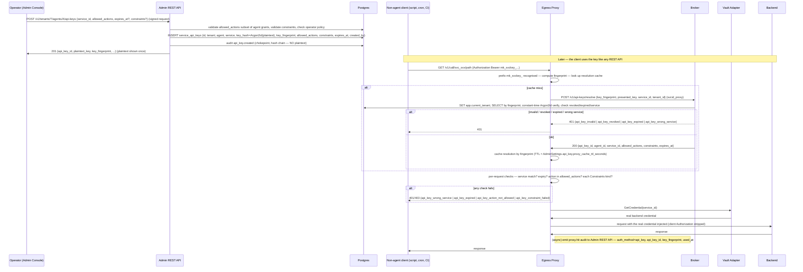

# Classical Service API Keys — Design

**Feature:** long-lived-api-keys (re-scoped — see `proposal/P-010` § "Outcome", 2026-05-11)
**Status:** DRAFT — blocked on `ADR-0018-classical-service-api-keys`. MUST NOT be promoted to `tasks.md` until ADR-0018 is Accepted. Supersedes the earlier "Extended API Keys" (extended-brokered-JWT) design (P-010 Option C, rejected); that draft is in git history.

**Sources:**
- `requirements.md` (this spec's 12 requirements + Error Codes + NFRs)
- `proposal/P-010-extended-token-class.md` § "Outcome" — the decision and the ADR-0018 agenda
- `docs/architecture/01-architecture/adr/0006-token-format-and-binding.md` — brokered JWT (unchanged here; the proxy distinguishes `eyJ…` from `mk_svckey_…`)
- `docs/architecture/01-architecture/adr/0014-iter-1-2-corrections.md` — service identities (§14.2), audit chokepoint + hash chain (§14.7), no plugin DB connection (§14.4), RLS coverage (§14.8), AdminJS-via-FastAPI (§14.5/14.6), global channels (§14.1)
- `docs/architecture/01-architecture/adr/0016-round-2-corrections.md` — closed `Constraints` schema (§16.4), PlatformAdmin RLS escape (§16.3), AdminSettings (§16.6)
- `docs/architecture/01-architecture/adr/0017-round-3-corrections.md` — `mintkey:code` closed enum (§17.10), OTel allowlist (§17.6), prefixed-ULID IDs (§17.11)
- `docs/architecture/01-architecture/adr/0015-liquibase-schema-source-of-truth.md`
- `docs/architecture/contracts/{rest/openapi.yaml, events/*}`
- `.kiro/specs/mintkey-mvp/design.md` — existing component patterns (proxy plugin, broker, admin-api, mintkey-models, AdminJS, change-channel wrappers)

---

## Overview

A classical service API key (`mk_svckey_…`) is a long-lived opaque token an operator issues, bound to one Agent + one Service + a subset of that Agent's grants + an optional expiry + optional `Constraints`. A non-agent client presents it directly at the egress proxy; the proxy recognises the `mk_svckey_` prefix, resolves it server-side against the Broker (caching the result briefly), re-checks the requested action and any `Constraints` on every request, and injects the real backend credential exactly as on the brokered-JWT path. No MCP surface; no new container; agents unaffected.

The honest tradeoff (a leaked key works until revoked) is bounded by: a short proxy resolution-cache TTL ⇒ revocation in seconds; optional + optionally-mandatory per-key expiry; per-request enforcement of all four `Constraints` kinds (the proxy does a server-side lookup anyway); a key can never exceed its bound Agent's grants (revoking the Agent revokes its keys); fingerprint-only audit/logs/OTel.



---

## 1. Schema Changes (Liquibase)

New changeset: `admin-api/db/changelog/012-service-api-keys.yaml`. Liquibase is the source of truth (ADR-0015); the SQLAlchemy mirror is regenerated from the post-migration schema (§7). Explicit `rollback` block included (R7.5).

### 1.1 `service_api_keys` table

```sql
CREATE TABLE service_api_keys (
  id              UUID PRIMARY KEY,
  tenant_id       UUID NOT NULL REFERENCES tenants(id),
  agent_id        UUID NOT NULL REFERENCES agents(id),
  service_id      UUID NOT NULL REFERENCES services(id),
  key_hash        TEXT NOT NULL,                 -- Argon2id, same params as the Agent API Key
  key_fingerprint CHAR(16) NOT NULL,             -- hex(sha256(plaintext)[:8])
  allowed_actions TEXT[] NOT NULL,
  constraints     JSONB,                         -- closed Constraints schema (ADR-0016.4); NULL = none
  expires_at      TIMESTAMPTZ,                   -- NULL = no expiry
  last_used_at    TIMESTAMPTZ,
  revoked_at      TIMESTAMPTZ,
  revoked_by      UUID,
  revoke_reason   TEXT,
  created_at      TIMESTAMPTZ NOT NULL DEFAULT now(),
  created_by      UUID NOT NULL,
  CONSTRAINT uq_service_api_keys_fingerprint UNIQUE (key_fingerprint),
  CONSTRAINT chk_service_api_keys_actions    CHECK (array_length(allowed_actions, 1) >= 1),
  CONSTRAINT chk_service_api_keys_expiry     CHECK (expires_at IS NULL OR expires_at > created_at)
);

ALTER TABLE service_api_keys ENABLE ROW LEVEL SECURITY;
CREATE POLICY tenant_isolation ON service_api_keys
  USING (
    tenant_id = current_setting('app.current_tenant', true)::uuid
    OR current_setting('app.platform_admin_view', true) = 'on'
  );

-- Partial-index predicates MUST be IMMUTABLE — no now(); "active" (= not revoked AND not expired) is a query-time filter.
CREATE INDEX idx_svc_api_keys_agent_service ON service_api_keys (agent_id, service_id) WHERE revoked_at IS NULL;
CREATE INDEX idx_svc_api_keys_service       ON service_api_keys (service_id)            WHERE revoked_at IS NULL;
```

`service_api_keys` is tenant-scoped; the byte-for-byte standard RLS template means the mintkey-mvp RLS architecture test (T-1.0.11) picks it up automatically. It is NOT on the platform-scoped exclusion allowlist.

### 1.2 `AdminSettings` keys (closed schema, ADR-0016.6 — new keys only, no new table)

```
api_key.proxy_cache_ttl_seconds   int   default 60   [10, 300]
api_key.require_expiry            bool  default false
api_key.allow_no_expiry          bool  default true
api_key.max_expiry_days          int   default 365  [1, 3650]
api_key.require_ip_allowlist     bool  default false
```

ADR-0016.6's `AdminSettings` schema gains an `api_key` sub-object; mirrored in the OpenAPI `AdminSettings` schema (§7).

### 1.3 Identifier note

`mk_svckey_<Crockford-base32 of 32 random bytes>` — the wire form. `service_api_keys.id` is a plain `UUID` (it is an internal row id, never on the wire as a credential; it does appear in audit payloads as `api_key_id` — represent it as a prefixed ULID `svckey_<ULID>` on the wire there, consistent with ADR-0017.11, with the `UUID` column holding the 128-bit body, mirroring the `jti` treatment). `key_fingerprint` is the lookup index; `key_hash` is the Argon2id of the plaintext; the plaintext itself is never stored.

---

## 2. Proxy Plugin Changes (`services/proxy-plugin/`)

The plugin holds no DB connection (ADR-0014.4). It already has, on the `/v1/call/...` route: JWT verification, the JWKS cache, the `jti`/`sub` revocation sets, the Vault Adapter gRPC client, credential injection per auth scheme, the response scrubber, and the `mintkey:agent` change-channel subscriber. This feature adds a parallel "classical-key" branch.

### 2.1 Credential-type dispatch

On a `/v1/call/{service_id}/{path...}` request, after extracting the inbound credential (from `Authorization: Bearer …` or the service's configured inbound header):

```go
switch {
case strings.HasPrefix(cred, "mk_svckey_"):
    handleClassicalKey(ctx, cred, serviceID, req)   // §2.2..2.5
default:
    handleBrokeredJWT(ctx, cred, serviceID, req)    // existing path, unchanged
}
```

### 2.2 Resolution cache + resolve call

```go
type resolution struct {
    APIKeyID, AgentID, ServiceID string
    AllowedActions []string
    Constraints    *Constraints
    ExpiresAt      *time.Time
}
type resolutionCache struct {
    mu  sync.Mutex
    m   map[string]cachedResolution // key: key_fingerprint; value: { resolution; cachedAt }
}
```

`handleClassicalKey`:
1. `fp := hex(sha256(cred)[:8])`.
2. Cache lookup: if present and `now - cachedAt < AdminSettings.api_key.proxy_cache_ttl_seconds` → use it (no Broker call, no Argon2id).
3. Cache miss → `POST /v1/api-keys/resolve` on the Broker (`X-Mintkey-Service-Token: <svcid_proxy>`) with `{key_fingerprint: fp, presented_key: cred, service_id: serviceID, tenant_id: <tenant from the route's service config>}`.
   - 200 → cache the resolution under `fp`, proceed.
   - 401 → return the same `mintkey:code` to the client; apply a brief per-`fp` backoff (R10.3) so a flood of a known-bad key does not hammer the Broker.
   - network error / 5xx → if no cached resolution exists → return 503 `api_key_resolution_unavailable` (fail-closed for the cache-miss-during-outage case, R10.6); if a (now-expired) cached resolution exists, the spec does **not** allow serving from a stale cache during an outage — return 503. (The exposure window for a revocation is `min(cache TTL, outage)`, accepted.)

### 2.3 Per-request checks (every request, hit or miss)

In order (R2.3):
1. `resolution.ServiceID == serviceID` from the URL — else 401 `api_key_wrong_service`.
2. `resolution.ExpiresAt == nil || resolution.ExpiresAt.After(now)` — else 401 `api_key_expired`, and evict the cache entry.
3. action = `serviceActionMap(method, path)` (the same mapping the brokered path uses to derive `scope`); `action ∈ resolution.AllowedActions` — else 403 `api_key_action_not_allowed`.
4. For each present `Constraints` kind:
   - `request_path_prefix`: `strings.HasPrefix(path, prefix)`.
   - `source_ip_allowlist`: client IP ∈ any CIDR.
   - `time_window`: `now` (in the constraint's `timezone`) is within `[start_local, end_local]` on a `days` day.
   - `rate_limit`: a per-`api_key_id` in-memory token bucket (per proxy instance) has capacity.
   Any failure → 403 `api_key_constraint_failed` with the failing kind in the message, and `proxy.hit` `outcome: "denied"`, `reason_code: "constraint_failed:<kind>"`.

### 2.4 Credential injection + scrubbing

Identical to the brokered-JWT path: fetch the real backend credential from the Vault Adapter (`GetCredential(service_id)`), inject per the service's auth scheme, strip the client's `Authorization` before forwarding, run the response scrubber. The classical-key branch reuses these helpers verbatim — the only difference from the brokered path is *how the request was authorized*, not *how the upstream call is made*.

### 2.5 Audit + OTel

`proxy.hit` audit (sent to the Admin REST API internal endpoint — the plugin never writes the DB): adds `auth_method: "api_key"`, `api_key_id`, `key_fingerprint`, and a `used_at` timestamp. The plugin coalesces the `used_at` report: it tracks a per-`api_key_id` "last reported" time and only includes `used_at` in `proxy.hit` if > 60 s since the last report (R10.5); the Admin REST API does the `UPDATE service_api_keys SET last_used_at = greatest(last_used_at, :used_at)` inside the audit transaction. OTel span: `span.SetAttributes(attribute.String("mintkey.auth_method", "api_key"))` — `mintkey.auth_method` is on the allowlist (§7); `key_fingerprint` is **not** a span attribute.

### 2.6 Change-channel handling

The plugin's existing `mintkey:agent` subscriber gains two cases:
- `api_key.revoked` → evict the entry for `payload.key_fingerprint` from the resolution cache.
- `agent.revoked` (existing event) → in addition to its current behavior, evict any resolution-cache entries whose `AgentID == payload.agent_id`.

### 2.7 Resolution-cache eviction & memory bound

A background goroutine sweeps the resolution cache every 60 s, dropping entries older than the TTL. Memory is bounded by the number of distinct API-key fingerprints seen within a TTL window — small for any realistic deployment.

---

## 3. Broker — Resolution Endpoint (`services/broker/`)

The Broker already runs an HTTP server (JWKS at `/.well-known/jwks.json`, `POST /v1/issue`). Add:

```
POST /v1/api-keys/resolve
  Auth: X-Mintkey-Service-Token: <svcid_proxy>   (ADR-0014.2; else 401)
  Body: { key_fingerprint, presented_key, service_id, tenant_id }
  → 200 { api_key_id, agent_id, service_id, allowed_actions[], constraints, expires_at }
  → 401 { "mintkey:code": "api_key_invalid" | "api_key_revoked" | "api_key_expired" | "api_key_wrong_service" }
  → 429 if the per-fingerprint or per-caller rate limit is exceeded
```

Handler:
1. Validate `tenant_id` is a well-formed prefixed-ULID; `SET app.current_tenant` (bound parameter via `set_config` — never f-string SQL, per the SQL-injection architecture test T-1.0.15).
2. `SELECT id, agent_id, service_id, key_hash, allowed_actions, constraints, expires_at, revoked_at FROM service_api_keys WHERE key_fingerprint = :fp` (RLS-scoped). If no row → constant-time path: run an Argon2id verify against a fixed `DUMMY_HASH` (so timing does not reveal fingerprint existence), then return 401 `api_key_invalid`.
3. Constant-time Argon2id verify of `presented_key` against `key_hash`. Fail → 401 `api_key_invalid`.
4. `revoked_at IS NOT NULL` → 401 `api_key_revoked`. Also `SELECT status FROM agents WHERE id = agent_id`; if `'revoked'` → 401 `api_key_revoked`.
5. `expires_at` present and in the past → 401 `api_key_expired`.
6. `service_id` (row) ≠ `service_id` (request) → 401 `api_key_wrong_service`.
7. Else → 200 with the binding.

Rate limiting: a per-`key_fingerprint` token bucket (e.g. 20/min) and a per-caller-IP bucket; 429 on either. Emits **no audit event** per call (R3.4) — `proxy.hit` records usage; the Broker logs failure reasons in its structured log only (R3.5), returning the uniform `api_key_invalid` to avoid a fingerprint-existence oracle. This endpoint is internal (service-to-service), not part of the public OpenAPI surface (§7).

---

## 4. Admin REST API Changes (`admin-api/`)

### 4.1 Endpoints (R8)

```
POST   /v1/tenants/{tid}/agents/{aid}/api-keys                 — create (R1); 201 with plaintext once
GET    /v1/tenants/{tid}/agents/{aid}/api-keys                 — list (filter: service_id, status); no plaintext
GET    /v1/tenants/{tid}/agents/{aid}/api-keys/{kid}           — single; no plaintext
POST   /v1/tenants/{tid}/agents/{aid}/api-keys/{kid}/revoke    — { reason }; idempotent (R4)
POST   /v1/tenants/{tid}/agents/{aid}/api-keys/{kid}/rotate    — { reason? }; 201 with new plaintext once (R5)
```

All under tenant-context middleware (RLS). Create / revoke / rotate require the AdminUiSignedRequest envelope + CSRF middleware (state-changing). Pydantic models (`mintkey-models`): `ServiceApiKeyCreate` (request body), `ServiceApiKey` (list/show element — no plaintext), `ServiceApiKeyCreated` (201 body — with plaintext).

### 4.2 Create handler

1. Load the agent's permission grants for `body.service_id`; assert `set(body.allowed_actions) ⊆ {grant.action}` — else 422 `api_key_actions_exceed_grant`.
2. Validate `body.constraints` against the closed `Constraints` Pydantic model (`additionalProperties=False`).
3. Enforce operator policies from `AdminSettings.api_key` (R10.4): `require_expiry` / `allow_no_expiry == false` ⇒ `expires_at` required; `expires_at <= now() + max_expiry_days`; `require_ip_allowlist` ⇒ `constraints.source_ip_allowlist` present and non-empty. Violation → 422 `api_key_policy_violation` naming the policy.
4. `plaintext = "mk_svckey_" + crockford_b32(secrets.token_bytes(32))`; `key_hash = argon2id(plaintext)`; `key_fingerprint = hex(sha256(plaintext)[:8])`.
5. In one transaction: `INSERT service_api_keys (...)`; emit `api_key.created` audit (chokepoint + hash chain, payload `{api_key_id, key_fingerprint, agent_id, service_id, allowed_actions, expires_at, constraints, created_by}` — **no plaintext**). On a `uq_service_api_keys_fingerprint` violation, regenerate (bounded retries, R1.5).
6. Return 201 `ServiceApiKeyCreated` with `plaintext_key`.

### 4.3 Revoke / rotate handlers

- **Revoke**: one transaction — `UPDATE service_api_keys SET revoked_at = now(), revoked_by = :op, revoke_reason = :reason WHERE id = :kid AND tenant_id = current_setting('app.current_tenant')::uuid`; emit `api_key.revoked` audit; `pg_notify('mintkey:agent', json{event:"api_key.revoked", tenant_id, api_key_id, key_fingerprint, reason})`. Idempotent (already-revoked → 200; absent → 404).
- **Rotate**: create a new key (same `agent_id, service_id, allowed_actions, constraints`; `expires_at = now() + (old.expires_at - old.created_at)` if the old had one, else NULL); emit `api_key.rotated` audit (`{old_api_key_id, new_api_key_id, agent_id, service_id, rotated_by}`); return 201 with the new plaintext. Does **not** revoke the old key (operator-controlled overlap, R5.2). The list response links the pair until the old is revoked (R5.3) — the link is derivable from the `api_key.rotated` audit events; the list endpoint joins them.

### 4.4 `proxy.hit` internal endpoint extension (R8.7)

The existing internal `proxy.hit` audit endpoint accepts the new optional fields `auth_method`, `api_key_id`, `key_fingerprint`, `used_at`; when `auth_method == "api_key"` and `used_at` is present, it performs `UPDATE service_api_keys SET last_used_at = greatest(last_used_at, :used_at) WHERE id = :api_key_id` inside the audit transaction.

---

## 5. Admin Console (AdminJS) Changes

All writes route through the Admin REST API with the AdminUiSignedRequest envelope (ADR-0014.5/0014.6); AdminJS reads via the read-only `@adminjs/sql` adapter — it never writes `service_api_keys` directly.

### 5.1 Agent detail — "API Keys" tab (R9.1)

A new tab alongside the existing Permissions / Audit tabs. Lists the agent's keys: `key_fingerprint`, Service (joined `services.name`), `allowed_actions`, a Constraints summary, `expires_at`, `last_used_at` (blank = never used — these are the "issued but unused" hygiene candidates), Status (`active` / `expired` / `revoked`), and (for a rotated pair) a "rotated from/to" link.

### 5.2 "Create API Key" form (R9.2)

| Field | Type | Notes |
|---|---|---|
| Service | select | the agent's services |
| Allowed actions | multiselect | limited client-side to the agent's grants for the chosen service; server re-validates (R1.3) |
| Expiry | datetime picker, optional | required + bounded if `require_expiry` / `allow_no_expiry == false` / `max_expiry_days` say so |
| Constraints | sub-form | the same component used for permission-grant constraints; `source_ip_allowlist` required if `require_ip_allowlist` |

On success: display the plaintext key in a copy box with a "shown once — store it now" warning. The Zod schema for the form is generated from the updated OpenAPI `ServiceApiKey`/`ServiceApiKeyCreate` schemas.

### 5.3 Actions (R9.3)

Per-key "Revoke" (reason field) and "Rotate" (optional reason). "Rotate" displays the new plaintext once and shows the old/new link until the old key is revoked.

---

## 6. Change Channel Events

On the existing global `mintkey:agent` channel (ADR-0014.1; the proxy plugin and MCP server subscribe; payload carries `tenant_id` for the app-layer filter):

```json
{ "event": "api_key.revoked", "tenant_id": "tenant_01HX...", "api_key_id": "svckey_01HX...", "key_fingerprint": "a1b2c3d4e5f6a7b8", "reason": "operator_revoke" }
```

(`agent.revoked` is unchanged but the proxy's handler gains the cache-eviction-by-`agent_id` behavior in §2.6. No new channel.)

---

## 7. Contract & Schema Propagation (R11)

Every wire surface this feature touches, and the order (the OpenAPI-parity and SQLAlchemy-mirror CI gates fail until all of it lands together):

1. **OpenAPI** (`docs/architecture/contracts/rest/openapi.yaml`, canonical per ADR-0014.3): add the `ServiceApiKey` schema (list/show element, no plaintext), the `ServiceApiKeyCreate` schema (request body), the `ServiceApiKeyCreated` schema (201 body, with plaintext + a `description` flagging it is shown once); the five `/v1/tenants/{tid}/agents/{aid}/api-keys…` paths; the new `mintkey:code` enum values from `requirements.md` § "Error Codes"; the `AdminSettings.api_key` sub-object (mirror in ADR-0016.6). The Broker `POST /v1/api-keys/resolve` is internal — documented in the Broker's contract notes, not the public OpenAPI.
2. **Audit-event schema** (`docs/architecture/contracts/events/audit-event.schema.json`): add event types `api_key.created`, `api_key.revoked`, `api_key.rotated`; add `auth_method` (enum `brokered_jwt`/`api_key`), `api_key_id`, `key_fingerprint`, `reason_code` as fields on `proxy.hit`.
3. **Change-event schema** (`docs/architecture/contracts/events/change-event.schema.json`): add `api_key.revoked` on `mintkey:agent`.
4. **OTel allowlist** (`docs/architecture/contracts/events/span-attributes.md`): add `mintkey.auth_method` (enum value only — never the key or fingerprint).
5. **SQLAlchemy mirror** (`mintkey-models/mintkey_models/db.py`): regenerate from the post-migration schema; CI mirror-diff gate must pass. Add the Pydantic models `ServiceApiKeyCreate`, `ServiceApiKey`, `ServiceApiKeyCreated`, and the `Constraints` reuse, to `mintkey-models`.
6. **ADR notes**: a Status-line corrigendum on ADR-0016.6 pointing to the `AdminSettings.api_key` addition; ADR-0017.10's closed `mintkey:code` enum gains the new codes; ADR-0006 is untouched (the proxy distinguishes credential types by prefix; nothing about brokered JWTs changes).
7. **CI gates**: OpenAPI parity, SQLAlchemy mirror diff, JSON-Schema validity, `protoc` compile (no `.proto` change here, but the gate runs), Mermaid render — all green on the post-feature tree.

---

## 8. Testing Strategy

### 8.1 Unit tests

| Component | Focus |
|---|---|
| `admin-api/api/api_keys.py` | create: `allowed_actions ⊄ grants` → 422 `api_key_actions_exceed_grant`; policy violations → 422 `api_key_policy_violation`; happy path returns plaintext once; audit `api_key.created` has no plaintext; fingerprint-collision retry |
| `admin-api/api/api_keys.py` | revoke: one transaction (UPDATE + audit + NOTIFY); idempotent; 404 on absent; rotate: clones binding, recomputes expiry, emits `api_key.rotated`, does not revoke old |
| `services/broker/internal/api/resolve` | unknown fingerprint → constant-time `api_key_invalid` (timing within ±10% of a real verify); wrong key → `api_key_invalid`; revoked row → `api_key_revoked`; revoked agent → `api_key_revoked`; expired → `api_key_expired`; wrong service → `api_key_wrong_service`; happy path returns the binding; missing `svcid_proxy` → 401; rate limit → 429 |
| `services/proxy-plugin/` | prefix dispatch (`mk_svckey_` vs `eyJ`); resolution-cache hit skips the Broker; cache miss calls resolve; 401 from resolve is relayed + backoff applied; resolver-down + no cache → 503 `api_key_resolution_unavailable`; per-request checks (wrong service / expired / action / each constraint kind) → correct code; `mintkey.auth_method` span attr; `proxy.hit` carries `auth_method`/`api_key_id`/`key_fingerprint`/`used_at` (coalesced); cache eviction on `api_key.revoked` and on `agent.revoked` by `agent_id` |
| `admin-ui/` | API Keys tab renders; create form limits actions to the agent's grants; plaintext shown once; revoke/rotate actions POST signed requests |

### 8.2 Property-based tests

| Property | Generator | Assertion |
|---|---|---|
| Fingerprint determinism / uniqueness | random 32-byte keys | `fingerprint(k)` is stable; collisions over 10⁶ keys = 0 |
| `allowed_actions ⊆ grants` invariant | random grant sets + requested action sets | create succeeds iff subset; else 422 |
| Per-request constraint evaluation | random `(constraints, request)` pairs | proxy allows iff *all* present kinds satisfied for *that* request (esp. `time_window`/`rate_limit` re-checked every time, unlike a brokered token) |
| Revocation propagation | revoke (UPDATE + NOTIFY), then use | denied within `min(5 s, cache TTL)` |
| Plaintext non-persistence | create N keys | no row, audit payload, log line, or span contains `mk_svckey_…` |

### 8.3 Integration tests

| Scenario | Validates |
|---|---|
| E2E: operator creates a key (curl), uses it against the mock backend, mock backend log shows the **real** backend credential (not the API key), operator revokes, next call → 401 within ≤ 5 s | R1, R2, R4 |
| Cache behavior: first call → resolve roundtrip (slow, Argon2id); next N calls within the TTL → no Broker call (fast); after TTL → one resolve again | R2.2, NFR |
| Wrong service: key bound to svc_A, presented at `/v1/call/svc_B/...` → 401 `api_key_wrong_service` | R2.3.a / R3 |
| Constraint enforcement: key with a `time_window` → call inside the window OK, call outside → 403 `api_key_constraint_failed:time_window` (mock the clock) | R6 |
| Agent revocation cascades: revoke the bound agent → the key stops working within ≤ 5 s | R4.4 |
| Policy: `require_ip_allowlist=true`, create without `source_ip_allowlist` → 422 `api_key_policy_violation` | R10.4 |
| Resolver outage: stop the Broker, present a not-yet-cached key → 503 `api_key_resolution_unavailable`; a cached key keeps working until its TTL | R10.6 |

### 8.4 Architecture tests

| Assertion | Source |
|---|---|
| `service_api_keys` has the byte-for-byte standard tenant-isolation RLS policy; not on the exclusion allowlist | R7.4, ADR-0014.8 |
| `service_api_keys` partial-index predicates contain no `now()` | R7.3 (would fail the migration) |
| Every new audit event (`api_key.created` / `.revoked` / `.rotated`) flows through the single `audit_emit` chokepoint | ADR-0014.7 |
| No `mk_svckey_…` plaintext in any container log, OTel export, or `audit_events.payload` | R10.7 (extends mintkey-mvp T-1.3.3) |
| No f-string SQL in the Broker resolve handler or the admin-api api-key handlers | mintkey-mvp T-1.0.15 |
| OpenAPI parity, SQLAlchemy mirror diff, Mermaid render | mintkey-mvp T-1.11.5/6/7 |

---

## 9. Migration & Rollback

**Forward:** changeset `012-service-api-keys.yaml` creates the table; the `AdminSettings.api_key` keys are added (defaults make the feature inert until an operator creates a key); the SQLAlchemy mirror is regenerated; the contract updates (§7) land in the same change set; the Broker resolve endpoint, the proxy classical-key branch, the Admin REST API endpoints, and the AdminJS tab ship together. No new container. The feature is "off" until the first key is created.

**Rollback runbook (order matters):**
1. **Code first, schema second.** Roll back the proxy-plugin / broker / admin-api / admin-ui images before the Liquibase rollback. (If the schema is dropped while the new proxy code runs, the proxy's classical-key branch resolves against a table that no longer exists; if the new admin-api runs against a dropped table, key CRUD 500s.) After the code rollback, any presented `mk_svckey_…` credential is simply an unrecognised bearer token to the old proxy → 401 — i.e. **all classical API keys stop working on code rollback**, which is the safe direction (no orphaned access).
2. **Liquibase `rollback` block** — drops `service_api_keys`, the `AdminSettings.api_key` keys, the constraints, the indexes. Regenerate the SQLAlchemy mirror from the rolled-back schema.
3. **Operator communication:** unlike a brokered-JWT rollback, there is no "tokens keep working until expiry" window — classical keys die immediately on code rollback. Notify clients before rolling back. (This is *less* dangerous than the rejected Option C's rollback, where extended JWTs would have lingered.)

---

## 10. Open Questions / Dependencies

- **`ADR-0018-classical-service-api-keys` must be Accepted first** — see `requirements.md` § "Architectural Prerequisites" for its agenda (token format/prefix; resolution model + cache-TTL bound; binds-to-Agent in v1; resolution endpoint owner = Broker; `mintkey:code` delta; change-channel event; mandatory-expiry/IP-allowlist policy). This design assumes those resolutions; if the ADR decides otherwise, §1–§3 change accordingly.
- **`api_key_id` wire representation** — this design assumes `svckey_<ULID>` on the wire (audit payloads, list responses) with a `UUID` column holding the 128-bit body, mirroring the `jti` treatment; tied to the mintkey-mvp `jti`-format resolution.
- **Service-action mapping for `allowed_actions`** — §2.3.3 assumes the proxy already has a `(method, path) → action` mapping per service (the same one used to derive a brokered token's `scope`). If that mapping does not yet exist as a reusable component in the mintkey-mvp design, it must be factored out before this feature can do per-request action checks for classical keys. Flag for the implementer.
- **Service-account principal (future)** — v1 binds a key to an existing Agent, so a "pure API-key client" Agent also has an MCP key. A small future flag (`agents.mcp_enabled`, default true) lets an operator create an Agent that exists *only* to back API keys. Out of scope here; noted in `requirements.md` § "Out of Scope".
- **Global vs per-instance `rate_limit`** — per-proxy-instance token buckets in v1 (as for permission-grant rate limits); exact cross-replica rate limiting is a separate concern.
