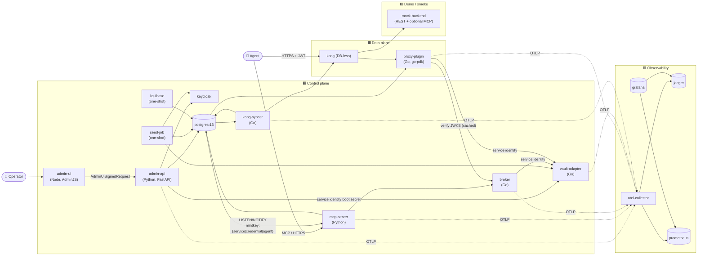

# Mintkey MVP — Phase 1 Design

**Feature:** mintkey-mvp
**Sources:**
- `docs/architecture/01-architecture/02-container-view.md`
- `docs/architecture/03-flows/` (E2E‑01 + F‑OP/F‑AG flow set)
- `docs/architecture/contracts/` (REST OpenAPI, MCP tools, audit/change schemas, span attributes, `vault.proto`)
- `docs/architecture/01-architecture/open-questions.md`
- ADRs **0001 through 0017**, all Accepted
- `requirements.md` (the updated 15‑requirement spec; this design implements every AC)

---

## Overview

Mintkey Phase 1 is a polyglot stack split into **control plane** (high‑trust, low‑traffic) and **data plane** (latency‑sensitive, stateless). Per [REQ‑1.1](requirements.md), the compose set is **15 long‑running containers + 2 one‑shot jobs = 17 services**.

| Tier | Containers |
|---|---|
| Control plane (long‑running) | `admin-api`, `admin-ui`, `mcp-server`, `broker`, `vault-adapter`, `kong-syncer`, `keycloak`, `postgres` |
| Data plane (long‑running) | `kong`, `proxy-plugin` |
| Demo / smoke harness (long‑running) | `mock-backend` (§12) |
| Observability (long‑running) | `otel-collector`, `jaeger`, `prometheus`, `grafana` |
| One‑shot jobs | `liquibase` (migrations), `seed-job` (bootstrap) |



---

## 1. Shared infrastructure (`internal/` + `mintkey-models/`)

**Purpose:** shared Go packages and Python package used by every service in their respective language.

### Go: `internal/`

| Package | Responsibility |
|---|---|
| `internal/changes` | Postgres `LISTEN/NOTIFY` client over `pgx`. **Mandatory tenant‑scope configuration at startup**: callers pass either an explicit tenant list or the `[ALL_TENANTS]` sentinel; the wrapper **panics on startup** if no scope is configured ([REQ‑MT‑4](requirements.md), [ADR‑0014.1](../../../docs/architecture/01-architecture/adr/0014-iter-1-2-corrections.md)). Reconnect + heartbeat (60 s timeout) + reconciliation via `GET /v1/changes?since=<event_id>` on disconnect. |
| `internal/audit` | `audit.Emit(ctx, event)` — the **single audit chokepoint**. Emits to Postgres inside the caller's transaction; computes and stores `prev_hash` + `hash` per ADR‑0014.7 + REQ‑AUD‑3/4; takes a per‑tenant Postgres advisory lock for in‑order chain insertion. |
| `internal/ulid` | ULID generation with type prefix. Recognized prefixes: `tenant_`, `operator_`, `agent_`, `svc_`, `cred_`, `perm_`, `audit_`, `change_`, `session_`, `system_`, `jti_`, `kid_`. |
| `internal/otelinit` | OTel SDK bootstrap (tracer + meter + logger). **SDK‑level redaction filter** runs against the [forbidden span attribute patterns](../../../docs/architecture/contracts/events/span-attributes.md): exact names, suffix patterns (`*_token`, `*_secret`, `*_password`, `*_passphrase`), credential‑signature regex. Per ADR‑0017.6 / REQ‑11.6. |
| `internal/cfg` | Env‑based config loader using `caarlos0/env/v10`. |
| `internal/models` | Shared Go structs **mirroring** the Liquibase schema. Per [REQ‑SCHEMA‑1](requirements.md) / [ADR‑0015](../../../docs/architecture/01-architecture/adr/0015-liquibase-schema-source-of-truth.md), structs **never** add a column not present in Liquibase. CI mirror‑diff test (REQ‑12.6.6) enforces this. |
| `internal/svcid` | Service‑identity boot‑secret client. Reads token from `/run/secrets/mintkey_service_token` at startup; presents it as `X-Mintkey-Service-Token` on every gRPC/HTTP call to the Vault Adapter (REQ‑SEC‑8 / ADR‑0014.2). |

### Python: `mintkey-models/`

| Module | Responsibility |
|---|---|
| `mintkey_models.db` | SQLAlchemy 2.x async `Mapped` types. **Mirrors** Liquibase; never authoritative. CI mirror‑diff (REQ‑12.6.6) enforces. |
| `mintkey_models.schemas` | Pydantic v2 request/response schemas, generated from `docs/architecture/contracts/rest/openapi.yaml`. |
| `mintkey_models.audit` | `audit_emit(session, event)` — the Python audit chokepoint. Computes `prev_hash` + `hash`; takes the per‑tenant advisory lock; runs inside the caller's session/transaction. |
| `mintkey_models.changes` | `asyncpg`‑based LISTEN/NOTIFY client (same shape and tenant‑scope guarantees as the Go wrapper). |
| `mintkey_models.svcid` | Boot‑secret client (Python counterpart). |
| `mintkey_models.tenant_ctx` | Middleware helper to set `app.current_tenant` (and `app.platform_admin_view` for PlatformAdmin) using **bound parameters**, not f‑strings (see §4 below). |

---

## 2. Database schema (Liquibase = source of truth)

Schema lives in `admin-api/db/changelog/`. Per [REQ‑SCHEMA‑1](requirements.md) / [ADR‑0015](../../../docs/architecture/01-architecture/adr/0015-liquibase-schema-source-of-truth.md), Liquibase YAML changelogs are authoritative. SQLAlchemy and Go `internal/models` mirror this schema; the CI mirror‑diff fails the build on any drift.

### Tenant‑scoped tables (RLS enforced)

```
tenants                       (id, slug, display_name, status, settings, created_at, updated_at)
operators                     (id, tenant_id, email, display_name, internal_password_hash,
                               oidc_sub, oidc_provider, is_platform_admin, status, created_at)
operator_tenant_memberships   (operator_id, tenant_id, role, created_at)
sessions                      (id, tenant_id, operator_id, oidc_refresh_token_encrypted,
                               last_used_at, expires_at, ip, user_agent, created_at)
agents                        (id, tenant_id, name, description, api_key_hash, api_key_fingerprint,
                               mcp_endpoint, status, rate_limit_rps, created_at, updated_at)
services                      (id, tenant_id, name, slug, display_name, description,
                               base_url, auth_scheme, openapi_url, openapi_etag,
                               allow_internal_urls, current_key_version, status,
                               created_at, updated_at)
credentials                   (id, tenant_id, service_id, key_version,
                               ciphertext, nonce, wrapped_dek, auth_scheme,
                               status, created_at, revoked_at)
permission_grants             (id, tenant_id, agent_id, service_id, action, constraints,
                               created_at, created_by)
audit_events                  (id, tenant_id, event_type, actor_id, actor_type,
                               target_id, target_type, payload, prev_hash, hash,
                               request_id, trace_id, at)
tenant_settings               (tenant_id, key, value, updated_at, updated_by)
```

### Platform‑scoped tables (NO RLS — explicit allowlist)

```
admin_request_jti             (jti UUID PK, expires_at)
                              -- Replay protection for AdminJS↔FastAPI signed requests.
                              -- Per ADR-0016.1.

service_identities            (id, name, hashed_token, scopes, expires_at, created_at)
                              -- Per-service boot secrets (svcid_admin_api, svcid_mcp,
                              -- svcid_broker, svcid_proxy). Per ADR-0014.2.

audit_chain_state             (tenant_id PK, head_event_id, head_hash,
                              last_verified_at, last_verified_event_id)
                              -- Per-tenant audit chain head pointer.
                              -- Per ADR-0014.7 + REQ-15.

schema_migrations_history     (managed by Liquibase)
```

### RLS policy (every tenant‑scoped table)

```sql
ALTER TABLE <table> ENABLE ROW LEVEL SECURITY;
CREATE POLICY tenant_isolation ON <table>
  USING (
    tenant_id = current_setting('app.current_tenant', true)::uuid
    OR current_setting('app.platform_admin_view', true) = 'on'
  );
```

The `, true` second argument on `current_setting` makes it return `NULL` (instead of erroring) if the GUC isn't initialized — required so the policy evaluates safely even during edge‑case connection initialization. The OR clause is the **PlatformAdmin escape** per ADR‑0016.3 / REQ‑1.4. The architecture test (REQ‑1.11) asserts exactly this shape on every tenant‑scoped table and rejects any policy with `qual = 'true'` or any other no‑op form.

### DB roles

| Role | Privileges |
|---|---|
| `mintkey_migrate` | DDL + DML; **bypasses RLS**; used **only** by Liquibase (one‑shot job). |
| `mintkey_app` | DML on all tables; `INSERT` + `SELECT` only on `audit_events` (no `UPDATE`/`DELETE`); does **not** bypass RLS. Used by `admin-api`, `mcp-server`, `vault-adapter`, `broker`, `kong-syncer`. |
| `mintkey_subscriber` | `LISTEN` privileges on `mintkey:service`, `mintkey:credential`, `mintkey:agent`, `mintkey:heartbeat` plus `SELECT` on the four `*_changes_view` views. No INSERT/UPDATE/DELETE. Used by long‑running subscriber connections in `kong-syncer`, `mcp-server`, `proxy-plugin`. |

---

## 3. Seed job (`seed-job/`)

**Language:** Python (shares `mintkey-models`). One‑shot container; runs **after** `liquibase` exits 0 and **before** `admin-api` starts. The seed job does **not** itself run Liquibase; it depends on the migrations having already applied.

### Sequence

All steps are **idempotent**: re‑running the seed job is a no‑op unless `--rotate-bootstrap` is passed.

1. **Wait** for Postgres to accept connections.
2. **Verify** Liquibase migrations have applied (`SELECT version FROM databasechangelog ORDER BY orderexecuted DESC LIMIT 1`).
3. **Default tenant**: INSERT `tenants` row with slug `t_default` and `isolation_mode='row'` (`ON CONFLICT DO NOTHING`).
4. **Per‑tenant `audit_chain_state`**: INSERT a genesis row for `t_default` with `head_hash = sha256("mintkey-audit-genesis-v1:" || tenant_id)`, `head_event_id = NULL`.
5. **Bootstrap admin operator**: generate a 32‑byte random password; Argon2id‑hash it; INSERT operator with `role=Admin`, `is_platform_admin=true`, `status=active`. INSERT `operator_tenant_memberships(operator_id, tenant_id=t_default, role=Admin)`.
6. **Service‑identity boot secrets**: generate four 32‑byte random tokens (`svcid_admin_api`, `svcid_mcp`, `svcid_broker`, `svcid_proxy`); Argon2id‑hash each into `service_identities`; write the plaintexts to `./data/bootstrap-secrets/svcid_*` (mode `0400`, owner = service user).
7. **AdminJS keypair**: generate an Ed25519 keypair; **store the public key** in the Vault Adapter under credential type `admin_ui_signing_key`; write the **private key** to `./data/bootstrap-secrets/admin_ui_private.pem` (mode `0400`).
8. **Broker signing keypair**: generate an Ed25519 keypair; **store the private key** in the Vault Adapter under credential type `signing_key` with `kid = ulid('kid_')`; the public key is published by the broker's JWKS endpoint at runtime.
9. **Keycloak realm**: import `seed-job/realm-mintkey.json` via the Keycloak Admin REST API; the import includes the `mintkey-admin` confidential OIDC client.
10. **Bootstrap admin password**: write to `./data/bootstrap-secrets/admin_password` (mode `0400`) and print to stdout for operator capture.
11. **Audit**: emit `tenant.bootstrap_completed` event for `t_default` (this is the first event in the per‑tenant chain).
12. **Exit 0**.

### Rotation mode (`--rotate-bootstrap`)

Re‑runs steps 6–9 with new secrets; the Vault Adapter accepts the new and old tokens during a configurable overlap window (default 1 hour).

---

## 4. Admin REST API (`admin-api/`)

**Language:** Python 3.12, FastAPI, SQLAlchemy 2.x async, Pydantic v2, `asyncpg`, `authlib`, `argon2-cffi`, `structlog`, `ruff` + `mypy --strict`, `uv`.

### Internal structure

```
admin-api/src/admin_api/
  main.py                    # FastAPI app factory, lifespan, middleware registration
  api/
    auth.py                  # POST /v1/auth/internal-login, /logout, /oidc/login, /oidc/callback, /me
    tenants.py               # POST/GET/PATCH/DELETE /v1/tenants[/{id}]
    services.py              # CRUD /v1/tenants/{tid}/services[/{sid}], POST .../test
    credentials.py           # CRUD /v1/tenants/{tid}/services/{sid}/credentials
    agents.py                # CRUD /v1/tenants/{tid}/agents[/{aid}], POST .../revoke
    permissions.py           # POST/DELETE /v1/tenants/{tid}/agents/{aid}/permissions
    audit.py                 # GET /v1/tenants/{tid}/audit
    changes.py               # GET /v1/changes?since=<event_id> (reconciliation)
    settings.py              # GET/PATCH /v1/admin/settings (PlatformAdmin only — REQ-14)
    audit_admin.py           # POST /v1/admin/audit/verify-chain, /acknowledge-tamper (REQ-15)
    health.py                # GET /v1/health (liveness), /v1/ready (readiness)
    jwks.py                  # Internal proxy for /.well-known/jwks.json from broker
    internal/
      validate_agent.py      # POST /v1/internal/validate-agent-key (ServiceIdentity-auth, called by mcp-server)
      audit_emit.py          # POST /v1/internal/audit/emit (ServiceIdentity-auth, called by proxy-plugin)
  services/
    identity.py              # operator authn, agent key validation, RBAC checks
    vault_client.py          # gRPC client to vault-adapter (carries svcid_admin_api token)
    broker_client.py         # HTTP client to broker (JWKS only; not token issuance)
    change_publisher.py      # NOTIFY wrapper (bound parameters; called inside transactions)
  db/
    session.py               # async engine, session factory, tenant middleware
    models.py                # SQLAlchemy Mapped types — MIRRORS Liquibase, never authoritative
    triggers.py              # (none in v1; reserved if future RLS additions need them)
  auth/
    internal.py              # Argon2id verify; identical-body / equalized-timing per REQ-SEC-9
    oidc.py                  # authlib OIDC flow (PKCE)
    sessions.py              # server-side session storage in `sessions` table
    middleware.py            # Session cookie validation; tenant context injection
    signed_request.py        # Validate AdminJS Ed25519 JWTs + jti denylist (ADR-0014.6 / REQ-SEC-5)
  audit/
    emit.py                  # Single chokepoint: hashing + per-tenant advisory lock
  middleware/
    tenant.py                # SET LOCAL app.current_tenant (bound parameters, see below)
    csrf.py                  # X-Mintkey-Csrf header validation (REQ-SEC-6)
    otel.py                  # OTel instrumentation; SDK-level redaction
```

### Tenant context middleware (CORRECTED — bound parameters)

Per [REQ‑MT‑2](requirements.md): every DB transaction sets `app.current_tenant` before any query. Per **REQ‑MT‑5 / ADR‑0016.3**: `PlatformAdmin` operations also set `app.platform_admin_view = 'on'`. **All values bind via SQLAlchemy parameters** (no f‑string interpolation):

```python
async def set_tenant_context(
    session: AsyncSession,
    tenant_id: UUID,
    is_platform_admin_view: bool = False,
) -> None:
    # Use bound parameters via execute(text(...), params) — never f-strings.
    # SET LOCAL doesn't accept query parameters directly; we use set_config() instead,
    # which is the Postgres-supported way to parameterize.
    await session.execute(
        text("SELECT set_config('app.current_tenant', :tid, true)"),
        {"tid": str(tenant_id)},
    )
    if is_platform_admin_view:
        await session.execute(
            text("SELECT set_config('app.platform_admin_view', 'on', true)"),
        )
```

The third parameter `true` to `set_config(...)` is `is_local`, equivalent to `SET LOCAL` (transaction‑scoped). This pattern is **identical** in `mcp-server`, `vault-adapter`, and `broker` — see `mintkey_models.tenant_ctx`.

### Change publisher (CORRECTED — bound parameters, transactional guarantee)

```python
async def publish_change(
    session: AsyncSession,
    channel: Literal["mintkey:service", "mintkey:credential", "mintkey:agent"],
    payload: dict,
) -> None:
    # MUST run inside the same transaction as the state-change INSERT.
    # SQLAlchemy parameter binding prevents injection.
    await session.execute(
        text("SELECT pg_notify(:channel, :payload)"),
        {"channel": channel, "payload": json.dumps(payload, separators=(",", ":"))},
    )
```

The transactional guarantee is enforced by an architecture test that asserts every `publish_change` call site is inside a `session.begin()` block that also contains the corresponding INSERT.

### Internal‑login (CORRECTED — identical body + equalized timing)

Per [REQ‑SEC‑9](requirements.md) / [ADR‑0017.5](../../../docs/architecture/01-architecture/adr/0017-round-3-corrections.md):

```python
DUMMY_HASH = "$argon2id$v=19$m=65536,t=3,p=4$..."  # fixed; never matches a real password

async def internal_login(username: str, password: str) -> Operator | None:
    operator = await db.fetch_operator_by_email(username)
    if operator is None:
        # Always run a verify against the dummy to equalize timing.
        argon2.verify(DUMMY_HASH, password)
        await audit.emit("auth.login.failed.user_unknown", {"username_attempted": username[:200]})
        return None
    if operator.status == "locked":
        argon2.verify(DUMMY_HASH, password)  # equalize even when we know it's locked
        await audit.emit("auth.login.failed.account_locked", {"operator_id": operator.id})
        return None
    try:
        argon2.verify(operator.internal_password_hash, password)
    except VerifyMismatchError:
        await audit.emit("auth.login.failed.bad_password", {"operator_id": operator.id})
        return None
    await audit.emit("auth.login.success", {...})
    return operator
```

The HTTP handler returns the **same body** for all three failure modes:
```json
{"type": "...", "title": "Invalid credentials", "status": 401, "mintkey:code": "invalid_credentials"}
```

### AdminJS signed‑request validation (CORRECTED — Ed25519 keypair, not shared secret)

Per [REQ‑SEC‑5](requirements.md) / [ADR‑0014.6](../../../docs/architecture/01-architecture/adr/0014-iter-1-2-corrections.md):

```python
class AdminUiSignedRequestMiddleware:
    """Validates Ed25519-signed JWTs from AdminJS on every state-changing endpoint."""
    
    async def __call__(self, request: Request, call_next):
        if request.method in ("GET", "HEAD"):
            return await call_next(request)
        token = extract_bearer(request.headers.get("Authorization"))
        # Public key fetched from Vault Adapter at startup; cached for 1h;
        # force-refreshed on signature-verify failure.
        claims = jwt.decode(token, key=self.adminjs_public_key, algorithms=["EdDSA"])
        # claims: iss="mintkey/admin-ui", sub=operator_id, tnt=tenant_id, aud="mintkey/admin-api",
        #         iat, exp (60s TTL), jti (UUID)
        if claims["iss"] != "mintkey/admin-ui": raise Unauthorized
        if claims["aud"] != "mintkey/admin-api": raise Unauthorized
        if not (now() - 30 < claims["iat"] < claims["exp"] < now() + 60): raise Unauthorized
        # Replay protection: insert jti; conflict ⇒ replay
        try:
            await db.execute(
                text("INSERT INTO admin_request_jti (jti, expires_at) VALUES (:jti, :exp)"),
                {"jti": claims["jti"], "exp": datetime.fromtimestamp(claims["exp"])},
            )
        except UniqueViolationError:
            raise Unauthorized("replay_detected")
        # Bind operator + tenant to the request scope
        request.state.operator_id = claims["sub"]
        request.state.tenant_id = claims["tnt"]
        return await call_next(request)
```

A periodic cleanup job deletes expired `admin_request_jti` rows every 5 minutes.

### Vault Adapter gRPC client

```
PutCredential(tenant_id, service_id, plaintext, auth_scheme) -> {key_version}
GetCredential(tenant_id, service_id, key_version) -> {plaintext, auth_scheme, expires_at?}
RotateCredential(tenant_id, service_id, new_plaintext) -> {key_version}
RevokeCredential(tenant_id, service_id, key_version) -> {}
ValidateServiceIdentity(token) -> {scopes, valid_until}   # called by other services
```

Every call carries the `X-Mintkey-Service-Token` metadata field with `svcid_admin_api`'s boot secret. The Vault Adapter validates via constant‑time Argon2id compare (REQ‑SEC‑8 / ADR‑0014.2).

---

## 5. Admin UI (`admin-ui/`)

**Language:** Node 20, AdminJS 7.x, Express, `passport-openidconnect`, `connect-pg-simple`, `pino`, `vitest`, `pnpm`.

### Authentication flow

1. Operator visits `/`. AdminJS Express middleware checks for `mintkey_session` cookie.
2. No cookie ⇒ redirect to `/login`.
3. Login page offers two paths:
   - **Internal auth** (bootstrap): username + password → `POST /v1/auth/internal-login` on `admin-api` (no signed‑request envelope on this route — login is the bootstrap surface).
   - **OIDC** (Keycloak): `passport-openidconnect` redirects to Keycloak; on callback, posts the ID token to `admin-api POST /v1/auth/oidc/callback`.
4. On success, `admin-api` sets `mintkey_session` (HttpOnly Secure SameSite=Strict). AdminJS reads the same cookie via `connect-pg-simple` (shared `sessions` table).

### State‑changing operations (CORRECTED — Ed25519 keypair)

Per [REQ‑SEC‑5](requirements.md) / [ADR‑0014.6](../../../docs/architecture/01-architecture/adr/0014-iter-1-2-corrections.md):

- AdminJS holds a **private** Ed25519 key, mounted from `./data/bootstrap-secrets/admin_ui_private.pem` (read‑only, mode 0400).
- For every state‑changing operation (create/update/delete/custom action):
  - AdminJS **signs** an Ed25519 JWT with claims `{iss: "mintkey/admin-ui", sub: operator_id, tnt: tenant_id, aud: "mintkey/admin-api", iat, exp: iat+60, jti: uuid()}`.
  - Sends the request to `admin-api` with `Authorization: Bearer <signed-jwt>` plus the operator's `mintkey_session` cookie.
  - Sends `X-Mintkey-Csrf` header (double‑submit cookie pattern, REQ‑SEC‑6).
- AdminJS **never writes** to the database directly; the `@adminjs/sql` adapter is used in **read‑only mode** only for list / show views.

### PlatformAdmin tenant scope (NEW — per REQ‑MT‑5 / ADR‑0016.3)

When a `PlatformAdmin` operator's session is active, the UI shows a tenant selector with an "All tenants" option. Choosing "All tenants" sets `req.session.tenant_id = null` and `req.session.platform_admin_view = true`. The `before` hooks on each AdminJS resource:

- If `platform_admin_view`: skip the tenant filter (don't constrain the SQL `WHERE`).
- Else: apply `WHERE tenant_id = :session.tenant_id`.

The corresponding state‑changing JWT to `admin-api` carries `tnt: null` and a special `mintkey:platform_admin_view: true` claim; `admin-api` sets `app.platform_admin_view = 'on'` for the request and emits a sibling `platform_admin.access` audit event.

### Resources

| Resource | Roles | Scope |
|---|---|---|
| `Tenants` | `PlatformAdmin` only | All |
| `Operators` | `Admin` (own tenant), `PlatformAdmin` (all) | RBAC + RLS |
| `Services` | `Admin`, `AgentOwner` (read) | Tenant‑scoped |
| `Credentials` | `Admin` only — create + rotate; **never** read plaintext (the field is `x-mintkey-sensitive`) | Tenant‑scoped |
| `Agents` | `Admin`, `AgentOwner` (own agents) | Tenant‑scoped |
| `PermissionGrants` | `Admin`, `AgentOwner` (own agents) | Tenant‑scoped |
| `AuditEvents` | `Auditor`, `Admin` | Tenant‑scoped (PlatformAdmin can view across) |
| `AdminSettings` | `PlatformAdmin` only | Platform |

---

## 6. MCP Server (`mcp-server/`)

**Language:** Python 3.12, Anthropic `mcp` SDK, FastAPI (for `/v1/health`, `/v1/ready`).

### Authentication

```python
async def authenticate_agent(authorization: str) -> AgentSession:
    if not authorization.startswith("Bearer mk_agent_"):
        raise Unauthorized("bad_format")
    api_key = authorization.removeprefix("Bearer ").strip()
    # Internal call to admin-api with svcid_mcp boot secret
    resp = await admin_api_client.post(
        "/v1/internal/validate-agent-key",
        json={"api_key": api_key},
        headers={"X-Mintkey-Service-Token": svcid_mcp.token},
    )
    if resp.status_code != 200:
        raise Unauthorized
    data = resp.json()  # {agent_id, tenant_id, status}
    if data["status"] != "active":
        raise Unauthorized("agent_revoked")
    return AgentSession(agent_id=data["agent_id"], tenant_id=data["tenant_id"])
```

The internal endpoint `POST /v1/internal/validate-agent-key` is **not** part of the public OpenAPI surface; it's documented in `admin-api/internal-contracts.md` (a sibling spec document). It accepts only callers presenting a valid `ServiceIdentity` boot secret.

### Tenant context

Every DB query in `mcp-server` runs inside a transaction that sets `app.current_tenant` to the agent's tenant via `mintkey_models.tenant_ctx.set_tenant_context()` (REQ‑MT‑2).

### MCP tools

All tools are documented in `docs/architecture/contracts/mcp/tools.yaml`. Tool handlers are thin wrappers around the database + the broker.

| Tool | Behavior |
|---|---|
| `list_services()` | `SELECT s.* FROM services s JOIN permission_grants p ON p.service_id = s.id WHERE p.agent_id = :agent_id` (RLS scopes to tenant). |
| `describe_service(service_id)` | `SELECT * FROM services WHERE id = :service_id` (RLS handles tenant; returns 404 if cross‑tenant). |
| `get_openapi(service_id)` | If the service has `openapi_url` and it's reachable, fetch and return; else return the URL with `etag`. |
| `request_token(service_id, action, ttl_seconds?)` | (1) check `permission_grants`; (2) evaluate `Constraints` (rate_limit via `redis`‑less in‑memory token bucket, time_window via tz lookup, request_path_prefix is plugin‑side, source_ip_allowlist is plugin‑side); (3) call broker `POST /v1/issue` with `svcid_mcp` token. |
| `proxy_endpoint(service_id)` | Returns `{explicit_url, virtual_host_url}` from the service config. |

### Change‑channel subscriber

Subscribes to **global** channels `mintkey:agent` (for `agent.revoked`) and `mintkey:service` (to invalidate discovery cache). On startup the wrapper requires an explicit tenant scope; in the default deployment it's `[ALL_TENANTS]` since the MCP server serves any tenant's agent.

On `agent.revoked` for an agent with an active session: terminate the connection within ≤ 5 s (REQ‑10.2).

---

## 7. Credential Broker (`services/broker/`)

**Language:** Go 1.22, `chi/v5`, `go-jose/v4`, `pgx/v5`.

### Endpoints

- `POST /v1/issue` — issue a JWT. **Authenticated** with `X-Mintkey-Service-Token: <svcid_broker>` (only `mcp-server` calls this).
- `GET /.well-known/jwks.json` — public JWKS, **unauthenticated** (cache‑friendly for proxy plugin).
- `GET /v1/health`, `GET /v1/ready` — health checks.

### JWT issuance (CORRECTED — `tnt` is tenant_id, not slug; `kid` in header)

```go
type BrokeredTokenClaims struct {
    Issuer    string   `json:"iss"`     // "mintkey/broker"
    Subject   string   `json:"sub"`     // agent_<ULID>
    Audience  []string `json:"aud"`     // [svc_<ULID>]
    Tenant    string   `json:"tnt"`     // tenant_<ULID>  -- prefixed ULID, NEVER a slug
    Scope     string   `json:"scope"`   // single action
    JTIID     string   `json:"jti"`     // ULID
    IssuedAt  int64    `json:"iat"`
    ExpiresAt int64    `json:"exp"`
}

func (b *Broker) Issue(ctx context.Context, req IssueRequest) (*IssueResponse, error) {
    // ServiceIdentity validation already done by middleware.
    claims := BrokeredTokenClaims{
        Issuer:    "mintkey/broker",
        Subject:   req.AgentID,                // agent_<ULID>
        Audience:  []string{req.ServiceID},    // [svc_<ULID>]
        Tenant:    req.TenantID.String(),      // tenant_<ULID>  <-- the FULL prefixed ULID
        Scope:     req.Action,
        JTIID:     ulid.New("jti"),
        IssuedAt:  time.Now().Unix(),
        ExpiresAt: time.Now().Add(req.TTL).Unix(),
    }
    // Sign using the active key; embed `kid` in JWS header for verifier lookup.
    headers := jose.SignerOptions{}.WithType("JWT").WithHeader("kid", b.activeKID)
    signer, _ := jose.NewSigner(jose.SigningKey{Algorithm: jose.EdDSA, Key: b.activeKey}, &headers)
    token, err := jose.SignerSign(signer, claims)
    if err != nil {
        return nil, err
    }
    audit.Emit(ctx, audit.Event{
        Type:       "token.issued",
        TenantID:   req.TenantID,
        ActorID:    req.AgentID,
        ActorType:  "agent",
        TargetID:   req.ServiceID,
        TargetType: "service",
        Payload: map[string]any{
            "jti":         claims.JTIID,
            "scope":       claims.Scope,
            "ttl_seconds": int(req.TTL.Seconds()),
            "key_version": req.KeyVersion,
        },
    })
    return &IssueResponse{
        Token:     token,
        ExpiresAt: claims.ExpiresAt,
        JTI:       claims.JTIID,
        ProxyEndpoint: req.ProxyEndpoint,
    }, nil
}
```

### Key management

- **Private key** loaded at startup from the Vault Adapter under credential type `signing_key`, with the **`kid`** read from the credential metadata. Authenticated with `svcid_broker` boot secret.
- **JWKS endpoint** publishes all *active* and *retiring* (within overlap window) public keys, each with `kid`.
- **Rotation**: a new key is added with overlap (default 1 hour); after overlap, the old key is removed from JWKS. The verifier‑side force‑refresh on unknown `kid` (REQ‑SEC‑10) handles the rare case of a JWT signed before the rotation but verified after.

---

## 8. Vault Adapter (`services/vault-adapter/`)

**Language:** Go 1.22, gRPC, `modernc.org/sqlite` (pure‑Go, no CGO), AES‑256‑GCM (stdlib `crypto/cipher`), Argon2id (`golang.org/x/crypto/argon2`).

### gRPC service (per `docs/architecture/contracts/vault-adapter/vault.proto`)

```proto
service VaultAdapter {
  rpc PutCredential(PutCredentialRequest) returns (PutCredentialResponse);
  rpc GetCredential(GetCredentialRequest) returns (GetCredentialResponse);
  rpc RevokeCredential(RevokeCredentialRequest) returns (RevokeCredentialResponse);
  rpc ListVersions(ListVersionsRequest) returns (ListVersionsResponse);
  rpc ValidateServiceIdentity(ValidateServiceIdentityRequest)
    returns (ValidateServiceIdentityResponse);   // NEW per ADR-0014.2 / REQ-SEC-8
}
```

Every RPC except `ValidateServiceIdentity` requires a `X-Mintkey-Service-Token` gRPC metadata field. The adapter calls its own `ValidateServiceIdentity` path internally to authenticate the caller and check scopes.

### Caller scopes

| Service identity | Allowed RPCs |
|---|---|
| `svcid_admin_api` | `Put*`, `Get*`, `Revoke*`, `List*` (full CRUD) |
| `svcid_mcp` | `GetCredential` (signing key only), `ValidateServiceIdentity` |
| `svcid_broker` | `GetCredential` (signing key only), `ValidateServiceIdentity` |
| `svcid_proxy` | `GetCredential` (any tenant's service credential), `ValidateServiceIdentity` |
| `svcid_seed` | `PutCredential` (only `signing_key`, `admin_ui_signing_key`, `service_identity` types) |

### Encryption (file backend v1)

```
KEK (loaded from /run/secrets/mintkey_kek_keyfile, owner-readonly, mode 0400, never logged)
  |
  +-- wraps --> DEK (32 bytes random per credential, never written to disk plaintext)
                     |
                     +-- AES-256-GCM(plaintext, nonce) --> ciphertext
                                                            |
                                                            stored as: (ciphertext, nonce, wrapped_dek)
                                                            in vault.sqlite
```

`GetCredential` flow:
1. ServiceIdentity validated (constant‑time Argon2id verify).
2. Check encrypted‑DEK cache (see below).
3. Cache miss: `SELECT ciphertext, nonce, wrapped_dek FROM credentials WHERE tenant_id=? AND service_id=? AND key_version=?`.
4. Unwrap DEK with KEK; decrypt ciphertext with DEK.
5. Return plaintext + auth_scheme over gRPC (TLS in production, plaintext channel in compose with caller authenticated by service identity).
6. Zero DEK and plaintext byte slices best‑effort (Go GC limitation acknowledged per ADR‑0014.4).

### Encrypted‑DEK cache (CORRECTED — lives here, not in proxy plugin)

Per [ADR‑0014.4](../../../docs/architecture/01-architecture/adr/0014-iter-1-2-corrections.md) / [REQ‑9.3](requirements.md):

- Cache key: `(tenant_id, service_id, key_version)`.
- Cache value: `wrapped_dek` (AES‑256‑GCM ciphertext of the DEK; **never** the plaintext DEK).
- TTL: ≤ JWT TTL (default 5 minutes; max 10 minutes).
- Invalidation: on `credential.rotated` event from the change channel for `(tenant_id, service_id, key_version)`, the cache entry is deleted.
- The plaintext credential is **never** cached — only the encrypted DEK.

This cache reduces the Vault Adapter's per‑request work from "DB read + KEK unwrap + plaintext decrypt" to "KEK unwrap + plaintext decrypt"; the DB read is amortized.

### Security invariants

- Plaintext credential **never** written to disk, logs, or OTel span attributes.
- KEK **never** logged or returned in any RPC.
- DEK **never** written to disk in plaintext form.
- Best‑effort zeroization after request scope.

---

## 9. Kong‑Syncer (`services/kong-syncer/`)

**Language:** Go 1.22, `chi/v5` (for `/v1/health`), `pgx/v5` (LISTEN/NOTIFY), Kong Admin API client.

### Responsibility

Translate the Mintkey service registry into Kong DB‑less declarative YAML and push to Kong's `/config` endpoint on operator events.

### Subscriber configuration (CORRECTED — global channels, explicit tenant scope)

```go
// Per REQ-MT-4: explicit tenant scope is mandatory
client := changes.NewClient(
    db,
    changes.WithTenantScope(changes.AllTenants),  // syncer is cross-tenant
    changes.WithChannels("mintkey:service", "mintkey:agent"),
)
```

The wrapper panics if `WithTenantScope` is not called.

### Event handling

- `service.registered` / `service.updated` / `service.removed` → rebuild full Kong declarative YAML for the affected tenant(s); push to Kong.
- `agent.revoked` → update Kong `acl` plugin's denylist for the tenant; push to Kong.

### Kong declarative YAML (per service)

```yaml
services:
  - name: svc_<slug>
    url: <base_url>
    plugins:
      - name: mintkey-proxy-plugin
        config:
          service_id: <svc_ULID>
          tenant_id: <tenant_ULID>
      - name: rate-limiting
        config:
          minute: <rate_limit>
      - name: opentelemetry
        config:
          endpoint: http://otel-collector:4317
    routes:
      - name: route_<slug>_path
        paths: ["/v1/call/<svc_ULID>"]
        strip_path: true
      - name: route_<slug>_vhost
        hosts: ["<slug>.<tenant_slug>.proxy.local"]
        strip_path: false
```

The dual route forms implement [ADR‑0007](../../../docs/architecture/01-architecture/adr/0007-proxy-deployment-topology.md): explicit path form + virtual‑host alias.

### Startup

On startup, fetch all services from `admin-api` (presenting `svcid_proxy`'s read scope), generate the full declarative YAML, push to Kong before subscribing to live events. Reconcile any missed events via `GET /v1/changes?since=<last_event_id>` if a state hash was persisted.

---

## 10. Proxy Plugin (`services/proxy-plugin/`)

**Language:** Go 1.22, Kong `go-pdk`. Runs as a sidecar process to Kong, communicating via Unix socket.

### Plugin phases

#### `access` phase

1. Extract JWT from `Authorization: Bearer` header.
2. Parse JWT header to get `kid`.
3. Look up `kid` in JWKS cache (5‑min TTL).
4. **Cache miss**: force‑refresh JWKS from `broker:8080/.well-known/jwks.json`. **Rate‑limit** to one refresh per `(verifier_instance, kid)` per minute (REQ‑SEC‑10 / ADR‑0016.2). Per‑kid mutex serializes the refresh.
5. Verify EdDSA signature against the resolved public key.
6. Check claims in order: `exp` (with ≤ 30 s clock skew), `iss == "mintkey/broker"`, `aud == service_id` (from URL), `tnt == registered service's tenant_id` (looked up from in‑memory service config map populated by Kong‑syncer), `scope` matches the requested action, `jti` not in revocation set, `sub` not in revoked‑agent set.
7. If all checks pass, call Vault Adapter's `GetCredential(tenant_id, service_id, key_version)` over gRPC, presenting `svcid_proxy` boot secret.
8. Plaintext is held in a request‑scoped variable (no cache).
9. Strip the agent's `Authorization` header; strip hop‑by‑hop headers; inject the credential per `auth_scheme`:
   - `api_key_header` → set the configured header name to the value.
   - `api_key_query` → append the configured query parameter.
   - `bearer_token` → `Authorization: Bearer <value>`.
   - `basic_auth` → `Authorization: Basic <base64(user:pass)>`.
   - `oauth2_client_credentials` → `Authorization: Bearer <access_token>` (with refresh handled by Vault Adapter).
   - `oidc_client_secret` → similar.
   - `mtls` → load cert+key from credential payload, configure mTLS to backend for this request, zero cert+key after handshake.
10. Set OTel trace context on outbound request.

#### `header_filter` + `body_filter` phases (response scrubber)

Per [REQ‑11.6](requirements.md) / [ADR‑0017.6](../../../docs/architecture/01-architecture/adr/0017-round-3-corrections.md):

```go
var forbiddenHeaderNames = []string{
    "authorization", "cookie", "set-cookie",
    "x-api-key", "api-key", "auth-token",
}

var forbiddenBodyPatterns = []*regexp.Regexp{
    regexp.MustCompile(`(?i)\b(api[_-]?key|access[_-]?token|refresh[_-]?token|client[_-]?secret|password)\b\s*[:=]\s*"?[\w\-\.\+/=]+"?`),
    regexp.MustCompile(`\b(sk|pk)_[a-zA-Z0-9_-]{20,}\b`),                  // Stripe-shaped
    regexp.MustCompile(`\beyJ[A-Za-z0-9+/=._-]{20,}\b`),                    // JWT-shaped
}
```

- **Headers**: strip every header whose name (case‑insensitive) matches `forbiddenHeaderNames`.
- **Body**: scan up to the first 256 KiB of response body for `forbiddenBodyPatterns`; if a match is found, redact the matched substring (replace with `[REDACTED]`) and emit `proxy.credential_echo_detected` audit event with `field_location` (header name or body offset).

#### `log` phase

1. Emit `proxy.hit` audit event via `POST /v1/internal/audit/emit` to `admin-api` (presenting `svcid_proxy`).
2. Best‑effort zero plaintext credential bytes from request context.

### In‑memory state

| Map | Contents | Eviction |
|---|---|---|
| `jwksCache` | `kid -> {public_key, fetched_at}` | TTL 5 min |
| `revokedAgents` | `agent_id -> revoked_at` | LRU, max 100k, TTL 24h |
| `jtiDenylist` | `jti -> exp` | Time‑bucketed, max 100k, TTL = JWT TTL |
| `serviceConfig` | `service_id -> {tenant_id, base_url, auth_scheme, ...}` | Refreshed by Kong‑syncer |

**The plugin holds NO encrypted‑DEK or plaintext credential cache.** That cache lives in the Vault Adapter (§8).

### Change‑channel subscriber

```go
client := changes.NewClient(
    db,
    changes.WithTenantScope(changes.AllTenants),  // proxy serves all tenants
    changes.WithChannels("mintkey:agent"),         // for agent.revoked, token.revoked
)
```

On `agent.revoked` → add to `revokedAgents`. On `token.revoked` → add to `jtiDenylist`. The plugin does **not** subscribe to `mintkey:credential` (the Vault Adapter does, for cache invalidation).

---

## 11. Docker Compose (`docker-compose.yml`)

### Startup graph

```
postgres (healthcheck ready)
  └─→ liquibase (one-shot, runs migrations, exits 0)
        └─→ keycloak (depends_on: liquibase service_completed_successfully — actually no,
                      keycloak doesn't need our DB; it uses its own DB schema in Postgres)
        └─→ seed-job (one-shot, exits 0)
              └─→ admin-api
                    └─→ admin-ui
                    └─→ mcp-server
                    └─→ broker
                    └─→ vault-adapter
                    └─→ kong-syncer
                          └─→ kong
                                └─→ proxy-plugin (Kong dependency)
otel-collector
  └─→ jaeger
  └─→ prometheus
        └─→ grafana
mock-backend (no deps; always up)
```

### Health checks

Every long‑running service exposes `GET /v1/health` (or equivalent for off‑the‑shelf containers). Compose `healthcheck` polls this; downstream services use `depends_on: condition: service_healthy`.

### Volumes

| Volume | Path | Purpose |
|---|---|---|
| `postgres_data` | `/var/lib/postgresql/data` | Postgres data |
| `vault_data` | `/var/lib/mintkey/vault.sqlite` | SQLite vault file |
| **`vault_kek` (separate mount)** | `/run/secrets/mintkey_kek_keyfile` | **REQUIRED**: KEK keyfile, mode 0400, on a **separate filesystem mount** from `vault_data` (per [ADR‑0003](../../../docs/architecture/01-architecture/adr/0003-credential-storage-strategy.md) — defense in depth: an attacker who gets `vault_data` should not also get the keyfile). |
| `bootstrap_secrets` | `/run/secrets/mintkey/bootstrap-secrets/` | Service identity boot secrets, AdminJS private key, admin password (mode 0400 each) |
| `grafana_data` | `/var/lib/grafana` | Grafana state |

### Networking

Single `mintkey` bridge network. Internal service ports not exposed externally except:

| Port | Service | External |
|---|---|---|
| 8080 | admin-api | yes (operator API) |
| 8081 | admin-ui | yes (operator UI) |
| 8082 | mcp-server | yes (agent MCP endpoint) |
| 8000 | kong | yes (agent proxy entry) |
| 8443 | keycloak | yes (operator OIDC) |
| 16686 | jaeger | yes (operator trace UI) |
| 3000 | grafana | yes (operator dashboards) |
| 9090 | prometheus | yes (operator) |
| 8999 | mock-backend | yes (smoke tests) |

Internal-only: 5432 postgres, 4317 OTLP, broker (8083), vault-adapter (8084 gRPC), kong-syncer (8085), kong admin (8001).

---

## 12. Mock Backend (`mock-backend/`)

The mock backend is the smoke‑test target. It serves three purposes:

1. **Smoke‑test target** (Phase 1, REQ‑12): a real HTTP backend the proxy can call so the E2E path is exercised end‑to‑end.
2. **Auth‑scheme exerciser** (Phase 1): one endpoint per supported auth scheme, so we test that the proxy plugin injects the right header / query / TLS config and the backend sees the real credential, not the JWT.
3. **Response‑scrubber test target** (Phase 1): an endpoint that deliberately echoes the `Authorization` header so we verify the response scrubber strips it (REQ‑7.6 / REQ‑7.7).

### Options analyzed

| Option | Pros | Cons | Verdict |
|---|---|---|---|
| **A. httpbin / similar off‑the‑shelf** | Zero custom code; standard | Limited customization; no per‑auth‑scheme assertions; doesn't test mTLS | Insufficient |
| **B. Custom FastAPI app** (≤ 200 lines) | Full control; can assert auth schemes; can echo for scrubber tests; OpenAPI auto‑generated | Custom code | **Selected** |
| **C. Mockoon / WireMock / Prism** | GUI-driven scenarios; mock from OpenAPI | Adds another runtime; overkill for smoke | Defer |
| **D. Dual‑protocol (REST + native MCP)** | Future‑ready for Phase 3 MCP‑to‑MCP proxy | Extra complexity for Phase 1 | **Phase 3 expansion** |

**Decision**: **Option B for Phase 1**, structured so the **MCP‑native layer (Option D) can be added in Phase 3 without restructuring**.

### Phase 1 implementation (Option B)

**Language:** Python 3.12, FastAPI, ~200 lines.

#### Endpoints

| Endpoint | Auth scheme exercised | Behavior |
|---|---|---|
| `GET /health` | none | Returns `{"status":"ok"}`. Always 200. |
| `GET /api-key-header` | `api_key_header` (header `X-Api-Key`) | Returns `{"received_key": "<value>"}` if present and non‑empty, else 401. |
| `GET /api-key-query` | `api_key_query` (query `?api_key=`) | Returns `{"received_key": "<value>"}` if present, else 401. |
| `GET /bearer` | `bearer_token` (`Authorization: Bearer …`) | Returns `{"received_token": "<value>"}` if present, else 401. |
| `GET /basic-auth` | `basic_auth` | Returns `{"received_user": "<user>"}` if Basic auth present, else 401. |
| `GET /oauth-protected` | `oauth2_client_credentials` (`Authorization: Bearer …`) | Returns `{"received_token": "<value>"}`. |
| `GET /mtls` | `mtls` | Returns `{"client_cn": "<cn>"}` from the verified client cert. Requires mTLS handshake. |
| `POST /echo` | any | Returns the **full request headers and body** in the response — used to verify the response scrubber strips echoed credentials (REQ‑7.6 / REQ‑7.7). |
| `GET /timeout` | any | Sleeps 30 s before responding — used to test test‑run timeout handling (REQ‑4.7). |
| `GET /5xx` | any | Returns 500 — used to test test‑run failure handling. |
| `GET /redirect-internal` | any | Returns 302 to `/health` (same origin) — should be followed by Kong if configured. |
| `GET /redirect-external` | any | Returns 302 to `https://example.com/` — should NOT be followed (REQ‑7.13 — egress allowlist). |

#### OpenAPI surface

The mock backend's OpenAPI spec is served at `GET /openapi.json`. The seed job registers the mock backend as a Mintkey service with:

- `name: "mock-backend"`
- `display_name: "Mock backend (smoke test target)"`
- `base_url: "http://mock-backend:8999"`
- `auth_scheme: "bearer_token"` (default; the smoke test creates additional service registrations for the other schemes)
- `openapi_url: "http://mock-backend:8999/openapi.json"`
- A demo agent `mock-agent` is created with permission grants for actions `read:health`, `read:echo`, etc.

This makes the mock backend a **discoverable service via MCP** for any agent connecting to Mintkey: the agent can `list_services()` → see `mock-backend` → `request_token(svc_mock_backend, read:health)` → call `GET /v1/call/svc_mock_backend/health` through Kong.

#### Logging

The mock backend logs every received `Authorization` header (or auth header equivalent) at INFO level. The smoke test (REQ‑12.2) asserts that the logged value is the **real credential**, not the agent's JWT — proving that Mintkey successfully swapped the credential in‑flight.

### Phase 3 expansion (Option D — deferred)

When MCP‑to‑MCP proxying is added in Phase 3:

1. The mock backend gains an embedded MCP server (also Python, Anthropic `mcp` SDK).
2. Each REST endpoint is also exposed as an MCP tool (e.g., `mock_health()`, `mock_echo(payload)`).
3. The mock backend is registered with Mintkey as an "MCP‑native service" (distinct `auth_scheme`).
4. Mintkey's MCP server, on calls to that service, opens an upstream MCP client connection and proxies tool calls — credentials injected by the same Vault Adapter pipeline, just at the MCP message layer instead of HTTP.

The Phase 1 file structure pre‑accommodates this: `mock-backend/src/mock_backend/rest/` is the REST app; `mock-backend/src/mock_backend/mcp/` is reserved (empty in Phase 1) for the MCP server.

---

## 13. Observability stack

### OTel Collector configuration

The collector is the **second** layer of redaction. The **first** layer is the SDK‑level filter in `internal/otelinit` (Go) and the OTel SDK custom processor in Python — applied **before** spans leave each service. This two‑layer approach (per [REQ‑OBS‑2](requirements.md) / [ADR‑0017.6](../../../docs/architecture/01-architecture/adr/0017-round-3-corrections.md)) ensures redaction can't fail silently.

```yaml
# otel-collector-config.yaml
receivers:
  otlp:
    protocols:
      grpc:
        endpoint: 0.0.0.0:4317

processors:
  batch:
    timeout: 5s
    send_batch_size: 1000

  # Defense-in-depth redaction. Primary redaction is at the SDK.
  attributes/redact:
    actions:
      # Exact-name forbidden attributes
      - { key: mintkey.token, action: delete }
      - { key: mintkey.api_key, action: delete }
      - { key: mintkey.password, action: delete }
      - { key: mintkey.authorization_header, action: delete }
      - { key: mintkey.cookie_value, action: delete }
      - { key: mintkey.set_cookie_value, action: delete }
      # HTTP-level capture from auto-instrumentation (in case it sneaks past SDK)
      - { key: http.request.header.authorization, action: delete }
      - { key: http.request.header.cookie, action: delete }
      - { key: http.response.header.set-cookie, action: delete }

  # Heuristic suffix redaction via regex (collector supports `redaction` processor).
  redaction:
    allow_all_keys: true
    blocked_values:
      - 'sk_[a-zA-Z0-9_-]{20,}'      # Stripe-shaped
      - 'pk_[a-zA-Z0-9_-]{20,}'
      - 'eyJ[A-Za-z0-9+/=._-]{20,}'  # JWT-shaped
    summary: silent

exporters:
  otlphttp/jaeger:
    endpoint: http://jaeger:4318
  prometheus:
    endpoint: 0.0.0.0:8889

service:
  pipelines:
    traces:
      receivers:  [otlp]
      processors: [batch, attributes/redact, redaction]
      exporters:  [otlphttp/jaeger]
    metrics:
      receivers:  [otlp]
      processors: [batch]
      exporters:  [prometheus]
```

### Span naming convention

Per `docs/architecture/contracts/events/span-attributes.md`:

```
mintkey.adminapi.endpoint
mintkey.broker.issue_token
mintkey.proxy.handle_request
mintkey.proxy.upstream_call
mintkey.vault.get_credential
mintkey.vault.put_credential
mintkey.vault.encrypt
mintkey.vault.decrypt
mintkey.mcp.tool_call
mintkey.kongsyncer.push_config
mintkey.changes.publish
mintkey.changes.consume
mintkey.audit.emit
mintkey.audit.chain_verify
```

### Grafana dashboards (provisioned from `grafana/dashboards/`)

| Dashboard | Panels |
|---|---|
| `mintkey-overview.json` | RPS, error rate, p50/p99 proxy latency, token issuance rate, active agent count, **change‑channel subscriber lag** (REQ‑11.2) |
| `mintkey-per-service.json` | Per‑service latency, error rate, top agents, top actions |
| `mintkey-credential-cache.json` | Vault Adapter encrypted‑DEK cache hit rate, invalidation events, decrypt latency |
| `mintkey-audit.json` | Audit emission rate per type, hash‑chain verification status, last verified timestamp per tenant |

---

## 14. Admin Settings Endpoint (REQ‑14)

**Implementation surface in `admin-api/src/admin_api/api/settings.py`**:

```python
@router.get("/v1/admin/settings")
async def get_admin_settings(
    operator: Operator = Depends(require_platform_admin),
) -> AdminSettings:
    rows = await db.fetch_all(
        text("SELECT key, value FROM tenant_settings WHERE tenant_id IS NULL")
    )
    s = AdminSettings.from_kv(rows)
    # Server-set guard
    s.internal_auth.can_be_disabled = await any_oidc_admin_login_succeeded()
    return s

@router.patch("/v1/admin/settings")
async def patch_admin_settings(
    body: AdminSettingsPatch,
    operator: Operator = Depends(require_platform_admin),
) -> AdminSettings:
    # Validate body against the closed schema (Pydantic enforces additionalProperties=false)
    if body.internal_auth and body.internal_auth.enabled is False:
        if not await any_oidc_admin_login_succeeded():
            raise HTTPException(409, detail={
                "type": "https://mintkey.dev/problems/internal-auth-cannot-be-disabled",
                "title": "Internal auth cannot be disabled yet",
                "mintkey:code": "internal_auth_cannot_be_disabled",
            })
    # Apply changes
    fields_changed = await apply_settings_diff(body)
    await audit.emit("settings.updated", {"fields_changed": fields_changed},
                     actor_type="platform_admin")
    await audit.emit("platform_admin.access", {
        "resource_type": "settings", "endpoint": "patch_admin_settings",
        "viewed_tenant_ids": ["__all__"],
    }, actor_type="platform_admin")
    return await get_admin_settings(operator)
```

The `AdminSettings` Pydantic model mirrors the OpenAPI schema in `docs/architecture/contracts/rest/openapi.yaml`.

---

## 15. Audit chain verification job (REQ‑15)

### Scheduled run (default daily)

A small Python script `audit-verify-job/` packaged as a one‑shot container, scheduled by an external cron / Kubernetes CronJob (in compose: ad‑hoc invocation by an operator via the on‑demand endpoint).

```python
async def verify_chain(tenant_id: UUID) -> ChainVerificationResult:
    # Walk the chain in (at, event_id) order
    state = await db.fetch_one(
        text("SELECT head_hash, head_event_id FROM audit_chain_state WHERE tenant_id = :tid"),
        {"tid": str(tenant_id)},
    )
    expected_prev = bytes.fromhex(genesis_hash(tenant_id))
    cursor = None
    chain_length = 0
    async for row in db.stream(
        text("""SELECT id, event_type, ..., prev_hash, hash, payload, ...
                FROM audit_events WHERE tenant_id = :tid
                ORDER BY at, id"""),
        {"tid": str(tenant_id)},
    ):
        if row.prev_hash != expected_prev:
            await audit.emit("audit.chain.tampered", {
                "first_bad_event_id": row.id,
                "expected_hash": expected_prev.hex(),
                "actual_hash": row.prev_hash.hex(),
                "detected_at": now_iso(),
            }, tenant_id=tenant_id, actor_type="system")
            return ChainVerificationResult(ok=False, ...)
        recomputed = compute_hash(row, expected_prev)
        if recomputed != row.hash:
            ...  # similar tampered emission
            return ...
        expected_prev = row.hash
        chain_length += 1
    await audit.emit("audit.chain.verified", {
        "chain_length": chain_length,
        "first_event_id": ...,
        "last_event_id": ...,
        "last_hash": expected_prev.hex(),
        "verified_at": now_iso(),
    }, tenant_id=tenant_id, actor_type="system")
    return ChainVerificationResult(ok=True, ...)
```

### On‑demand endpoint

`POST /v1/admin/audit/verify-chain?tenant_id=<tid>` (PlatformAdmin only) — runs synchronously. Returns within 30 s for chains of ≤ 1 M events.

`POST /v1/admin/audit/acknowledge-tamper?tenant_id=<tid>&event_id=<eid>` (PlatformAdmin only) — records that the operator has reviewed the tampered chain; subsequent verifications won't re‑emit `audit.chain.tampered` for the same `event_id` until a new tamper is detected.

---

## 16. Property‑based testing strategy

Per the test posture in [REQ‑12.6](requirements.md), every component has invariants verified under arbitrary inputs:

| Component | Property | Layer |
|---|---|---|
| Vault Adapter | `decrypt(encrypt(x, kek), kek) == x` for all `x` | Unit PBT |
| Vault Adapter | `encrypt(x, kek)` ≠ `x` for all `x` | Unit PBT |
| Vault Adapter | encrypt nonce uniqueness across N encryptions | Unit PBT |
| Credential Broker | every issued JWT verifies with the JWKS public key | Unit PBT |
| Credential Broker | JWT `exp` always `iat + ttl_seconds` | Unit PBT |
| Credential Broker | JWT `kid` always present in JWKS at issuance time | Unit PBT |
| Proxy Plugin | JWT with any tampered claim always rejected | Unit PBT (fuzz) |
| Proxy Plugin | response scrubber idempotent: `scrub(scrub(r)) == scrub(r)` | Unit PBT |
| Proxy Plugin | response scrubber preserves non‑credential body content | Unit PBT |
| Admin REST API | cross‑tenant query always returns 0 rows | Integration PBT (fuzz) |
| Admin REST API | unknown‑user vs wrong‑password response bodies are byte‑identical | Unit PBT |
| Admin REST API | unknown‑user vs wrong‑password response timing is statistically indistinguishable | Statistical PBT (k‑sample) |
| AdminJS signed request | `verify(sign(payload, priv), pub) == payload` for all valid payloads | Unit PBT |
| AdminJS signed request | tampered JWT always rejected | Unit PBT (fuzz) |
| MCP Server | `list_services` never returns services without a permission grant | Integration PBT (fuzz) |
| Audit chain | `verify_chain(insert(insert(insert(empty, e1), e2), e3))` is always valid | Unit PBT |
| Audit chain | tampering any single event's payload is always detected | Unit PBT |
| Liquibase ↔ SQLAlchemy | mirror is byte‑identical to introspected schema | CI gate (REQ‑12.6.6) |
| OpenAPI ↔ FastAPI | runtime‑emitted spec is byte‑identical to checked‑in YAML | CI gate (REQ‑12.6.3) |

---

## 17. Security design decisions (summary)

1. **Credential never in plaintext outside Vault Adapter + proxy request scope.** Enforced by the SDK‑level redaction filter in `internal/otelinit`, the collector‑level redaction config, and the CI red‑team grep (REQ‑12.4).
2. **Audit is a chokepoint.** `audit.Emit` / `audit_emit` are the only paths. Architecture test asserts no state‑change handler bypasses (REQ‑12.6.8).
3. **Audit hash chain is mandatory.** Per‑tenant chain with advisory‑lock‑enforced ordering. Verification job + on‑demand endpoint per REQ‑15.
4. **RLS is the safety net.** Every tenant‑scoped table has the `tenant_isolation` policy with the `OR platform_admin_view='on'` escape. Architecture test asserts coverage and rejects no‑op policies (REQ‑12.6.7).
5. **AdminJS never writes to DB.** All writes go through `admin-api`. Ed25519 signed requests + jti denylist prevent forgery and replay. (REQ‑SEC‑5.)
6. **Service identity authentication on every internal call.** Boot secrets per service, validated by Vault Adapter. (REQ‑SEC‑8 / ADR‑0014.2.)
7. **JWT `tnt` claim enforced at proxy.** `tnt` is the prefixed ULID `tenant_id`; cross‑tenant token replay impossible by construction. (REQ‑MT‑3 / ADR‑0017.11.)
8. **Revocation in seconds.** Change channel + in‑memory revoked‑agent set. Degrades to TTL on channel failure. (REQ‑10.5.)
9. **Identical‑body / equalized‑timing internal login.** Eliminates the username‑existence oracle. (REQ‑SEC‑9 / ADR‑0017.5.)
10. **JWKS force‑refresh rate‑limited.** One refresh per `(verifier_instance, kid)` per minute prevents JWKS DoS. (REQ‑SEC‑10 / ADR‑0016.2.)
11. **CSRF on every browser‑originated state change.** `X-Mintkey-Csrf` double‑submit pattern. (REQ‑SEC‑6.)
12. **KEK keyfile on a separate filesystem mount** from the encrypted vault file, mode 0400. (ADR‑0003.)

---

## 18. Failure mode catalog

| Failure | Detection | Behavior |
|---|---|---|
| Postgres down | health check fails | admin‑api, mcp‑server, broker return 503; `/v1/ready` flips |
| Vault Adapter down | gRPC error | proxy‑plugin returns 503; admin‑api credential ops fail; broker can't fetch signing key on restart |
| Kong down | health check fails | All brokered calls fail; control plane unaffected |
| Broker down | HTTP error from mcp-server | `request_token` returns 503; existing un-expired tokens still work via JWKS cache |
| **AdminJS public‑key fetch fails on admin-api startup** | startup error | admin‑api fails readiness until Vault Adapter is reachable; AdminJS writes are blocked |
| Change channel disconnect | heartbeat timeout 60 s | Subscriber reconnects + reconciles via `GET /v1/changes?since=…` |
| **`since` parameter unknown to /v1/changes** | reconciliation API returns 410 | Subscriber resyncs from oldest known event (per ADR‑0017.7) |
| KEK keyfile missing | Vault Adapter startup fails | Container exits non‑zero; compose restarts; admin notified via OTel error log |
| Liquibase migration fails | seed‑job runs after liquibase, so seed exits non‑zero | admin‑api never starts; compose halts |
| Keycloak down | OIDC flow fails | Internal auth fallback still works (until disabled) |
| OTel Collector down | OTLP export errors | Services continue; metrics/traces lost; SDK‑level batching may drop spans |
| **Audit chain tampered** | verification job detects mismatch | Job emits `audit.chain.tampered`; OTel error metric; operator notified; subsequent inserts continue (don't block) until acknowledged |
| **Service identity boot secret rotation in‑flight** | Vault Adapter accepts both old and new during overlap (default 1h) | Services hot‑reload via SIGHUP; no downtime |
| **Plaintext credential detected in logs (red‑team grep)** | CI gate fails | Block PR; investigate where the leak occurred (typically span attribute) |
| **`jti` replay detected on AdminJS request** | UNIQUE constraint on `admin_request_jti` | admin‑api returns 401 `replay_detected`; security audit event |
