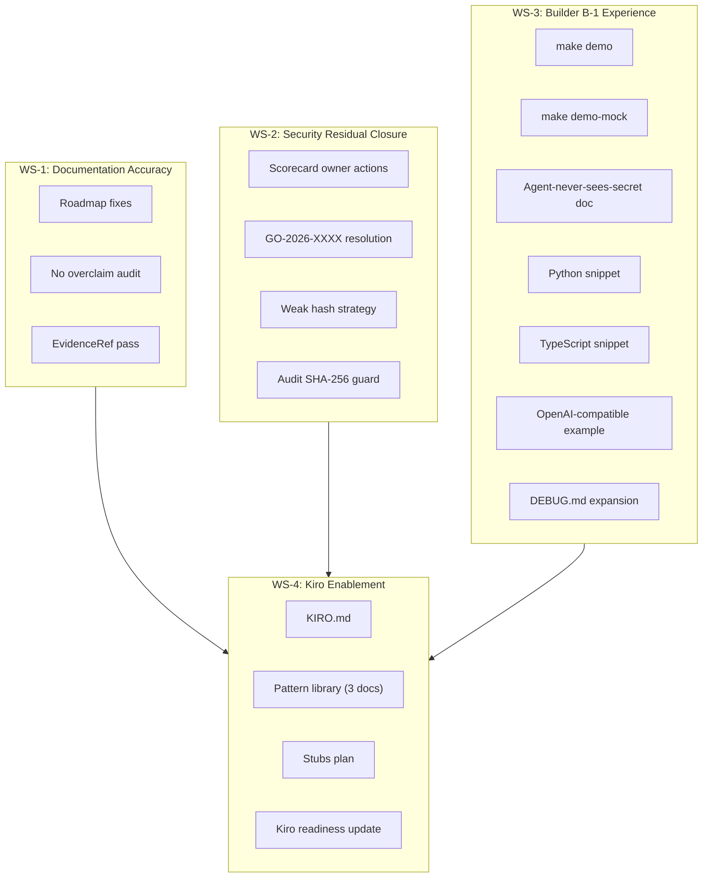

# Design Document

## Overview

This spec delivers four workstreams that bring Mintkey from `v0.1.0-prealpha` to a state where documentation is accurate, security residuals are closed, the Builder B-1 experience is complete, and Kiro enablement artifacts are in place. The deliverables are primarily documentation, Makefile targets, and example code — minimal changes to core service code.

## Architecture

### Workstream Layout



### Design Principles

1. **No core service code changes** — this spec produces documentation, Makefile targets, shell scripts, and example code. It does not modify `apps/admin-api/`, `apps/mcp-server/`, `apps/broker/`/`apps/proxy-plugin/`/etc, or `apps/admin-ui/` source.
2. **Existing infrastructure reuse** — `make demo` wraps the existing `docker compose up -d` + health-check pattern already proven in `make dev`.
3. **Thin hub pattern** — KIRO.md links to existing docs rather than duplicating content.
4. **Evidence-backed claims** — every status sentence cites a file path, commit SHA, or tool output.

---

## Components

### WS-1: Documentation Accuracy

#### Roadmap_Doc Updates (`docs/architecture/00-vision/06-roadmap.md`)

**Changes:**
- Section 1 "What is not yet in place": remove "No backup/restore procedure" line.
- Replace with: "Dev-workflow backup/restore scripts exist (`scripts/dev-backup.sh`, `scripts/dev-restore.sh`, `scripts/dev-backup-cron.example.sh`); production DR is not validated."
- Add EvidenceRef parentheticals to every status sentence in Sections 1 and 3.
- Audit all status claims against `main` HEAD; correct any that contradict verified state.

**Constraints:**
- Do NOT claim production-grade backup/restore, HA, or DR.
- Do NOT edit accepted ADRs (Requirement 9).

#### Evidence Table (`evidence.md`)

A new file at `.kiro/specs/post-prealpha-readiness/evidence.md` tracks the evidence citations used across all deliverables. Format:

```markdown
| Claim | EvidenceRef | Verified |
|---|---|---|
| Dev backup scripts exist | `scripts/dev-backup.sh` on main | ✅ |
```

---

### WS-2: Security Residual Closure

#### Scorecard Owner Actions (`SECURITY.md` updates)

For each accepted Scorecard residual in `SECURITY.md §Accepted Scorecard Residuals`:
1. Add a "GitHub UI Dismissal Steps" subsection with exact click-path instructions.
2. Where a code fix is available (e.g., GO-2026-XXXX if upstream patch exists), create a remediation task in `tasks.md`.

#### GO-2026-XXXX Resolution

**Decision tree:**
1. Check GitHub Security → Code scanning alerts for the full advisory ID.
2. Run `govulncheck` (if available) to confirm affected module.
3. If upstream patch exists → create dep-bump task.
4. If no patch → document deferral with rationale and revisit trigger in SECURITY.md.

#### Weak Hash Migration Strategy

**Location:** `docs/architecture/01-architecture/security-notes/weak-hash-migration.md`

**Content structure:**
- Current state: `agents.api_key_fingerprint` and `service_api_keys.key_fingerprint` use SHA-256 truncated fingerprints.
- Risk assessment: fingerprint is not the credential itself; it's a lookup index. Collision risk at current scale is negligible.
- Chosen approach: **Accept for prealpha** with documented rationale.
- Revisit trigger: pre-v1.0 stable release OR if the agent population exceeds 10,000.
- Document acceptance in SECURITY.md with rationale and revisit criterion.

#### Audit Hash Chain Guard

No code changes. Document the invariant:
- SHA-256 is the algorithm per ADR-0014.7.
- Any future change requires a new ADR superseding ADR-0014.7.
- Existing tests in `tests/acceptance/test_audit_append_only.py` verify chain integrity.

---

### WS-3: Builder B-1 Experience

#### `make demo` Target

**Location:** `Makefile` — new target `demo`

**Implementation:**

```makefile
.PHONY: demo
demo:
	@command -v docker >/dev/null 2>&1 || { echo "ERROR: Docker is required but not found. Install Docker and try again."; exit 1; }
	@echo "Starting Mintkey stack..."
	docker compose up -d
	@echo "Waiting for all services to become healthy..."
	@timeout=180; elapsed=0; \
	while [ $$elapsed -lt $$timeout ]; do \
		unhealthy=$$(docker compose ps --format '{{.Health}}' 2>/dev/null | grep -cv "healthy" || true); \
		if [ "$$unhealthy" -eq 0 ]; then break; fi; \
		sleep 5; elapsed=$$((elapsed + 5)); \
		printf "."; \
	done; \
	if [ $$elapsed -ge $$timeout ]; then \
		echo "\nERROR: Timed out waiting for services. Run 'docker compose ps' to check status."; \
		exit 1; \
	fi
	@echo ""
	@echo "═══════════════════════════════════════════════════════════"
	@echo "  Mintkey is running!"
	@echo ""
	@echo "  Admin UI:  http://localhost:8081"
	@echo "  Password:  $$(cat data/bootstrap-secrets/admin_password 2>/dev/null || docker run --rm -v mintkey_bootstrap_secrets:/s alpine cat /s/admin_password 2>/dev/null || echo '(not yet seeded)')"
	@echo ""
	@echo "  Next steps: docs/guides/github-quickstart.md"
	@echo ""
	@echo "  TIP: Run 'bash scripts/dev-backup.sh' before any"
	@echo "       destructive operation (docker compose down -v)."
	@echo "═══════════════════════════════════════════════════════════"
```

**Behavior:**
1. Check Docker availability → exit 1 with clear message if missing.
2. Run `docker compose up -d`.
3. Poll health status every 5s for up to 180s.
4. On success: print admin URL, bootstrap password (from volume), next steps link.
5. Never destroys volumes. Recommends `scripts/dev-backup.sh`.

#### `make demo-mock` Target

**Location:** `Makefile` — new target `demo-mock`

**Implementation:**

```makefile
.PHONY: demo-mock
demo-mock:
	@command -v docker >/dev/null 2>&1 || { echo "ERROR: Docker is required."; exit 1; }
	@if ! docker compose ps --format '{{.State}}' 2>/dev/null | grep -q running; then \
		echo "Stack not running. Starting..."; \
		$(MAKE) demo; \
	fi
	@echo ""
	@echo "Running PAT-free mock demo flow..."
	@echo "See: docs/guides/10min-mock-demo.md"
	@echo ""
	bash scripts/demo-mock-flow.sh || { echo "ERROR: Mock demo failed. Check output above."; exit 1; }
```

**Supporting script:** `scripts/demo-mock-flow.sh`

This script orchestrates the mock-backend flow:
1. Register a mock service via admin-api REST.
2. Create an agent with a grant for the mock service.
3. Request a JWT token via MCP server.
4. Make a proxied call through Kong to the mock-backend.
5. Verify the response and print success.

The script uses `curl` and `jq` — no external API keys required. It reuses the existing `mock-backend` container (port 8999) that's already in `docker-compose.yml`.

#### "Agent Never Sees the Secret" Proof (`docs/guides/agent-never-sees-secret.md`)

**Structure:**
1. **Setup** — prerequisites (running stack, `curl`, `jq`).
2. **Step 1: Request a token** — show the MCP `request_token` call; highlight that the response contains only a JWT, no credential.
3. **Step 2: Call through the proxy** — show the proxied call; highlight the `Authorization: Bearer <jwt>` header the agent sends vs the real credential injected by the proxy.
4. **Step 3: Check the audit log** — query audit events; show that `credential_value` is never present.
5. **Step 4: Check the OTel trace** — open Jaeger; show span attributes contain no credential fields.
6. **Conclusion** — the agent held only a short-lived JWT; the real credential existed only inside the proxy's request scope.

All commands are copy-paste against a running stack.

#### Python Agent Snippet (`examples/python-agent-snippet/`)

**Files:**
- `examples/python-agent-snippet/README.md` — prerequisites, setup, run instructions.
- `examples/python-agent-snippet/agent.py` — ~40 lines demonstrating:
  1. Authenticate with agent API key.
  2. Request a JWT via MCP `request_token` tool.
  3. Call a backend service through the egress proxy using the JWT.
- `examples/python-agent-snippet/requirements.txt` — `httpx` (or `requests`).

**Language:** Python 3.10+ (broad compatibility for builders).

#### TypeScript Agent Snippet (`examples/typescript-agent-snippet/`)

**Files:**
- `examples/typescript-agent-snippet/README.md` — prerequisites, setup, run instructions.
- `examples/typescript-agent-snippet/agent.ts` — ~40 lines demonstrating the same three steps.
- `examples/typescript-agent-snippet/package.json` — minimal deps (`node-fetch` or native fetch).
- `examples/typescript-agent-snippet/tsconfig.json` — minimal config.

**Language:** TypeScript 5.x, targeting Node 20+.

#### OpenAI-Compatible API Example (`examples/openai-compatible/`)

**Files:**
- `examples/openai-compatible/README.md` — explains the pattern: register an OpenAI-compatible endpoint as a Mintkey service, grant an agent access, call through the proxy.
- `examples/openai-compatible/register-service.sh` — curl commands to register the service with `auth_type: bearer_token`.
- `examples/openai-compatible/agent.py` — Python snippet calling the OpenAI-compatible endpoint through Mintkey's proxy.

**Design note:** Uses the mock-backend in "echo" mode to simulate an OpenAI-compatible response, so no real API key is needed for the example.

#### DEBUG.md Expansion

**New troubleshooting entries appended to `docs/DEBUG.md`:**

| Entry | Symptom | Root Cause | Resolution |
|---|---|---|---|
| Stack not running | `make smoke` or API calls fail with connection refused | Docker not started or `docker compose up` not run | Run `docker compose up -d` or `make demo` |
| Bootstrap password / KEK mismatch | admin-ui login fails; seed-job logs show decryption error | `MINTKEY_BOOTSTRAP_KEK` differs between seed-job and admin-ui | Ensure both services use the same KEK value in `.env` or `docker-compose.yml` |
| oauth2-proxy / Jaeger auth issues | Redirect loop or 403 on Jaeger UI | Cookie secret mismatch or Keycloak realm not seeded | Verify `jaeger_oidc_client_secret` exists in bootstrap-secrets volume; check Keycloak realm import in seed-job logs |
| `make smoke` failures | Test assertions fail against running stack | Stale state, port conflicts, or services not fully healthy | Run `docker compose ps` to verify health; `docker compose restart <svc>` for unhealthy services |
| Backup before reset | Data loss after `docker compose down -v` | Volumes destroyed without backup | Always run `bash scripts/dev-backup.sh` before `docker compose down -v` |
| MCP config mismatch | MCP client cannot connect or tools not found | MCP server URL or tool schema version disagrees with client config | Verify `MINTKEY_MCP_PUBLIC_URL` matches client config; check tool schema version in `docs/architecture/contracts/mcp/tools.yaml` |

Each entry follows the existing DEBUG.md format: symptom, diagnostic commands, resolution steps.

---

### WS-4: Kiro Enablement

#### KIRO.md (`/KIRO.md`)

**Design:** Thin link hub, < 100 lines. Does NOT duplicate content from AGENTS.md or architecture docs.

**Structure:**

```markdown
# KIRO.md

> Mintkey — a self-hostable credential broker for AI agents.
> Agents discover services via MCP, receive scoped short-lived JWTs,
> and call backends through an egress proxy that injects the real
> credential. The agent never holds a usable credential.

## Quick links

- [AGENTS.md](AGENTS.md) — coding-agent instructions (read this for implementation work)
- [.kiro/steering/](.kiro/steering/) — governance rules and conventions
- [docs/architecture/](docs/architecture/) — architectural source of truth (20 ADRs, contracts, flows)
- [docs/patterns/](docs/patterns/) — step-by-step recipes for common operations

## Tech stack at a glance

| Layer | Stack |
|---|---|
| Security-critical (broker, vault, proxy) | Go 1.22+ |
| Admin API + MCP Server | Python 3.12 + FastAPI |
| Admin UI | AdminJS 7.x (Node 20) |
| Database | PostgreSQL 16 + Liquibase |
| Proxy | Kong DB-less + Go plugin |
| Identity | Keycloak |

## How to make a change

1. Check if a spec exists in `.kiro/specs/`.
2. If not, create one (requirements → design → tasks).
3. Reference the relevant ADR or contract.
4. Implement test-first.
5. Run `make lint && make test`.

## Key invariants

- The agent never sees the real credential (P-1).
- Every state change emits an audit event (P-2).
- Tenant isolation is structural via RLS (P-3).
- Contracts are written before code (P-4).
```

#### Pattern Library Documents

**Location:** `docs/patterns/`

Each document follows the 6-section template from `docs/architecture/00-vision/07-kiro-readiness.md`:

##### `docs/patterns/add-rest-endpoint.md`

1. **Goal** — Add a new REST endpoint to the Admin API.
2. **Where the change lives** — `apps/admin-api/src/admin_api/api/` (router), `apps/admin-api/src/admin_api/services/` (business logic), `docs/architecture/contracts/rest/openapi.yaml` (contract), `tests/acceptance/` (tests).
3. **Step-by-step** — (1) Add to OpenAPI YAML, (2) Create Pydantic request/response models, (3) Add FastAPI router, (4) Add service layer, (5) Add audit emission, (6) Write acceptance test, (7) Run `make lint && make test-arch`.
4. **Tests to write** — Unit test for service logic, acceptance test for the endpoint, architecture test verifying audit emission.
5. **Common pitfalls** — Forgetting audit emission (caught by `test_audit_coverage.py`), not updating OpenAPI (caught by CI parity check), using UUID instead of ULID with prefix.
6. **References** — ADR-0005, ADR-0014.7, ADR-0017.11, `docs/architecture/contracts/rest/openapi.yaml`.

##### `docs/patterns/add-mcp-tool.md`

1. **Goal** — Add a new MCP tool to the MCP Server.
2. **Where the change lives** — `docs/architecture/contracts/mcp/tools.yaml` (schema), `apps/mcp-server/src/mcp_server/tools/` (handler), `tests/unit/mcp_server/` (tests).
3. **Step-by-step** — (1) Add tool schema to `tools.yaml`, (2) Create tool handler file, (3) Register in tool registry, (4) Add unit test, (5) Run `make lint-contracts && make test-unit`.
4. **Tests to write** — Unit test for tool handler, contract validation test.
5. **Common pitfalls** — Schema mismatch between `tools.yaml` and handler, missing auth check on agent API key.
6. **References** — ADR-0009, `docs/architecture/contracts/mcp/tools.yaml`.

##### `docs/patterns/add-audit-event.md`

1. **Goal** — Add a new audit event type.
2. **Where the change lives** — `docs/architecture/contracts/events/audit-event.schema.json` (schema), `apps/admin-api/src/admin_api/audit/` (emission), `tests/acceptance/test_audit_coverage.py` (test).
3. **Step-by-step** — (1) Add event type to schema enum, (2) Add emission call in the state-change handler, (3) Update architecture test allowlist, (4) Run `make lint-contracts && make test-arch`.
4. **Tests to write** — Architecture test verifying the new event type is emitted, unit test for the handler.
5. **Common pitfalls** — Forgetting to add to the schema enum (caught by contract lint), emitting outside the audit chokepoint (caught by `test_audit_coverage.py`).
6. **References** — ADR-0014.7, `docs/architecture/contracts/events/audit-event.schema.json`.

#### Stubs Plan (`tests/stubs/README.md`)

**Design:** A plan document (not implementations) describing the three priority stubs.

**Content:**

```markdown
# Stub Services Plan

## Purpose
Enable Kiro-generated code to be tested in CI without external services.

## Priority Stubs

### 1. Vault Adapter (in-memory)
- **Interface:** gRPC as defined in `docs/architecture/contracts/vault-adapter/vault.proto`
- **Location:** `tests/stubs/vault-adapter/`
- **Scope:** In-memory credential store; deterministic encrypt/decrypt; supports store, retrieve, delete, rotate operations.
- **Language:** Go (matches production implementation)

### 2. Kong/Proxy Recorder (HTTP)
- **Interface:** HTTP reverse proxy that records all requests
- **Location:** `tests/stubs/proxy-recorder/`
- **Scope:** Records inbound requests (method, path, headers, body); returns configurable canned responses; exposes `/recorded` endpoint for test assertions.
- **Language:** Go (lightweight HTTP server)

### 3. OIDC/Keycloak Mock
- **Interface:** OpenID Connect discovery + token endpoint
- **Location:** `tests/stubs/oidc-mock/`
- **Scope:** Serves `.well-known/openid-configuration`; issues canned ID tokens with configurable claims (sub, email, roles); validates auth codes.
- **Language:** Python (matches admin-api test infrastructure)

## Uniform Conventions
- Each stub implements the same interface as the real service.
- Configuration via environment variables.
- Records all inbound calls for test assertions.
- No external dependencies beyond stdlib + test framework.

## CI Integration
- Stubs are used by `make test-unit` and `make test-acceptance` (no Docker required).
- Integration tests (`make test-integration`) use real services via Docker.
```

#### Kiro Readiness Doc Update

**Location:** `docs/architecture/00-vision/07-kiro-readiness.md`

**Changes to status table:**
- "KIRO.md project conventions" row: ⏳ → ✅ with EvidenceRef `/KIRO.md`.
- "Pattern library" row: ❌ → 🟢 (partial) with EvidenceRef `docs/patterns/{add-rest-endpoint,add-mcp-tool,add-audit-event}.md`.
- "Stub services" row: ❌ → 🟢 (plan documented) with EvidenceRef `tests/stubs/README.md`.

---

## Interfaces

### Makefile Targets (Public Interface)

| Target | Input | Output | Exit Code |
|---|---|---|---|
| `make demo` | None (Docker must be available) | Stack running + admin URL + password + next steps | 0 on success; 1 if Docker missing or timeout |
| `make demo-mock` | None (Docker must be available) | Full mock demo flow executed | 0 on success; 1 on failure |

### File Deliverables

| Path | Type | Size Target |
|---|---|---|
| `KIRO.md` | Markdown link hub | < 100 lines |
| `docs/patterns/add-rest-endpoint.md` | Pattern doc | ~80 lines |
| `docs/patterns/add-mcp-tool.md` | Pattern doc | ~60 lines |
| `docs/patterns/add-audit-event.md` | Pattern doc | ~60 lines |
| `docs/guides/agent-never-sees-secret.md` | Walkthrough | ~120 lines |
| `examples/python-agent-snippet/` | Example code | 3 files |
| `examples/typescript-agent-snippet/` | Example code | 4 files |
| `examples/openai-compatible/` | Example code | 3 files |
| `tests/stubs/README.md` | Design document | ~60 lines |
| `scripts/demo-mock-flow.sh` | Shell script | ~80 lines |
| `.kiro/specs/post-prealpha-readiness/evidence.md` | Evidence table | grows with deliverables |

---

## Data Models

No new data models. This spec does not modify database schemas, API contracts, or service interfaces.

---

## Error Handling

### `make demo` Error Cases

| Condition | Behavior |
|---|---|
| Docker not installed | Exit 1 + "ERROR: Docker is required but not found." |
| Docker daemon not running | Exit 1 + "ERROR: Docker is required but not found." (same check) |
| Health-check timeout (180s) | Exit 1 + "ERROR: Timed out waiting for services." |
| Partial container failure | Health-check loop continues until timeout; user sees which services are unhealthy via `docker compose ps` |

### `make demo-mock` Error Cases

| Condition | Behavior |
|---|---|
| Stack not running | Auto-starts via `make demo` |
| Mock flow script fails | Exit 1 + "ERROR: Mock demo failed. Check output above." |
| Individual step fails | Script prints the failing step and curl output before exiting |

---

## Security Considerations

1. **No credentials in deliverables** — all example code uses placeholder values (`YOUR_AGENT_API_KEY`, `<agent-key>`). The `make demo` target reads the bootstrap password from the volume at runtime, never hardcodes it.
2. **Red-team verification** — all deliverables must pass `grep -E "$(cat scripts/red-team-fingerprints.txt)"` with zero matches.
3. **ADR immutability** — no accepted ADR is edited. Security documentation updates go to `SECURITY.md` (which is not an ADR).
4. **Weak hash acceptance** — documented with explicit rationale and revisit trigger, not silently ignored.

---

## Correctness Properties

*This spec produces documentation, Makefile targets, and example code. The deliverables are not pure functions with input/output behavior amenable to property-based testing. Verification is through example-based checks (file existence, content assertions, integration tests against a running stack) and smoke tests (CI exit codes, red-team greps).*

*No property-based tests are appropriate for this spec. Verification strategy:*

- **Documentation correctness:** Example-based tests asserting file existence and required content sections.
- **Makefile targets:** Integration tests requiring a running Docker stack (not suitable for PBT — external service dependency, deterministic behavior).
- **Security invariants:** Smoke tests (red-team grep, ADR immutability check via git diff).
- **Code examples:** Syntax validation (Python/TypeScript linters) and optional integration test against running stack.
