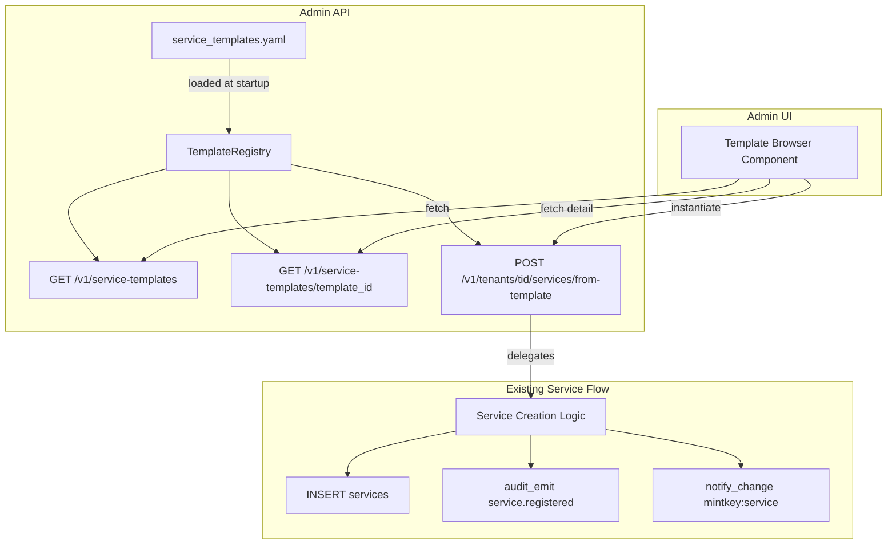
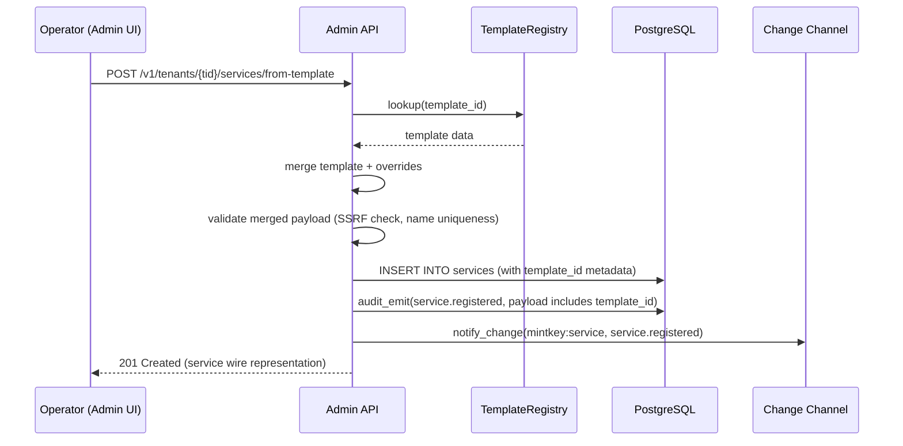
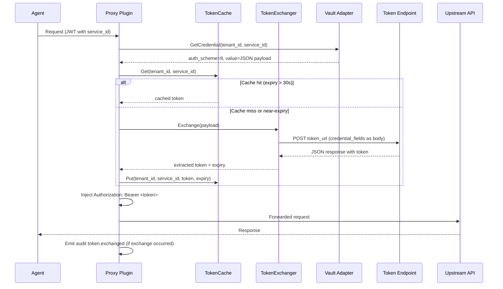

# Design Document: Service Templates

## Overview

Service templates provide pre-configured service definitions that operators can use to quickly register popular third-party APIs in Mintkey. This feature extends the existing template infrastructure (currently 5 JSON-based templates with a basic list/detail API) to meet the full requirements: 12 curated templates in a single YAML catalog file, category/search filtering, semantic versioning, and a `from-template` instantiation endpoint that delegates to the existing service creation flow.

### Design Decisions

1. **Single YAML catalog file** — All templates live in one file (`admin-api/src/admin_api/templates/service_templates.yaml`) rather than individual JSON files. This simplifies validation, versioning, and atomic loading. The existing `service_templates/*.json` directory is superseded.
2. **Read-only seed data, not database rows** — Templates are static data bundled with the application image. No schema changes, no RLS complexity, no migration overhead.
3. **Template instantiation reuses existing service creation** — The `POST /v1/tenants/{tid}/services/from-template` endpoint merges template fields with operator overrides, then delegates to the same code path as direct service registration (audit, change-channel, Kong-syncer).
4. **Template IDs are stable slugs** — `template_id` is the kebab-case `name` field (e.g., `gitlab`, `brave-search`). No ULID needed since templates are not tenant-scoped domain entities.

### Scope

- Admin API: new YAML-based template registry, enhanced list/detail endpoints, new `from-template` endpoint
- Admin UI: enhanced template browser component with category grouping and search
- No database schema changes
- No new audit event types (reuses `service.registered`)

## Architecture



### Request Flow: Template Instantiation



## Components and Interfaces

### 1. TemplateRegistry (Python module)

**Location:** `apps/admin-api/src/admin_api/templates/registry.py`

Responsibilities:
- Load and validate `service_templates.yaml` at import time
- Provide lookup by `template_id`, filtering by `category` and `search` term
- Log warnings for malformed entries without failing startup

```python
class TemplateRegistry:
    """In-memory catalog of service templates loaded from YAML."""

    def list_all(
        self,
        category: str | None = None,
        search: str | None = None,
    ) -> list[ServiceTemplate]: ...

    def get(self, template_id: str) -> ServiceTemplate | None: ...
```

### 2. ServiceTemplate (Pydantic model)

**Location:** `apps/admin-api/src/admin_api/templates/models.py`

```python
class ServiceTemplate(BaseModel):
    template_id: str          # kebab-case slug, e.g. "gitlab"
    name: str                 # machine name (same as template_id)
    display_name: str         # human-readable, e.g. "GitLab"
    description: str          # what the API covers
    base_url: str             # default base URL
    auth_type: str            # one of the supported auth_scheme values
    openapi_spec_url: str | None
    category: str             # e.g. "ci_cd", "payments", "communications"
    version: str              # semver, e.g. "1.0.0"
    config_notes: str | None  # optional notes about auth setup
    credential_hint: CredentialHint | None
    test_path: str | None     # suggested test endpoint path
```

### 3. FastAPI Router — Service Templates

**Location:** `apps/admin-api/src/admin_api/api/service_templates.py` (replaces existing)

| Endpoint | Method | Description |
|---|---|---|
| `/v1/service-templates` | GET | List templates (filterable by `category`, `search`) |
| `/v1/service-templates/{template_id}` | GET | Get single template detail |

### 4. FastAPI Router — From-Template Instantiation

**Location:** `apps/admin-api/src/admin_api/api/services.py` (new endpoint on existing router)

| Endpoint | Method | Description |
|---|---|---|
| `/v1/tenants/{tid}/services/from-template` | POST | Create service from template |

Request body:
```python
class FromTemplateRequest(BaseModel):
    template_id: str
    overrides: ServiceOverrides | None = None

class ServiceOverrides(BaseModel):
    name: str | None = None
    display_name: str | None = None
    description: str | None = None
    base_url: str | None = None
```

### 5. Admin UI — Enhanced Template Browser

**Location:** `apps/admin-ui/src/components/` (existing `ServiceTemplatePicker` enhanced)

Enhancements:
- Category grouping with collapsible sections
- Search input filtering by name/display_name/description
- Template detail panel showing config_notes and version
- Pre-fill service registration form on selection
- Calls `POST /v1/tenants/{tid}/services/from-template` on submit

## Data Models

### Template Catalog YAML Schema

**File:** `apps/admin-api/src/admin_api/templates/service_templates.yaml`

```yaml
templates:
  - template_id: gitlab
    name: gitlab
    display_name: GitLab
    description: "CI/CD pipelines, repository management, merge requests, and project administration."
    base_url: https://gitlab.com/api/v4
    auth_type: bearer_token
    openapi_spec_url: https://gitlab.com/gitlab-org/gitlab/-/raw/master/doc/api/openapi/openapi.yaml
    category: ci_cd
    version: "1.0.0"
    config_notes: null
    credential_hint:
      field: value
      help: "Personal Access Token or Project/Group Access Token"
      format: "glpat-..."
    test_path: /version

  - template_id: stripe
    name: stripe
    display_name: Stripe
    description: "Payments, subscriptions, invoicing, and financial reporting."
    base_url: https://api.stripe.com/v1
    auth_type: bearer_token
    openapi_spec_url: https://raw.githubusercontent.com/stripe/openapi/master/openapi/spec3.json
    category: payments
    version: "1.0.0"
    config_notes: null
    credential_hint:
      field: value
      help: "Use a restricted key for production; test keys start with sk_test_"
      format: "sk_live_... or sk_test_..."
    test_path: /charges?limit=1
  # ... (12 templates total)
```

### Categories

| Category | Templates |
|---|---|
| `ci_cd` | GitLab, Azure DevOps |
| `app_store` | Apple App Store Connect, Google Play Developer API |
| `platform` | Heroku |
| `search` | Brave Search |
| `communications` | SendGrid, Twilio |
| `payments` | Stripe |
| `infrastructure` | Cloudflare |
| `observability` | Datadog |
| `incident_management` | PagerDuty |

### Wire Representation (API Response)

Template list item:
```json
{
  "template_id": "gitlab",
  "name": "gitlab",
  "display_name": "GitLab",
  "description": "CI/CD pipelines, repository management...",
  "base_url": "https://gitlab.com/api/v4",
  "auth_type": "bearer_token",
  "openapi_spec_url": "https://gitlab.com/...",
  "category": "ci_cd",
  "version": "1.0.0"
}
```

Service created from template (response reuses existing service wire format with added `template_id`):
```json
{
  "id": "svc_01HXYZ...",
  "tenant_id": "...",
  "name": "gitlab",
  "slug": "gitlab",
  "display_name": "GitLab",
  "base_url": "https://gitlab.com/api/v4",
  "auth_scheme": "bearer_token",
  "openapi_url": "https://gitlab.com/...",
  "status": "active",
  "template_id": "gitlab",
  "created_at": "2026-06-01T12:00:00Z",
  "updated_at": "2026-06-01T12:00:00Z"
}
```

## Error Handling

| Scenario | HTTP Status | Error Code | Behavior |
|---|---|---|---|
| Template file missing/unreadable at startup | — | — | Log warning, start with empty registry |
| Individual template malformed | — | — | Log warning, skip that template, continue loading |
| `GET /v1/service-templates/{id}` not found | 404 | `template_not_found` | Return error response |
| `POST from-template` with unknown template_id | 404 | `template_not_found` | Return error response |
| `POST from-template` duplicate service name | 409 | `service_name_taken` | Consistent with direct registration |
| `POST from-template` forbidden base_url | 422 | `forbidden_destination` | SSRF check (S-SEC-1) |
| Override validation failure | 422 | `validation_error` | Pydantic validation error |

## Testing Strategy

Since templates are static seed data with deterministic behavior (no randomized input space, no pure-function transformations amenable to property-based testing), the testing approach uses example-based unit tests and integration tests.

**Why PBT does not apply:** The template feature is primarily CRUD over static data. The template registry loads a fixed YAML file, the list/detail endpoints return deterministic results, and instantiation delegates to an already-tested service creation flow. There are no parsers, serializers, or algorithmic transformations with a meaningful input space to explore.

### Unit Tests (pytest)

- `TemplateRegistry` loads valid YAML and exposes all 12 templates
- `TemplateRegistry` skips malformed entries and logs warnings
- `TemplateRegistry` filters by category correctly
- `TemplateRegistry` search is case-insensitive across name/display_name/description
- `ServiceTemplate` Pydantic model validates required fields
- `FromTemplateRequest` applies overrides correctly (merge logic)

### Integration Tests (pytest + httpx)

- `GET /v1/service-templates` returns all 12 templates
- `GET /v1/service-templates?category=ci_cd` returns only GitLab and Azure DevOps
- `GET /v1/service-templates?search=stripe` returns Stripe template
- `GET /v1/service-templates/{id}` returns full template detail
- `GET /v1/service-templates/nonexistent` returns 404
- `POST /v1/tenants/{tid}/services/from-template` creates service with template values
- `POST from-template` with overrides applies them correctly
- `POST from-template` emits `service.registered` audit event with `template_id` in payload
- `POST from-template` emits change-channel notification
- `POST from-template` with duplicate name returns 409
- `POST from-template` with unknown template_id returns 404

### Admin UI Tests (vitest)

- Template browser component renders category groups
- Search input filters templates
- Template selection pre-fills the service form
- Submit calls the `from-template` endpoint

### Test Configuration

- Framework: `pytest` + `pytest-asyncio` + `httpx` (Admin API)
- Framework: `vitest` + `supertest` (Admin UI)
- No property-based testing library needed for Requirements 1–18

---

## OAuth2 Password Grant — Token Exchange (Requirements 19–23)

### Overview

This section extends the service-templates design to support a new auth scheme: `oauth2_password_grant`. This scheme enables the Proxy Plugin to automatically exchange stored username/password credentials for a short-lived bearer token by calling a token endpoint, then inject the resulting JWT on the upstream request. The agent never sees the underlying credentials or the exchanged token.

**Design Decisions:**

1. **New proto enum value `AUTH_SCHEME_OAUTH2_PASSWORD_GRANT = 8`** — extends the existing `AuthScheme` enum in `vault.proto`. All downstream enums (OpenAPI, MCP tools, audit schemas) mirror this value.
2. **Structured credential storage** — the Vault Adapter stores the credential as a JSON-encoded payload (not raw bytes), enabling the proxy to parse token_url, credential_fields, and extraction path from a single `GetCredential` response.
3. **Token exchange in the Proxy Plugin** — a new `TokenExchanger` component handles the HTTP POST to the token endpoint and JSONPath extraction. This keeps the exchange logic isolated from the injection logic.
4. **In-memory token cache** — a new `TokenCache` component avoids redundant token exchanges. Tokens are never persisted (security invariant P-1).
5. **Pre-expiry refresh** — the cache triggers a new exchange 30 seconds before expiry, avoiding latency spikes from expired tokens.
6. **Audit event `token.exchanged`** — provides visibility into token lifecycle without exposing credentials or tokens.

### Architecture



### Components and Interfaces

#### 1. Proto Enum Extension

**File:** `docs/architecture/contracts/vault-adapter/vault.proto`

```protobuf
enum AuthScheme {
  // ... existing values 0-7 ...
  AUTH_SCHEME_OAUTH2_PASSWORD_GRANT = 8;
}
```

The Go constant in the proxy plugin:

```go
const AuthSchemeOAuth2PasswordGrant AuthScheme = 8
```

#### 2. TokenExchanger

**Location:** `apps/proxy-plugin/internal/credential/exchanger.go`

Responsibilities:
- Make HTTP POST to `token_url` with `credential_fields` as JSON body
- Apply configured `token_request_headers`
- Extract token from response using `token_response_path` (JSONPath)
- Enforce 10-second request timeout
- Return token string + raw response (for expiry detection)

```go
// TokenExchanger performs OAuth2 password-grant token exchanges.
type TokenExchanger struct {
    httpClient *http.Client // 10s timeout
}

// ExchangeRequest holds the parsed credential payload for a token exchange.
type ExchangeRequest struct {
    TokenURL            string            // HTTPS endpoint
    CredentialFields    map[string]string // POST body fields
    TokenResponsePath   string            // JSONPath, e.g. "$.token"
    TokenRequestHeaders map[string]string // extra headers
}

// ExchangeResult holds the outcome of a successful token exchange.
type ExchangeResult struct {
    Token     string
    ExpiresIn int64           // seconds, 0 if unknown
    RawBody   json.RawMessage // for JWT exp parsing
}

// Exchange performs the HTTP POST and extracts the token.
// Returns ExchangeResult on success, or a typed error:
//   - ErrTokenExchangeFailed (non-2xx)
//   - ErrTokenEndpointUnreachable (network error)
//   - ErrTokenParseFailed (JSONPath extraction failure)
func (te *TokenExchanger) Exchange(ctx context.Context, req ExchangeRequest) (*ExchangeResult, error)
```

#### 3. TokenCache

**Location:** `apps/proxy-plugin/internal/cache/token_cache.go`

Responsibilities:
- Store tokens keyed by `(tenant_id, service_id)`
- Determine expiry from: JWT `exp` claim → `expires_in` response field → 300s default
- Return cached token if expiry > 30s in the future
- Signal refresh needed if expiry ≤ 30s in the future
- Thread-safe via `sync.RWMutex`
- No persistence — empty on restart

```go
// TokenCache is an in-memory cache for exchanged bearer tokens.
// Thread-safe. No persistence — empty on process restart.
type TokenCache struct {
    mu      sync.RWMutex
    entries map[cacheKey]*cacheEntry
}

type cacheKey struct {
    TenantID  string
    ServiceID string
}

type cacheEntry struct {
    Token     string
    ExpiresAt time.Time
}

const (
    RefreshBuffer  = 30 * time.Second
    DefaultExpiry  = 300 * time.Second
)

// Get returns the cached token if valid (expiry > 30s from now).
// Returns ("", false) if missing or near-expiry.
func (tc *TokenCache) Get(tenantID, serviceID string) (string, bool)

// Put stores a token with the given expiry time.
func (tc *TokenCache) Put(tenantID, serviceID, token string, expiresAt time.Time)

// DetermineExpiry resolves token expiry using the priority chain:
// 1. JWT exp claim (if token is a valid JWT)
// 2. expires_in from response body
// 3. Default 300 seconds
func DetermineExpiry(token string, responseBody json.RawMessage) time.Time
```

#### 4. Injector Enhancement

**File:** `apps/proxy-plugin/internal/credential/injector.go`

New case in the `Inject()` switch:

```go
case AuthSchemeOAuth2PasswordGrant:
    // Token is already exchanged and passed as cred.Value
    req.Header.Set("Authorization", "Bearer "+string(cred.Value))
```

The orchestration (cache check → exchange → cache store → inject) happens in the egress handler, not inside `Inject()`. The injector receives the final token as `cred.Value`.

#### 5. Credential Payload Schema

The Vault Adapter stores the credential `value` field as JSON for `auth_scheme=8`:

```json
{
  "token_url": "https://dashboard-api-ps-stag.azurewebsites.net/api/v1/Token",
  "credential_fields": {
    "userName": "admin",
    "password": "secret123"
  },
  "token_response_path": "$.data.token",
  "token_request_headers": {
    "Content-Type": "application/json"
  }
}
```

Go struct for parsing:

```go
// OAuth2PasswordGrantCredential is the JSON structure stored in the Vault
// for auth_scheme=8 credentials.
type OAuth2PasswordGrantCredential struct {
    TokenURL            string            `json:"token_url"`
    CredentialFields    map[string]string `json:"credential_fields"`
    TokenResponsePath   string            `json:"token_response_path"`
    TokenRequestHeaders map[string]string `json:"token_request_headers,omitempty"`
}
```

#### 6. Audit Event: `token.exchanged`

**Emitted by:** Proxy Plugin after every token exchange attempt (success or failure).

```go
// TokenExchangedEvent is the payload for a token.exchanged audit record.
type TokenExchangedEvent struct {
    TenantID     string `json:"tenant_id"`
    ServiceID    string `json:"service_id"`
    AgentID      string `json:"agent_id"`
    TokenURLHost string `json:"token_url_host"` // host only, path redacted
    Success      bool   `json:"success"`
    LatencyMS    int64  `json:"latency_ms"`
}
```

Security constraints:
- `token_url_host` contains only the hostname (e.g., `dashboard-api-ps-stag.azurewebsites.net`), never the full URL path
- No credential_fields values in the event
- No token value in the event

#### 7. Admin API — Credential Validation for oauth2_password_grant

**Location:** `apps/admin-api/src/admin_api/services/credential_service.py`

New validation logic when `auth_type == "oauth2_password_grant"`:

```python
class OAuth2PasswordGrantPayload(BaseModel):
    token_url: HttpUrl                          # must be HTTPS
    credential_fields: dict[str, str]           # at least 1 entry
    token_response_path: str = "$.access_token" # JSONPath default
    token_request_headers: dict[str, str] | None = None

    @field_validator("token_url")
    @classmethod
    def validate_https(cls, v: HttpUrl) -> HttpUrl:
        if v.scheme != "https":
            raise ValueError("token_url must use HTTPS")
        return v

    @field_validator("credential_fields")
    @classmethod
    def validate_non_empty(cls, v: dict[str, str]) -> dict[str, str]:
        if not v:
            raise ValueError("credential_fields must contain at least one entry")
        return v
```

The `token_url` also passes through the existing SSRF allowlist check (S-SEC-1) at registration time.

### Data Models

#### Template Catalog Extension

New template entry in `service_templates.yaml`:

```yaml
  - template_id: spotus-dashboard-api
    name: SpotUs Dashboard API
    display_name: SpotUs Dashboard API
    description: "SpotUs Dashboard API (staging) — user administration, reporting, and identity management via username/password JWT authentication."
    base_url: https://dashboard-api-ps-stag.azurewebsites.net
    auth_type: oauth2_password_grant
    openapi_spec_url: https://dashboard-api-ps-stag.azurewebsites.net/swagger/v1/swagger.json
    category: platform
    version: "1.0.0"
    config_notes: "Points at the staging deployment. The token endpoint accepts {userName, password} as form/JSON body and returns a JWT via token_response_path. The proxy automatically exchanges credentials for a bearer token on each request."
    credential_hint:
      token_url: https://dashboard-api-ps-stag.azurewebsites.net/api/v1/Token
      credential_fields:
        userName: "(your userName)"
        password: "(your password)"
      token_response_path: "$.data.token"
    test_path: /api/v1/Identity/me
```

#### ServiceTemplate Model Extension

```python
class OAuth2CredentialHint(BaseModel):
    token_url: str
    credential_fields: dict[str, str]  # field_name → placeholder
    token_response_path: str

class CredentialHint(BaseModel):
    # Existing fields for simple auth types
    field: str | None = None
    help: str | None = None
    format: str | None = None
    # New fields for oauth2_password_grant
    token_url: str | None = None
    credential_fields: dict[str, str] | None = None
    token_response_path: str | None = None
```

### Error Handling

| Scenario | HTTP Status | Error Code | Behavior |
|---|---|---|---|
| Token endpoint returns non-2xx | 502 | `token_exchange_failed` | Log status code (no body content); emit audit with `success=false` |
| Token endpoint unreachable (timeout/DNS) | 502 | `token_endpoint_unreachable` | Log generic network error; emit audit with `success=false` |
| JSONPath extraction fails (path not found) | 502 | `token_parse_failed` | Log path and response structure hint (no values); emit audit with `success=false` |
| Refresh fails but cached token still valid | — | — | Use cached token; log warning; no error to caller |
| Refresh fails and cached token expired | 502 | `token_exchange_failed` | Return error to caller |
| `token_url` not HTTPS at registration | 422 | `validation_error` | Reject at Admin API |
| `token_url` fails SSRF check at registration | 422 | `forbidden_destination` | Reject at Admin API (S-SEC-1) |
| `credential_fields` empty at registration | 422 | `validation_error` | Reject at Admin API |

### Security Invariants

Per architecture principle P-1 ("The agent never holds a usable credential"):

1. **Credential fields** (`username`, `password`, etc.) are decrypted only inside the Vault Adapter and consumed only inside the Proxy Plugin's `TokenExchanger`. They never appear in logs, audit events, OTel spans, or responses.
2. **Exchanged token** lives only in the `TokenCache` (memory) and the request-scoped `Authorization` header. It never appears in logs, audit events, OTel spans, or responses to the agent.
3. **Token cache is memory-only** — no persistence to disk, database, or any durable store. Empty on restart.
4. **SSRF validation** on `token_url` happens at registration time (Admin API). The proxy trusts the stored URL because it was validated at write time.
5. **Audit redaction** — `token.exchanged` events contain only the hostname portion of `token_url`, never the full path or query parameters.

## Correctness Properties

*A property is a characteristic or behavior that should hold true across all valid executions of a system — essentially, a formal statement about what the system should do. Properties serve as the bridge between human-readable specifications and machine-verifiable correctness guarantees.*

### Property 1: Credential payload validation

*For any* credential payload submitted for `oauth2_password_grant`, the Admin API SHALL accept it if and only if `token_url` is a valid HTTPS URL, `credential_fields` contains at least one entry (with any field names), and SHALL reject it otherwise — regardless of the specific field names used.

**Validates: Requirements 19.2, 19.5**

### Property 2: Credential storage round-trip

*For any* valid `OAuth2PasswordGrantCredential` payload (containing `token_url`, `credential_fields`, `token_response_path`, and optional `token_request_headers`), storing it via `PutCredential` and retrieving it via `GetCredential` SHALL produce a JSON-decoded structure identical to the original.

**Validates: Requirements 19.3**

### Property 3: token_url HTTPS and SSRF validation

*For any* URL string, the Admin API SHALL accept it as a valid `token_url` if and only if it uses the HTTPS scheme and passes the SSRF allowlist check (no private/loopback IPs, no blocked hosts).

**Validates: Requirements 19.4**

### Property 4: Token exchange request construction

*For any* `ExchangeRequest` with arbitrary `credential_fields` and `token_request_headers`, the `TokenExchanger` SHALL construct an HTTP POST where the request body is the JSON encoding of `credential_fields` and all entries from `token_request_headers` are present as request headers.

**Validates: Requirements 20.2**

### Property 5: JSONPath token extraction

*For any* JSON response body and any valid JSONPath expression pointing to a string value in that body, the `TokenExchanger` SHALL extract and return exactly that string value.

**Validates: Requirements 20.3**

### Property 6: Non-2xx status maps to 502

*For any* HTTP status code outside the 2xx range returned by the token endpoint, the Proxy Plugin SHALL return HTTP 502 with error code `token_exchange_failed`.

**Validates: Requirements 20.5**

### Property 7: Cache keyed retrieval

*For any* set of `(tenant_id, service_id)` pairs with stored tokens, retrieving by a specific key SHALL return only the token stored for that exact key and no other.

**Validates: Requirements 21.1**

### Property 8: Expiry detection priority chain

*For any* token and response body combination, `DetermineExpiry` SHALL return: the JWT `exp` claim time if the token is a valid JWT with `exp`; otherwise the current time plus `expires_in` seconds if the response contains that field; otherwise the current time plus 300 seconds.

**Validates: Requirements 21.2**

### Property 9: Cache hit/refresh threshold at 30 seconds

*For any* cached token, `TokenCache.Get` SHALL return the token (cache hit) if and only if the token's expiry is more than 30 seconds in the future; otherwise it SHALL signal a cache miss (triggering refresh).

**Validates: Requirements 21.3, 21.4**

### Property 10: Graceful degradation on refresh failure

*For any* cached token whose refresh exchange fails, the Proxy Plugin SHALL use the cached token if its absolute expiry has not yet passed, and SHALL return HTTP 502 only after the cached token has fully expired.

**Validates: Requirements 21.7**

### Property 11: Audit event completeness and host-only redaction

*For any* token exchange (success or failure), the emitted `token.exchanged` audit event SHALL contain `tenant_id`, `service_id`, `agent_id`, `success`, and `latency_ms`; and `token_url_host` SHALL equal only the hostname portion of the original `token_url` (no path, no query, no credentials).

**Validates: Requirements 22.1**

### Property 12: Sensitive data exclusion from all observable outputs

*For any* token exchange, neither the `credential_fields` values nor the exchanged bearer token SHALL appear in audit events, structured log fields, OTel span attributes, or HTTP response headers/bodies returned to the agent.

**Validates: Requirements 22.2, 22.3, 22.6, 22.7**

## Testing Strategy (Requirements 19–23)

The token exchange feature involves pure-function logic (validation, JSONPath extraction, expiry detection, cache threshold) that benefits from property-based testing, alongside integration concerns (HTTP calls, vault interaction) tested with example-based tests.

### Property-Based Tests (Go: `rapid` library)

Each property test runs a minimum of 100 iterations.

| Test | Property | Tag |
|---|---|---|
| `TestCredentialPayloadValidation` | Property 1 | Feature: service-templates, Property 1: Credential payload validation |
| `TestCredentialStorageRoundTrip` | Property 2 | Feature: service-templates, Property 2: Credential storage round-trip |
| `TestTokenURLValidation` | Property 3 | Feature: service-templates, Property 3: token_url HTTPS and SSRF validation |
| `TestExchangeRequestConstruction` | Property 4 | Feature: service-templates, Property 4: Token exchange request construction |
| `TestJSONPathExtraction` | Property 5 | Feature: service-templates, Property 5: JSONPath token extraction |
| `TestNon2xxErrorMapping` | Property 6 | Feature: service-templates, Property 6: Non-2xx status maps to 502 |
| `TestCacheKeyedRetrieval` | Property 7 | Feature: service-templates, Property 7: Cache keyed retrieval |
| `TestExpiryDetectionPriority` | Property 8 | Feature: service-templates, Property 8: Expiry detection priority chain |
| `TestCacheThreshold` | Property 9 | Feature: service-templates, Property 9: Cache hit/refresh threshold |
| `TestGracefulDegradation` | Property 10 | Feature: service-templates, Property 10: Graceful degradation on refresh failure |
| `TestAuditEventCompleteness` | Property 11 | Feature: service-templates, Property 11: Audit event completeness |
| `TestSensitiveDataExclusion` | Property 12 | Feature: service-templates, Property 12: Sensitive data exclusion |

**PBT Library:** `pgregory.net/rapid` (Go property-based testing, well-maintained, no CGO).

### Unit Tests (Go: `testing` + `testify`)

- `TokenExchanger` returns `ErrTokenEndpointUnreachable` on connection timeout
- `TokenExchanger` returns `ErrTokenEndpointUnreachable` on DNS failure
- `TokenExchanger` HTTP client has 10-second timeout configured
- `TokenCache` is empty on construction (no warm-up)
- `Inject()` with `AuthSchemeOAuth2PasswordGrant` sets `Authorization: Bearer <token>`
- Default `token_response_path` is `$.access_token` when not provided

### Unit Tests (Python: `pytest`)

- `OAuth2PasswordGrantPayload` rejects non-HTTPS `token_url`
- `OAuth2PasswordGrantPayload` rejects empty `credential_fields`
- `OAuth2PasswordGrantPayload` defaults `token_response_path` to `$.access_token`
- `OAuth2PasswordGrantPayload` accepts arbitrary field names in `credential_fields`
- `token_url` SSRF check rejects private IPs and loopback addresses

### Integration Tests (Go: `testcontainers-go`)

- Full flow: vault stores oauth2_password_grant credential → proxy retrieves → exchanges → injects Bearer
- Token cache prevents redundant exchanges within TTL
- Refresh triggers new exchange when cache entry near-expiry
- Audit event emitted with correct fields after exchange

### Integration Tests (Python: `pytest` + `httpx`)

- `POST /v1/tenants/{tid}/services` with `auth_type=oauth2_password_grant` stores structured credential
- `POST /v1/tenants/{tid}/services/from-template` with `spotus-dashboard-api` pre-populates credential structure
- Template registry contains `spotus-dashboard-api` with correct fields
- Vault adapter scope enforcement: non-proxy callers cannot read oauth2_password_grant credentials

### Test Configuration

- Go PBT: `pgregory.net/rapid` with default 100 iterations per property
- Go unit/integration: stdlib `testing` + `stretchr/testify` + `testcontainers-go`
- Python unit/integration: `pytest` + `pytest-asyncio` + `httpx`
- Tag format: `Feature: service-templates, Property {N}: {title}`
