# Contributing to Mintkey

Mintkey is a security-engineering project. Every wire surface is contracted; every decision is recorded as an ADR; every state change is audited. Contribution rules are correspondingly strict.

If the rules below feel heavy, this project is probably not for you. That is fine.

---

## Zero tolerance for vibe coding

**Vibe coding** is writing code by feel rather than from a spec. Concretely, in this repository, any of the following is vibe coding and is rejected:

1. **Code without a corresponding spec entry under `.kiro/specs/`.** If your change isn't traceable to a numbered `Acceptance Criterion` in a `requirements.md`, it is unspecified — and unspecified work has no review surface.
2. **An architectural decision that does not have an ADR under `docs/architecture/01-architecture/adr/`.** Choosing how a wire surface is shaped, how data is stored, how trust is established — these are decisions. Decisions live in ADRs. Code that quietly encodes a decision in 30 lines of FastAPI without a corresponding `0NNN-*.md` is invisible to every future maintainer.
3. **A wire-shape change in code before the contract change.** The OpenAPI YAML at `docs/architecture/contracts/rest/openapi.yaml` is canonical. CI diffs the running FastAPI against it. An endpoint added in Python before the YAML is added is dead on arrival — the build will fail.
4. **LLM-generated code with uninvoked imports, dead functions, or `pass` placeholders disguised as completion.** Slop is slop regardless of source. A 40-line patch that imports `Optional` but never uses it, calls a function that doesn't exist, or returns a stub is not "almost done".
5. **A PR that says "tests pass" without showing the runner output.** Principle 1: validate with tools, never with hallucinations. If you cannot paste `pytest -q` exit code 0 with a count of passed assertions, the tests did not pass.
6. **"Let me just try this and see what happens."** This phrase, spoken or implied, marks the boundary between engineering and gambling. We are a credential broker — we do not gamble with credentials.
7. **Editing an Accepted ADR to make existing code align with it.** ADRs are immutable. Changes to decisions are recorded in *new* ADRs that supersede the old.

**Zero tolerance** means: PRs exhibiting any of the above are closed, not iterated on. The author re-opens with a spec, an ADR, the failing test, and the verification output. We will help you do this right. We will not help you do this fast.

---

## The Kiro Spec-Driven Development pipeline

Mintkey uses **Spec-Driven Development** as practiced in the Kiro project. The pipeline is non-negotiable for any change that is not a typo fix or a dependency bump:

```mermaid
flowchart LR
  OQ["Open question<br/>(docs/architecture/01-architecture/<br/>open-questions.md)"]
  --> P["Proposal<br/>(docs/architecture/proposal/<br/>P-NNN-*.md)"]
  P --> ADR["ADR<br/>(docs/architecture/01-architecture/adr/<br/>0NNN-*.md)<br/>Status: Accepted"]
  ADR --> C["Contract change<br/>(openapi.yaml, vault.proto,<br/>tools.yaml, *.schema.json)"]
  C --> S["Spec entry<br/>(.kiro/specs/&lt;feature&gt;/<br/>requirements.md,<br/>design.md,<br/>tasks.md)"]
  S --> T["Failing test<br/>(tests/.../test_*.py)"]
  T --> I["Implementation<br/>(minimum code to turn test green)"]
  I --> V["Verification<br/>(CLAUDE.md Principle 1)"]
  V --> M["Merge"]
```



Each arrow is a gate. A node cannot exist without the node before it. **You may not skip a node.** If your change is small enough that an OQ feels excessive, the right move is usually that the change is also small enough that no ADR is needed — and that the change probably does not require a wire contract edit. If you are uncertain, file the OQ. The cost of an extra OQ is a paragraph; the cost of an unrecorded decision is a deployment outage two years from now.

The canonical example of this pipeline executed end-to-end is the Mintkey MVP itself: [`.kiro/specs/mintkey-mvp/requirements.md`](.kiro/specs/mintkey-mvp/requirements.md) was written first; [`.kiro/specs/mintkey-mvp/design.md`](.kiro/specs/mintkey-mvp/design.md) followed; [`.kiro/specs/mintkey-mvp/tasks.md`](.kiro/specs/mintkey-mvp/tasks.md) broke the work into numbered milestones (`M1.0` → `M1.13`) with `_Requirements: ..._` provenance per task; each task's tests preceded its implementation. The result is `PROGRESS.md`: 244 unit tests, 17 architecture tests, 23 Go packages green.

---

## Remediation vs Spec-Driven Work

Mintkey has two workflows for code changes:

- **Remediation** — fixing something broken or risky. Use `team/remediation/YYYY-MM-DD-<topic>/` sessions with issue intake, orchestrator pattern, and independent review. See [`team/remediation/README.md`](team/remediation/README.md).
- **Spec-driven (Kiro)** — building new capabilities. Use `.kiro/specs/` with requirements → design → tasks → ADR/proposal. See [`docs/SDD.md`](docs/SDD.md).

The decision table below — identical in `team/remediation/README.md`, `AGENTS.md`, and `CLAUDE.md` — codifies which path your change requires.

| Request Type | Required Path | Issue Intake | Reviewer |
|---|---|---|---|
| "Fix this bug" with clear evidence | `team/remediation/YYYY-MM-DD-<topic>/` | Full intake file (`ISSUE_INTAKE_TEMPLATE.md`) | Independent REVIEWER subagent |
| "Fix this bug" without clear evidence | Ask for issue intake first; **do not start** | Required BEFORE any chunk dispatch | After intake lands |
| Multi-file remediation | Orchestrator pattern required (`remediation-orchestrator` skill) | Full intake file | Independent REVIEWER per chunk |
| Security, release, auth, audit, credential, tenant isolation issue | Orchestrator pattern required | Full intake file | Independent REVIEWER per chunk |
| New feature | Kiro spec-driven flow (`.kiro/specs/`) | Use Kiro requirements + ADR/proposal | Per Kiro process |
| Wire contract change | Proposal/ADR + contract-first flow | Full intake + ADR/proposal link | ADR review + contract review |
| Database schema change | Liquibase-first flow (`admin-api/db/changelog/`) | Full intake + changeset link | Schema review + migration verify |
| Documentation typo | Direct small PR allowed | Brief intake stub (Problem + Evidence) in PR body | Standard PR review |
| Dependency bump | Direct PR allowed if tests/verification included | Brief intake stub (Problem + Evidence + Verification) | Standard PR review |

Per the F4 owner decision: **every PR has an Issue Definition section in the template** — even doc typos and dep bumps fill it (just briefer). "Direct PR allowed" means "no session folder required", NOT "no intake fields required".

### Issue intake is required for ALL changes

Even doc typos and dependency bumps include a brief intake stub in the PR body's `## Issue Definition` section. The Issue Definition fields are: Problem, Expected behavior, Evidence, Scope, Out of scope. See `.github/pull_request_template.md`.

For multi-file or risky changes, file the full intake at `team/remediation/<session>/ISSUE_INTAKE.md` BEFORE any code change.

---

## Non-negotiable rules

1. **No code change without a corresponding spec entry under `.kiro/specs/`.** A `requirements.md` `Acceptance Criterion` is the unit of work. PRs cite the AC by number.
2. **Every architectural decision is recorded in an ADR.** Format: Nygard. Path: `docs/architecture/01-architecture/adr/0NNN-<kebab-name>.md`. Immutable once `Status: Accepted`. Changes happen in new ADRs that supersede the old (see [`0019-admin-ui-bff-and-write-auth.md`](docs/architecture/01-architecture/adr/0019-admin-ui-bff-and-write-auth.md) for the pattern).
3. **Every wire change lives in the canonical contract before the handler.** OpenAPI for REST, proto for gRPC, YAML for MCP, JSON Schema for events. CI diffs the running services against these files. The handler PR does not pass review until the contract PR has landed.
4. **Every behavioural change has a failing test before the implementation.** TDD. The PR shows the test added in commit N, the implementation in commit N+1, the test passing in commit N+2.
5. **Every state change emits an audit event.** The audit chokepoint is the FastAPI Admin REST API; nothing bypasses it ([ADR-0014.7](docs/architecture/01-architecture/adr/0014-iter-1-2-corrections.md)).
6. **Liquibase is the source of truth for the database schema.** Never add a column in SQLAlchemy ([ADR-0015](docs/architecture/01-architecture/adr/0015-liquibase-schema-source-of-truth.md)).
7. **All wire IDs are ULIDs with a stable prefix.** Pattern `^<prefix>_[0-9A-HJKMNP-TV-Z]{26}$` ([ADR-0017.11](docs/architecture/01-architecture/adr/0017-round-3-corrections.md)).
8. **The plaintext credential never appears in any log, audit payload, OTel span attribute, or response visible to the agent** ([S-SEC-1](docs/architecture/01-architecture/03-quality-attributes.md), [ADR-0014.4](docs/architecture/01-architecture/adr/0014-iter-1-2-corrections.md), [ADR-0017.6](docs/architecture/01-architecture/adr/0017-round-3-corrections.md)). Span attributes are an explicit allowlist.
9. **Verification with tools, never with hallucinations.** Principle 1 of [`CLAUDE.md`](CLAUDE.md). PRs paste exit codes.
10. **PRs that skip these rules are rejected.** No exceptions; see the exception process for the very narrow cases where one is genuinely warranted ([`docs/SDD.md`](docs/SDD.md) §"Exceptions and exception handling").
11. **LLM-assisted code is the author's responsibility.** The contributor — not the model — owns the verification.
12. **`--no-verify` is forbidden.** Hooks fail for a reason. If you must bypass a hook, the PR description must include the failing hook output and a justification, and a reviewer must approve the bypass explicitly.

---

## What AI-slop looks like (bad examples)

Five real shapes we reject:

**Slop 1 — The phantom import.**
```python
from typing import Optional, List, Dict, Any  # only Optional is used
from mintkey_models.audit import emit_audit_event  # never called

@router.post("/v1/tenants/{tid}/agents")
async def create_agent(tid: str, body: AgentCreate) -> Agent:
    agent = await Agent.create(...)
    return agent  # no audit emission. anti-pattern: see ADR-0014.7
```
**Why this is slop:** unused imports indicate the LLM was guessing at the shape; the missing audit emission is the actual bug. **Right answer:** delete the unused imports, call `audit_emit('agent.created', ...)` per the rule, and write the failing test first.

**Slop 2 — The phantom field.**
```python
class Service(BaseModel):
    id: str
    name: str
    base_url: HttpUrl
    auth_scheme: AuthScheme
    status: ServiceStatus
    created_by: str  # NEW — but nowhere in openapi.yaml or the Liquibase schema
```
**Why this is slop:** field added in Pydantic without the corresponding Liquibase migration and OpenAPI schema change. CI catches it; the SQLAlchemy mirror diff fails. **Right answer:** Liquibase changeset first (ADR-0015), then mirror regeneration, then Pydantic, then OpenAPI.

**Slop 3 — The interpretive PR description.**
> "I think this fixes the auth bug? Tests should pass."

**Why this is slop:** "I think" and "should" are hypotheses, not status. **Right answer:** "Fixes the auth bug described in `OQ-014`. Repro before: <command + 401 output>. After: <command + 200 output>. `pytest tests/unit/admin_api/test_auth.py -v` → 14 passed, 0 failed. `make test-arch` → 17 passed."

**Slop 4 — The free-form ADR.**
A 600-word essay in `docs/architecture/01-architecture/adr/0020-new-cool-thing.md` that omits the `Status` line and reads like a blog post.

**Why this is slop:** ADRs follow the Nygard format. The format is the discipline. **Right answer:** `Status / Context / Decision / Consequences / Implications`. See [`0001-record-architecture-decisions.md`](docs/architecture/01-architecture/adr/0001-record-architecture-decisions.md).

**Slop 5 — The "let me just".**
> "Let me just add a quick column to track this. I'll update the migration later."

**Why this is slop:** SQLAlchemy edits ahead of Liquibase invert the source-of-truth relationship. There is no "later" — the CI diff catches it before the PR merges, but the time wasted is the symptom of the slop. **Right answer:** Liquibase changeset first; mirror regen; *then* code. The longer path is the shorter path.

---

## What good looks like

A worked example: adding the `oauth_token_basic_client` auth scheme.

1. **Open question.** Add `OQ-023` to [`docs/architecture/01-architecture/open-questions.md`](docs/architecture/01-architecture/open-questions.md): "Add `oauth_token_basic_client` auth scheme — client credentials grant against an OAuth2 token endpoint, Basic auth on the token endpoint. Owner: <you>. Phase: 1."
2. **Proposal.** Write [`docs/architecture/proposal/P-010-extended-token-class.md`](docs/architecture/proposal/P-010-extended-token-class.md)-style proposal naming the new scheme, the option set considered, the chosen option, and the impact on the proxy plugin (≤ 3 files per [S-MOD-1](docs/architecture/01-architecture/03-quality-attributes.md)).
3. **ADR.** Once the proposal is accepted, write `docs/architecture/01-architecture/adr/0020-oauth-token-basic-client.md`. `Status: Accepted`. Reference the proposal in `Context`. Spell out the wire contract delta.
4. **Contract change.** Edit four canonical files in one commit:
   - `docs/architecture/contracts/vault-adapter/vault.proto` — add the enum value to `AuthScheme`.
   - `docs/architecture/contracts/rest/openapi.yaml` — add the enum to `AuthScheme` schema.
   - `docs/architecture/contracts/mcp/tools.yaml` — add the enum to the relevant tool's response schema.
   - `docs/architecture/contracts/events/audit-event.schema.json` and `change-event.schema.json` — add the enum where it appears.
   Validate each with the commands in [`CLAUDE.md`](CLAUDE.md) "Verification commands".
5. **Spec entry.** Add a new milestone (or extend an existing one) in [`.kiro/specs/mintkey-mvp/tasks.md`](.kiro/specs/mintkey-mvp/tasks.md) with `WHEN/THEN` ACs in `requirements.md` and a matching `design.md` plan. Reference the new ADR in `_Requirements: ADR-0020; ..._` provenance.
6. **Failing test.** Write `services/proxy-plugin/internal/credential/oauth_basic_client_test.go` with a table-test that asserts: given a service with `auth_scheme=oauth_token_basic_client` and the right configuration, the plugin injects the right `Authorization` header. Run it; it fails.
7. **Implementation.** Add the injection case in `services/proxy-plugin/internal/credential/injector.go`. Touch ≤ 3 files in the proxy per [S-MOD-1](docs/architecture/01-architecture/03-quality-attributes.md). Run the test; it passes.
8. **Verification.** Paste:
   - `go test ./services/proxy-plugin/... -v` → all passed, exit 0.
   - `pytest tests/architecture/ -q` → 17 passed.
   - `python3 -c "import yaml,openapi_spec_validator as v; v.validate(yaml.safe_load(open('docs/architecture/contracts/rest/openapi.yaml')))"` → no errors.
   - `protoc --proto_path=docs/architecture/contracts/vault-adapter --descriptor_set_out=/dev/null docs/architecture/contracts/vault-adapter/vault.proto` → exit 0.
9. **Merge.** PR description cites `OQ-023`, `P-010`-style proposal, `ADR-0020`, the spec milestone, the test commit, the implementation commit, and the verification output.

This is more work than "just add an `if` branch". It is also why Mintkey ships without losing customer credentials. The longer path is the shorter path.

---

## How to propose an architectural change

Write a proposal under `docs/architecture/proposal/P-NNN-<kebab-title>.md`. Follow the format of the 9 existing proposals there. Once accepted, it becomes an ADR. See [`docs/architecture/proposal/README.md`](docs/architecture/proposal/README.md) for the format.

Filing an open question first ([`docs/architecture/01-architecture/open-questions.md`](docs/architecture/01-architecture/open-questions.md)) is the right starting point if you are uncertain whether the change warrants a full proposal. The cost of an OQ is one paragraph.

---

## How to add a feature

The "How to add an X" table in [`CLAUDE.md`](CLAUDE.md) and [`AGENTS.md`](AGENTS.md) is the source of truth. If your change does not fit any row in that table, write a proposal first. Do not improvise outside the established patterns.

---

## How to file a PR

CI gates that must pass (see [`PROGRESS.md`](PROGRESS.md) §1 checklist and the verification commands in [`CLAUDE.md`](CLAUDE.md) "Verification commands"):

- `pytest tests/architecture/ -q` — 17 architecture invariants (RLS, audit chokepoint, OpenAPI parity, SQLAlchemy mirror diff).
- `make smoke` — E2E-01 happy path, completes ≤ 90 s.
- Plaintext-in-logs red-team grep: `docker compose logs | grep -E "$(cat ./scripts/red-team-fingerprints.txt)"` must return empty.
- Contract validators: `openapi-spec-validator`, `Draft202012Validator`, `protoc --descriptor_set_out=/dev/null`, `mmdc` on every fenced Mermaid block.

A PR that bypasses verification with `--no-verify` is rejected.

---

## Commit and PR style

- Reference the ADR / proposal / `S-*-*` / `OQ-NNN` in the commit body.
- PR description must include: "Spec it satisfies", "ADRs touched", "Verification output (paste exit codes)".
- Do NOT add `Co-Authored-By` trailers naming LLM assistants (Claude, GPT-x, Gemini, etc.). End the commit message at the last meaningful line.

Commit message format example:

```
feat(broker): add oauth_token_basic_client injection (ADR-0020)

Satisfies: .kiro/specs/mintkey-mvp/requirements.md Req 12 AC 3
ADRs touched: ADR-0020 (new), ADR-0011 (stack reference)
Verification:
  go test ./services/proxy-plugin/... -v  → 42 passed, exit 0
  pytest tests/architecture/ -q          → 17 passed, exit 0
  openapi-spec-validator                  → exit 0
  protoc --descriptor_set_out=/dev/null  → exit 0
```

---

## Coding agent usage rules

Coding agents (Claude Code, Cursor, Codex, opencode, amp, Aider, and others) are welcome contributors. The rules are the same; the accountability is on the human author.

- Read [`CLAUDE.md`](CLAUDE.md) (Claude Code sessions) or [`AGENTS.md`](AGENTS.md) (all other agents) before starting. They override agent defaults.
- Karpathy's four rules apply: Think before coding. Simplicity first. Surgical changes. Goal-driven execution. See [`CLAUDE.md`](CLAUDE.md) §"Karpathy's four principles".
- An LLM may draft code. The human author is accountable for verifying it under `CLAUDE.md` Principle 1 before submission.
- A commit message reading "asked Claude to do X" is not a substitute for showing the test output.
- ❌ Do not add columns in SQLAlchemy — Liquibase only.
- ❌ Do not edit Accepted ADRs — write a new one.
- ❌ Do not bypass the audit chokepoint.
- ❌ Do not cache plaintext credentials in the proxy plugin ([ADR-0014.4](docs/architecture/01-architecture/adr/0014-iter-1-2-corrections.md)).
- ❌ Do not claim "tests pass" without showing runner output and exit code.
- ❌ Do not use `<X>` in Mermaid sequence-diagram message text — use `(X)`.
- ❌ Do not use `;` in Mermaid sequence-diagram message text — use `,` or `—`.
- ✅ Show verification output in every PR description.
- ✅ Cite the ADR / spec AC / `S-*-*` / `OQ-NNN` the change satisfies.

Full anti-pattern list: [`CLAUDE.md`](CLAUDE.md) "Anti-patterns (do NOT)".

---

## Reviewing

Reviewers check:

- **Anti-patterns** from [`CLAUDE.md`](CLAUDE.md) lines 287–308 — specifically: missing audit emission, plaintext-credential exposure, SQLAlchemy columns, UUID IDs on wire surfaces, `<X>` in Mermaid, `;` in Mermaid, claimed "tests pass" without output.
- **Contract drift** — does the PR's OpenAPI change match the FastAPI handler? Run `make test-arch`.
- **Plaintext-in-logs red-team grep** — run it yourself; do not trust the author's paste.
- **SDD provenance** — does the PR cite a spec AC? An ADR? If not, close and re-open with one.

Reviewers must run the verification commands themselves, not trust the author's paste.

---

## Code of conduct, in one paragraph

Technical disagreements are settled by tools and tests, not by tone. Bring evidence; cite the spec; run the check. Disrespect, harassment, or abuse reported via project channels is treated as a security issue — report to [`SECURITY.md`](SECURITY.md) if it occurs.
