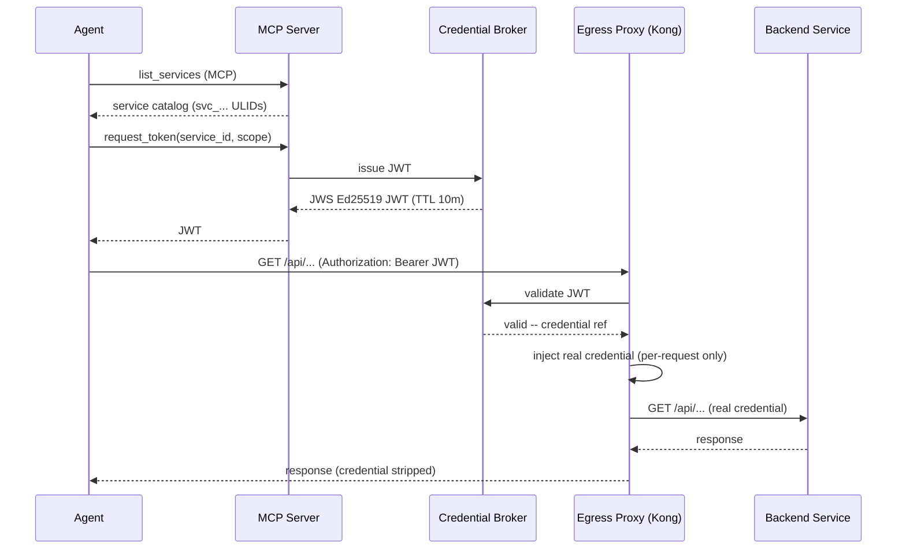

# Mintkey

> A self-hostable broker that lets autonomous agents **discover** services, **acquire** scoped short-lived credentials for them, and **call** them through a proxy that the real credentials never leave through — with operator-grade observability and per-request audit.
>
> — [`docs/architecture/00-vision/02-product-vision.md`](docs/architecture/00-vision/02-product-vision.md)

**Status: pre-alpha.** The wire surface is declared `experimental` ([`docs/architecture/contracts/rest/openapi.yaml`](docs/architecture/contracts/rest/openapi.yaml) `x-mintkey-stability`). Breaking changes will bump the major version. Do not use this in production.

---

## Status

| Item | State |
|---|---|
| Milestones | WS-0 → WS-8 complete (Phase 1); `v0.1.0-prealpha` tagged 2026-05-17 |
| Unit tests | 244 passing (2026-05-12 WS-8 snapshot) |
| Architecture tests | 17 passing (2026-05-12 WS-8 snapshot) |
| Go package tests | 23 packages green (2026-05-12 WS-8 snapshot) |
| Wire surface stability | `experimental` (`openapi.yaml` v0.1.0-preview.1) |
| License | Apache-2.0 |

See [`PROGRESS.md`](PROGRESS.md) for the full milestone checklist.

---

## What this is / what this is not

**Is:**
- A credential broker for AI agents: register services, store credentials encrypted, grant agents scoped access.
- An egress proxy (Kong + Go plugin) that injects the real credential in-flight — the agent never holds it.
- An MCP server: agents discover services and request JWTs without out-of-band setup.
- Per-request audit with a mandatory hash chain ([ADR-0014.7](docs/architecture/01-architecture/adr/0014-iter-1-2-corrections.md)).
- Self-hostable via `docker compose up`.

**Is not:**
- A general-purpose secrets manager for humans and CI/CD pipelines.
- An agent runtime or orchestrator.
- An inbound API gateway.
- A prompt-injection prevention layer (it contains blast radius; it does not prevent injection).
- Multi-region or horizontally scaled out of the box.

See [`docs/architecture/00-vision/02-product-vision.md`](docs/architecture/00-vision/02-product-vision.md) for the full non-goals list.

---

## At a glance



The agent never touches the underlying credential. Full sequence: [`docs/architecture/03-flows/E2E-01-builder-happy-path.md`](docs/architecture/03-flows/E2E-01-builder-happy-path.md).

---

## Run it locally (5 minutes)

```bash
git clone https://github.com/WeLikeCode/mintkey.git mintkey
cd mintkey
docker compose up -d
make smoke
```

On a clean machine, the 17 long-running containers and 2 one-shot jobs (liquibase, seed-job) reach healthy state within ≤ 120 seconds. `make smoke` runs the E2E-01 happy path and completes within ≤ 90 seconds.

Expected `docker compose ps` output: 17 services showing `Up (healthy)`, 2 one-shot jobs showing `Exit 0`.

Get the bootstrap admin password:

```bash
docker run --rm -v mintkey_bootstrap_secrets:/secrets alpine \
  cat /secrets/admin_password
```

Admin UI: `http://localhost:8081` — full port map in [`PORTS.md`](PORTS.md).

> Log in at `http://localhost:8081` — click **Sign in with Keycloak** and paste the password above. Full auth reference: [docs/AUTH.md](docs/AUTH.md).

Full walkthrough: [`docs/guides/github-quickstart.md`](docs/guides/github-quickstart.md).

### Backup local state before a reset

Local docker volumes hold curated state (agents/services in `postgres_data`, vault
credentials in `vault_data`/`vault_kek`, bootstrap secrets). `docker compose down -v`
wipes all 7 named volumes permanently (EV-DESTRUCTIVE-001, EV-VOL-001..007). Before
any reset:

```bash
bash scripts/dev-backup.sh
```

Default mode redacts secrets and writes to `.mintkey-backups/<timestamp>/`. To recover later:

```bash
bash scripts/dev-restore.sh .mintkey-backups/<timestamp> --dry-run   # see what would change
bash scripts/dev-restore.sh .mintkey-backups/<timestamp> --apply     # actually restore
```

Full workflow: [docs/operations/backup-before-reset.md](docs/operations/backup-before-reset.md).
EvidenceRefs (source of truth): see that doc's appendix.

---

## Where to read next

| Goal | Start here |
|---|---|
| Run the demo | [`docs/guides/github-quickstart.md`](docs/guides/github-quickstart.md) |
| Understand the architecture | [`docs/architecture/README.md`](docs/architecture/README.md) |
| Deploy on a LAN or behind a reverse proxy | [`docs/NETWORK.md`](docs/NETWORK.md) — env-var setup for `MINTKEY_MCP_PUBLIC_URL` / `MINTKEY_PROXY_PUBLIC_URL` |
| Operator auth, SSO, break-glass | [docs/AUTH.md](docs/AUTH.md) |
| Contribute code | [`CONTRIBUTING.md`](CONTRIBUTING.md), then [`docs/SDD.md`](docs/SDD.md) |
| Debug a running stack | [`docs/DEBUG.md`](docs/DEBUG.md) |
| Report a bug or security issue | [`docs/REPORTING.md`](docs/REPORTING.md) / [`SECURITY.md`](SECURITY.md) |
| Read the marketing summary | [`marketing/index.html`](marketing/index.html) |

---

## Repo map

```
README.md                          this file
CONTRIBUTING.md                    contribution gate (SDD zero tolerance)
SECURITY.md                        vulnerability disclosure policy
CLAUDE.md                          Claude Code instructions (authoritative)
AGENTS.md                          coding-agent instructions (lock-step sibling)
QUICKSTART.md                      local setup (steps, ports, smoke test)
PORTS.md                           port map + service list
PROGRESS.md                        milestone checklist + test counts
BOOTSTRAP.md                       bootstrap notes
apps/
  admin-api/                       Admin REST API — Python + FastAPI
  admin-ui/                        Admin Console — AdminJS (TypeScript)
  mcp-server/                      MCP Server — Python + FastAPI
  mock-backend/                    Demo backend (all auth schemes)
  seed-job/                        One-shot bootstrap job
  audit-verify-job/                Scheduled audit chain verification
  broker/                          Credential Broker — EdDSA JWT issuer (Go)
  vault-adapter/                   Vault Adapter — credential store (Go)
  kong-syncer/                     Kong declarative YAML pusher (Go)
  proxy-plugin/                    Kong go-pdk egress plugin (Go)
  jaeger-auth/                     Jaeger OIDC auth proxy
packages/
  python/mintkey-models/           Shared Python package (Pydantic v2 + SQLAlchemy Mapped)
  go/audit/                        Go audit emission helper
  go/auditq/                       Go audit queue
  go/changes/                      Postgres LISTEN/NOTIFY client
  go/otelinit/                     OTel SDK bootstrap
  go/svcid/                        Service identity boot-secret client
  go/ulid/                         ULID helpers
  go/vault/                        Vault proto + Go stubs
infra/
  compose/                         docker-compose.yml (primary), docker-compose.test.yml
  observability/                   prometheus.yml, alert_rules.yml, otel-collector-config.yaml, grafana/
  keycloak/                        Keycloak realm placeholders
docker-compose.yml                 Root shim (includes infra/compose/docker-compose.yml)
docs/
  architecture/                    SOURCE OF TRUTH for architectural design
    README.md                      reading order
    00-vision/                     problem, vision, personas, roadmap
    01-architecture/
      adr/                         20 ADRs (all accepted; ADR-0018 accepted 2026-05-11, ADR-0020 accepted 2026-05-15)
      open-questions.md            22 OQ-* tracked items
    03-flows/                      E2E-01 + 6 component flows
    contracts/                     REST OpenAPI, MCP tools, event schemas, proto
    proposal/                      9 accepted proposals
  guides/
    github-quickstart.md           operator runbook (GitHub PAT example)
    hermes-coingecko-quickstart.md operator runbook (CoinGecko example)
  SDD.md                           Spec-Driven Development explainer
  HOW-TO.md                        operator playbook index
  DEBUG.md                         layered troubleshooting
  REPORTING.md                     bug / feature / feedback routing
remediation/
  active/                          Ongoing remediation sessions
  archive/2026/05/                 44 completed sessions (historical; read-only)
  SESSION_TEMPLATE/                Scaffold for new sessions
.kiro/
  specs/mintkey-mvp/               Phase 1: requirements, design, tasks (M1.0-M1.13)
  steering/                        project-wide steering rules
marketing/
  index.html                       landing page
  architecture.html                architecture deep dive
  security.html                    security posture
```

---

## Project rules in 60 seconds

1. **Spec-Driven Development is mandatory.** No code without a spec entry under `.kiro/specs/`. See [`CONTRIBUTING.md`](CONTRIBUTING.md) (zero tolerance section) and [`docs/SDD.md`](docs/SDD.md).
2. **Architecture lives in ADRs; ADRs are immutable once Accepted.** To change a decision, write a new ADR that supersedes the old. See [`docs/architecture/01-architecture/adr/0001-record-architecture-decisions.md`](docs/architecture/01-architecture/adr/0001-record-architecture-decisions.md).
3. **The OpenAPI YAML is canonical; CI diffs against it.** Any handler that does not match `docs/architecture/contracts/rest/openapi.yaml` fails the build. See [`CLAUDE.md`](CLAUDE.md) "Architecture immutability".
4. **The plaintext credential never appears in any log, audit payload, OTel span attribute, or response visible to the agent.** Scenario [`S-SEC-1`](docs/architecture/01-architecture/03-quality-attributes.md); see [`ADR-0014.4`](docs/architecture/01-architecture/adr/0014-iter-1-2-corrections.md) and [`ADR-0017.6`](docs/architecture/01-architecture/adr/0017-round-3-corrections.md).
5. **Validate with tools, never with hallucinations.** A claim without a tool output is a hypothesis. See [`CLAUDE.md`](CLAUDE.md) Principle 1.

Full guardrails: [`CLAUDE.md`](CLAUDE.md) and [`AGENTS.md`](AGENTS.md) (kept in lock-step).

---

## Stability and versioning

Mintkey is pre-alpha. The wire surface is declared `experimental` in [`docs/architecture/contracts/rest/openapi.yaml`](docs/architecture/contracts/rest/openapi.yaml) (`x-mintkey-stability: experimental`, version `0.1.0-preview.1`). Breaking changes will bump the major version; resource-level stability is called out per operation in the OpenAPI `description` where it differs from the document tier.

There is no managed offering. Self-host only.

---

## License

Apache-2.0. See [`docs/architecture/contracts/rest/openapi.yaml`](docs/architecture/contracts/rest/openapi.yaml) `info.license`.
