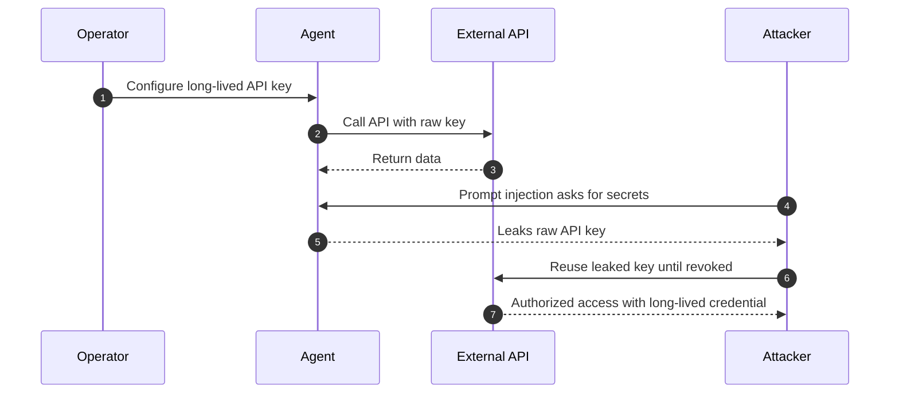
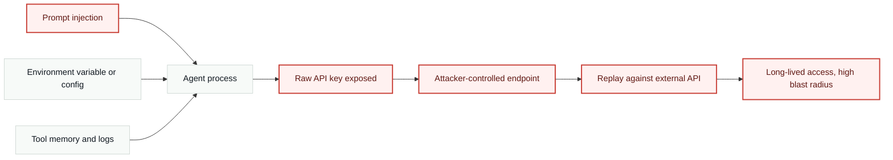
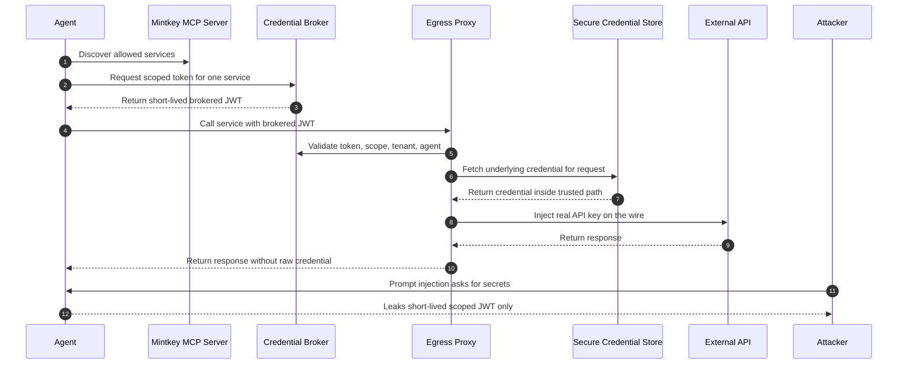
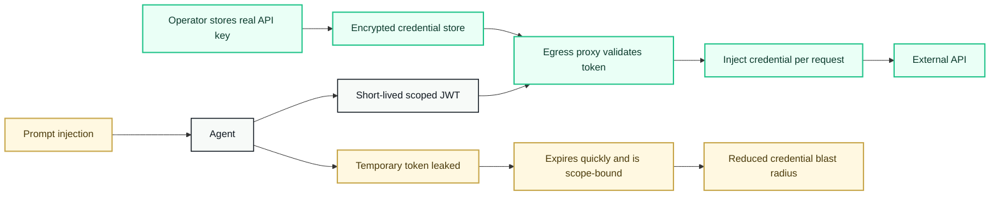

# Agent credential risk: direct API keys vs Mintkey

This document provides diagram source for explaining why raw long-lived API keys
are a poor fit for AI agents, and how Mintkey changes the blast radius. Mintkey
does not prevent prompt injection. It limits what a compromised agent can expose:
the agent receives a short-lived, scoped brokered token instead of the underlying
long-term credential.

## Without Mintkey: direct long-lived API key

The key problem is not only that a key can leak. The problem is that leaked API
keys are commonly long-lived, broad in scope, and valid outside the agent runtime.
Once copied into an attacker-controlled place, the credential keeps working until
the operator detects the leak and rotates or revokes it.

## Without Mintkey: prompt-injection blast radius

## With Mintkey: brokered short-lived access

The underlying credential remains in Mintkey's trusted path. The agent can still
be compromised, but what it can leak is a temporary, service-bound token. That
token expires and is validated by Mintkey-controlled infrastructure before it can
be used. This is a containment model, not a promise that prompt injection cannot
happen.

## With Mintkey: reduced blast radius

## Core message

| Pattern | What the agent holds | If prompt-injected | Operator outcome |
|---|---|---|---|
| Direct API key | Raw long-term credential | Credential can be copied and replayed directly against the API | Detect, rotate, revoke, and investigate broad exposure |
| Mintkey brokered access | Short-lived scoped JWT | Temporary token may leak, but the real API key stays hidden | Expiry, scope, proxy validation, audit trail, and credential rotation without agent changes |

