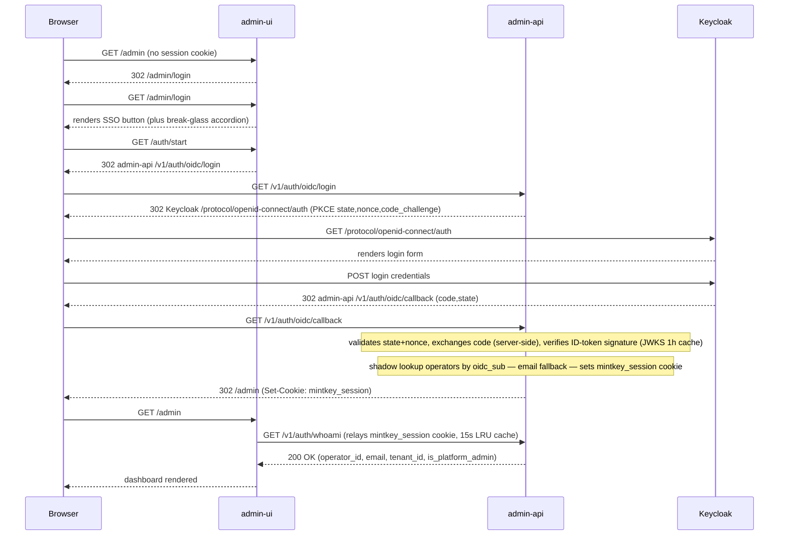

# AUTH.md — Operator Authentication Reference

> **Status:** pre-alpha. SSO is wired and functional; architecture is stabilized per ADR-0020 (2026-05-15).
> This document covers operator-facing authentication only. Agent API keys and internal service-token auth are out of scope — see below.

---

## TL;DR

Keycloak is the canonical IdP for admin-ui, Grafana, and Jaeger. Operators sign in once per service; sessions are independent per service today (no central SSO state shared across admin-ui, Grafana, and Jaeger — each service issues its own session).

**Normal login:** Navigate to `http://localhost:8081`, click "Sign in with Keycloak", enter `admin@mintkey.internal` + the bootstrap password from `data/bootstrap-secrets/admin_password`.

**Break-glass (Keycloak unreachable):**
```bash
docker compose exec admin-api python -m admin_api.cli admin reset-password --email admin@mintkey.internal
# prints a one-time temp password — copy it immediately
# Log in via the "Break-glass (local password)" accordion on /admin/login
# When Keycloak is back, clear the hash:
docker compose exec admin-api python -m admin_api.cli admin clear-password --email admin@mintkey.internal
```

---

## Architecture

### admin-api OIDC flow (PKCE, BFF pattern — ADR-0019)

admin-ui delegates the OIDC flow entirely to admin-api. admin-ui never holds the OIDC `client_secret`.



**Key properties:**
- admin-api owns the `client_secret`; admin-ui never sees it (ADR-0020).
- The PKCE `state_store` in admin-api is currently in-process memory — single-replica only. This is flagged as a known risk; see Open items.
- After callback, admin-api looks up the operator in `operators` by `oidc_sub` first, then `email` (D1 shadow table — pre-linked at seed time).
- The `mintkey_session` cookie is `HttpOnly; Secure; SameSite=Strict`.

---

## Realm and clients

Mintkey deploys one Keycloak realm: `mintkey`.

| Client ID | Type | Used by | Redirect URI (default) |
|---|---|---|---|
| `mintkey-admin-api` | Confidential PKCE | admin-api OIDC flow | `http://localhost:8080/v1/auth/oidc/callback` |
| `mintkey-grafana` | Confidential | Grafana native OIDC | `http://localhost:3000/login/generic_oauth` |
| `mintkey-jaeger` | Confidential | oauth2-proxy (jaeger-auth sidecar) | `http://localhost:16686/oauth2/callback` |

For cross-machine or LAN deployments, the redirect URIs must match the public URLs. See [docs/NETWORK.md — Keycloak / SSO public URLs](NETWORK.md#keycloak--sso-public-urls) and the `MINTKEY_KEYCLOAK_PUBLIC_URL` env var.

**Realm roles:**

| Role | Purpose |
|---|---|
| `mintkey-platform-admin` | Full admin access across tenants |
| `mintkey-tenant-admin` | Admin within a single tenant |
| `mintkey-operator` | Read-only operator within a tenant |

---

## Role mapping

| Keycloak realm role | admin-ui | Grafana | Jaeger (oauth2-proxy) |
|---|---|---|---|
| `mintkey-platform-admin` | `is_platform_admin=true` | Admin | authenticated |
| `mintkey-tenant-admin` | tenant scope | Viewer | authenticated |
| `mintkey-operator` | tenant scope | Viewer | authenticated |

Grafana role is mapped via a JMESPath expression on the token's `realm_access.roles` claim (SSO-D). Jaeger via oauth2-proxy validates the token; any authenticated user can view traces (D3 — Prometheus stays internal).

---

## First-time setup

Prerequisites: `docker compose up -d` completed successfully; all containers healthy.

1. **Find the bootstrap password:**
   ```bash
   cat data/bootstrap-secrets/admin_password
   # or, if the file is inside the Docker volume:
   docker run --rm -v mintkey_bootstrap_secrets:/s alpine cat /s/admin_password
   ```

2. **Navigate to the admin console:**
   ```
   http://localhost:8081
   ```
   You will be redirected to `/admin/login`.

3. **Click "Sign in with Keycloak"** — you will be redirected to the Keycloak login page.

4. **Log in** with:
   - Username: `admin@mintkey.internal`
   - Password: (bootstrap password from step 1)

5. On first login, Keycloak may prompt you to change your password. Do so and you are redirected to the admin dashboard.

---

## Password rotation

Operators change their password via the **Keycloak Account Console**:

```
http://localhost:8443/realms/mintkey/account/
```

Log in with your current credentials, navigate to "Account Security" > "Signing In", and update your password.

**Sessions remain valid** until the `mintkey_session` cookie expires or the Keycloak token expires — changing your Keycloak password does not immediately invalidate active admin-ui sessions.

To force re-login after a password change:
```
http://localhost:8443/realms/mintkey/protocol/openid-connect/logout?redirect_uri=http://localhost:8081/admin/login
```

---

## Break-glass

Use when Keycloak is unreachable and you need admin-ui access.

**Step 1 — Issue a temporary local password:**
```bash
docker compose exec admin-api python -m admin_api.cli admin reset-password --email admin@mintkey.internal
# Output: "Temporary password: <temp>  — copy this now; it will not be shown again."
```

**Step 2 — Log in via break-glass:**
Navigate to `http://localhost:8081/admin/login`. Open the "Break-glass (local password)" accordion, enter your email and the temporary password.

**Step 3 — Clear the hash when Keycloak is back:**
```bash
docker compose exec admin-api python -m admin_api.cli admin clear-password --email admin@mintkey.internal
```
This sets `operators.internal_password_hash = NULL`, restoring the Keycloak-only posture (D2-b). Internal login is gated by `internal_password_hash IS NULL` — if the hash is NULL, break-glass login returns 404. This is expected behavior.

---

## Keycloak admin recovery

If the Keycloak admin credentials (`KEYCLOAK_ADMIN` / `KEYCLOAK_ADMIN_PASSWORD`) are lost:

Keycloak persists its state in Postgres (the `keycloak` schema). Two recovery paths:

**Option A — Update the Keycloak admin row directly in Postgres:**
```bash
docker compose stop keycloak
# Connect to Postgres and update the admin user password in the keycloak schema.
# Keycloak's admin credentials are stored in the master realm user table.
docker compose start keycloak
```

**Option B — Re-seed (destroys bootstrap state, use only as last resort):**

> **⚠ Pre-flight backup** — this rotates ALL bootstrap secrets. Run a backup first so you can roll back if anything downstream depends on the current values:
> ```bash
> bash scripts/dev-backup.sh --write --with-secrets
> ```
> Full workflow: [team/remediation/HOWTO-backup-before-reset.md](../team/remediation/HOWTO-backup-before-reset.md).
> (EvidenceRef: DSBR session `EV-DESTRUCTIVE-011`.)

```bash
docker compose down
rm data/bootstrap-secrets/.admin_password_synced   # forces re-seed
docker compose up -d
```
This triggers the seed job to regenerate all bootstrap secrets, including the Keycloak admin password. **All existing bootstrap secrets (service-identity tokens, AdminJS keypair, broker keypair) will be rotated.**

---

## Multi-machine / LAN setup

When operators access Mintkey from a machine other than the one running Docker, the browser-visible Keycloak URL must be reachable from that machine. Set the six public URL env vars in `.env`:

```bash
MINTKEY_KEYCLOAK_PUBLIC_URL=http://192.168.1.50:8443
MINTKEY_ADMIN_UI_PUBLIC_URL=http://192.168.1.50:8081
MINTKEY_ADMIN_API_PUBLIC_URL=http://192.168.1.50:8080
MINTKEY_GRAFANA_PUBLIC_URL=http://192.168.1.50:3000
MINTKEY_JAEGER_PUBLIC_URL=http://192.168.1.50:16686
MINTKEY_KEYCLOAK_INTERNAL_URL=http://keycloak:8443
```

See [docs/NETWORK.md — Keycloak / SSO public URLs](NETWORK.md#keycloak--sso-public-urls) for the complete reference, including which containers must be restarted and how redirect URIs are registered on Keycloak clients.

---

## Troubleshooting

| Symptom | Root cause | Fix |
|---|---|---|
| Login redirects forever (browser loops between admin-ui and Keycloak) | Cookie domain mismatch — admin-ui and admin-api must be reachable on the same eTLD+1 for `SameSite=Strict` to work correctly | Verify both services are accessed on the same hostname; use the same base domain for both URLs |
| Keycloak returns `invalid_redirect_uri` | The browser-visible URL does not match a registered `redirectUri` on the Keycloak client | Set `MINTKEY_KEYCLOAK_PUBLIC_URL` to the public URL; re-seed or add the URI via Keycloak Admin REST API |
| `iss` claim mismatch in admin-api logs | admin-api expected issuer (derived from `MINTKEY_KEYCLOAK_INTERNAL_URL`) does not match what Keycloak emits in the ID token | Compare token `iss` field vs `MINTKEY_KEYCLOAK_INTERNAL_URL`; they must match exactly including path |
| `GET /v1/auth/internal-login` returns 404 | Expected — this is the D2-b posture. `internal_password_hash IS NULL` means break-glass is disabled. | Run `reset-password` CLI to enable break-glass, or verify Keycloak is reachable |
| Grafana SSO button missing | Grafana not rebuilt after `MINTKEY_KEYCLOAK_INTERNAL_URL` change, or `grafana_oidc_client_secret` file missing in the bootstrap_secrets volume | Run `docker compose up -d --force-recreate grafana`; verify secrets volume contains `grafana_oidc_client_secret` |
| Jaeger shows "authentication required" loop | oauth2-proxy `oidc-issuer-url` not resolving from browser (should be the public URL, not the internal URL) | Check `OIDC_ISSUER_URL` in the jaeger-auth service environment; must be `MINTKEY_KEYCLOAK_PUBLIC_URL/realms/mintkey` |
| `GET /v1/auth/whoami` returns 401 after login | Session cookie not relayed from admin-ui to admin-api, or cookie domain/path mismatch | Verify admin-ui's `http-proxy` config forwards the `mintkey_session` cookie on calls to admin-api |
| Keycloak container starts but realm `mintkey` is missing | Seed job ran before Keycloak was ready, or seed failed and was not retried | Check seed-job logs; re-run: `docker compose up seed-job` (idempotent) |

---

## Known gaps (pre-alpha)

- **PKCE `state_store` is in-process memory.** `admin-api/src/admin_api/auth/oidc.py` keeps the OIDC state cache in a Python `dict` — single-replica only. A horizontally-scaled admin-api would lose state across pods and fail callbacks. Flagged in ADR-0020 open follow-ups; will switch to a shared store (Redis or postgres-backed table) before alpha.
- **`admin_ui_private.pem` not provisioned in dev.** The signed-request JWT pattern (admin-ui → admin-api, Ed25519-signed per ADR-0019) requires admin-ui to hold a private key. The current bootstrap does not generate this keypair, so admin-ui falls back to omitting the JWT header. admin-api accepts unsigned writes in dev — fine for local stack; **must be fixed before any deployment that runs admin-api without `cookie_secure=true`**.
- **Existing sessions pre-016 show "Keycloak" badge.** The `sessions.auth_method` column was added in migration `016`. Sessions created before this point have `auth_method=NULL` and display as "Keycloak" regardless of how they were created. Acceptable for pre-alpha; refresh fixes.

---

## MCP client headers

When a Model Context Protocol client connects to Mintkey's MCP server (`/mcp` endpoint), it must send a Bearer token to authenticate tool calls:

| Header | Status | Note |
|---|---|---|
| `Authorization: Bearer mk_agent_<key>` | **Preferred** | Matches MCP spec 2025-06-18 §authorization. New clients should use this. |
| `X-API-Key: mk_agent_<key>`            | Accepted | Backward-compat with pre-MCP-standard Mintkey clients. |

`initialize` and `notifications/initialized` are unauthenticated (they're discovery-time). `tools/list` and `tools/call` require auth and return JSON-RPC error `-32001` if no valid agent key is presented.

The agent key is the `mk_agent_<crockford>` value generated when an operator creates an Agent in the admin UI. It is shown once at creation; if lost, the operator must rotate it.

---

## Out of scope

The following auth mechanisms are intentionally separate from Keycloak and do NOT flow through it:

- **Internal service-token auth** (`/v1/internal/audit/emit` and Vault Adapter calls) — uses per-service boot secrets (`svcid_*`) per ADR-0014.2.
- **Agent API keys** (`mk_agent_*`) — brokered JWTs issued by the Credential Broker per ADR-0006. Agents never touch Keycloak.
- **AdminUiSignedRequest JWT** — Ed25519 JWT signed by AdminJS on writes to admin-api per ADR-0014.6 / ADR-0019. This is a channel-proof mechanism, not an operator IdP.

See [ADR-0020](architecture/adrs/0020-sso-keycloak-canonical-idp.md) for the canonical rationale for this scope boundary.

---

# For developers

This section documents how admin-ui talks to admin-api. Operators don't need any of this.

## Server-side session relay

`admin-ui` is a Node.js BFF — it does not hold the OIDC client_secret. When a request hits admin-ui:

1. `requireSession` middleware (`admin-ui/src/index.ts`) reads the inbound `mintkey_session` cookie.
2. It calls `admin-api /v1/auth/whoami` with the cookie relayed via `Cookie:` header.
3. On 200, it stashes the operator on `req.session.adminUser` (express-session) AND on `req.adminSession` (typed Express augmentation).
4. AdminJS action handlers receive the operator as `context.currentAdmin` (sourced by AdminJS from `req.session.adminUser`).

## Threading the session into admin-api calls

AdminJS resource actions that mutate state (e.g. `services.test-transient`, `agents.create`, `permission_grants.delete`) call `apiWrite()` in `admin-ui/src/lib/api-client.ts`. Always thread the operator's session via `operatorOptsFromAdmin(currentAdmin)`:

```ts
const resp = await apiWrite(
  `/v1/tenants/${tenantId}/...`,
  "POST",
  request.payload,
  operatorOptsFromAdmin(currentAdmin)
);
```

Without `operatorOpts`, `apiWrite` falls back to `getApiSession()` which tries a bootstrap internal-login that returns 404 by default (D2-b). All write actions WILL fail with 403 (CSRF missing) until you pass `operatorOpts`. This was the SSO-REDUX-3 / UI-E2E `fcac7053` bug class.

## Signed-request JWT (ADR-0019)

Every state-changing call to admin-api must carry both:
- `mintkey_session` cookie (session-bound identity)
- `x-mintkey-signed-request` header (Ed25519 JWT issued by admin-ui, signed with `admin_ui_private.pem`)

`admin-ui/src/lib/signed-request.ts` implements the signer; admin-api's `AdminUiSignedRequestMiddleware` validates. **Pre-alpha caveat**: the private key isn't provisioned in dev; the signer gracefully returns null and the header is omitted; admin-api accepts unsigned writes in dev. See "Known gaps" above.

## State_store and OIDC callback race

`oidc.py:_state_store` is an in-process dict. Each `/oidc/login` writes a `(state, code_verifier)` pair; `/oidc/callback` pops it. Single-replica only — see "Known gaps".
