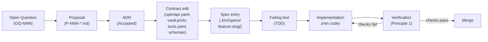

# Spec-Driven Development (Kiro flavor)

> **Audience:** developer; secondarily, a decision-maker who wants to understand why this project ships
> slowly and deliberately.

Mintkey uses Kiro for Spec-Driven Development. The Kiro workspace lives under `.kiro/`. The
canonical example is `.kiro/specs/mintkey-mvp/` — `requirements.md`, `design.md`, and `tasks.md` —
which produced every line of Phase 1 code. Steering rules under `.kiro/steering/` apply to every
spec implicitly.

---

## 1. What Mintkey is (30-second context)

Mintkey is a credential broker for AI agents. Operators register backend services with credentials;
agents discover services over MCP, request short-lived JWTs, and call services through Kong, which
injects credentials in-flight. The agent never touches the underlying credential.

Architecture is settled across 19 ADRs in
[`docs/architecture/01-architecture/adr/`](architecture/01-architecture/adr/). Implementation must
conform to those ADRs. This document explains the pipeline that takes a new feature from idea to
merged, conformant code.

---

## 2. Why we do this

Three reasons.

**Credentials are at stake.** A "let me just try this and see what happens" PR can leak a
customer's API keys — directly, through a log statement, through a span attribute, through an audit
payload. The spec process forces the implementer to identify every path to exposure before writing a
line of code.

**The architecture is non-trivial.** Nineteen ADRs, a polyglot stack (Python/Go/TypeScript), and
strong opinions about wire-level contracts mean divergence between services is guaranteed unless
every change starts from the same shared description. A spec is that shared description.

**LLM-assisted coding amplifies both signal and noise.** An LLM that does not have a spec will
invent a plausible-looking implementation of a plausible-looking problem. An LLM with a spec will
implement the actual problem. SDD makes LLM output verifiable.

---

## 3. The pipeline

Every non-trivial change follows this path:



The loop `IMPL → VERIFY → IMPL` corresponds to `CLAUDE.md` Principle 3, Step 5 → 6. Every cycle
through the loop narrows the gap between the intent (spec) and the code (diff).

**Bugfixes** that touch no architectural surface skip `OQ → PROP → ADR → CONTRACT`; they start at
`SPEC` (or a task in the existing spec) and run the `TEST → IMPL → VERIFY → MERGE` tail.

---

## 4. The `.kiro/` workspace

The workspace has two areas.

### Specs

```
.kiro/specs/<feature-slug>/
  requirements.md   WHEN/THEN acceptance criteria; source from quality-attribute scenarios and flows
  design.md         implementation plan; cites ADRs; states which S-*-* scenarios it satisfies
  tasks.md          work breakdown; checkbox items; each ends in _Requirements: ..._ provenance
```

Anything that does not have all three files is **not** a spec. A markdown file in the wrong
directory is not a spec. An LLM-summarized doc is not a spec unless it is in this format.

The canonical example is `.kiro/specs/mintkey-mvp/`. The provenance convention used in
`tasks.md` — `_Requirements: Req N ACM; ADR-XXXX_` — is described in §9 (worked example).

### Steering rules

`.kiro/steering/` contains project-wide rules — architecture principles, structure conventions,
tech-stack constraints, security-and-tenancy mandates — that every spec implicitly inherits. A
spec's design and tasks must be consistent with all steering rules. Steering rules are not editable
by feature authors; changes go through an ADR.

---

## 5. What counts as a spec

A Kiro spec is a directory under `.kiro/specs/<feature-slug>/` containing three files:

| File | Required content |
|---|---|
| `requirements.md` | `Requirement N` blocks; each has `User Story` + numbered `WHEN/THEN` acceptance criteria. Sources are cited at the top. |
| `design.md` | Implementation plan. Cites the ADRs it relies on. States which `S-*-*` quality-attribute scenarios it satisfies. References flows in `docs/architecture/03-flows/`. |
| `tasks.md` | Checkbox items. Each item names the work to be done and ends with `_Requirements: <list>_` provenance tracing it back to acceptance criteria and ADRs. |

Example: ten lines from `.kiro/specs/mintkey-mvp/requirements.md` (Req 1, AC 1–4), which show the
WHEN/THEN format:

```
1. WHEN `docker compose up` is run on a clean machine with Docker installed, THEN the **15
   long-running containers** (postgres, keycloak, admin-api, admin-ui (AdminJS), mcp, broker,
   vault-adapter, kong, proxy-plugin, kong-syncer, demo-backend, otel-collector, jaeger,
   prometheus, grafana) reach a healthy state within **≤ 120 seconds**, and the **2 one-shot
   jobs** (liquibase, seed-job) exit 0 before admin-api starts.
2. WHEN Liquibase runs as a one-shot job, THEN it applies all changelogs successfully and exits 0.
3. WHEN Liquibase migrations complete, THEN every domain table exists. Every **tenant-scoped**
   table carries `tenant_id UUID NOT NULL`.
4. WHEN Liquibase migrations complete, THEN every tenant-scoped table has a Postgres Row Level
   Security policy whose `qual` evaluates to:
     tenant_id = current_setting('app.current_tenant', true)::uuid
     OR current_setting('app.platform_admin_view', true) = 'on'
```

Source: `.kiro/specs/mintkey-mvp/requirements.md` lines 51–59.

---

## 6. What counts as an ADR

An ADR lives at `docs/architecture/01-architecture/adr/0NNN-<kebab-name>.md`. It follows the
Nygard format:

- **Status** — `Accepted — YYYY-MM-DD` (or `Proposed`, `Superseded by ADR-NNNN`).
- **Context** — what forces make this decision necessary.
- **Decision** — the chosen option.
- **Consequences** — positive, cost, risk.
- Optional **Related** — links to related ADRs, flows, proposals, or external references.

See [`docs/architecture/01-architecture/adr/0001-record-architecture-decisions.md`](architecture/01-architecture/adr/0001-record-architecture-decisions.md)
for the canonical format.

Once `Status: Accepted`, an ADR is immutable. Corrections happen in a new ADR that *amends* or
*supersedes* the old one; the old ADR's status field is updated to `Superseded by ADR-NNNN` but its
content is not edited. The pattern is visible in
[`ADR-0014`](architecture/01-architecture/adr/0014-iter-1-2-corrections.md),
[`ADR-0016`](architecture/01-architecture/adr/0016-round-2-corrections.md), and
[`ADR-0017`](architecture/01-architecture/adr/0017-round-3-corrections.md), each of which amends
earlier decisions with corrigenda.

---

## 7. What counts as a contract

The canonical contracts are:

| File | Format | CI gate |
|---|---|---|
| `docs/architecture/contracts/rest/openapi.yaml` | OpenAPI 3.1 | `openapi-spec-validator` + `redocly lint` + parity with runtime `GET /openapi.json` |
| `docs/architecture/contracts/mcp/tools.yaml` | YAML | `python3 -c "import yaml; yaml.safe_load(...)"` |
| `docs/architecture/contracts/events/audit-event.schema.json` | JSON Schema Draft 2020-12 | `Draft202012Validator.check_schema` |
| `docs/architecture/contracts/events/change-event.schema.json` | JSON Schema Draft 2020-12 | `Draft202012Validator.check_schema` |
| `docs/architecture/contracts/vault-adapter/vault.proto` | Protobuf | `protoc --descriptor_set_out=/dev/null` |
| `docs/architecture/contracts/events/span-attributes.md` | Markdown allowlist | OTel redaction CI test (REQ-11.6) |

All six are canonical. CI diffs the running services against these. Code is not allowed to drift —
any divergence fails the build (per [ADR-0014.3](architecture/01-architecture/adr/0014-iter-1-2-corrections.md)
and [ADR-0017.1](architecture/01-architecture/adr/0017-round-3-corrections.md)).

---

## 8. The execution loop (per task)

Quoted verbatim from `CLAUDE.md` Principle 3:

> For any non-trivial change:
>
> 1. **Read the relevant ADRs and contracts.** Cite them in the plan.
> 2. **State the plan as numbered steps with explicit verify checks per step** (Karpathy's Goal-Driven Execution, below).
> 3. **Write the failing test first** (TDD). Reference the quality-attribute scenario `S-*-*` it satisfies.
> 4. **Implement the minimum code that turns the test green** (Karpathy's Simplicity First, below).
> 5. **Run all relevant validators** (Principle 1). Capture the exit codes and salient output.
> 6. **Re-read the diff** before declaring done; it should trace line-by-line to the user's request (Karpathy's Surgical Changes, below).
> 7. **Update the audit / open-questions register / relevant doc** if the change affected an architectural surface.
>
> Loop until the verify checks pass. Do not declare done on partial completion.

This loop applies at task granularity. Each task in `tasks.md` has implicit verify checks embedded
in its bullet points (`Write tests/...`); those checks are the step-5 validators for that task.

---

## 9. Worked example — adding `oauth_token_basic_client` auth scheme

This walks a hypothetical addition of a new auth scheme: `oauth_token_basic_client`. It
illustrates why each step in the pipeline exists.

### Step 1 — Open question (`OQ-NNN`)

The scheme is not in the current `vault.proto` enum. Before any code, add an entry to
`docs/architecture/01-architecture/open-questions.md`:

```
OQ-023 oauth_token_basic_client: basic-auth + OAuth2 client credentials, same DEK but
       different injection logic in proxy. Is this distinct from oauth2_client_credentials
       or a parameterization of it?
       Phase / Owner: Phase 2 / proxy-plugin team
```

**Why this step exists:** if the question is never asked, two engineers will implement it
differently. The OQ surfaces the question before any code is written.

### Step 2 — Proposal (`docs/architecture/proposal/P-NNN-*.md`)

Write `docs/architecture/proposal/P-023-oauth-token-basic-client.md`. Minimum content:

- Problem statement (one paragraph).
- At least two options: (a) new enum variant; (b) parameterize `oauth2_client_credentials`.
- Recommendation with rationale.
- Impact on contracts (vault.proto, openapi.yaml, tools.yaml, audit schema).
- Impact on `S-MOD-1` (≤ 3 files changed in the proxy plugin to add a scheme).

**Why this step exists:** the proposal forces the author to enumerate alternatives. It also surfaces
the `S-MOD-1` constraint early — adding a scheme must touch ≤ 3 files in the proxy plugin.
If the proposed design would touch more, it is rejected here, not after implementation.

### Step 3 — ADR

After the proposal is accepted, write `docs/architecture/01-architecture/adr/0020-oauth-token-basic-client-scheme.md`
citing `ADR-0011` (shared Go stack), `ADR-0014.4` (no plaintext credential cache), and the
proposal. The ADR records the chosen option and its consequences.

**Why this step exists:** the ADR is the immutable record. Future implementers who ask "why does
the proxy do X?" read the ADR, not someone's commit message.

### Step 4 — Contract edits

Four files change (in a single PR, before any implementation code):

1. `docs/architecture/contracts/vault-adapter/vault.proto` — add `OAUTH_TOKEN_BASIC_CLIENT = N`
   to the `AuthScheme` enum.
2. `docs/architecture/contracts/rest/openapi.yaml` — add `oauth_token_basic_client` to the
   `auth_scheme` enum in the `Service` schema.
3. `docs/architecture/contracts/mcp/tools.yaml` — add `oauth_token_basic_client` to the
   `auth_scheme` parameter enum in `describe_service` and `request_token`.
4. `docs/architecture/contracts/events/audit-event.schema.json` — if the new scheme emits a
   distinct audit event type, add it to the `event_type` enum.

Run all contract validators. CI must be green before moving to implementation.

**Why this step exists:** contracts are the shared language between services. If the proxy plugin
and the vault adapter use different enum values, the system silently degrades. The contract PR makes
that shared language explicit and machine-verifiable before any service code is written.

### Step 5 — Spec entry

Add a task to `.kiro/specs/mintkey-mvp/tasks.md` (or create a new spec if the feature is large
enough to warrant one):

```
- [ ] N.M Add oauth_token_basic_client injection to proxy plugin
  - Read vault credential as (user, pass) tuple per ADR-0014.4 (no cache)
  - Inject as Authorization: Basic base64(user:pass) with OAuth2 token endpoint call
  - Zero plaintext from request scope after upstream returns
  - Write services/proxy-plugin/internal/inject/oauth_token_basic_test.go
  - Write services/proxy-plugin/internal/inject/oauth_token_basic.go (≤ 3 files per S-MOD-1)
  - Verify: mmdc validates all Mermaid; protoc exit 0; openapi-spec-validator exit 0
  _Requirements: Req 7 AC4, AC5; ADR-0020; ADR-0014.4; S-MOD-1_
```

The `_Requirements: ..._` line is the provenance format from `.kiro/specs/mintkey-mvp/tasks.md`.
It traces this task back to the acceptance criteria and ADRs it satisfies. A reviewer who
questions whether the implementation is necessary can read the cited ACs; a reviewer who questions
whether the approach is correct can read the cited ADRs.

**Why this step exists:** the task checkboxes are the project's definition of done. Without a task,
"done" has no definition. The provenance line makes the task's rationale grep-able.

### Step 6 — Failing test

Write `services/proxy-plugin/internal/inject/oauth_token_basic_test.go` asserting:

- The correct `Authorization: Basic` header is set.
- The upstream `Authorization: Bearer <JWT>` header is stripped.
- The plaintext credential is zeroed after the request.
- The scheme rejects an empty `user` or `pass`.

Run `go test ./... -run TestOAuthTokenBasicClient` — it fails. This confirms the test is testing
something real, not something already implemented.

**Why this step exists:** a test written after the implementation proves the implementation is
testable, not that it is correct. Writing the test first forces the implementer to define "correct"
before writing code.

### Step 7 — Implementation

Write the minimum code that makes the test green, touching ≤ 3 files in the proxy plugin per
`S-MOD-1`. Typical: one new `inject/oauth_token_basic.go` file, one entry in the scheme dispatch
table, and an update to the existing test helper.

**Why this step exists:** minimalism is not laziness. It is the only way to ensure the diff is
reviewable. A diff that touches 12 files for a single auth scheme cannot be reviewed; it can only
be approved blindly.

### Step 8 — Verification (Principle 1)

Before declaring done, run every validator listed in `CLAUDE.md` "Verification commands":

```sh
# Contract validators
openapi-spec-validator docs/architecture/contracts/rest/openapi.yaml
protoc --descriptor_set_out=/dev/null docs/architecture/contracts/vault-adapter/vault.proto

# Tests
go test ./services/proxy-plugin/... -v   # show output; exit 0

# Mermaid (if any diagram was added or modified)
npx --yes -p @mermaid-js/mermaid-cli@10 mmdc -i <file>.mmd -o /tmp/check.svg

# Plaintext-in-logs red team (if running the full stack)
docker compose logs | grep -E "$(cat ./scripts/red-team-fingerprints.txt)"
```

Capture and paste exit codes in the PR description. "Tests pass" without showing output is a
hallucination, not a status (per `CLAUDE.md` Principle 1).

**Why this step exists:** the verifier has different failure modes from the implementer. Running
validators independently is the only way to catch the class of errors ("it works on my machine")
that code review cannot see.

### Step 9 — Update the audit register

If the change touched an architectural surface — a new enum variant in `vault.proto`, a new
`event_type` in the audit schema — update `docs/architecture/01-architecture/open-questions.md`
to close `OQ-023` and reference `ADR-0020`.

**Why this step exists:** open questions that are answered but not closed accumulate and become
noise. The register is only useful if it reflects the current state.

---

## 10. Exceptions and exception handling

The SDD pipeline may be abbreviated in exactly one case: a **documentation-only change** (no code,
no contract surface, no spec-observable behavior). Documentation changes skip `OQ → PROP → ADR →
CONTRACT → SPEC → TEST` and go directly to a PR.

Any other abbreviation requires explicit architect sign-off. The sign-off must be recorded in the
PR description as: `SDD exception: <reason>. Architect approval: <name>, <date>.`

Forbidden exceptions:

- ❌ "I wrote the code first, now I'll write the spec." Specs written after code are not specs;
  they are post-hoc documentation. The pipeline exists to shape the code, not describe it.
- ❌ "The ADR would slow us down." ADRs are the project's institutional memory. Skipping one for
  speed borrows against future contributors' time.
- ❌ "The test would be hard to write." Test difficulty is signal. If a behavior is hard to test,
  it is hard to verify and likely hard to maintain. The difficulty is a prompt to simplify the
  design, not a reason to skip testing.

---

## 11. Anti-patterns specific to SDD

- ❌ **Spec written after code.** The spec is input, not documentation. Code that precedes its
  spec cannot be verified against the spec — the spec will just describe whatever the code does.
- ❌ **ADR written to justify code already written.** ADRs record decisions, including the
  alternatives that were considered and rejected. An ADR written after the code cannot record the
  alternatives that were implicitly rejected; it can only record the one that won. This makes the
  ADR useless for future re-evaluation.
- ❌ **Task marked done without verify checks.** The checkbox in `tasks.md` represents a
  verifiable claim. Checking a box without running the named tests and validators is a false claim.
  CI will catch it; the cost is a broken build rather than a quiet conversation.
- ❌ **Contract edited in one PR, implementation in another, no spec linking them.** Without the
  spec as the shared anchor, the contract PR and the implementation PR can diverge. Someone merges
  the contract; someone else forgets to merge the implementation. The runtime drifts from the
  contract; CI fails on parity check; engineers spend a day tracing the divergence.
- ❌ **Verification delegated to the reviewer.** The author is responsible for running validators
  and pasting output. The reviewer is responsible for re-running them independently. Neither can
  delegate. A PR with "lgtm, CI is green" from an author who did not run `make test-arch` is not
  a reviewed PR.

---

## 12. Tooling

| Tool | Purpose |
|---|---|
| `make doctor` | Validates the local environment: Docker, `npx`, `openapi-spec-validator`, `protoc`, `mmdc` all present and functional |
| `make spec-trace` | Traces every task in `tasks.md` back to a requirement AC; flags tasks with missing `_Requirements:` provenance |
| `make contract-lint` | Runs all contract validators: `openapi-spec-validator`, `redocly lint`, `Draft202012Validator.check_schema`, `protoc` |
| `make test-arch` | Architecture invariant tests: RLS coverage, audit chokepoint, OpenAPI parity, SQLAlchemy mirror diff |
| `make smoke` | E2E-01 happy path (`docker compose up -d` then the smoke script; ≤ 90 s) |
| `npx mmdc` | Mermaid validator — run on every fenced `mermaid` block before claiming it renders |
| `.kiro/skills/` | Kiro skills for spec scaffolding, ADR generation, contract validation |
| `viz-architecture` skill | Renders `docs/architecture/` markdown + Mermaid into a static HTML site with sidebar |

Per `CLAUDE.md` Principle 1: if a tool is missing, install or write it. Do not skip the check.

---

## 13. Further reading

- [Kiro documentation](https://kiro.dev/docs/) — spec format, steering rules, task provenance.
- Karpathy's four rules for Claude Code — cited in `CLAUDE.md` lines 316–318:
  [andrej-karpathy-skills (GitHub)](https://github.com/forrestchang/andrej-karpathy-skills).
- *Documenting Software Architectures* — Bass, Clements, Kazman; SEI (2nd ed.). The quality
  attribute scenario format (`S-*-*`) comes from Chapter 4.
- Nygard, "Documenting Architecture Decisions" (2011) — the ADR format used in this project.
  [Original post](https://www.cognitect.com/blog/2011/11/15/documenting-architecture-decisions).
- [`docs/architecture/README.md`](architecture/README.md) — entry point and reading order for
  the architecture docs.
- [`CONTRIBUTING.md`](../CONTRIBUTING.md) — the gate document; `docs/SDD.md` (this file) is the
  explainer. Read `CONTRIBUTING.md` first.
