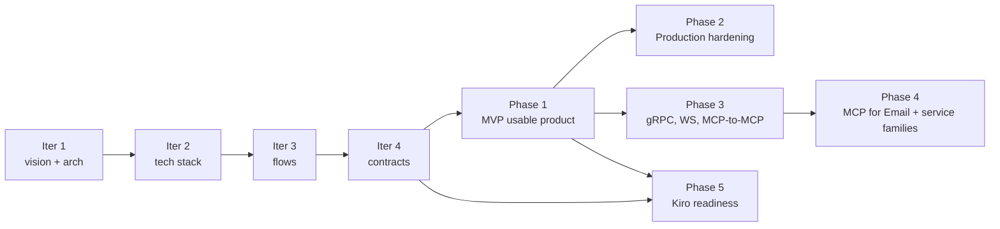

# Mintkey roadmap

<!-- ═══════════════════════════════════════════════════════════════════════ -->
<!-- PUBLIC PRODUCT ROADMAP                                                  -->
<!-- Added 2026-05-16. Source of truth for cohort analysis, launch           -->
<!-- milestones, and open product decisions.                                  -->
<!-- Architecture-iteration content (Phase 0 → Phase 5) is preserved below  -->
<!-- the separator line.                                                      -->
<!-- ═══════════════════════════════════════════════════════════════════════ -->

---

## Section 1 — Current Product State

Mintkey is **pre-alpha**. It is suitable for technical evaluation by builders and developers who want to understand the architecture, run the demo locally, and experiment with the MCP client integration. It is not suitable for production use of any kind.

**What is working today:**
- `docker compose up -d` starts all 19 containers (17 long-running, 2 one-shot) and reaches healthy state in ≤ 120 seconds on a clean machine. (EvidenceRef: `docker-compose.yml` — 19 services defined; healthy-state verified in OSS-6 and smoke tests)
- The PAT-free 10-minute mock demo (`docs/guides/10min-mock-demo.md`) runs end-to-end: service registration, agent creation, JWT issuance, brokered proxy call, audit chain verification. (EvidenceRef: OSS-6 commit `9705c16`)
- Four MCP client setup guides exist (`docs/guides/mcp-clients/`): Claude Desktop, Claude Code, Cursor, mcp-cli. (EvidenceRef: OSS-6 commit `9705c16`)
- GitHub PAT demo (`docs/guides/github-quickstart.md`) runs with a real external API key. (EvidenceRef: OSS-6 commit `9705c16`)
- Test suites green as of WS-8 (2026-05-12): 244 Python unit/integration; 17 architecture; 23 Go packages; 139 admin-ui vitest. Subsequent remediation (PRs #33–#53, 2026-05-16/17) changed the test surface; see `remediation/archive/2026/05/` for per-session verification snapshots. (EvidenceRef: `remediation/archive/2026/05/` session 99-report.md files)
- Apache-2.0 license, governance documents, contribution rules, security contact, and CodeQL/Dependabot/container-scan CI gates are all in place (OSS-readiness session, 2026-05-16). Pre-release tag `v0.1.0-prealpha` published 2026-05-17. (EvidenceRef: OSS-1 through OSS-7 commits; `LICENSE`, `SECURITY.md`, `.github/workflows/`)

**What is not yet in place:**
- No published container images (deferred; see `docs/RELEASE.md`). (EvidenceRef: `docs/RELEASE.md` documents manual-only path; GHCR workflow deferred per E-5)
- No high-availability topology. The state store is in-process (ADR-0020); single-replica only. (EvidenceRef: `docs/architecture/01-architecture/adr/0020-*.md`)
- No TLS ingress documentation; operators provide their own reverse proxy. (EvidenceRef: `docs/DEPLOYMENT.md` §"TLS not documented")
- Dev-workflow backup/restore scripts are present (`scripts/dev-backup.sh` 526 lines, `scripts/dev-restore.sh` 483 lines — PR #72; `scripts/dev-backup-cron.example.sh` 171 lines — PR #75; HOWTO at `docs/operations/backup-before-reset.md`). Production DR procedure (tested restore drill, Helm-backed PV snapshots) is **not yet documented**. (EvidenceRef: PR #72 commit `4de9631`, PR #75 commit `80717f6`)
- No third-party security audit or fuzzing campaign. (EvidenceRef: `SECURITY.md §Accepted Scorecard Residuals` — Fuzzing accepted as post-v1 goal)
- No compliance attestations (SOC2, ISO 27001, FedRAMP). (EvidenceRef: `SECURITY.md` — pre-alpha; no assessment started)
- Container hardening: all 15 Dockerfile `FROM` directives SHA-pinned to upstream registry digests (PR #35 commit `373221f`); 9 of 9 external images in `docker-compose.yml` @sha256-pinned (PRs #70 + #74); long-running Python/Node containers run as non-root with `HEALTHCHECK` (PR #33). One-shot init containers (`seed-job`, `liquibase`) deliberately run as root for bootstrap volume operations (PR #47). (EvidenceRef: `docker-compose.yml` lines 36/60/91/342/465/484/562/581/604; Dockerfiles for all 10 built images)
- No hosted or managed offering. (EvidenceRef: Section 9 OPEN-A — not yet decided)

**Wire surface stability:** `experimental`. Version `0.1.0-preview.1`. Breaking changes will bump the major version. See `docs/architecture/contracts/rest/openapi.yaml` (`x-mintkey-stability`).

> **Do not use Mintkey in production.** Self-hosted evaluation and technical preview only.

---

## Section 2 — Audience Cohort Analysis

| Cohort | Would use today? | Primary value | Adoption blockers | What makes it usable |
|---|---|---|---|---|
| **Builder / AI engineer** | Yes, with effort | Architecture proof: agents get scoped short-lived tokens; real credential never leaves the broker; per-request audit chain. MCP native. | Setup requires Docker Compose + 15 containers. No SDK helpers yet. Some first-run edge cases need manual troubleshooting. | Mock demo works with zero external keys. MCP client guides for Claude Desktop/Code, Cursor, mcp-cli. GitHub quickstart for real credential flow. Architecture docs are complete. |
| **Founder / startup CTO** | Maybe — evaluate only | Clear build-vs-buy positioning (comparison table in `marketing/index.html`). Architecture compelling for an agentic product that touches sensitive APIs. | No released images. No upgrade/migration guide. No stable release cadence. Hosted offering not yet decided. No production deployment path. | Marketing comparison table just landed (OSS-7). Can self-host for evaluation. Can adopt post-B-1 when images and upgrade story exist. |
| **Small business owner** | No | Would benefit from "agents never see my Stripe/QuickBooks credentials" story, but cannot operationalize it. | Too technical: requires Docker Compose, understanding of MCP, manual credential configuration. No setup wizard. No simplified dashboard. No managed offering. | Not usable today without technical staff. Requires either a managed/hosted offering OR a setup wizard with pre-built business app templates. Likely commercial-led path, not pure OSS. |
| **Enterprise user** | No | The audit chain, tenant isolation, and scoped-credential model are exactly what enterprise compliance needs. | No Helm chart. No HA topology. No SIEM export. No RBAC hardening beyond platform-admin/tenant scope. No compliance attestations. No third-party audit. No SLA. | Not usable in production today. Requires Phase E-1 deliverables: Helm, HA, backup/restore, SIEM, SCIM, RBAC, audit attestation, third-party review. Likely commercial-support model to be decided. |

> **Milestone codes used in the table above:**
> - **TP-0** — Public OSS hygiene complete (✅ 2026-05-16)
> - **TP-1** — Technical preview launch (push + announce)
> - **B-1** — Builder-friendly local demo + SDK snippets
> - **F-1** — Founder-ready release cadence + GHCR images
> - **SMB-1** — Simplified or hosted experience
> - **E-1** — Enterprise pilot readiness
>
> Full exit criteria for each: see Section 8.

---

## Section 3 — Phase 1.5 — Public Technical Preview Readiness

The OSS-readiness session (2026-05-16) shipped the bulk of the public technical preview work.
Full record: `remediation/archive/2026/05/2026-05-16-oss-readiness/99-report.md`.

**Status: mostly complete. Residuals listed below are explicitly deferred.**

| Item | User impact | Status | Notes |
|---|---|---|---|
| Root Apache-2.0 `LICENSE` | Required for any OSS contribution | ✅ DONE | OSS-1 commit `2f8a99b` (EvidenceRef: `LICENSE` file on main) |
| `<repo-url>`, `<TBD-by-architect>`, `maintainers@example.invalid` placeholders | Broken links in README, SECURITY.md, OpenAPI, marketing | ✅ DONE | OSS-1 commit `2f8a99b` (EvidenceRef: `README.md`, `SECURITY.md`, `docs/architecture/contracts/rest/openapi.yaml`) |
| LLM co-author trailer conflict (CONTRIBUTING.md required trailers, project rules forbid) | Contributor confusion | ✅ DONE | OSS-2 commit `e36492c` (EvidenceRef: `CONTRIBUTING.md` on main) |
| CI gates strict — `\|\| true` masks removed (Mermaid gate, 5 Python linter lines) | False-green CI | ✅ DONE | OSS-3 commit `46e91cf` (EvidenceRef: `.github/workflows/ci.yml`) |
| Issue templates (bug, feature, config.yml), PR template | Contributor UX | ✅ DONE | OSS-2 commit `e36492c` (EvidenceRef: `.github/ISSUE_TEMPLATE/`, `.github/pull_request_template.md`) |
| CODE_OF_CONDUCT.md, SUPPORT.md, GOVERNANCE.md | Community health | ✅ DONE | OSS-2 commit `e36492c` (EvidenceRef: `CODE_OF_CONDUCT.md`, `SUPPORT.md`, `GOVERNANCE.md`) |
| Dependabot (github-actions, docker 10 dirs, pip 3 dirs, npm, gomod 4) | Dependency security | ✅ DONE | OSS-3 commit `46e91cf` (EvidenceRef: `.github/dependabot.yml`) |
| CodeQL workflow (Python, JS/TS, Go) | Security automation | ✅ DONE | OSS-3 commit `46e91cf` (EvidenceRef: `.github/workflows/codeql.yml`) |
| Container scan workflow (Trivy, all 10 images) | Supply-chain security | ✅ DONE | OSS-3 commit `46e91cf`; push-trigger added PR #76 commit `00a1048` (EvidenceRef: `.github/workflows/container-scan.yml` — `push: branches: [main]` post-PR #76) |
| Scorecard workflow | OSS project health | ✅ DONE | OSS-3 commit `46e91cf` (EvidenceRef: `.github/workflows/scorecard.yml`) |
| `.dockerignore` (repo root + admin-ui + mock-backend + seed-job) | Build correctness / context size | ✅ DONE | OSS-5 commit `3d99f8c` (EvidenceRef: `.dockerignore`, `admin-ui/.dockerignore`, `mock-backend/.dockerignore`, `seed-job/.dockerignore`) |
| Version alignment across all touch-points (`0.1.0-preview.1`) | Release coherence | ✅ DONE | OSS-4 commit `a1abb8a` (EvidenceRef: `docs/RELEASE.md`, `docker-compose.yml` image tags) |
| `docs/DEPLOYMENT.md` — operator deployment guide with "not supported" boundary | Operator safety | ✅ DONE | OSS-5 commit `3d99f8c` (EvidenceRef: `docs/DEPLOYMENT.md`) |
| `docs/RELEASE.md` — manual release procedure | Release operator | ✅ DONE | OSS-4 commit `a1abb8a` (EvidenceRef: `docs/RELEASE.md`) |
| PAT-free 10-minute mock demo (`docs/guides/10min-mock-demo.md`) | First-user experience | ✅ DONE | OSS-6 commit `9705c16` (EvidenceRef: `docs/guides/10min-mock-demo.md`) |
| MCP client setup guides (Claude Desktop, Claude Code, Cursor, mcp-cli) | MCP adoption | ✅ DONE | OSS-6 commit `9705c16` (EvidenceRef: `docs/guides/mcp-clients/`) |
| Marketing CTA + comparison table + pre-alpha banners | Positioning | ✅ DONE | OSS-7 commit `65c007d` (EvidenceRef: `marketing/index.html`) |
| Prominent "not production ready" warnings in README, marketing, deployment, release docs | User safety | ✅ DONE | All OSS session commits (EvidenceRef: `README.md` banner, `docs/DEPLOYMENT.md` warnings, `marketing/index.html`) |
| Dockerfile `USER` directive | Supply-chain hardening | ✅ DONE | PR #33 REL-3 added `USER 65532:65532` + `HEALTHCHECK` to 6 long-running Dockerfiles. Go services use distroless static `nonroot`. `seed-job` intentionally root (one-shot init; PR #47). (EvidenceRef: `apps/admin-api/Dockerfile`, `apps/mcp-server/Dockerfile`, `apps/admin-ui/Dockerfile`, `apps/mock-backend/Dockerfile`, `apps/broker/Dockerfile`, `apps/vault-adapter/Dockerfile`) |
| Dockerfile `HEALTHCHECK` | Operational visibility | ✅ DONE | PR #33 REL-3 added `HEALTHCHECK` to the same 6 long-running Dockerfiles. (EvidenceRef: same Dockerfiles as `USER` above) |
| Base image `@sha256` digest pinning | Supply-chain hardening | ✅ DONE | PR #35 commit `373221f` SHA-pinned all 15 `FROM` directives across 10 Dockerfiles; 9 of 9 `docker-compose.yml` external images @sha256-pinned (PRs #70 + #74). (EvidenceRef: all `Dockerfile` `FROM` lines; `docker-compose.yml` lines 36/60/91/342/465/484/562/581/604) |
| Python dependency unbounded `>=` ranges | Release reproducibility | 🟦 Deferred | Dependabot will raise PRs; F-26 (EvidenceRef: `.github/dependabot.yml` — pip ecosystems configured) |
| GHCR publish workflow / image release | Operator convenience | ⛔ Deferred (E-5) | Manual path in `docs/RELEASE.md`; needs owner decision on release cadence (EvidenceRef: `docs/RELEASE.md` §"Publishing images") |
| `make lint` GNU Make 3.81 colon-target exit=2 on macOS | Local DX | 🟦 Local only; CI (ubuntu, GNU Make 4.x) is unaffected (EvidenceRef: `Makefile` — CI runs ubuntu-latest) |
| Service REST `DELETE /v1/.../services/:id` 500 | Operator UX | ⬜ Pre-existing bug; unrelated to OSS work (EvidenceRef: pre-existing; no issue filed yet) |
| `otel-collector` restart loop | Observability reliability | ✅ FIXED | PR #48 — spanmetrics connector config repaired for v0.104+ (session 2026-05-17-otel-collector-config) (EvidenceRef: `infra/observability/otel-collector-config.yaml`; `remediation/archive/2026/05/2026-05-17-otel-collector-config/`) |

**Acceptance criteria for "Public Technical Preview launched" (TP-1):** repo pushed to `https://github.com/WeLikeCode/mintkey`, GitHub Discussions enabled, launch announcement posted. Operator action pending.

### Accepted Scorecard Residuals (v0.1.0-prealpha)

The following OpenSSF Scorecard alerts were reviewed on 2026-05-18 and accepted as documented residuals. Full rationale and revisit criteria are in [`SECURITY.md §Accepted Scorecard Residuals`](../../SECURITY.md). Manual alert dismissal in the GitHub Security UI is a separate owner action.

| Scorecard Check | Severity | Decision | Revisit at |
|---|---|---|---|
| Code-Review | HIGH | Accepted — solo-author pre-v1; admin-merge stays allowed (EvidenceRef: `SECURITY.md §Accepted Scorecard Residuals`; PR #64 commit `c2b37a0`) | v1.0 or second active contributor |
| Maintained | HIGH | Accepted — auto-resolves; first commit 2026-05-02, day-90 = 2026-07-31 (EvidenceRef: `SECURITY.md §Accepted Scorecard Residuals`; PR #64 commit `c2b37a0`) | 2026-07-31 (no action needed) |
| Fuzzing | MEDIUM | Accepted — post-v1 hardening goal; go fuzz + hypothesis candidates documented in SECURITY.md (EvidenceRef: `SECURITY.md §Accepted Scorecard Residuals`; PR #64 commit `c2b37a0`) | Post-v1.0 stable |
| CII-Best-Practices | LOW | Accepted — badge groundwork in place; formal attestation is a v1.0 goal (EvidenceRef: `SECURITY.md §Accepted Scorecard Residuals`; PR #64 commit `c2b37a0`) | Pre-v1.0 stable release |
| Vulnerabilities (GO-2026-XXXX) | HIGH | Deferred pending upstream patch — owner must confirm advisory ID + patch status in GitHub Security tab (EvidenceRef: `SECURITY.md §Accepted Scorecard Residuals`; PR #64 commit `c2b37a0`; extended PR #77) | When upstream Go dep patch is published |

Session record: `remediation/archive/2026/05/2026-05-18-s11-scorecard-residuals/` (EvidenceRef: `remediation/archive/2026/05/2026-05-18-s11-scorecard-residuals/`).

---

## Section 4 — Builder Roadmap (Phase B)

> **Note on phase naming:** Sections 4–7 use cohort-named tracks (`Phase B` for Builder, `Phase F` for Founder, `Phase SMB` for Small Business, `Phase E` for Enterprise) that run in parallel with the architecture-iteration plan (Phase 0–5) preserved below. They are different views of the same roadmap, not sequential phases.

**Goal:** Mintkey is great for builders. Evaluating, understanding, and experimenting with Mintkey should take under an hour with zero friction.

Phase B is the "Mintkey is great for builders" milestone. Some of it is already shipped; the remainder needs concrete implementation work.

| Item | Status | Priority | Notes |
|---|---|---|---|
| One-command local demo (`make demo`) | Mostly there — `docker compose up -d` + password retrieval is two steps | Medium | A `make demo` wrapper that sequences startup + health check + opens the guide would reduce friction to a single command |
| PAT-free 10-minute mock demo | ✅ DONE — `docs/guides/10min-mock-demo.md` | — | Verified in OSS-6 with live stack |
| MCP client setup guides (4 clients) | ✅ DONE — `docs/guides/mcp-clients/` | — | Claude Desktop, Claude Code, Cursor, mcp-cli |
| GitHub PAT quickstart | ✅ DONE — `docs/guides/github-quickstart.md` | — | Real credential, real API |
| Example integrations — Slack | NEW | High | Service definition + agent walkthrough |
| Example integrations — Stripe | NEW | High | Service definition; relevant to SMB cohort too |
| Example integrations — OpenAI-compatible API | NEW | High | Common pattern for AI builders |
| Example integrations — generic HTTP service | NEW | Medium | Demonstrates custom headers, bearer injection |
| SDK / client snippets — Python | NEW | High | Agent-side: request token, call via proxy — 20-line snippet |
| SDK / client snippets — TypeScript | NEW | High | Same, for TS agents |
| SDK / client snippets — Go | NEW | Medium | Go agent helpers |
| "Agent never sees the secret" proof walkthrough | NEW | High | Structured doc or 5-min screencast: token request, proxy call, audit log, OTel trace — demonstrating zero credential exposure end-to-end |
| Troubleshooting expansion | NEW | High | Extend `docs/DEBUG.md` with first-run failure patterns (otel-collector restart, CSRF 404, delete-500 workaround) |
| Copy-paste MCP server config verification | Partial — guides exist; need smoke-test against current build | Medium | Verify each config snippet works against the `0.1.0-preview.1` MCP server |

**B-1 exit criteria:** `make demo` runs in one command; 5 example integrations with copy-paste configs; SDK snippets in Python + TypeScript; "agent never sees the secret" proof doc; troubleshooting guide covers the top 5 first-run failures.

---

## Section 5 — Founder / Startup Roadmap (Phase F)

**Goal:** A technical co-founder or startup CTO can evaluate Mintkey, decide whether to adopt it, and — if yes — deploy it and keep it running without surprises.

| Item | Status | Priority | Notes |
|---|---|---|---|
| Build-vs-buy positioning | Partial — comparison table in `marketing/index.html` (OSS-7) | High | Extend with total cost of ownership estimate; "what does it cost to build this yourself in 6 months?" |
| Product comparison page | Partial — comparison table exists; needs deepening | Medium | Add case study: "what Mintkey replaces in a typical agentic SaaS" |
| Published container images (GHCR) | Deferred — `docs/RELEASE.md` documents manual path | High | Needs release cadence decision first (see Open Decisions) |
| Stable release cadence | NEEDS DECISION | High | Monthly / on-demand / pinned-by-event? See Open Decisions |
| Upgrade / migration guide | Deferred — no upgrades exist yet | High | Needed before first breaking change; ADR-0021+ when applicable |
| CHANGELOG maintained per release | Partial — CHANGELOG rewritten in OSS-4 | Medium | Maintain it as the release cadence is decided |
| Hosted-preview or commercial-support direction | NEEDS DECISION | High | Owner decision; affects SMB-1 and E-1 entirely |
| Security contact / disclosure SLA | ✅ DONE — `SECURITY.md` (best-effort, pre-alpha) | — | Will need an upgrade to a real SLA when a commercial offering exists |

**F-1 exit criteria:** GHCR images published; release cadence stable and documented; comparison page deepened with cost analysis; upgrade guide exists; hosted/commercial direction decided.

---

## Section 6 — Small Business Roadmap (Phase SMB)

**Goal:** A non-technical small business owner can protect their SaaS integrations without understanding Docker, Compose, MCP, or Keycloak.

Mintkey is not suitable for SMB adoption today and will not become so on a pure self-hosted OSS path. SMB adoption requires either a managed/hosted offering or an appliance-style product with a setup wizard. This is almost certainly commercial-led, not a pure OSS roadmap item.

| Item | Status | Priority | Notes |
|---|---|---|---|
| Hosted or appliance-style deployment | NEW — significant product/architecture work | Critical | Without this, SMB cannot adopt. Needs owner decision on commercial direction. |
| Setup wizard (admin-ui-driven config flow) | NEW | Critical | Replace `.env` editing with a guided flow: "connect your Stripe account", "connect your QuickBooks" |
| Plain-language dashboard | NEW | High | Current admin-ui is operator-focused (ULIDs, JWT TTL, RLS). SMB needs "5 agent calls this week to your QuickBooks, all successful, 0 errors." |
| Pre-built business app templates | NEW | High | Stripe, QuickBooks, Square, Salesforce, HubSpot — pre-configured service definitions with sensible permission models |
| Alerts and simple audit summaries | NEW | High | Current audit is technical (hash chain, ULID IDs). SMB needs email/SMS alerts on anomalies and weekly plain-language summaries. |
| Non-technical copy and onboarding | NEW | Medium | The current README, QUICKSTART.md, and docs are written for engineers. SMB needs a different surface. |
| Support / managed update path | NEW | Critical | Self-hosting with no managed update path is untenable for non-technical operators. |

> **Note:** SMB-1 is most likely commercial-led. A pure open-source self-hosted path will never reach mass SMB adoption without a hosted layer or an operator-managed appliance. This is an owner decision (see Open Decisions).

**SMB-1 exit criteria:** setup wizard deployed in managed offering; plain-language dashboard; 3+ pre-built business app templates; alerts and weekly audit summary; non-technical onboarding flow; managed update path.

---

## Section 7 — Enterprise Roadmap (Phase E)

**Goal:** An enterprise security team can deploy Mintkey in a production Kubernetes environment, pass an internal security review, and operate it with audit-grade confidence.

None of the Phase E items exist today. All are NEW or DEFERRED.

> **Do not claim enterprise-readiness for Mintkey in its current state.** Enterprise deployment requires all of the items below. None are shipped.

| Item | Status | Priority | Notes |
|---|---|---|---|
| Helm chart | NEW | Critical | Not yet started. Required for Kubernetes-native deployment. |
| Production deployment guide | Deferred (E-6) | Critical | `docs/DEPLOYMENT.md` currently documents "unsupported but possible" with explicit caveats. A full production guide requires Helm, HA, and backup/restore first. |
| HA topology | NEW | Critical | `state_store` is in-process per ADR-0020. Needs Redis or Postgres-backed session/state store for multi-replica admin-api and broker. |
| Backup and restore | NEW | Critical | No procedure exists. Postgres volume only. A production DR procedure with tested restore is required. |
| Upgrade and rollback | NEW | Critical | No upgrade path exists. Required before any production deployment. Depends on Helm chart and migration guide. |
| TLS termination documentation | Partial | High | ADR-0004 notes Kong terminates TLS; `docs/DEPLOYMENT.md` notes operators provide their own reverse proxy. A full TLS guide (cert management, mTLS for backends) is needed. |
| SIEM export | NEW | High | Current audit chain is Postgres-only. Enterprise SIEM requires streaming (syslog, Splunk HEC, Elasticsearch) or structured log export. |
| Audit retention policy | NEW | High | No per-tenant retention policy exists. Enterprise compliance requires configurable retention and deletion with hash-chain integrity guarantees. |
| SCIM / identity lifecycle | NEW | High | Current Keycloak SSO has no SCIM endpoint. Enterprise IdP integration (Okta, Azure AD, Ping) requires SCIM for automated user provisioning/deprovisioning. |
| RBAC hardening | NEW | High | Current model: platform-admin vs tenant scope. Enterprise needs fine-grained roles (read-only auditor, service admin, agent admin, key admin) within a tenant. |
| Non-root Dockerfile `USER` directive across the full image set + image-signing / attestation | Partial | High | Long-running Python/Node containers run as non-root with `USER 65532` + `HEALTHCHECK` since PR #33 REL-3; one-shot init containers (seed-job, liquibase) intentionally root (PR #47). Enterprise bar additionally requires non-root strategy for init containers, image signing (Cosign), and provenance attestation (SLSA L1+). |
| Base image `@sha256` digest pinning with automated bump policy | Partial | High | All 15 Dockerfile `FROM` directives SHA-pinned since PR #35 (commit `373221f`). Enterprise bar adds automated digest-bump workflow with provenance attestation. |
| Image signing / SBOM / provenance | Deferred (E-5) | High | SLSA level 1+ requires signed images and SBOMs. Manual path in `docs/RELEASE.md`; automated workflow deferred. |
| HashiCorp Vault backend | Planned (Phase 2 architecture) | Medium | ADR-0003 describes v2 Vault Adapter. File backend is pre-alpha only. |
| Fuzzing / security testing campaign | NEW | Medium | No fuzzing or adversarial testing has been performed. Required before claiming hardened status. |
| Third-party security audit | NEW | Medium | Owner decision. Required before any production or compliance claim. |
| Compliance-readiness notes (SOC2 / ISO 27001 / FedRAMP) | NEW | Low (future) | Requires third-party assessment. Not applicable to pre-alpha. |
| Support / SLA model | NEW | Critical | Owner decision. Enterprise requires a defined support SLA. No SLA exists today. |

**E-1 exit criteria:** Helm chart deploys to a fresh cluster and demo passes; HA topology with tested failover; backup/restore with tested DR; SIEM export (at minimum Elasticsearch or syslog); RBAC hardening with at least 4 built-in roles; non-root containers; digest-pinned base images; signed images + SBOM; third-party security audit complete; published SLA.

---

## Section 8 — Launch Milestones

> **Target dates:** TBD. Sequencing depends on the open product decisions in Section 9 — especially hosted offering and commercial support. The milestone codes are a sequencing plan, not a delivery plan. Once Section 9 decisions land, this table is updated with target quarters.

| Milestone | Audience | Exit criteria |
|---|---|---|
| **TP-0** — Public hygiene complete | All | ✅ DONE 2026-05-16. Apache-2.0 license, governance templates, security contact, CI gates strict, Docker hardening partial, deployment docs, mock demo, MCP client guides, marketing with CTAs and comparison table, no production-readiness overclaims. Full record: `remediation/archive/2026/05/2026-05-16-oss-readiness/99-report.md`. |
| **TP-1** — Technical preview launch | Builder / AI engineer | Push to `https://github.com/WeLikeCode/mintkey`, enable GitHub Discussions, post launch announcement. `v0.1.0-prealpha` pre-release tag published 2026-05-17; launch announcement still pending owner action. |
| **B-1** — Builder-friendly local demo | Builder / AI engineer | 5 example integrations live (4 NEW: Slack, Stripe, OpenAI-compatible, generic HTTP; + 1 EXISTING: GitHub PAT quickstart at `docs/guides/github-quickstart.md`), `make demo` wrapper, SDK snippets (Python + TypeScript + Go), "agent never sees the secret" proof walkthrough, expanded troubleshooting. |
| **F-1** — Founder-ready packaging | Founder / startup CTO | GHCR images published; release cadence stable and documented; upgrade/migration guide exists; comparison page deepened; hosted/commercial direction decided. |
| **E-1** — Enterprise pilot readiness | Enterprise | Helm chart; HA topology; backup/restore; SIEM export; RBAC hardening (4 built-in roles); non-root containers; digest-pinned base images; signed images + SBOM; third-party security audit; published SLA. |
| **SMB-1** — Simplified or hosted experience | Small business | Setup wizard; plain-language dashboard; 3+ pre-built business app templates (Stripe, QuickBooks, HubSpot); alerts + weekly audit summary; managed update path. Likely commercial-led. |

Note: TP-1 → B-1 → F-1 form a sequential builder/founder track. E-1 and SMB-1 are parallel tracks that depend on owner decisions about commercial direction and resourcing. No ordering between E-1 and SMB-1 is assumed.

---

## Section 9 — Open Product Decisions

Each decision is owner-facing. Blocking milestones are called out.

| Decision | Why it matters | Recommendation | Status |
|---|---|---|---|
| **Public repo URL** | Required for TP-1 launch, all external links | `https://github.com/WeLikeCode/mintkey` — already referenced in README, SECURITY.md, marketing, CONTRIBUTING.md | ✅ DECIDED |
| **Security contact email** | Required for SECURITY.md, OpenAPI contact, coordinated disclosure | `the+security@ciprianiacobescu.com` — already in SECURITY.md, openapi.yaml, marketing/security.html | ✅ DECIDED |
| **Apache-2.0 as final license** | Required for all OSS contribution and distribution | Apache-2.0 — LICENSE file in place, README confirmed | ✅ DECIDED |
| **GHCR as image registry** | Required for F-1 (published images); pattern `ghcr.io/welikecode/mintkey-*` | GHCR — documented in `docs/RELEASE.md`; publish workflow deferred | ✅ DECIDED |
| **OPEN-A** — Hosted version planned? | Determines whether SMB-1 is achievable; affects F-1 positioning | If yes: SMB-1 is on the product roadmap. If no: SMB-1 is out of scope for this project. | Status: OPEN |
| **OPEN-B** — Commercial support planned? | Determines E-1 timeline and SLA feasibility; also affects F-1 | If yes: plan the tier structure alongside E-1. If no: community-only support; document support limits clearly. | Status: OPEN |
| **SMB as direct target or partner/channel target?** | Determines SMB-1 product shape (build a hosted offering vs partner with an MSP/integrator) | No recommendation without knowing commercial direction. Strongly affects resourcing. | Status: OPEN |
| **Enterprise as Phase 2 or later?** | E-1 is large (Helm, HA, audit, compliance). If Phase 2: resource it now. If later: focus on B-1 / F-1 first. | Recommend B-1 first (6–12 weeks), then F-1 (4–8 weeks), then E-1 (12–24 weeks). Enterprise timeline depends on team size. | Status: OPEN |
| **Release cadence: monthly / on-demand / pinned-by-event?** | Unblocks F-1 (published images). Monthly simplifies Dependabot and user upgrade planning. On-demand is fine for pre-launch but creates expectation problems post-launch. | Monthly cadence once images are published. | Status: OPEN |
| **Pricing / support tiers** (if hosted/commercial) | Only relevant if hosted or commercial support is decided. Affects SMB-1 and E-1. | Defer until hosted/commercial decision is made. | Status: BLOCKED — depends on OPEN-A (hosted version?) and OPEN-B (commercial support?) |

---

<!-- ═══════════════════════════════════════════════════════════════════════ -->
<!-- ARCHITECTURE ITERATION ROADMAP                                          -->
<!-- Original content preserved below. This is the architecture-focused      -->
<!-- iteration plan (Phase 0 → Phase 5) that was the original content of     -->
<!-- this file. Do not edit accepted ADRs.                                   -->
<!-- ═══════════════════════════════════════════════════════════════════════ -->

---

## Where we are
**Iteration 1 of architecture is complete.** All six iteration‑1 proposals have been promoted to ADRs. Seven ADRs are now Accepted:

| ADR | Topic | Decision |
|---|---|---|
| [ADR‑0001](../01-architecture/adr/0001-record-architecture-decisions.md) | Record decisions | Nygard‑style ADRs in `docs/01-architecture/adr/` |
| [ADR‑0002](../01-architecture/adr/0002-product-name-mintkey.md) | Product name | **Mintkey** |
| [ADR‑0003](../01-architecture/adr/0003-credential-storage-strategy.md) | Credential storage | Pluggable Vault Adapter; **v1 = encrypted file** on mounted volume; v2 HashiCorp Vault; v3 SQL+KMS |
| [ADR‑0004](../01-architecture/adr/0004-egress-proxy-kong.md) | Egress proxy | **Kong DB‑less + Go plugin (go‑pdk) + Kong‑syncer** |
| [ADR‑0005](../01-architecture/adr/0005-admin-tech-stack.md) | Admin stack | **Python + FastAPI + Liquibase + Postgres 16; AdminJS for UI; Keycloak default IdP** |
| [ADR‑0006](../01-architecture/adr/0006-token-format-and-binding.md) | Token format | **JWS Ed25519 JWT + revocation channel**; default 10‑min TTL |
| [ADR‑0007](../01-architecture/adr/0007-proxy-deployment-topology.md) | Proxy topology | **Explicit forward proxy** + per‑service virtual‑host alias |

We are ready to enter **iteration 2** (per‑container tech‑stack ADRs that depend on the above), then iteration 3 (flows), then iteration 4 (contracts).

## North star
A self‑hostable broker that lets autonomous agents **discover** services, **acquire** scoped short‑lived credentials for them, and **call** them through a proxy that the real credentials never leave through — with operator‑grade observability and per‑request audit. (See [Product vision](02-product-vision.md).)

The shortest path to value is **Phase 1**: a `docker compose up` that operators can demo end‑to‑end. Everything else is downstream.

## Phase model

---

## Phase 0 — Architecture (current; finishing)

**Goal**: every container has a clear responsibility, a chosen technology, a defined interface, a quality‑attribute target, and a threat‑model entry.

| Iteration | Status | Output |
|---|---|---|
| **1.** High‑level vision + container view + quality attributes + threat model + initial ADRs | **DONE** | This commit. |
| **2.** Per‑container tech‑stack ADRs (MCP server stack, Broker stack, Vault Adapter stack, Kong‑syncer stack, change‑channel transport, observability detail) | NEXT | New ADRs in `docs/01-architecture/adr/`. |
| **3.** End‑to‑end behavior flows (Mermaid sequence diagrams; quality‑attribute checklists) | PLANNED | `docs/03-flows/F-*.md` per flow. |
| **4.** Wire‑level contracts (OpenAPI, MCP tool schemas, event schemas) | PLANNED | `docs/contracts/{rest,mcp,events}/*`. |

**Exit criteria**: any engineer (or any agentic tool) can pick up the architecture docs and start building Phase 1 features without re‑deciding.

---

## Phase 1 — MVP "Usable product"

**Goal**: `docker compose up` produces a working Mintkey end‑to‑end. An operator creates a service + credential + agent + permission. An agent does discovery → token request → brokered call → backend response. End‑to‑end OTel trace visible. All flows audited.

This is the user‑facing definition of "usable product".

### Containers in the Phase 1 compose

| # | Container | Image / source | Language | Notes |
|---|---|---|---|---|
| 1  | `postgres`              | `postgres:16`              | —      | Default DB engine ([ADR‑0005](../01-architecture/adr/0005-admin-tech-stack.md)) |
| 2  | `keycloak`              | `quay.io/keycloak/keycloak`| —      | Default OIDC IdP, on by default ([ADR‑0005](../01-architecture/adr/0005-admin-tech-stack.md)) |
| 3  | `liquibase` (one‑shot)  | `liquibase/liquibase`      | —      | Applies migrations before admin‑api starts |
| 4  | `seed-job` (one‑shot)   | `mintkey/seed`             | TBD    | Bootstraps admin operator + Keycloak realm |
| 5  | `mintkey/admin-api`     | built                      | Python | FastAPI, OpenAPI, identity, audit, broker‑proxy ([ADR‑0005](../01-architecture/adr/0005-admin-tech-stack.md)) |
| 6  | `mintkey/admin-ui`      | built                      | Node   | AdminJS ([ADR‑0005](../01-architecture/adr/0005-admin-tech-stack.md)) |
| 7  | `mintkey/mcp`           | built                      | TBD    | MCP server; language pinned in iteration 2 |
| 8  | `mintkey/broker`        | built                      | Go     | EdDSA JWT issuer ([ADR‑0006](../01-architecture/adr/0006-token-format-and-binding.md)) |
| 9  | `mintkey/vault-adapter` | built                      | Go     | File backend ([ADR‑0003](../01-architecture/adr/0003-credential-storage-strategy.md)) |
| 10 | `kong`                  | `kong:3-alpine`            | —      | DB‑less ([ADR‑0004](../01-architecture/adr/0004-egress-proxy-kong.md)) |
| 11 | `mintkey/proxy-plugin`  | built                      | Go     | go‑pdk ([ADR‑0004](../01-architecture/adr/0004-egress-proxy-kong.md)) |
| 12 | `mintkey/kong-syncer`   | built                      | Go     | Pushes declarative YAML to Kong ([ADR‑0004](../01-architecture/adr/0004-egress-proxy-kong.md)) |
| ~~13~~ | ~~`redis`~~        | *removed*                  | —      | Change channel runs on Postgres `LISTEN/NOTIFY` ([ADR‑0010](../01-architecture/adr/0010-change-channel-postgres-listen-notify.md)) — no separate broker container in Phase 1 |
| 14 | `demo-backend`          | built                      | any    | Stubbed REST API for end‑to‑end demo |
| 15 | `otel-collector`        | `otel/opentelemetry-collector` | — | OTLP receiver |
| 16 | `jaeger`                | `jaegertracing/all-in-one` | — | Traces |
| 17 | `prometheus`            | `prom/prometheus`          | — | Metrics |
| 18 | `grafana`               | `grafana/grafana`          | — | Dashboards |

### Phase 1 milestones (each is a working partial product)

> **Tenancy is baked into Phase 1 from milestone 1.0**, per [P‑007](../proposal/P-007-multi-tenancy.md). Every domain table carries `tenant_id`; Postgres RLS is enabled from the first migration; the seed job creates a `t_default` tenant; the JWT carries a `tnt` claim from the first issuance. The single‑tenant UX hides the tenant concept for the default deployment.

| # | Milestone | Quality attributes proven |
|---|---|---|
| 1.0  | **Foundation skeleton (multi‑tenant aware)** — all containers start; health checks pass; Liquibase migrations apply with `tenant_id` + RLS on every domain table; Keycloak realm provisioned; default tenant `t_default` seeded; OTel pipeline running; AdminJS connects | S‑TEST‑1 (90s e2e CI), S‑MT‑1 (RLS coverage) |
| 1.1  | **Operator login** — Keycloak default + internal fallback; bootstrap admin via seed; session cookies set | S‑AUD‑1 (login events) |
| 1.2  | **Service registration** — operator can register/list/edit services through AdminJS and FastAPI | S‑AUD‑1 |
| 1.3  | **Credential registration** — envelope encryption working; AdminJS routes sensitive ops to FastAPI; KEK loaded from keyfile | S‑SEC‑2 (file backend variant) |
| 1.4  | **Agent + permission** — operator creates an agent (gets Agent API Key once); grants permission | S‑SEC‑3, S‑AUD‑1 |
| 1.5  | **MCP discovery + token issuance** — agent connects via MCP; lists services it has permission for; requests JWT; receives Ed25519 token | S‑PERF‑2 (≤50ms p99 issuance) |
| 1.6  | **Brokered call end‑to‑end** — Kong + plugin validates JWT, fetches credential, injects, forwards; demo backend responds; trace visible in Jaeger | S‑PERF‑1 (≤10ms p50 added), S‑OBS‑1 (end‑to‑end trace) |
| 1.7  | **Audit log viewer** — AdminJS shows audit events; filter by agent, service, time | S‑AUD‑1 |
| 1.8  | **Credential rotation (zero‑downtime)** — operator rotates; change channel propagates; next call uses new value | S‑OPS‑2 (≤30s rotation) |
| 1.9  | **Agent revocation** — operator revokes; subsequent token requests denied; in‑flight tokens denied within 5s | S‑OPS‑1 (≤5s revoke) |
| 1.10 | **Observability dashboards** — Grafana pre‑baked dashboards: RED metrics, per‑service latency, token issuance volume, credential cache hit rate | S‑OBS‑1 |
| 1.11 | **Demo script + CI smoke test** — end‑to‑end script that exercises 1.1 through 1.9 in <90s | S‑TEST‑1 |
| 1.12 | **Multi‑tenant smoke test** — create a second tenant `t_acme`; verify cross‑tenant isolation (a tenant A operator cannot see tenant B's services; a tenant A JWT is denied at tenant B's services) | S‑MT‑1, S‑MT‑2 |

### Out of Phase 1 scope
- HashiCorp Vault backend (Phase 2)
- TLS termination (Phase 2)
- Kubernetes Helm chart (Phase 2)
- gRPC, WebSockets, MCP‑to‑MCP (Phase 3)
- MCP for email and other service families (Phase 4)
- Operator MFA, SAML alternatives (Phase 2)
- HA / replication (Phase 2)
- DB‑per‑tenant high‑isolation tier (Phase 2). Row‑level + RLS is in from Phase 1; the high‑isolation deployment switch comes later.
- Per‑tenant KEK (Phase 2). Default shared KEK in Phase 1.
- Per‑tenant external IdP federation (Phase 2). Single Keycloak realm in Phase 1.

### Phase 1 exit criteria
1. Every milestone above demonstrably passes in CI.
2. The end‑to‑end demo runs in under 90 seconds with no manual steps after `docker compose up`.
3. Every quality‑attribute scenario [S‑*‑*](../01-architecture/03-quality-attributes.md) listed against a milestone is exercised by at least one CI test.
4. The `KIRO.md` project conventions doc exists at the repo root (see [`07-kiro-readiness.md`](07-kiro-readiness.md)).
5. All Phase 1 containers have at least one Kiro spec under `docs/specs/<container>/` (requirements, design, tasks).
6. **Multi‑tenant smoke test passes**: a second tenant can be created in < 60 s; cross‑tenant data and token boundaries are enforced ([S‑MT‑1](../01-architecture/03-quality-attributes.md), [S‑MT‑2](../01-architecture/03-quality-attributes.md)).

---

## Phase 2 — Production hardening

**Goal**: Mintkey can run safely in production beyond a developer laptop.

### Deliverables
- **TLS** — terminate at Kong by default; document mTLS for high‑assurance backends.
- **Kubernetes Helm chart** — sketched in iteration 2, working in Phase 2.
- **HashiCorp Vault backend** — Vault Adapter v2 implementation per [ADR‑0003](../01-architecture/adr/0003-credential-storage-strategy.md).
- **Backup / restore** — procedures for Postgres + credentials volume; tested DR drill.
- **Operator MFA** — TOTP for the internal auth fallback.
- **SAML alternative IdP** — same Identity service surface; OIDC remains primary.
- **Production deployment guide** — under `docs/05-deployment/production.md` (created in Phase 2).
- **Compliance‑readiness notes** — audit retention, encryption‑at‑rest evidence, key rotation cadences, RBAC review process.
- **High availability** — multiple admin‑api replicas, multiple proxy plugin processes, Postgres replication notes.

### Phase 2 exit criteria
- The Helm chart deploys to a fresh kind/k3d cluster and the demo passes end‑to‑end.
- The HashiCorp Vault backend passes the same quality‑attribute test suite as the file backend.
- An operator can rotate the JWT signing key without agent‑visible failures.

---

## Phase 3 — Protocol and service‑type expansion

**Goal**: brokering for protocols beyond plain HTTP REST.

### Deliverables
- **gRPC service support** — Kong supports gRPC natively; the Mintkey plugin extends to inject auth in gRPC metadata; new auth scheme `grpc_metadata` in the Vault Adapter contract; `aud` semantics extended to the gRPC `:authority`.
- **WebSocket service support** — long‑lived connections through Kong; session‑bound JWT renewal at the protocol level; per‑message scrubbing where applicable.
- **Server‑Sent Events** — single‑connection streaming; treated as a long‑lived response.
- **MCP‑to‑MCP proxy** — register an upstream MCP server as a Service. Mintkey discovers its tools and re‑exposes them under our MCP. Tool calls are routed to the upstream MCP, with credentials injected at the MCP message layer.
  - Inbound: agent calls a tool exposed by Mintkey.
  - Lookup: Mintkey resolves "this tool belongs to upstream MCP server X".
  - Translate: Mintkey opens (or reuses) an MCP client connection to upstream X with X's credentials, calls the same tool, and proxies the response.
  - Audit: every MCP call records both the agent‑facing tool call and the upstream call.
- **Service catalog view** in AdminJS — all registered services and their tool surfaces, regardless of underlying protocol.

### Phase 3 exit criteria
- An agent can discover and call a gRPC service through Mintkey end‑to‑end.
- An agent can discover and call a tool that lives on an upstream MCP server, with upstream credentials never reaching the agent.

---

## Phase 4 — Service families ("MCP for X")

**Goal**: turnkey "MCP for X" patterns where Mintkey provides not just brokering but a normalized abstraction over multiple providers of the same kind.

### Deliverables
- **MCP for Email** — pluggable provider adapters: SendGrid, AWS SES, Postmark, Mailgun, plain SMTP. Normalized `send_email(to, subject, body, …)` MCP tool. Per‑service operator configuration: from‑address, allowed domains, templates, rate limits. The agent doesn't know which provider sends the email. *(This is the user's named far‑fetched goal.)*
- **MCP for SQL** (read‑only) — operator defines an allowlist of named queries with parameters. Agent calls `query(name, params)`. Pluggable backends: Postgres, MySQL, SQLite, BigQuery.
- **MCP for Object Storage** — `put_object`, `get_object`, signed URLs. Pluggable backends: S3, GCS, Azure Blob.
- **MCP for Calendar** — Google Calendar, Microsoft Graph; normalized `create_event`, `list_events`.
- **MCP for HTTP webhooks** — outbound notification delivery with retry, dead‑letter, signing.

Each service family ships with:
- A normalized MCP tool schema.
- One or more provider adapters.
- Operator configuration (provider choice, credential, policy).
- Pre‑built audit events for the family.

### Phase 4 exit criteria
- MCP for Email is operator‑provisionable in under 5 minutes against any of two or more providers.
- An agent calls `send_email` and an email is sent through the configured provider with zero agent knowledge of which provider.

---

## Phase 5 — Agentic development enablement (Kiro readiness)

**Goal**: Kiro can take a feature description and produce requirements, design, and tasks for this project; from those, generate code and tests that pass.

This is its own document — see [`07-kiro-readiness.md`](07-kiro-readiness.md) for the full checklist.

Phase 5 deliverables (summary):
- Per‑component Kiro spec set (requirements, design, tasks) for every container.
- Project conventions (`KIRO.md` at the repo root).
- Pattern library (`docs/patterns/`).
- Stub service library (`tests/stubs/`).
- Test fixture library (`tests/fixtures/`).
- Code style enforcement per language (linters in CI).
- Contract artifacts under `docs/contracts/` fully populated.

### Phase 5 exit criteria
- Kiro can be given a one‑line feature description (e.g., "add a new auth scheme: AWS SigV4") and produce a runnable plan.
- Kiro's first‑draft implementation passes the quality‑attribute scenarios it claims to satisfy.
- New contributors (human or agent) can ship their first PR within one day from a fresh clone.

---

## Tracking and gating

- Each phase has milestones tracked as GitHub issues / project board (when the repo goes live).
- **Quality attribute scenarios** ([`S-*-*`](../01-architecture/03-quality-attributes.md)) are the acceptance criteria; every milestone names which scenarios it must pass.
- ADR additions are gated by a recorded proposal under `docs/proposal/`.
- Threat‑model updates accompany every protocol or auth‑scheme expansion.

## Notes on speed
The user's stated goal is "as quickly as possible a usable product". To reach Phase 1 quickly:
- **Defer everything not in the Phase 1 milestone list.** Production hardening, gRPC, MCP‑to‑MCP, MCP for email — all Phase 2+.
- **Iteration 4 contracts before code.** OpenAPI, MCP tool schemas, event schemas — these unblock spec‑driven implementation in Iteration 5.
- **Spec‑driven from day one.** Every Phase 1 milestone is a Kiro spec; tests are derived from the quality‑attribute scenarios.
- **Demo backend first, real backends later.** The end‑to‑end happy path is what proves "usable". Real integrations (a CRM, an email provider) come after.

## What we are deliberately NOT doing in any phase
- **Multi‑tenant SaaS posture.** Single‑tenant self‑host is the product.
- **Replacing a general‑purpose secrets manager.** Mintkey is a credential broker for *agents*, not a secrets manager for *humans and CI*.
- **Building an agent runtime.** We broker; we do not run agents.
- **Acting as an inbound API gateway.** We are the agent's egress, not someone else's ingress.
- **Solving prompt injection in the agent.** We *contain* its blast radius; we do not prevent it.
