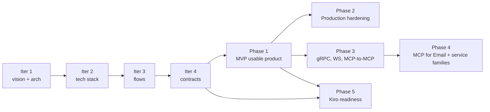

# Mintkey roadmap

## Where we are
**Iteration 1 of architecture is complete.** All six iteration‑1 proposals have been promoted to ADRs. Seven ADRs are now Accepted:

| ADR | Topic | Decision |
|---|---|---|
| [ADR‑0001](../01-architecture/adr/0001-record-architecture-decisions.md) | Record decisions | Nygard‑style ADRs in `docs/01-architecture/adr/` |
| [ADR‑0002](../01-architecture/adr/0002-product-name-mintkey.md) | Product name | **Mintkey** |
| [ADR‑0003](../01-architecture/adr/0003-credential-storage-strategy.md) | Credential storage | Pluggable Vault Adapter; **v1 = encrypted file** on mounted volume; v2 HashiCorp Vault; v3 SQL+KMS |
| [ADR‑0004](../01-architecture/adr/0004-egress-proxy-kong.md) | Egress proxy | **Kong DB‑less + Go plugin (go‑pdk) + Kong‑syncer** |
| [ADR‑0005](../01-architecture/adr/0005-admin-tech-stack.md) | Admin stack | **Python + FastAPI + Liquibase + Postgres 16; AdminJS for UI; Keycloak default IdP** |
| [ADR‑0006](../01-architecture/adr/0006-token-format-and-binding.md) | Token format | **JWS Ed25519 JWT + revocation channel**; default 10‑min TTL |
| [ADR‑0007](../01-architecture/adr/0007-proxy-deployment-topology.md) | Proxy topology | **Explicit forward proxy** + per‑service virtual‑host alias |

We are ready to enter **iteration 2** (per‑container tech‑stack ADRs that depend on the above), then iteration 3 (flows), then iteration 4 (contracts).

## North star
A self‑hostable broker that lets autonomous agents **discover** services, **acquire** scoped short‑lived credentials for them, and **call** them through a proxy that the real credentials never leave through — with operator‑grade observability and per‑request audit. (See [Product vision](02-product-vision.md).)

The shortest path to value is **Phase 1**: a `docker compose up` that operators can demo end‑to‑end. Everything else is downstream.

## Phase model

---

## Phase 0 — Architecture (current; finishing)

**Goal**: every container has a clear responsibility, a chosen technology, a defined interface, a quality‑attribute target, and a threat‑model entry.

| Iteration | Status | Output |
|---|---|---|
| **1.** High‑level vision + container view + quality attributes + threat model + initial ADRs | **DONE** | This commit. |
| **2.** Per‑container tech‑stack ADRs (MCP server stack, Broker stack, Vault Adapter stack, Kong‑syncer stack, change‑channel transport, observability detail) | NEXT | New ADRs in `docs/01-architecture/adr/`. |
| **3.** End‑to‑end behavior flows (Mermaid sequence diagrams; quality‑attribute checklists) | PLANNED | `docs/03-flows/F-*.md` per flow. |
| **4.** Wire‑level contracts (OpenAPI, MCP tool schemas, event schemas) | PLANNED | `docs/contracts/{rest,mcp,events}/*`. |

**Exit criteria**: any engineer (or any agentic tool) can pick up the architecture docs and start building Phase 1 features without re‑deciding.

---

## Phase 1 — MVP "Usable product"

**Goal**: `docker compose up` produces a working Mintkey end‑to‑end. An operator creates a service + credential + agent + permission. An agent does discovery → token request → brokered call → backend response. End‑to‑end OTel trace visible. All flows audited.

This is the user‑facing definition of "usable product".

### Containers in the Phase 1 compose

| # | Container | Image / source | Language | Notes |
|---|---|---|---|---|
| 1  | `postgres`              | `postgres:16`              | —      | Default DB engine ([ADR‑0005](../01-architecture/adr/0005-admin-tech-stack.md)) |
| 2  | `keycloak`              | `quay.io/keycloak/keycloak`| —      | Default OIDC IdP, on by default ([ADR‑0005](../01-architecture/adr/0005-admin-tech-stack.md)) |
| 3  | `liquibase` (one‑shot)  | `liquibase/liquibase`      | —      | Applies migrations before admin‑api starts |
| 4  | `seed-job` (one‑shot)   | `mintkey/seed`             | TBD    | Bootstraps admin operator + Keycloak realm |
| 5  | `mintkey/admin-api`     | built                      | Python | FastAPI, OpenAPI, identity, audit, broker‑proxy ([ADR‑0005](../01-architecture/adr/0005-admin-tech-stack.md)) |
| 6  | `mintkey/admin-ui`      | built                      | Node   | AdminJS ([ADR‑0005](../01-architecture/adr/0005-admin-tech-stack.md)) |
| 7  | `mintkey/mcp`           | built                      | TBD    | MCP server; language pinned in iteration 2 |
| 8  | `mintkey/broker`        | built                      | Go     | EdDSA JWT issuer ([ADR‑0006](../01-architecture/adr/0006-token-format-and-binding.md)) |
| 9  | `mintkey/vault-adapter` | built                      | Go     | File backend ([ADR‑0003](../01-architecture/adr/0003-credential-storage-strategy.md)) |
| 10 | `kong`                  | `kong:3-alpine`            | —      | DB‑less ([ADR‑0004](../01-architecture/adr/0004-egress-proxy-kong.md)) |
| 11 | `mintkey/proxy-plugin`  | built                      | Go     | go‑pdk ([ADR‑0004](../01-architecture/adr/0004-egress-proxy-kong.md)) |
| 12 | `mintkey/kong-syncer`   | built                      | Go     | Pushes declarative YAML to Kong ([ADR‑0004](../01-architecture/adr/0004-egress-proxy-kong.md)) |
| ~~13~~ | ~~`redis`~~        | *removed*                  | —      | Change channel runs on Postgres `LISTEN/NOTIFY` ([ADR‑0010](../01-architecture/adr/0010-change-channel-postgres-listen-notify.md)) — no separate broker container in Phase 1 |
| 14 | `demo-backend`          | built                      | any    | Stubbed REST API for end‑to‑end demo |
| 15 | `otel-collector`        | `otel/opentelemetry-collector` | — | OTLP receiver |
| 16 | `jaeger`                | `jaegertracing/all-in-one` | — | Traces |
| 17 | `prometheus`            | `prom/prometheus`          | — | Metrics |
| 18 | `grafana`               | `grafana/grafana`          | — | Dashboards |

### Phase 1 milestones (each is a working partial product)

> **Tenancy is baked into Phase 1 from milestone 1.0**, per [P‑007](../proposal/P-007-multi-tenancy.md). Every domain table carries `tenant_id`; Postgres RLS is enabled from the first migration; the seed job creates a `t_default` tenant; the JWT carries a `tnt` claim from the first issuance. The single‑tenant UX hides the tenant concept for the default deployment.

| # | Milestone | Quality attributes proven |
|---|---|---|
| 1.0  | **Foundation skeleton (multi‑tenant aware)** — all containers start; health checks pass; Liquibase migrations apply with `tenant_id` + RLS on every domain table; Keycloak realm provisioned; default tenant `t_default` seeded; OTel pipeline running; AdminJS connects | S‑TEST‑1 (90s e2e CI), S‑MT‑1 (RLS coverage) |
| 1.1  | **Operator login** — Keycloak default + internal fallback; bootstrap admin via seed; session cookies set | S‑AUD‑1 (login events) |
| 1.2  | **Service registration** — operator can register/list/edit services through AdminJS and FastAPI | S‑AUD‑1 |
| 1.3  | **Credential registration** — envelope encryption working; AdminJS routes sensitive ops to FastAPI; KEK loaded from keyfile | S‑SEC‑2 (file backend variant) |
| 1.4  | **Agent + permission** — operator creates an agent (gets Agent API Key once); grants permission | S‑SEC‑3, S‑AUD‑1 |
| 1.5  | **MCP discovery + token issuance** — agent connects via MCP; lists services it has permission for; requests JWT; receives Ed25519 token | S‑PERF‑2 (≤50ms p99 issuance) |
| 1.6  | **Brokered call end‑to‑end** — Kong + plugin validates JWT, fetches credential, injects, forwards; demo backend responds; trace visible in Jaeger | S‑PERF‑1 (≤10ms p50 added), S‑OBS‑1 (end‑to‑end trace) |
| 1.7  | **Audit log viewer** — AdminJS shows audit events; filter by agent, service, time | S‑AUD‑1 |
| 1.8  | **Credential rotation (zero‑downtime)** — operator rotates; change channel propagates; next call uses new value | S‑OPS‑2 (≤30s rotation) |
| 1.9  | **Agent revocation** — operator revokes; subsequent token requests denied; in‑flight tokens denied within 5s | S‑OPS‑1 (≤5s revoke) |
| 1.10 | **Observability dashboards** — Grafana pre‑baked dashboards: RED metrics, per‑service latency, token issuance volume, credential cache hit rate | S‑OBS‑1 |
| 1.11 | **Demo script + CI smoke test** — end‑to‑end script that exercises 1.1 through 1.9 in <90s | S‑TEST‑1 |
| 1.12 | **Multi‑tenant smoke test** — create a second tenant `t_acme`; verify cross‑tenant isolation (a tenant A operator cannot see tenant B's services; a tenant A JWT is denied at tenant B's services) | S‑MT‑1, S‑MT‑2 |

### Out of Phase 1 scope
- HashiCorp Vault backend (Phase 2)
- TLS termination (Phase 2)
- Kubernetes Helm chart (Phase 2)
- gRPC, WebSockets, MCP‑to‑MCP (Phase 3)
- MCP for email and other service families (Phase 4)
- Operator MFA, SAML alternatives (Phase 2)
- HA / replication (Phase 2)
- DB‑per‑tenant high‑isolation tier (Phase 2). Row‑level + RLS is in from Phase 1; the high‑isolation deployment switch comes later.
- Per‑tenant KEK (Phase 2). Default shared KEK in Phase 1.
- Per‑tenant external IdP federation (Phase 2). Single Keycloak realm in Phase 1.

### Phase 1 exit criteria
1. Every milestone above demonstrably passes in CI.
2. The end‑to‑end demo runs in under 90 seconds with no manual steps after `docker compose up`.
3. Every quality‑attribute scenario [S‑*‑*](../01-architecture/03-quality-attributes.md) listed against a milestone is exercised by at least one CI test.
4. The `KIRO.md` project conventions doc exists at the repo root (see [`07-kiro-readiness.md`](07-kiro-readiness.md)).
5. All Phase 1 containers have at least one Kiro spec under `docs/specs/<container>/` (requirements, design, tasks).
6. **Multi‑tenant smoke test passes**: a second tenant can be created in < 60 s; cross‑tenant data and token boundaries are enforced ([S‑MT‑1](../01-architecture/03-quality-attributes.md), [S‑MT‑2](../01-architecture/03-quality-attributes.md)).

---

## Phase 2 — Production hardening

**Goal**: Mintkey can run safely in production beyond a developer laptop.

### Deliverables
- **TLS** — terminate at Kong by default; document mTLS for high‑assurance backends.
- **Kubernetes Helm chart** — sketched in iteration 2, working in Phase 2.
- **HashiCorp Vault backend** — Vault Adapter v2 implementation per [ADR‑0003](../01-architecture/adr/0003-credential-storage-strategy.md).
- **Backup / restore** — procedures for Postgres + credentials volume; tested DR drill.
- **Operator MFA** — TOTP for the internal auth fallback.
- **SAML alternative IdP** — same Identity service surface; OIDC remains primary.
- **Production deployment guide** — under `docs/05-deployment/production.md` (created in Phase 2).
- **Compliance‑readiness notes** — audit retention, encryption‑at‑rest evidence, key rotation cadences, RBAC review process.
- **High availability** — multiple admin‑api replicas, multiple proxy plugin processes, Postgres replication notes.

### Phase 2 exit criteria
- The Helm chart deploys to a fresh kind/k3d cluster and the demo passes end‑to‑end.
- The HashiCorp Vault backend passes the same quality‑attribute test suite as the file backend.
- An operator can rotate the JWT signing key without agent‑visible failures.

---

## Phase 3 — Protocol and service‑type expansion

**Goal**: brokering for protocols beyond plain HTTP REST.

### Deliverables
- **gRPC service support** — Kong supports gRPC natively; the Mintkey plugin extends to inject auth in gRPC metadata; new auth scheme `grpc_metadata` in the Vault Adapter contract; `aud` semantics extended to the gRPC `:authority`.
- **WebSocket service support** — long‑lived connections through Kong; session‑bound JWT renewal at the protocol level; per‑message scrubbing where applicable.
- **Server‑Sent Events** — single‑connection streaming; treated as a long‑lived response.
- **MCP‑to‑MCP proxy** — register an upstream MCP server as a Service. Mintkey discovers its tools and re‑exposes them under our MCP. Tool calls are routed to the upstream MCP, with credentials injected at the MCP message layer.
  - Inbound: agent calls a tool exposed by Mintkey.
  - Lookup: Mintkey resolves "this tool belongs to upstream MCP server X".
  - Translate: Mintkey opens (or reuses) an MCP client connection to upstream X with X's credentials, calls the same tool, and proxies the response.
  - Audit: every MCP call records both the agent‑facing tool call and the upstream call.
- **Service catalog view** in AdminJS — all registered services and their tool surfaces, regardless of underlying protocol.

### Phase 3 exit criteria
- An agent can discover and call a gRPC service through Mintkey end‑to‑end.
- An agent can discover and call a tool that lives on an upstream MCP server, with upstream credentials never reaching the agent.

---

## Phase 4 — Service families ("MCP for X")

**Goal**: turnkey "MCP for X" patterns where Mintkey provides not just brokering but a normalized abstraction over multiple providers of the same kind.

### Deliverables
- **MCP for Email** — pluggable provider adapters: SendGrid, AWS SES, Postmark, Mailgun, plain SMTP. Normalized `send_email(to, subject, body, …)` MCP tool. Per‑service operator configuration: from‑address, allowed domains, templates, rate limits. The agent doesn't know which provider sends the email. *(This is the user's named far‑fetched goal.)*
- **MCP for SQL** (read‑only) — operator defines an allowlist of named queries with parameters. Agent calls `query(name, params)`. Pluggable backends: Postgres, MySQL, SQLite, BigQuery.
- **MCP for Object Storage** — `put_object`, `get_object`, signed URLs. Pluggable backends: S3, GCS, Azure Blob.
- **MCP for Calendar** — Google Calendar, Microsoft Graph; normalized `create_event`, `list_events`.
- **MCP for HTTP webhooks** — outbound notification delivery with retry, dead‑letter, signing.

Each service family ships with:
- A normalized MCP tool schema.
- One or more provider adapters.
- Operator configuration (provider choice, credential, policy).
- Pre‑built audit events for the family.

### Phase 4 exit criteria
- MCP for Email is operator‑provisionable in under 5 minutes against any of two or more providers.
- An agent calls `send_email` and an email is sent through the configured provider with zero agent knowledge of which provider.

---

## Phase 5 — Agentic development enablement (Kiro readiness)

**Goal**: Kiro can take a feature description and produce requirements, design, and tasks for this project; from those, generate code and tests that pass.

This is its own document — see [`07-kiro-readiness.md`](07-kiro-readiness.md) for the full checklist.

Phase 5 deliverables (summary):
- Per‑component Kiro spec set (requirements, design, tasks) for every container.
- Project conventions (`KIRO.md` at the repo root).
- Pattern library (`docs/patterns/`).
- Stub service library (`tests/stubs/`).
- Test fixture library (`tests/fixtures/`).
- Code style enforcement per language (linters in CI).
- Contract artifacts under `docs/contracts/` fully populated.

### Phase 5 exit criteria
- Kiro can be given a one‑line feature description (e.g., "add a new auth scheme: AWS SigV4") and produce a runnable plan.
- Kiro's first‑draft implementation passes the quality‑attribute scenarios it claims to satisfy.
- New contributors (human or agent) can ship their first PR within one day from a fresh clone.

---

## Tracking and gating

- Each phase has milestones tracked as GitHub issues / project board (when the repo goes live).
- **Quality attribute scenarios** ([`S-*-*`](../01-architecture/03-quality-attributes.md)) are the acceptance criteria; every milestone names which scenarios it must pass.
- ADR additions are gated by a recorded proposal under `docs/proposal/`.
- Threat‑model updates accompany every protocol or auth‑scheme expansion.

## Notes on speed
The user's stated goal is "as quickly as possible a usable product". To reach Phase 1 quickly:
- **Defer everything not in the Phase 1 milestone list.** Production hardening, gRPC, MCP‑to‑MCP, MCP for email — all Phase 2+.
- **Iteration 4 contracts before code.** OpenAPI, MCP tool schemas, event schemas — these unblock spec‑driven implementation in Iteration 5.
- **Spec‑driven from day one.** Every Phase 1 milestone is a Kiro spec; tests are derived from the quality‑attribute scenarios.
- **Demo backend first, real backends later.** The end‑to‑end happy path is what proves "usable". Real integrations (a CRM, an email provider) come after.

## What we are deliberately NOT doing in any phase
- **Multi‑tenant SaaS posture.** Single‑tenant self‑host is the product.
- **Replacing a general‑purpose secrets manager.** Mintkey is a credential broker for *agents*, not a secrets manager for *humans and CI*.
- **Building an agent runtime.** We broker; we do not run agents.
- **Acting as an inbound API gateway.** We are the agent's egress, not someone else's ingress.
- **Solving prompt injection in the agent.** We *contain* its blast radius; we do not prevent it.
