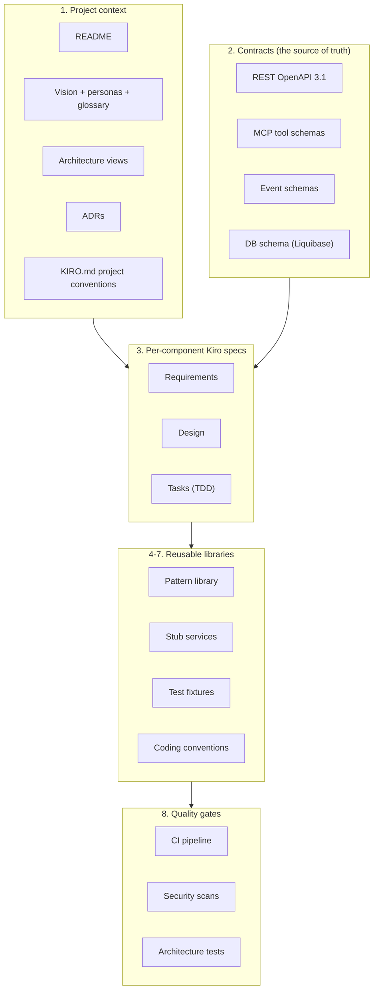

# Kiro readiness

> *What does Kiro need from us in order to take a feature description and produce correct **requirements**, **design**, and **tasks** — and then generate code and tests that pass?*

This is the checklist for **Phase 5** of the [roadmap](06-roadmap.md), but several items are useful before Phase 5 — they unblock Phase 1 development too. The items are ordered from "nice to have" to "needed for Kiro to function effectively"; the priority column flags the gating ones.

## What Kiro needs (at a glance)

---

## 1. Project context

| Item | Status | Where it lives |
|---|---|---|
| Top‑level README | ✅ | [`/README.md`](../../README.md) |
| Vision (problem, vision, personas, glossary, iteration plan, roadmap) | ✅ | [`/docs/architecture/00-vision/`](.) |
| Architecture views (system context, container view, quality attributes, threat model, *Views and Beyond*) | ✅ | [`/docs/architecture/01-architecture/`](../01-architecture/) |
| ADRs (20 accepted, latest ADR-0020 2026-05-15) | ✅ | [`/docs/architecture/01-architecture/adr/`](../01-architecture/adr/) |
| **`KIRO.md` project conventions** at the repo root | ✅ | `/KIRO.md` (EvidenceRef: `/KIRO.md` created 2026-05-19) |

`KIRO.md` is the single document Kiro reads first. It must contain:
- One‑paragraph product summary (lifted from the vision).
- Tech stack at a glance (Python + FastAPI; AdminJS; Go for security‑critical components; Postgres + Liquibase; Kong + Go plugin; Keycloak default).
- Directory map of the repo.
- "How to make a change" — the change → proposal → ADR → implementation pipeline.
- Coding conventions per language (link to the style guides).
- Test‑driven workflow expectations.
- "How to add an X" pointers (link to the pattern library).
- Audit chokepoint rule: every state‑change handler emits an audit event.

---

## 2. Contracts (the source of truth for code generation)

Kiro generates server stubs, client SDKs, test fixtures, and validation logic from these. They are the single source of truth.

| Contract | Status | Location | Owner |
|---|---|---|---|
| REST OpenAPI 3.1 | ✅ checked in; validated in CI Lint Contracts | [`/docs/architecture/contracts/rest/openapi.yaml`](../contracts/rest/) | Admin REST API + MCP server emit it |
| MCP tool schemas | ✅ checked in; validated in CI Lint Contracts | [`/docs/architecture/contracts/mcp/tools.yaml`](../contracts/mcp/) | MCP Server |
| Event schemas (audit + OTel attributes) | ✅ checked in; validated in CI Lint Contracts | [`/docs/architecture/contracts/events/`](../contracts/events/) | Audit Service |
| DB schema (Liquibase changelog) | ✅ 16 changelogs in `admin-api/db/changelog/` | `/admin-api/db/changelog/` | Admin REST API |
| JWT claim schema | ✅ in [ADR‑0006](../01-architecture/adr/0006-token-format-and-binding.md) | inline | Credential Broker |
| Vault Adapter gRPC IDL | ✅ `vault.proto` in `docs/architecture/contracts/vault-adapter/` | [`/docs/architecture/contracts/vault-adapter/`](../contracts/vault-adapter/) | Vault Adapter |

### Contract conventions
- **Schema‑first**: contracts are written before code.
- **Versioning**: every contract has an explicit `version` field; breaking changes require a new path/tool name and a deprecation window.
- **Stability tiers**: `experimental` → `stable` → `deprecated`. Stability is per surface, not per project.
- **Generated artefacts**: client SDKs and server stubs are generated from the contract; we do not hand‑maintain them.
- **Round‑trip check**: CI verifies that the running services emit OpenAPI matching the checked‑in contract.

---

## 3. Per‑component Kiro specs

For each container in [`02-container-view.md`](../01-architecture/02-container-view.md), Kiro needs a spec triple: **requirements**, **design**, **tasks**. Specs live under `.kiro/specs/mintkey-mvp/` (per the Kiro convention; see `.kiro/specs/mintkey-mvp/{requirements,design,tasks}.md`).

All Phase 1 containers are covered by the consolidated `.kiro/specs/mintkey-mvp/` triple. All 14 top-level milestones M1.0-M1.13 are checked in `tasks.md` (99 task lines marked [x] as of 2026-05-17; note this is checkbox state, not independent test verification). Per-component spec split is not currently used in this repo; the table below is retained as a reference for the planned split in Phase 5.

| Component | Requirements | Design | Tasks |
|---|---|---|---|
| Admin REST API (FastAPI) | ✅ (consolidated in `.kiro/specs/mintkey-mvp/`) | ✅ | ✅ |
| Admin UI (AdminJS) | ✅ | ✅ | ✅ |
| MCP Server | ✅ | ✅ | ✅ |
| Credential Broker | ✅ | ✅ | ✅ |
| Vault Adapter (file backend; v2 Vault; v3 SQL+KMS) | ✅ | ✅ | ✅ |
| Egress Proxy plugin | ✅ | ✅ | ✅ |
| Kong‑syncer | ✅ | ✅ | ✅ |
| Audit Service (or as a section of Admin API) | ✅ | ✅ | ✅ |
| Seed job | ✅ | ✅ | ✅ |

### Spec template (Kiro pattern)
**`docs/specs/<component>/requirements.md`** — illustrative template; the actual layout in this repo is `.kiro/specs/mintkey-mvp/{requirements,design,tasks}.md`.
- One‑line goal.
- User stories ("As an X, I want Y, so that Z").
- Functional requirements (numbered).
- Non‑functional requirements (mapped to quality‑attribute scenarios `S-*-*`).
- Out of scope.
- Acceptance criteria — each functional requirement maps to at least one test.

**`docs/specs/<component>/design.md`** — illustrative template.
- Architecture context (which container, which interfaces).
- Internal module structure.
- Data model (with references to the DB schema).
- Public interface (with references to contracts).
- Internal dependencies (Vault Adapter, Identity, Audit, Change channel, …).
- ADRs invoked.
- Failure modes and how the component handles them.

**`docs/specs/<component>/tasks.md`** — illustrative template.
- Sequenced TDD tasks: `[ ] Test X`, `[ ] Implement X`, `[ ] Refactor`, `[ ] Integration test Y`.
- Estimated complexity per task (S/M/L).
- Cross‑task dependencies marked.

The smallest Phase 5 unit is **one component spec triple**. The first one to write is the **Vault Adapter** because it has the clearest interface and the smallest scope; specs for the others can follow the same template. The current consolidated spec under `.kiro/specs/mintkey-mvp/` covers Phase 1; per-component splits are a Phase 5 refinement task.

---

## 4. Pattern library

"How to do X" reference for common operations. One page each. Aspirational target location: `docs/patterns/`. As of 2026-05-17 this directory does not exist; the pattern library has not been started.

| Pattern | Purpose | Status |
|---|---|---|
| `add-rest-endpoint.md` | Add a new endpoint to the Admin REST API (FastAPI route → Pydantic models → service call → audit emission → tests) | ⏳ |
| `add-mcp-tool.md` | Add a new tool to the MCP server (schema → handler → tests) | ⏳ |
| `add-audit-event.md` | Add a new audit event type (schema → emission → consumers) | ⏳ |
| `add-auth-scheme.md` | Add a new backend auth scheme to the Vault Adapter + Kong plugin (per [S‑MOD‑1](../01-architecture/03-quality-attributes.md)) | ⏳ |
| `add-service-validation.md` | Add a service registration validation rule | ⏳ |
| `add-liquibase-changelog.md` | Add a DB migration | ⏳ |
| `add-kong-plugin-phase.md` | Add behavior in a new Kong plugin phase hook | ⏳ |
| `add-adminjs-resource.md` | Add a new resource to AdminJS | ⏳ |
| `add-otel-span.md` | Add an OTel span (with the attribute allowlist) | ⏳ |
| `add-vault-backend.md` | Add a new Vault Adapter backend (e.g., v2 HashiCorp Vault) | ⏳ |
| `add-mcp-tool-family.md` | Add an "MCP for X" family (e.g., MCP for SQL) | ⏳ Phase 4 |

Each pattern has six sections:
1. **Goal** — one sentence.
2. **Where the change lives** — file paths with relative imports.
3. **Step‑by‑step** — TDD‑ordered.
4. **Tests to write** — with sample test code.
5. **Common pitfalls** — what we've already learned.
6. **References** — ADRs, contracts.

---

## 5. Stub service library

For development and CI, Kiro generates code that should be testable without external services. Stubs go under `tests/stubs/`.

| Stub | Purpose | Status |
|---|---|---|
| `vault-adapter` | In‑memory Vault Adapter; deterministic outputs; supports rotation | ⏳ |
| `kong` | HTTP server that records requests; returns canned responses | ⏳ |
| `backend-rest` | Echo or canned responses; OpenAPI‑example‑driven | ⏳ |
| `backend-grpc` | gRPC server; echo or canned responses (Phase 3) | ⏳ |
| `identity` | Predefined operators, agents, permissions | ⏳ |
| `oidc` | Mock Keycloak; canned ID tokens with configurable claims | ⏳ |
| `change-channel` | In‑memory pub/sub | ⏳ |
| `otel-collector` | Records span attributes for assertion | ⏳ |
| `email-provider` | Mock email provider for MCP for Email (Phase 4) | ⏳ Phase 4 |

Stubs follow a uniform pattern:
- Implements the same interface as the real service.
- Configuration via env vars or a YAML file.
- Records all inbound calls so tests can assert on them.
- "Time machine" mode: clock can be advanced for testing TTLs and rotations.

---

## 6. Test fixtures

Loadable fixtures Kiro can use to set up scenarios. Live under `tests/fixtures/`.

| Fixture | Contents | Status |
|---|---|---|
| `services.yaml` | Sample services: 1 REST, 1 gRPC (Phase 3), 1 WebSocket (Phase 3) | ⏳ |
| `credentials.yaml` | Sample credentials: API key, OAuth2, basic, OIDC client | ⏳ |
| `operators.yaml` | Sample operators: Admin, Auditor, AgentOwner | ⏳ |
| `agents.yaml` | Sample agents with permissions | ⏳ |
| `audit-events.yaml` | One sample event per `event_type` | ⏳ |
| `keycloak-realm.json` | Default Keycloak realm export | ⏳ Phase 1 |

Fixtures are versioned with the contracts. A breaking contract change requires a fixture update.

---

## 7. Coding conventions

| Language / area | Tool / config | Status |
|---|---|---|
| Python | `ruff` config; `mypy` strict; line length 100; pep8 imports | ✅ ruff + mypy --strict configured and green on admin-api, mintkey-models, mcp-server (last verified 2026-05-16 by `team/remediation/2026-05-16-python-code-quality/99-report.md`) |
| Go | `gofmt` + `golangci-lint` config; `errcheck`, `goimports`, `revive` | ✅ golangci-lint v8 + go vet configured and green in CI Lint Go (last verified on tag v0.1.0-prealpha 2026-05-17) |
| AdminJS / TypeScript | `eslint` + `prettier` config; strict TS | ⏳ |
| SQL | `sqlfluff` config (Postgres dialect) | ⏳ |
| Liquibase | Changelog naming and structure conventions | ⏳ |
| Resource ID style | ULID (`agent_…`, `svc_…`, `cred_…`, `perm_…`); see glossary | ✅ implicit, document in Phase 5 |
| Error envelope | RFC 7807 Problem Details for the REST API | ⏳ Iteration 4 contract |
| Audit emission idiom | Single `audit.emit(event_type, actor, target, before, after)` helper | ⏳ |

---

## 8. Quality gates

| Gate | Tool / approach | Status |
|---|---|---|
| Per‑language linter in CI | ruff, golangci-lint, eslint, sqlfluff | ✅ Lint Python + Lint Go configured and green (last verified on tag v0.1.0-prealpha 2026-05-17) |
| Per‑language type checker | mypy, Go's compiler, tsc | ✅ mypy --strict green for Python services; Go compiler enforced via CI Lint Go (last verified 2026-05-17) |
| Unit tests | pytest, go test, jest | ✅ Python Unit Tests + Go Unit Tests configured; 244 passed, 2 skipped (last verified 2026-05-12 by WS-8) |
| Integration tests | testcontainers (Postgres, Kong, Keycloak) | ✅ Integration Tests job configured in CI; runs on main/PRs to main (last verified 2026-05-17 via PR #46 integration-tests-timeout fix) |
| Security scan | `govulncheck`, `pip-audit`, `npm audit`, container image scan | ✅ CodeQL (`.github/workflows/codeql.yml`) + container scan (`.github/workflows/container-scan.yml`) + dependency review configured |
| License compatibility | FOSSA or scancode‑toolkit (manual policy) | ⏳ |
| Architecture test | Custom: assert no module bypasses the audit chokepoint; assert no plaintext credential outside Vault Adapter or proxy plugin request scope | ✅ Architecture Tests job configured with 6 custom checks; 17 passing (last verified 2026-05-12 by WS-8) |
| Contract round‑trip | Diff between OpenAPI emitted by FastAPI and `docs/architecture/contracts/rest/openapi.yaml` | ✅ OpenAPI parity gate (T-1.11.5) in Schema Integrity Gates CI job (last verified on tag v0.1.0-prealpha 2026-05-17) |
| Mermaid lint in docs | `mermaid-cli` validates fenced blocks (CI) | ⏳ |

---

## 9. Kiro‑specific scaffolding

| Item | Status |
|---|---|
| Kiro project pointer (`.kiro/project.yaml` or equivalent) | ✅ `.kiro/setup-state.json` + `.kiro/settings/mcp.json` present; `.kiro/` project root established |
| Kiro template: "add a new feature" prompt | ✅ `.kiro/skills/` contains named skill templates (e.g. `adr-from-decision`, `adversarial-review`, `architecture-advisor`); `.kiro/steering/` contains product/tech/structure/security steering docs |
| Kiro template: "fix a bug" prompt | ✅ `.kiro/skills/` skill templates present (see `assumption-validate`, `decision-log-append`, etc.) |
| Documentation of the spec‑driven workflow | ✅ `.kiro/steering/STEERING-PROTOCOL.md` + `.kiro/specs/mintkey-mvp/{requirements,design,tasks}.md` document the workflow |

The "add a new feature" template should accept inputs like:
- Feature description (one or two sentences).
- Affected components (list).
- Quality attributes that must hold (list of `S-*-*` references).
- Acceptance criteria (one or more sentences).

…and produce:
- A draft proposal under `docs/proposal/P-NNN-…md` (if a decision is needed; note: `docs/proposal/` does not yet exist in this repo as of 2026-05-17).
- A draft Kiro spec triple under `.kiro/specs/mintkey-mvp/` (current repo layout) or `docs/specs/<component>/` (planned Phase 5 split).
- Updated contracts under `docs/architecture/contracts/`.
- A draft PR description.

---

## How to use this document
1. Pick an item from a table above.
2. Open the relevant directory (or create it).
3. Mark the checkbox `✅` when the deliverable is in place.
4. When all items in a phase are checked, that phase's exit criterion is met.

---

## Status (as of 2026-05-17)

| Area | Status |
|---|---|
| Project context | ✅ complete; `KIRO.md` created at repo root (EvidenceRef: `/KIRO.md`, 2026-05-19) |
| ADRs | ✅ 20 accepted (ADR-0001..ADR-0020; ADR-0018 accepted 2026-05-11; ADR-0020 accepted 2026-05-15) |
| Contracts | 🟢 checked in: REST OpenAPI 3.1, MCP tool schemas, audit+OTel event schemas, Vault Adapter gRPC IDL (`vault.proto`), 16 Liquibase changelogs — all validated in CI Lint Contracts (last verified on tag v0.1.0-prealpha 2026-05-17) |
| Per‑component specs | ✅ consolidated under `.kiro/specs/mintkey-mvp/{requirements,design,tasks}.md`; M1.0-M1.13 all checked in `tasks.md` (99 task lines marked [x] as of 2026-05-17; checkbox state only, not independent test verification) |
| Pattern library | 🟢 partial — 3 of 11 patterns documented (`add-rest-endpoint`, `add-mcp-tool`, `add-audit-event`); EvidenceRef: `docs/patterns/*.md` (created 2026-05-19) |
| Stub services | 🟢 plan documented — 3 priority stubs planned (Vault Adapter, Proxy Recorder, OIDC Mock); EvidenceRef: `tests/stubs/README.md` (created 2026-05-19) |
| Test fixtures | ❌ not started; `tests/fixtures/` does not exist (verified 2026-05-17) |
| Coding conventions | 🟢 ruff + mypy --strict configured and green for Python (admin-api, mintkey-models, mcp-server; last verified 2026-05-16); golangci-lint v8 + go vet configured and green (last verified on tag v0.1.0-prealpha 2026-05-17); TypeScript/SQL conventions ⏳ |
| Quality gates | 🟢 9 CI jobs configured in `.github/workflows/ci.yml` (Lint Python, Lint Go, Lint Contracts, Python Unit Tests, Go Unit Tests, Architecture Tests, Schema Integrity Gates, Acceptance Tests, Integration Tests) + CodeQL + container scan + OpenSSF Scorecard + dependency review + Playwright; all 13 CI checks passing on tag v0.1.0-prealpha (last verified 2026-05-17) |
| Kiro scaffolding | ✅ `.kiro/` project root established; `.kiro/specs/mintkey-mvp/` triple present; `.kiro/steering/` (product/tech/structure/security docs) present; `.kiro/skills/` templates present |

## Fastest path to "Kiro can develop new features"

*Original north-star sequencing (preserved for reference):*

1. **Finish iteration 4 contracts** (the schemas) — this unblocks every code‑generation step.
2. **Write the Vault Adapter spec** as the first per‑component Kiro spec — it's the smallest container with the clearest interface.
3. **Write the top 3 pattern library entries** — `add-rest-endpoint`, `add-mcp-tool`, `add-audit-event` — these cover most CRUD work.
4. **Write the stub services** for Vault Adapter, Kong, and OIDC — these unblock CI for the rest.
5. **Write `KIRO.md`** at the repo root — make Kiro readable.
6. From this point, **Kiro can scaffold the rest** (other component specs, other patterns, other stubs).

### Status as of 2026-05-17 (tag v0.1.0-prealpha)

| Step | Status |
|---|---|
| 1. Iteration 4 contracts | ✅ Done — REST OpenAPI, MCP tools, event schemas, Vault Adapter IDL all checked in and CI-validated |
| 2. Vault Adapter spec (per-component) | ✅ Partially done — covered by consolidated `.kiro/specs/mintkey-mvp/`; per-component split deferred to Phase 5 |
| 3. Top 3 pattern library entries | ✅ Done — `docs/patterns/add-rest-endpoint.md`, `add-mcp-tool.md`, `add-audit-event.md` created (EvidenceRef: `docs/patterns/*.md`, 2026-05-19) |
| 4. Stub services | 🟢 Plan documented — 3 priority stubs planned in `tests/stubs/README.md` (EvidenceRef: `tests/stubs/README.md`, 2026-05-19) |
| 5. Write `KIRO.md` | ✅ Done — `KIRO.md` created at repo root (EvidenceRef: `/KIRO.md`, 2026-05-19) |
| 6. Kiro scaffolds the rest | 🔄 Unblocked — KIRO.md, top-3 patterns, and stubs plan all in place (2026-05-19); remaining patterns + full stub implementations are Phase 5 work |
