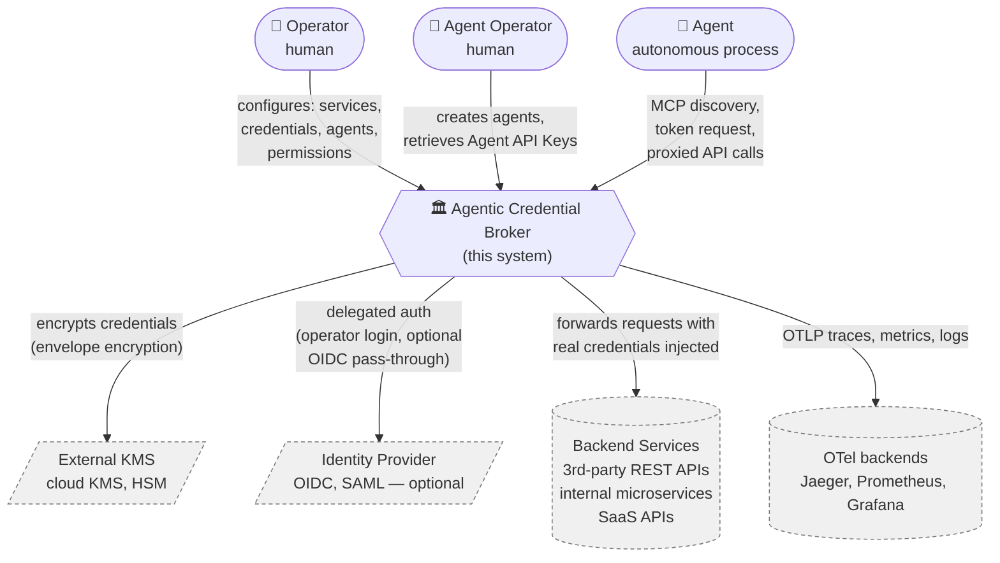

# System context (C4 Level 1)

A black‑box view of the system in its environment: who interacts with it, and which external systems it depends on.

## Diagram

## External actors

| Actor              | Type    | What they do |
|--------------------|---------|--------------|
| **Operator**       | human   | Logs into the Admin Console. Registers services and credentials. Manages agents and permissions. Investigates audit. |
| **Agent Operator** | human   | Logs into the Admin Console with restricted scope. Creates agents, retrieves Agent API Keys, sets up integrations on behalf of agents they own. |
| **Agent**          | machine | Authenticates with an Agent API Key. Uses MCP to discover services. Requests a JWT. Calls backend services through the Egress Proxy. |

## External systems

| System                 | Relationship                                                                                          | Why it's external |
|------------------------|-------------------------------------------------------------------------------------------------------|-------------------|
| **Backend Services**   | We forward authenticated requests to them on the agent's behalf.                                       | They are the very thing we broker access to. |
| **External KMS**       | Holds the KEK; performs encrypt/decrypt of DEKs at the security boundary.                              | We refuse to be our own root of trust for encryption. |
| **Identity Provider**  | (Optional) federates Operator login. (Optional) sources OIDC pass‑through credentials for Services.    | Operators already have an IdP; reusing it is table stakes. |
| **OTel backends**      | Receive OTLP traces/metrics/logs from us.                                                              | Standardized telemetry — we emit; others store/visualize. |

## Implications for the architecture
- **Three distinct trust zones**: Operator (high trust, attributed), Agent (low trust, contained), Backend (we authenticate to it as the Service's intended client).
- **The system never trusts the Agent's request body to identify which credential to inject** — the credential mapping is anchored to the JWT we minted ourselves.
- **The system has two production failure modes**:
  - Control plane down → no new tokens, in‑flight tokens still work until expiry, agents degrade gracefully.
  - Data plane (proxy) down → agents cannot reach backends.

  → The control plane and data plane therefore have different availability targets (see [`03-quality-attributes.md`](03-quality-attributes.md)).

## Open questions
- Do we treat *internal* services (same network) and *third‑party* services (different network) identically at this level, or model them as two distinct external systems? *Recommendation: identical at L1; the data plane may route differently — that belongs in deployment view (iteration 2).*
- Is there a use case for a non‑MCP agent (REST‑only) on day 1? *Recommendation: yes — MCP wraps the same REST surface; revisit in iteration 4 contracts.*
