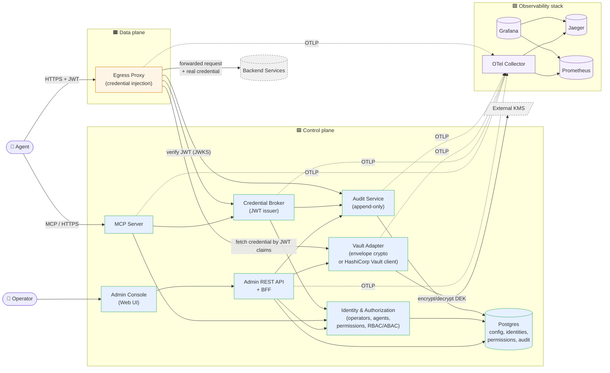

# Container view (C4 Level 2)

The major runtime containers (deployable units), their responsibilities, and the principal interactions between them.

## Architectural style: two‑plane separation

- **Control plane** (low‑traffic, high‑trust): operator‑facing config, identity, permissions, broker, vault adapter, audit. Scales by data volume.
- **Data plane** (high‑traffic, latency‑sensitive): the Egress Proxy. Stateless, horizontally scalable, hot path for every brokered API call.

This separation lets us:
- Apply different SLOs (control plane 99.5% / data plane 99.9%).
- Deploy the data plane closer to backends (latency).
- Restart the control plane during business hours without breaking in‑flight tokens.

## Diagram

## Containers

### Control plane

#### C1. Admin Console (Web UI)
- **Responsibility**: render screens for service registration, credential management, agent management, permission grants, audit viewing.
- **Talks to**: Admin REST API only.
- **Avoids**: any direct DB or vault access.
- **Quality drivers**: minimalism (this is *not* a CRM); fast review of audit events.

#### C2. Admin REST API + BFF
- **Responsibility**: HTTP surface for the Admin Console; orchestrates Identity, Vault Adapter, Audit, and DB. Exposes both UI‑specific (BFF) and machine‑friendly (REST) endpoints.
- **Talks to**: Identity, Vault Adapter, Audit, DB.
- **Authn**: operator session (cookie or short‑lived bearer); API tokens for machine‑friendly use.
- **Authz**: RBAC; emits audit events for every state change.

#### C3. Identity & Authorization
- **Responsibility**: source of truth for `Operator`, `Agent`, `Permission Grant`. Verifies Operator sessions and Agent API Keys (hash compared). Enforces RBAC on operators and ABAC on agents (per service+action).
- **Talks to**: DB.
- **Quality drivers**: revoke‑in‑seconds — an agent revocation must propagate to MCP and Broker within a small bounded delay.

#### C4. MCP Server
- **Responsibility**: speaks the Model Context Protocol to agents. Exposes discovery (`list_services`, `describe_service`, `get_openapi`) and token‑request (`request_token`) tools. Authenticates the agent via Agent API Key.
- **Talks to**: Identity (authn + permission read), Credential Broker (delegate `request_token`), DB (read service + OpenAPI metadata).
- **Quality drivers**: stable tool surface (changes here ripple to every agent).

#### C5. Credential Broker (JWT issuer)
- **Responsibility**: mint short‑lived, scope‑bound, audience‑bound JWTs. Holds the signing private key. Publishes the public key (JWKS) for the Egress Proxy.
- **Talks to**: Identity (verify Agent + Permission), Audit (record issuance).
- **Tokens**: signed JWS over claims `{sub: agent_id, aud: service_id, scope: action, jti, iat, exp, cnf?}`. Format and binding pinned in [`P-003`](../proposal/P-003-token-format-and-binding.md).
- **Quality drivers**: signing key protection; clock correctness; revocation propagation.

#### C6. Vault Adapter
- **Responsibility**: encapsulates "store and fetch a credential safely". Provides a uniform `put/get/rotate` interface with a pluggable backend.
- **Backend options** (per [ADR‑0003](adr/0003-credential-storage-strategy.md)):
  - **v1 — encrypted file on an externally mounted volume.** Per‑credential AES‑256‑GCM envelope; KEK loaded at startup from a keyfile (preferred) or env var. No external KMS or Vault required.
  - **v2 — HashiCorp Vault.** Vault as the credential store, or Vault Transit engine to wrap our DEKs.
  - **v3 — SQL + envelope encryption against an external KMS.** Ciphertext in Postgres; KEK in cloud KMS or HSM.
- **Talks to**: an external mounted volume (v1) / HashiCorp Vault (v2) / KMS + DB (v3); called by the Admin API and the Egress Proxy.
- **Quality drivers**: the credential is decrypted only inside this component and is consumed only inside the proxy hot path. Envelope model is identical across all backends — only the source of the KEK and the storage of ciphertext change.

#### C7. Audit Service
- **Responsibility**: append‑only event sink. Records: credential CRUD, token issuance, token use (proxy hit + outcome), permission grant/revoke, KEK rotation, login.
- **Storage**: append‑only table in Postgres (with optional hash chain).
- **Quality drivers**: tamper evidence; queryability for the operator UI.

#### C8. Database (Postgres)
- **Responsibility**: durable store for configuration, identities, permissions, and audit. (Vault may share or have its own — see P‑002.)
- **Quality drivers**: transactional integrity for permission grants; retention policy for audit.

### Data plane

#### D1. Egress Proxy
- **Responsibility**: terminate the agent's HTTPS request, validate the JWT against the broker's JWKS, look up the Service the JWT is bound to, retrieve the Credential via the Vault Adapter, mutate the outbound request to inject the credential per the Service's auth scheme, forward the request to the backend, stream the response back, scrub any echo of the credential from the response.
- **Statelessness**: holds no per‑agent state; can be horizontally scaled.
- **Quality drivers**: low p99 latency overhead; resilient to backend faults; fail‑closed on JWT validation; never logs the injected credential.
- **Implementation**: per [ADR‑0004](adr/0004-egress-proxy-kong.md) the proxy is realized as **Kong Gateway (DB‑less)** + a custom **Go plugin via go‑pdk** for credential injection, plus a small **Kong‑syncer** (Go) in the control plane that pushes declarative YAML to Kong's `/config` endpoint on operator events. Envoy + ext_authz is the documented upgrade path.

### Observability stack (commodity, but in scope)

- **OTel Collector** receives OTLP from every container; fans out to Jaeger (traces), Prometheus (metrics), and a log sink.
- **Jaeger / Prometheus / Grafana** — traces, metrics, dashboards. Pre‑baked dashboards ship with the repo.

## Why these boundaries

| Boundary                                  | Why it exists                                                                                    |
|-------------------------------------------|---------------------------------------------------------------------------------------------------|
| MCP Server vs. Admin REST API             | Different audiences (Agents vs. Operators), different authn, different evolution cadence.        |
| Credential Broker vs. MCP Server          | Broker holds the signing key — narrow attack surface, narrow upgrade scope.                      |
| Vault Adapter vs. its backend             | Lets us swap HashiCorp Vault for SQL+KMS (or vice versa) without touching anything else.         |
| Egress Proxy vs. control plane            | Different SLOs, different scaling axis, different deploy cadence.                                |
| Audit as its own component                | Forces every state change to flow through one auditing chokepoint; simplifies tamper evidence.   |

## Notable absences (deliberate YAGNI)
- No separate "Discovery service". Discovery is a thin read‑side of the MCP Server backed by Identity + the service catalog tables in Postgres. Splitting it out is a YAGNI we will not do until we have evidence it matters.
- No internal message bus. The revocation channel ([P‑003](../proposal/P-003-token-format-and-binding.md)) may introduce one, but otherwise components communicate via direct calls.

## Open questions
- Should the MCP Server and the Admin REST API share a process for the MVP (single binary), or be deployed separately? *Recommendation: separate processes from day one — same repo, two binaries — to keep authn surfaces from co‑mingling.*
- Should the Egress Proxy front *all* outbound traffic from the agent's network namespace (transparent proxy) or only requests the agent explicitly addresses to it? *Recommendation: explicit; transparent intercept is a deployment‑environment concern, not an architecture concern.* (See [P‑004](../proposal/P-004-proxy-deployment-topology.md).)
- Where does OAuth2 token refresh happen — Vault Adapter or a dedicated Token Manager? *Tracked in P‑002.*
