# Quality attributes

We document quality attributes as **scenarios** in the SEI ADD format:

> *Source* of stimulus → *Stimulus* → *Environment* → *Artifact* → *Response* → *Response measure*

Each scenario is testable: there's a measurable response measure that becomes either an SLO or a test assertion.

## Utility tree (priorities, top of tree)

```mermaid
flowchart TB
    root["Utility:<br/>safe, observable, useful<br/>credential brokering"]
    sec["Security &<br/>Confidentiality"]
    aud["Auditability"]
    perf["Latency overhead<br/>(proxy hot path)"]
    ops["Operability<br/>(revoke, rotate, deploy)"]
    obs["Observability"]
    mod["Modifiability"]
    avail["Availability<br/>(data plane)"]
    test["Testability"]

    root --> sec
    root --> aud
    root --> perf
    root --> ops
    root --> obs
    root --> mod
    root --> avail
    root --> test

    sec --> sec1["S-SEC-1<br/>agent never holds<br/>real credential"]
    sec --> sec2["S-SEC-2<br/>credentials at rest<br/>encrypted (KMS-rooted)"]
    sec --> sec3["S-SEC-3<br/>stolen API key<br/>has bounded blast radius"]
    aud --> aud1["S-AUD-1<br/>every issuance & use<br/>is logged"]
    perf --> perf1["S-PERF-1<br/>proxy p50 ≤ 10 ms<br/>added latency"]
    perf --> perf2["S-PERF-2<br/>token issuance<br/>p99 ≤ 50 ms"]
    ops --> ops1["S-OPS-1<br/>revoke ≤ 5 s"]
    ops --> ops2["S-OPS-2<br/>rotate ≤ 30 s,<br/>zero failure"]
    obs --> obs1["S-OBS-1<br/>end-to-end trace<br/>per request"]
    mod --> mod1["S-MOD-1<br/>add auth scheme<br/>≤ 3 file change"]
    avail --> avail1["S-AVAIL-1<br/>control plane outage<br/>doesn't break in-flight"]
    test --> test1["S-TEST-1<br/>full e2e in CI<br/>≤ 90 s"]

    classDef pri fill:#e6f0ff,stroke:#3a6;
    class sec,aud,perf pri;
```

## Scenarios

### S‑SEC‑1 — The agent never holds a usable backend credential
- **Source**: a malicious actor who has fully compromised an agent process.
- **Stimulus**: agent dumps memory, prompt context, environment, request bodies, and response bodies to an external endpoint.
- **Environment**: normal operation.
- **Artifact**: the agent process and any data it can observe.
- **Response**: the dumped material contains *no* string from which the backend credential can be reconstructed.
- **Response measure**: code‑level invariant, asserted by integration test — in any successful brokered request, the original Credential is never serialized into a response visible to the agent and is never present in any log emitted by any container the agent can reach.

### S‑SEC‑2 — Credentials at rest are encrypted; root of trust depends on backend
- **Source**: an attacker with read access to the credential storage substrate (file on disk, Vault contents, or DB rows depending on backend).
- **Stimulus**: read of the credentials substrate.
- **Environment**: per backend:
  - File backend (v1): attacker has filesystem read but **not** the KEK source (keyfile or env).
  - HashiCorp Vault backend (v2): attacker has read of any data Mintkey wrote to Vault but **not** Vault unseal/auth.
  - SQL+KMS backend (v3): KMS unavailable to the attacker.
- **Artifact**: the credential substrate (file / Vault / DB).
- **Response**: substrate reveals only ciphertext.
- **Response measure (backend‑conditional, per [ADR‑0003](adr/0003-credential-storage-strategy.md))**:
  - **File backend (v1)**: pen test against an offline filesystem dump (without the KEK source) yields no plaintext credentials. Note: this backend's KEK lives on the same host, so co‑location of substrate + KEK *is* a defeat — and is a documented limitation, not a guaranteed property. Rotation of the KEK re‑wraps all DEKs in place, no full re‑encryption.
  - **HashiCorp Vault backend (v2)**: same as v1 plus the KEK is in Vault Transit, not on the host filesystem.
  - **SQL+KMS backend (v3)**: pen test against an offline DB dump yields no plaintext credentials; KEK is not derivable from the database alone; rotation of the KEK does not require re‑encrypting the entire credentials table (only DEKs).

The file backend therefore satisfies *confidentiality at rest* but **does not** satisfy *KMS‑rooted root‑of‑trust*. Operators in regulated environments must use v2 or v3. The admin console and readiness probes surface a warning when a non‑KMS‑rooted backend is configured.

### S‑SEC‑3 — Stolen Agent API Key has bounded blast radius
- **Source**: an attacker exfiltrates an Agent API Key.
- **Stimulus**: attacker uses the key to request and use brokered tokens.
- **Environment**: agent has not yet been revoked.
- **Artifact**: the Identity service and the Egress Proxy.
- **Response**: attacker can only call the Services the agent was granted, only for the Actions granted, only at the rate limit configured per agent. No lateral movement.
- **Response measure**: 0 unauthorized service calls succeed in fuzzing tests; revoke‑to‑deny propagates within `≤ 5 s`.

### S‑AUD‑1 — Every credential issuance and use is logged
- **Source**: an Auditor.
- **Stimulus**: query "show me everything agent X did between 09:00 and 10:00".
- **Environment**: 24h after the events.
- **Artifact**: the Audit Service.
- **Response**: a complete, ordered list of token issuances and proxy hits with timestamps, target services, latencies, outcomes, and request correlation IDs.
- **Response measure**: 100% coverage in integration tests; end‑to‑end query returns within `≤ 2 s` for any 1h window of a single agent.

### S‑PERF‑1 — Proxy latency overhead is bounded
- **Source**: a backend service whose own p50 is 80 ms.
- **Stimulus**: agent makes a brokered call.
- **Environment**: proxy and broker healthy; vault adapter cache warm.
- **Artifact**: Egress Proxy.
- **Response**: the request is forwarded with real credential injected.
- **Response measure**: p50 added latency `≤ 10 ms`; p99 added latency `≤ 30 ms`; measured under 100 RPS sustained per proxy instance.

### S‑PERF‑2 — Token issuance is fast
- **Source**: agent.
- **Stimulus**: `request_token(service, action)` call.
- **Environment**: identity and broker healthy.
- **Artifact**: Credential Broker.
- **Response**: signed JWT returned.
- **Response measure**: p99 ≤ 50 ms at 100 issuances/sec.

### S‑OPS‑1 — Operator can revoke an agent in seconds
- **Source**: Operator presses "Revoke" in Admin Console.
- **Stimulus**: revocation event.
- **Environment**: agent currently has a valid (un‑expired) JWT.
- **Artifact**: Identity, Broker, Egress Proxy.
- **Response**: subsequent token requests fail; proxy denies subsequent requests bearing the revoked agent's tokens (regardless of remaining JWT TTL).
- **Response measure**: end‑to‑end deny within `≤ 5 s` of revoke click. (Implementation note: this is why the Proxy must check liveness, not just JWT expiry.)

### S‑OPS‑2 — Operator can rotate a backend credential without agent changes
- **Source**: Operator updates the credential for a Service.
- **Stimulus**: Vault Adapter receives a new value for the same `(service, environment)` key.
- **Environment**: agents are actively making calls.
- **Artifact**: Vault Adapter, Egress Proxy.
- **Response**: subsequent proxy hits use the new value.
- **Response measure**: 100% of proxy hits within `≤ 30 s` after rotation use the new credential; zero failures attributable to the rotation in synthetic load.

### S‑OBS‑1 — One agent request can be traced end‑to‑end
- **Source**: SRE investigating "agent X said this call was slow".
- **Stimulus**: open Jaeger, search by request ID.
- **Environment**: trace within OTel retention window.
- **Artifact**: OTel pipeline.
- **Response**: a single trace contains spans for: MCP discovery (if applicable), token issuance, proxy receive, vault decrypt, backend call, proxy respond.
- **Response measure**: ≥ 95% of proxy hits in steady state have a complete end‑to‑end trace; trace lookup by correlation ID returns within ≤ 3 s.

### S‑MOD‑1 — Adding a new backend auth scheme is small and local
- **Source**: developer adds support for a new auth scheme (e.g., AWS SigV4).
- **Stimulus**: PR.
- **Environment**: existing schemes (API key, OAuth2, OIDC, basic) work.
- **Artifact**: Egress Proxy + Vault Adapter.
- **Response**: new scheme integrated.
- **Response measure**: change touches ≤ 3 files in the Proxy and ≤ 2 in the Vault Adapter; no contract changes for existing schemes.

### S‑AVAIL‑1 — Control plane downtime does not stop in‑flight agent work
- **Source**: control plane is taken down for upgrade.
- **Stimulus**: control plane unreachable for ≤ 5 min.
- **Environment**: agents have un‑expired JWTs.
- **Artifact**: Egress Proxy.
- **Response**: agents continue to call backends successfully via the proxy until JWT expiry.
- **Response measure**: 0 agent‑visible failures attributable to control plane outage if all agents have ≥ 30 s remaining on their JWTs.

### S‑MT‑1 — Strict tenant isolation
- **Source**: a malicious operator or a coding bug in tenant A.
- **Stimulus**: tries to query/modify tenant B's data via API or via direct DB access from a compromised admin‑api process.
- **Environment**: shared‑DB (default) deployment with multiple tenants.
- **Artifact**: any Mintkey container with DB access.
- **Response**: query returns zero rows from tenant B; modification is rejected with an audit event.
- **Response measure**: integration test fuzzes API endpoints with cross‑tenant IDs and asserts 0 leakage; Postgres RLS policies cover 100% of domain tables (asserted by an architecture test). See [P‑007](../proposal/P-007-multi-tenancy.md).

### S‑MT‑2 — Tenant onboarding is fast
- **Source**: a `PlatformAdmin` operator.
- **Stimulus**: creates a new tenant via API or UI.
- **Environment**: an existing Mintkey instance with N existing tenants (N up to 1000).
- **Artifact**: Admin REST API, seed‑equivalent.
- **Response**: new tenant created, default `Admin` operator provisioned, ready for service registration.
- **Response measure**: ≤ 60 seconds end‑to‑end; tenant count up to 1000 doesn't change this measurably.

### S‑MT‑3 — Noisy‑neighbor isolation at the application layer
- **Source**: tenant A floods Mintkey with 1000 token requests/sec.
- **Stimulus**: high load from one tenant.
- **Environment**: tenant B has normal load.
- **Artifact**: Credential Broker, Egress Proxy.
- **Response**: tenant B's p99 token‑issuance and proxy latency unchanged.
- **Response measure**: p99 broker latency for tenant B ≤ 1.2× baseline under tenant A's flood; per‑tenant rate limits configurable; per‑tenant Postgres `statement_timeout` tunable.

### S‑TEST‑1 — End‑to‑end happy path is testable in CI without external services
- **Source**: CI.
- **Stimulus**: integration test runs.
- **Environment**: CI runner with Docker.
- **Artifact**: full Docker Compose stack + a stubbed backend service.
- **Response**: a brokered call from a test agent to the stubbed backend succeeds.
- **Response measure**: full stack‑up + test passes in ≤ 90 s; 100% of architectural quality scenarios above are exercised by at least one CI test.

## Out of scope (explicitly)
- Multi‑region active‑active.
- Sub‑millisecond proxy latency.
- 10k RPS per proxy instance (we target 100; horizontal scaling owns the rest).
