# Threat model

A STRIDE‑style first‑pass threat model. We will revisit per‑flow in iteration 3 and per‑contract in iteration 4. This document is the reference everyone agrees on now.

## Scope
The system as defined in [`02-container-view.md`](02-container-view.md). External systems (KMS, IdP, Backends) are trust boundaries; we model attacks *against* us, not *through* us.

## Trust boundaries

```mermaid
flowchart LR
    subgraph EXT["🟥 Untrusted"]
        attacker(("Attacker"))
        agent2(("Compromised<br/>Agent"))
    end
    subgraph DMZ["🟧 Semi-trusted"]
        proxy["Egress Proxy"]
        mcp["MCP Server"]
    end
    subgraph TRUSTED["🟦 Trusted (control plane)"]
        broker["Broker"]
        idp_int["Identity"]
        vault["Vault Adapter"]
        audit["Audit"]
        db[("DB")]
    end
    subgraph KMSZ["🟩 Strongly trusted"]
        kms[/"External KMS"/]
    end
    EXT -- "internet" --> DMZ
    DMZ -- "internal network" --> TRUSTED
    TRUSTED -- "narrow IAM-scoped calls" --> KMSZ

    classDef extZone fill:#ffe6e6,stroke:#a33;
    classDef dmzZone fill:#fff5e6,stroke:#c70;
    classDef truZone fill:#e6f0ff,stroke:#36a;
    classDef kmsZone fill:#e6ffe6,stroke:#283;
    class attacker,agent2 extZone;
    class proxy,mcp dmzZone;
    class broker,idp_int,vault,audit,db truZone;
    class kms kmsZone;
```

The arrows are the only legal control flows; anything else (e.g., DMZ → KMS direct, EXT → TRUSTED direct) is a finding.

## STRIDE applied

### Spoofing
| Threat | Mitigation |
|---|---|
| Attacker forges Agent API Key. | Keys are 32‑byte random, hashed at rest, validated by constant‑time compare. Format‑prefixed for early rejection. |
| Attacker forges JWT. | JWS over EdDSA (or RS256); broker holds private key; proxy fetches JWKS; key rotation supported. (Format pinned in [P‑003](../proposal/P-003-token-format-and-binding.md).) |
| Operator session hijack. | Short‑lived sessions; HttpOnly Secure SameSite=strict cookies; CSRF tokens on state‑changing calls. |
| Backend impersonates a brokered backend (DNS poisoning). | Per‑service registered hostname + TLS pinning on registration; proxy rejects mismatched cert. |

### Tampering
| Threat | Mitigation |
|---|---|
| Attacker modifies stored credential ciphertext. | AEAD (e.g., AES‑256‑GCM) — tamper detected on decrypt. |
| Attacker modifies the audit log. | Append‑only table + (optional) hash chain; periodic export to immutable storage. |
| Attacker modifies a JWT in flight. | JWS signature; proxy verifies before any vault lookup. |

### Repudiation
| Threat | Mitigation |
|---|---|
| Operator claims "I didn't grant that permission." | Every state change emits a signed audit event with operator id, timestamp, and prior+new state. |
| Agent claims "I never made that call." | JWT `jti` + proxy audit links the request to the issued token. |

### Information disclosure
| Threat | Mitigation |
|---|---|
| Logs leak the real backend credential. | Single chokepoint: the credential is decrypted only inside the Vault Adapter and used only inside the Proxy's request mutation step. Structured logging with field‑level allowlists. CI test: grep all log emissions for known credential fingerprints in red‑team mode. |
| Response body echoes the credential (e.g., misconfigured backend echoing `Authorization`). | Proxy response scrubber strips known credential locations and emits a high‑severity audit event. |
| Memory dump of the proxy reveals plaintext credentials. | Credentials zeroed after request; no caching of plaintext beyond request scope. (Caching the *encrypted* DEK is fine.) |
| DB / file read leaks ciphertext that an attacker can crack offline. | DEKs unique per credential; AES‑256‑GCM. KEK source depends on backend ([ADR‑0003](adr/0003-credential-storage-strategy.md)): keyfile/env (v1), Vault Transit (v2), KMS (v3). v1 is *not* defeat‑resistant against an attacker who reads both the credential file and the host filesystem; this is a documented limitation, mitigated operationally (separate mount for KEK keyfile, restrictive permissions). |
| OTel exporters leak credentials. | Span attributes are allowlisted; "header" attributes are redacted; CI test asserts redaction. |

### Denial of service
| Threat | Mitigation |
|---|---|
| Token issuance flood. | Per‑agent rate limit on `request_token`; per‑IP rate limit at the MCP edge. |
| Slowloris on Egress Proxy. | Read/header timeouts; idle connection caps; backpressure. |
| Vault adapter overload via repeated decrypt. | Per‑service decrypted‑credential cache with TTL ≤ JWT TTL; cache key is `(service_id, key_version)`. |
| Audit log floods storage. | Sampling for high‑cardinality success events; 100% retention for security‑relevant events. |

### Elevation of privilege
| Threat | Mitigation |
|---|---|
| Agent crafts JWT claims that resolve to a different service. | Proxy treats JWT as the *only* authority; agent's request body is **never** consulted for routing; the JWT's `aud` and `scope` claims are the binding. |
| Agent reaches a backend it wasn't granted by exploiting open redirects in the proxy. | Proxy's egress allowlist is the registered base URL of the bound service; no follow of redirects to other origins. |
| Operator escalation via Admin API. | RBAC enforced at API; UI is *not* the security boundary. Tests mirror UI calls directly to API to verify authz. |
| SSRF via "register a service" pointing inside our own network. | Allowlist of registered hostnames; proxy refuses RFC1918 / link‑local destinations unless explicitly enabled. |

## Cross‑tenant threats (per [P‑007](../proposal/P-007-multi-tenancy.md))

Mintkey is multi‑tenant by architecture; cross‑tenant isolation must be defended explicitly.

| Threat | Mitigation |
|---|---|
| Cross‑tenant data leakage via missed query filter (Information Disclosure). | Postgres RLS policy on every domain table; application sets `app.current_tenant` per transaction; an architecture test asserts every table has RLS; an integration test fuzzes API endpoints with cross‑tenant IDs and asserts 0 leakage. |
| Cross‑tenant token replay (Spoofing / Elevation). | JWT carries a `tnt` (tenant) claim; Egress Proxy validates `tnt` matches the registered service's tenant on every request; a token issued in tenant A cannot validate against a service in tenant B. |
| Privilege escalation across tenants. | Operator roles are per‑(operator, tenant); only a `PlatformAdmin` (a separate boolean on `Operator`) spans tenants, and every cross‑tenant access emits an audit event. |
| Backup snooping across tenants in shared‑DB mode. | Default deployment uses a single KEK; a high‑isolation deployment uses **per‑tenant KEK** so an offline DB read of one tenant's ciphertext doesn't reveal another's plaintext. Phase 2 deliverable. |
| Cross‑tenant denial of service (noisy neighbor at the auth layer). | Per‑tenant rate limits on `request_token`; per‑tenant Postgres `statement_timeout`; per‑tenant Kong rate‑limiting plugin configuration. See S‑MT‑3 in [`03-quality-attributes.md`](03-quality-attributes.md). |
| Audit‑log cross‑contamination. | Every audit event tagged with `tenant_id`; audit query is tenant‑scoped; `PlatformAdmin` cross‑tenant queries themselves emit audit events. |

## Top architectural risks (from this model)

1. **Compromise of the Egress Proxy** is catastrophic — it sees plaintext credentials in process memory.
   - Mitigations: small attack surface (one binary), hardened image, minimal dependencies, mandatory code review for proxy changes, no plugin loading at runtime, optional namespaced/seccomp container.
2. **Compromise of the JWT signing key** lets an attacker mint tokens for any agent and any service.
   - Mitigations: key in a dedicated process, periodic rotation, optional HSM backing, JWKS‑based public‑key distribution.
3. **Compromise of the KMS root** is "game over" by definition; we do not own it. We document the operator's responsibility.
4. **Audit gap** — a code path that mutates state without going through the audit chokepoint.
   - Mitigations: enforced via lint/architecture test, not just discipline.

## Open questions
- Do we want short‑lived signing keys (e.g., daily rotation) from day one, or a single key with manual rotation? (See [P‑003](../proposal/P-003-token-format-and-binding.md).)
- Do we encrypt audit log entries, or rely on access control + hash chain? *Recommendation: hash chain + ACL, not encryption — encryption complicates investigation.*
- Should the proxy reject HTTP (non‑TLS) backend URLs entirely? *Recommendation: yes by default; opt‑in for explicit dev mode.*
