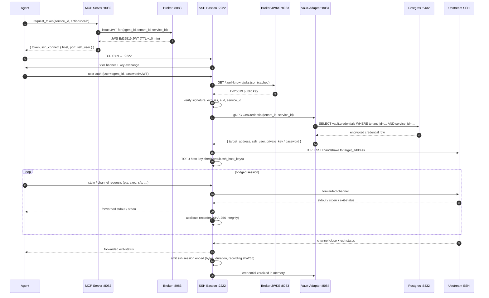

# SSH Bastion — architecture reference

**Operator runbook:** [docs/HOW-TO.md § 5 — SSH bastion onboarding](../../HOW-TO.md#5-ssh-bastion-onboarding)  
**Decision record:** [ADR-0022 — SSH bastion design](adr/0022-ssh-bastion.md)

---

## 1. Summary

Mintkey runs an SSH bastion on `:2222` that multiplexes every SSH session to every registered upstream host through a single listener. Dispatch is by JWT claim, not by port. The agent provides a broker-issued JWT as the SSH password; the bastion verifies it, looks up the vault credential that the JWT's `service_id` claim identifies, and dials the upstream SSH server using that credential. The agent never sees the upstream credential bytes — only the rendered I/O stream arrives at its terminal.

---

## 2. Data flow



---

## 3. Single-port multiplexing — explained

### The claim

Every agent that has a permission grant — regardless of which upstream host it targets — connects to the same TCP socket: `:2222`. There is no "one port per upstream". The bastion serves any number of upstreams from one listener.

### How it works (step by step)

1. **One TCP listener.** `server.Start()` binds a single `net.Listener` to `s.cfg.SSHAddr` (default `:2222`). This socket stays open for the lifetime of the process.

2. **Accept loop spawns one goroutine per TCP connection.** `acceptLoop()` calls `listener.Accept()` in a tight loop. Each accepted `net.Conn` is handed to `go handleConnection(conn)`. The goroutines are fully independent — they share no channel state.

3. **Rate guard before goroutine spawn.** Before spawning, `acceptLoop` checks a token-bucket (`rate.NewLimiter(10/s, burst 20)`) and a concurrent-handshake semaphore (capacity 200). Connections that exceed either limit are dropped at the TCP layer.

4. **SSH handshake + JWT extraction.** Inside `handleConnection`, `ssh.NewServerConn` performs the full SSH key exchange. The client presents a JWT string in the SSH password slot. The `passwordCallback` handler calls `AuthenticateJWT(user, password)`.

5. **JWT decoded → `service_id` extracted.** `AuthenticateJWT` fetches the broker's Ed25519 public key from the JWKS cache (`GET broker:8083/.well-known/jwks.json`, HTTP, cached in memory), verifies the signature, checks `iss`, `aud`, `exp`/`iat`, and extracts three claims: `sub` (agent_id), `tenant_id`, and `service_id`. The result is stored as a serialized `SessionContext` in `ssh.Permissions.Extensions["session_context"]`.

6. **`service_id` → vault lookup → target address.** When the first session channel is opened and the agent sends an `exec` or `shell` request, `session.handleExec` calls `backend.Connector.Connect`. That function calls `vaultClient.GetCredential(tenant_id, service_id)` over gRPC to vault-adapter. The returned `vault.Credential` row carries `target_address` (e.g. `internal-server.corp:22`) and `ssh_user`. Those are the coordinates the bastion dials with `ssh.Dial("tcp", targetAddr, ...)`.

7. **N agents to N upstreams, one port.** Two agents connecting to two different upstream hosts at the same time each open a separate TCP connection to `:2222`, each complete their own SSH handshake with their own JWT (carrying different `service_id` values), and each end up with a goroutine dialling a different `target_address`. From the network's perspective it looks like two independent SSH sessions to the same bastion host — which is exactly what it is.

### Why not one port per upstream?

The obvious alternative is to bind a dedicated listener for each registered service — e.g. `:2222` for server-A and `:2223` for server-B. This is how some simple jump-host setups work. It doesn't scale:

| Problem | Detail |
|---|---|
| N firewall rules | Every new service requires an operator to open a new inbound port on the bastion host and update any security groups or `iptables` rules. |
| N DNS entries | Each port needs a name or clients must remember port numbers per target. |
| N keepalives / health checks | The process holds N sockets open even when they are idle. |
| Service discovery mismatch | MCP `list_services` returns service ULIDs, not port numbers; agents would need an out-of-band port map. |

JWT-claim dispatch solves all four: one port, any number of services, zero firewall changes per new service, no per-service DNS, and the ULID from `list_services` doubles as the routing key in the JWT.

---

## 4. Open ports and connections

| Port / endpoint | Direction | Protocol | Who connects | Purpose |
|---|---|---|---|---|
| `:2222` | **listen** | SSH/TCP | agents (any SSH client) | bastion auth + session multiplex |
| `:8087` | **listen** | HTTP | Prometheus scraper, healthcheck probe | `GET /healthz` → `ok`; `GET /metrics` → Prometheus |
| `broker:8083` | outbound | HTTP GET | bastion → broker | JWKS fetch (`/.well-known/jwks.json`); response cached in memory per `kid` |
| `vault-adapter:8084` | outbound | gRPC | bastion → vault-adapter | `GetCredential(tenant_id, service_id)` — auth: `svcid_ssh_proxy` service identity |
| `postgres:5432` | outbound | TCP | bastion → postgres | `LISTEN mintkey:agent` (long-lived connection) for live agent revocations |
| `upstream:22` (or custom) | outbound | SSH/TCP | bastion → upstream | second SSH session, fully separate from the agent-facing session |
| `otel-collector:4317` | outbound | gRPC (OTLP) | bastion → otel | distributed traces |

**Note on port 8087.** The HOW-TO references `:8089` in the setup note for the metrics port. The canonical default in `config.go` is `:8087`. Do not expose either port publicly.

---

## 5. JWT claims — how each drives a decision

Sample decoded payload (compact — actual JWS header carries `alg=EdDSA`, `kid=<key_id>`):

```json
{
  "iss": "mintkey/broker",
  "aud": ["svc_01HZEX..."],
  "sub": "agent_01HZEX...",
  "tenant_id": "tnt_01HZEX...",
  "tnt":        "tnt_01HZEX...",
  "service_id": "svc_01HZEX...",
  "exp": 1748800000,
  "iat": 1748799400,
  "scope": "call",
  "jti": "tok_01HZEX..."
}
```

| Claim | Where validated | Effect |
|---|---|---|
| `iss` | `AuthenticateJWT` — `jwt.Parse` default checks | Must equal `mintkey/broker`; any other issuer rejects immediately. |
| `aud` | `AuthenticateJWT` — `jwt.Parse` default checks | Must contain the `service_id` the agent is targeting; prevents token re-use across services. |
| `sub` | `AuthenticateJWT` | Must match the SSH `user` field the client sent; a JWT cannot be used by a different user/agent. |
| `tenant_id` / `tnt` | `AuthenticateJWT` → `SessionContext.TenantID` | Passed to `GetCredential` as the Postgres RLS tenant context; sets `app.current_tenant` on the vault-adapter connection. Both flat aliases are present (fix in commit 5234f96). |
| `service_id` | `AuthenticateJWT` → `SessionContext.ServiceID` | Key routing claim — passed to `GetCredential`; determines which `vault.credentials` row (and therefore which upstream) to fetch. |
| `exp` / `iat` | `jwt.Parse` standard validation | Token rejected if expired or issued in the future; TTL ~10 min as issued by the broker. Long sessions must re-authenticate before expiry. |
| `scope` / `actions` | Not enforced by the bastion today | Reserved for future fine-grained access control (e.g. read-only vs. full shell). |
| `jti` | Not checked at the bastion (checked at broker on `resolve`) | Tracked at broker for classical API-key flows; SSH path does not currently enforce single-use per JTI. |

---

## 6. Connection lifecycle — typical exec

A concrete walkthrough for `ssh -p 2222 agent_01...@bastion 'uname -a'`:

```
1.  Agent TCP SYN → bastion :2222
2.  bastion: Accept() → goroutine
3.  SSH key exchange (KEX): ECDH/curve25519-sha256 negotiated
4.  bastion sends banner: "Mintkey SSH bastion. Sessions are recorded…"
5.  Agent sends user-auth request (user=agent_id, method=password, password=<JWT>)
6.  bastion passwordCallback:
      a. parse JWT (Ed25519; fetch JWKS key by kid if cache miss)
      b. verify sig, iss, aud, exp, sub==user
      c. build SessionContext{TenantID, AgentID, ServiceID}
      d. store serialized context in ssh.Permissions.Extensions
7.  SSH auth succeeds; connection handed to handleConnection
8.  global-requests goroutine starts (rejects port-forward/streamlocal)
9.  Agent opens "session" channel
      bastion: channel-type check → "session" allowed
      session.Manager.CreateSession(sessionCtx, sshConn, channel)
      session_id = ULID() assigned; asciicast writer opened
      audit: ssh.session.started (agent_id, tenant_id, service_id, source_ip)
10. Agent sends "exec" request (command="uname -a")
    session.handleExec:
      a. (optional) filter.IsAllowed("uname -a") → pass
      b. backend.Connector.Connect(ctx, sessCtx, ""):
            GetCredential(tenant_id, service_id) → gRPC vault-adapter
            vault-adapter: SET app.current_tenant → SELECT vault.credentials
            returns: target_address="internal-server.corp:22", ssh_user="deploy",
                     private_key=<PEM bytes>
      c. TOFU hostKeyCallback: lookup vault.ssh_host_keys for "internal-server.corp"
            first visit → store fingerprint (TOFU); subsequent → verify
      d. ssh.Dial("tcp", "internal-server.corp:22", config{user="deploy", auth=signer})
            → upstream SSH session established
      e. upstream.NewSession() → session.RequestSubsystem("exec","uname -a")
11. Bridge goroutines start:
      stdin:   agent channel → upstream stdin  (via bridge.Copy)
      stdout:  upstream stdout → agent channel  + asciicast writer
      stderr:  upstream stderr → agent channel stderr
12. "uname -a" runs on upstream; output arrives at bastion stdout bridge
13. upstream sends exit-status(0) → forwarded to agent channel
14. upstream closes channel → bridge goroutines drain and exit
15. audit: ssh.session.exec (command="uname -a", exit_code=0)
16. upstream SSH client closed; private-key bytes zeroed (backend.Close)
17. agent channel closed
18. session.Manager.DestroySession(session_id)
    audit: ssh.session.ended (duration_s, bytes_sent, bytes_received, recording_sha256)
19. asciicast file flushed and closed
20. goroutine exits; TCP connection closed
```

---

## 7. Security boundary

- **The agent never receives upstream credential bytes.** The private key or password is fetched by the bastion over gRPC, held in process memory for the session duration only, and zeroed on session close (`backend.Close` range-zeros the PEM slice). The agent's view is limited to the I/O stream.

- **Session recording is tamper-evident.** Every session produces an asciicast v2 file at `/var/lib/mintkey/ssh-recordings/<session_id>.cast`. A SHA-256 digest of the file is embedded in the `ssh.session.ended` audit event, which is itself part of the mandatory hash chain (ADR-0014.7). An operator can replay the session and verify integrity offline.

- **Channel-type denylist.** `handleChannel` rejects every SSH channel type except `"session"`:

  | Rejected type | Effect |
  |---|---|
  | `direct-tcpip` | No local TCP forwarding (`-L`) |
  | `forwarded-tcpip` | No remote TCP forwarding (`-R`) |
  | `x11` | No X11 forwarding (`-X`) |
  | `direct-streamlocal@openssh.com` | No Unix-domain socket forwarding |
  | `auth-agent@openssh.com` | No SSH agent forwarding (`-A`) |

  Each rejection emits an `ssh.channel.denied` audit event.

- **Upstream host-key TOFU pinning.** The first connection to an upstream stores the host-key fingerprint in `vault.ssh_host_keys` per `(tenant, service)`. Subsequent connections verify the fingerprint; a mismatch emits `ssh.hostkey.mismatch` and rejects the session. Strict mode (operator-controlled) rejects even the first connection if no pre-registered key exists.

- **Session timeouts.** `SessionTimeout` (max duration) and `SessionIdleTimeout` (idle) are enforced via context cancellation. When either fires, the session goroutines drain, the upstream connection is closed, and the agent receives a clean EOF.

- **Rate limiting.** The Accept loop applies two guards: a token-bucket limiter (`rate.NewLimiter`) at the TCP level, and a concurrent-handshake semaphore (default capacity 200). Excess connections are dropped before they consume goroutine resources.

- **Live revocation.** The revocation handler subscribes to `LISTEN mintkey:agent` on Postgres via the changes client. An `agent.revoked` event immediately calls `sessionMgr.TerminateAgentSessions(agentID)`, cancelling all in-flight sessions for that agent without waiting for JWT expiry.

- **Audit events.** Every session lifecycle step emits a structured audit event: `ssh.session.started`, `ssh.session.exec` (per command), `ssh.session.sftp` (per SFTP operation), `ssh.session.ended`, plus `ssh.channel.denied`, `ssh.global_request.denied`, `ssh.hostkey.mismatch`, `ssh.auth.failed`.

---

## 8. What the bastion does NOT do

| Common misconception | Reality |
|---|---|
| "It runs a Mintkey-specific SSH protocol." | The bastion is a standard `crypto/ssh` server. Any vanilla `ssh` client (OpenSSH, paramiko, libssh2) works. No custom client needed. |
| "SSH goes through Kong." | Kong is HTTP-only. The SSH bastion is a sibling data-plane component that runs on its own port. Kong does not handle `:2222` traffic. |
| "It is one hop — the agent's SSH session IS the upstream session." | There are always two SSH sessions: (1) agent → bastion, and (2) bastion → upstream. The bastion bridges them. The upstream host sees connections from the bastion's IP, not the agent's IP. |
| "Agent forwarding works." | Agent forwarding (`-A`), X11 (`-X`), and all TCP port-forwarding variants (`-L`, `-R`) are explicitly disabled and audited. |
| "The bastion terminates the upstream SSH tunnel." | The bastion keeps both sessions alive simultaneously for the duration of the connection. Closing either side closes both. |
| "I need to open a new port for each SSH service I register." | No. All services share `:2222`. The JWT's `service_id` claim is the routing key. |

---

## Cross-references

- [ADR-0022 — SSH bastion design decisions](adr/0022-ssh-bastion.md)
- [ADR-0004 — Egress proxy (Kong, HTTP-only)](adr/0004-egress-proxy-kong.md) — SSH bastion is a sibling, not an extension
- [ADR-0006 — Token format (JWS Ed25519 JWT)](adr/0006-token-format-and-binding.md) — JWT shape used by the bastion
- [ADR-0008 — Multi-tenancy (RLS, `app.current_tenant`)](adr/0008-multi-tenancy-row-level-with-db-tier.md) — `tenant_id` claim drives RLS
- [docs/HOW-TO.md § 5 — operator runbook](../../HOW-TO.md#5-ssh-bastion-onboarding) — step-by-step setup and usage
- [docs/architecture/03-flows/](../03-flows/) — E2E flow diagrams for the HTTP proxy path (SSH path has no dedicated flow doc yet)
