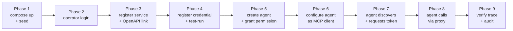
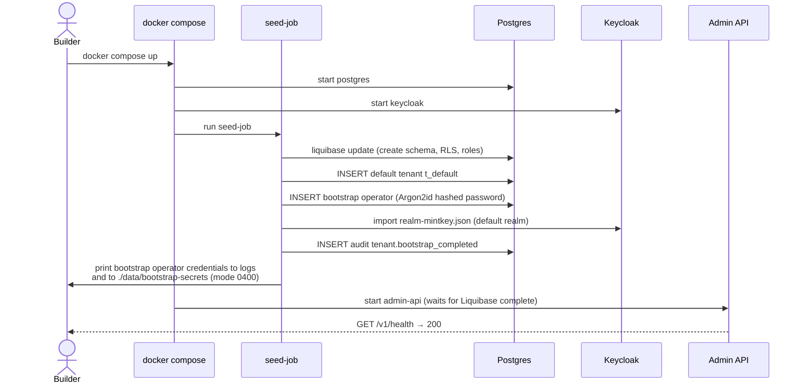
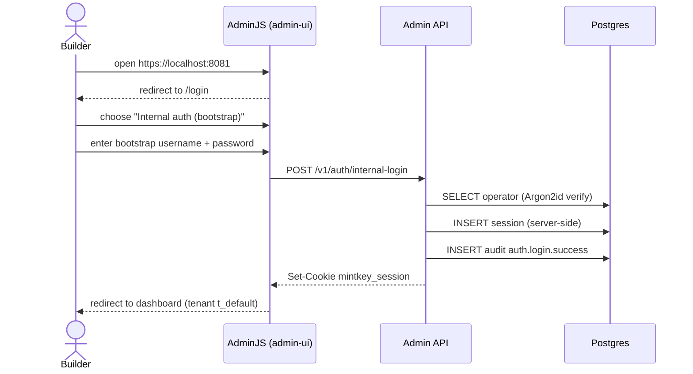
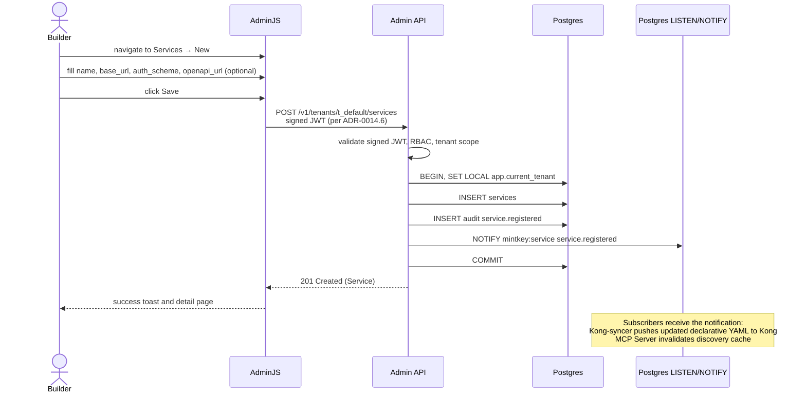
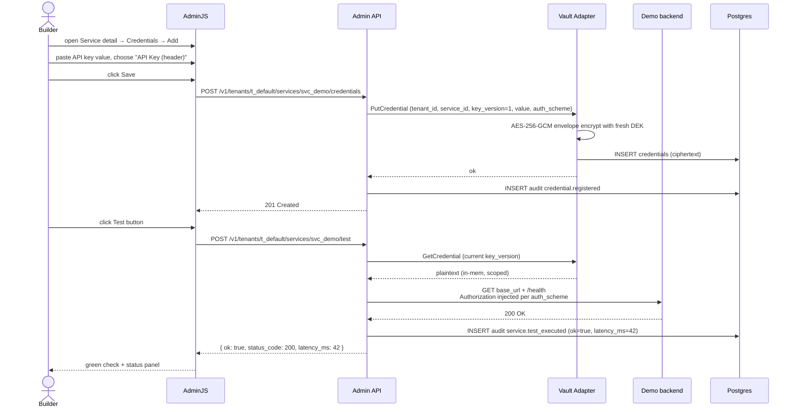
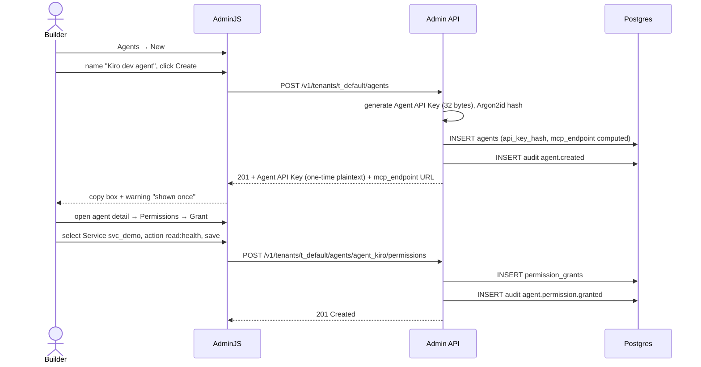
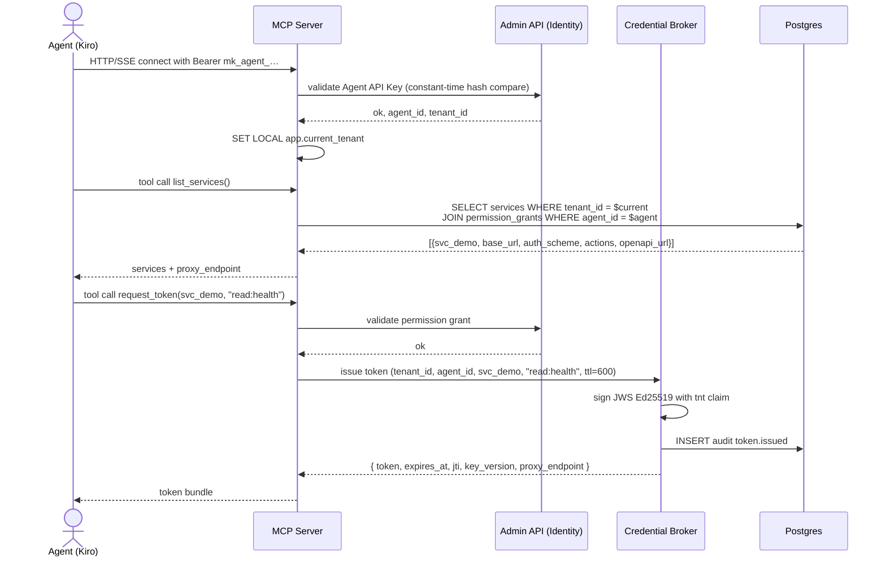
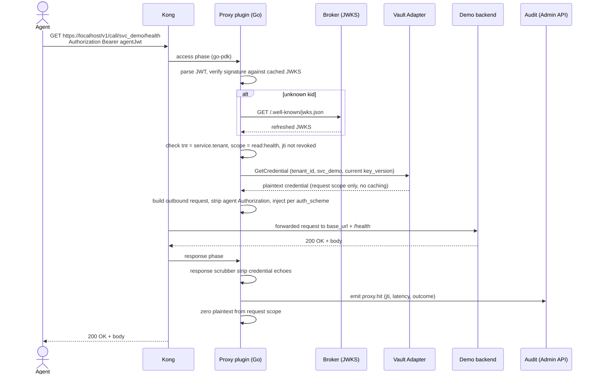
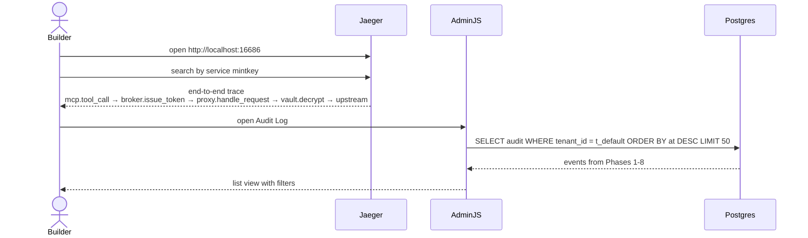

# E2E‑01 — Builder happy path

> *I'm a builder. I want to start the project, log in, register an API service with credentials, test it, generate an API key for my agent (Kiro / Claude Code / OpenCode / Hermas / …), wire it as an MCP, and watch the agent successfully discover and call the service through Mintkey — observable end‑to‑end.*

This is the **headline demo** for Phase 1. It stitches together six component flows into a single user journey.

## Goal
A builder takes a freshly cloned repo, runs `docker compose up`, and within ~10 minutes has an agent successfully calling a registered backend service through Mintkey, with full observability.

## Actors
- **Builder** (human) — operator role; uses the AdminJS UI.
- **Agent** (machine) — any MCP‑compatible agent (Kiro, Claude Code, OpenCode, etc.).
- **Mintkey services** — Admin API (FastAPI), AdminJS, Keycloak, Postgres, Vault Adapter, Credential Broker, MCP Server, Kong + proxy plugin, Kong‑syncer, OTel collector + Jaeger + Prometheus + Grafana.
- **Demo backend** — the API the agent calls (a stubbed REST service for the demo; in real use, the builder's chosen API).

## Pre‑conditions
- Docker + docker compose installed.
- Ports 80/443/5432/8080/8081/4317/3000 (or as configured) available.
- No prior Mintkey state on disk.

## Post‑conditions
- One tenant (`t_default`) seeded.
- One operator (`Admin` role) provisioned with a known bootstrap password.
- One service registered with an OpenAPI link.
- One credential registered, tested, and current.
- One agent created with an Agent API Key (printed once to the operator).
- One permission granted (agent can call `read:health` on the service).
- Agent's MCP client is connected; the agent has called `list_services`, `request_token`, and the proxied service.
- A Jaeger trace shows the end‑to‑end call across MCP → broker → proxy → backend.
- Audit log contains: `tenant.bootstrap_completed`, `auth.login.success`, `service.registered`, `credential.registered`, `service.test_executed`, `agent.created`, `agent.permission.granted`, `token.issued`, `proxy.hit`, all with the same `tenant_id`.

## Phases (overview)



## Phase 1 — Bootstrap (`docker compose up` + seed)



See [F‑OP‑01](F-OP-01-bootstrap-and-login.md) for full detail.

## Phase 2 — Operator login



Builder is logged in. (OIDC via Keycloak is the production path; internal auth is the bootstrap shortcut.) See [F‑OP‑01](F-OP-01-bootstrap-and-login.md).

## Phase 3 — Register a service (with optional OpenAPI link)



See [F‑OP‑02](F-OP-02-register-service.md).

## Phase 4 — Register a credential and test the service



See [F‑OP‑03](F-OP-03-register-credential-and-test.md).

## Phase 5 — Create an agent and grant a permission



See [F‑OP‑04](F-OP-04-create-agent-and-permissions.md).

## Phase 6 — Configure the agent as an MCP client

This is **client‑side configuration** for the agent's tooling. Mintkey does not push config to the agent; the builder copies the values into the agent's MCP config.

For Kiro, Claude Code, OpenCode, etc., the relevant config (typical):

```json
{
  "mcpServers": {
    "mintkey": {
      "url": "https://localhost:8082/mcp",
      "headers": { "Authorization": "Bearer mk_agent_<the-API-key-shown-once>" }
    }
  }
}
```

The mcp_endpoint URL came from the Phase‑5 response; the agent API key came once at agent creation. The builder restarts (or reloads) their agent.

## Phase 7 — Agent discovers + requests a token



See [F‑AG‑01](F-AG-01-discover-and-request-token.md).

## Phase 8 — Agent calls the service via the proxy



See [F‑AG‑02](F-AG-02-brokered-call-happy-path.md).

## Phase 9 — Verify trace + audit



The trace and audit list confirm the full path. End of demo.

## Quality attribute scenarios touched

- [S‑SEC‑1](../01-architecture/03-quality-attributes.md) — agent never sees plaintext credential.
- [S‑SEC‑2](../01-architecture/03-quality-attributes.md) — credentials at rest encrypted (file backend variant).
- [S‑SEC‑3](../01-architecture/03-quality-attributes.md) — bounded blast radius (agent only has `read:health` on `svc_demo`).
- [S‑AUD‑1](../01-architecture/03-quality-attributes.md) — every step audited.
- [S‑PERF‑1](../01-architecture/03-quality-attributes.md) — proxy latency in budget.
- [S‑PERF‑2](../01-architecture/03-quality-attributes.md) — token issuance fast.
- [S‑OBS‑1](../01-architecture/03-quality-attributes.md) — end‑to‑end trace.
- [S‑MT‑1](../01-architecture/03-quality-attributes.md) — tenant scoping.
- [S‑TEST‑1](../01-architecture/03-quality-attributes.md) — full happy path testable in CI.

## Test plan (the headline plan)

### Live smoke (Phase 1 milestone 1.11)
A single CI test that:
1. `docker compose up` (pre‑warmed image cache for speed).
2. Polls `/v1/health` and `/v1/ready` until 200.
3. Reads bootstrap creds from the host file.
4. Logs in via internal auth.
5. Creates `svc_demo` (base_url pointing at the demo‑backend container).
6. Registers a credential (`api_key_header`).
7. Calls `POST .../test`; asserts `ok: true`.
8. Creates `agent_kiro`; captures the API key.
9. Grants `(svc_demo, read:health)` permission.
10. Spawns a small Python test agent with the Agent API Key.
11. The test agent runs the MCP Server's tools: `list_services`, `request_token`, then issues an HTTPS request to Kong with the JWT.
12. Asserts: 200 from Kong; the demo‑backend log shows the call with the *real* API key (not the JWT); audit log has all 9 expected event types; Jaeger trace exists with all expected spans.
13. Total runtime budget: **≤ 90 s** ([S‑TEST‑1](../01-architecture/03-quality-attributes.md)).

### Integration tests (per phase)
Each phase has an integration test exercising it against testcontainers. See the test plans in [F‑OP‑01](F-OP-01-bootstrap-and-login.md) through [F‑AG‑02](F-AG-02-brokered-call-happy-path.md).

### Unit tests
Per‑function in each component. See the per‑flow docs.

## Failure modes (overview)
| Phase | Failure | Detection | Behavior |
|------|---------|-----------|----------|
| 1 | Liquibase migration failure | seed‑job non‑zero exit | compose halts; admin‑api never starts |
| 1 | Keycloak realm import fails | seed‑job log | admin‑api can still start (internal auth works); operator must repair before Phase 2 OIDC use |
| 2 | Wrong bootstrap password | Argon2id verify fails | 401, audit `auth.login.failed`, constant‑time response |
| 3 | Service base_url unreachable on later test | F‑OP‑03 fail | Builder fixes URL or auth scheme |
| 4 | Test‑run fails (401, 5xx, timeout) | F‑OP‑03 detail | Audit `service.test_executed` ok=false; Builder iterates |
| 5 | Permission grant has no matching service | API 404 | error toast |
| 7 | Agent API Key invalid | MCP Server 401 | builder re‑checks the copied key |
| 8 | JWT expired or revoked | Kong plugin 401 | agent retries with refresh; on persistent 401 builder investigates |
| 8 | Backend down | Kong 502 | agent retry policy |
| 9 | No trace | OTel pipeline issue | builder checks otel‑collector logs |

## Kiro spec inputs
For each phase, Kiro is given:
- The pre/post‑conditions and sequence diagram from this doc.
- The relevant ADRs (linked).
- The contract surface from `docs/contracts/` (the OpenAPI endpoint, the MCP tool, the audit‑event payload).
- The test plan section.

Kiro produces:
- A **requirements** doc per implementing component (in `docs/specs/<component>/requirements.md`) anchoring acceptance criteria to the quality‑attribute scenarios.
- A **design** doc enumerating internal modules, dependencies, failure modes.
- A **tasks** doc sequencing TDD tasks (write test → implement → refactor).

The first Kiro target is **F‑OP‑01** (smallest, clearest). E2E‑01 is the merge gate that proves all components compose correctly.
