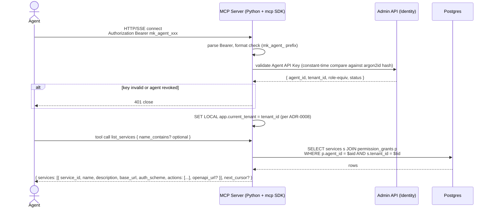
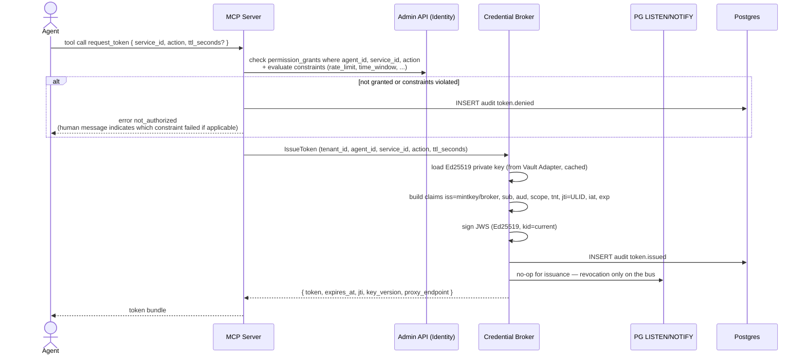

# F‑AG‑01 — Agent: MCP discovery and request a token

## Goal
An agent connects to the Mintkey MCP server using its Agent API Key, lists the services it has permission to call, and acquires a short‑lived JWT scoped to a specific `(service, action)`.

## Actors
- **Agent** (machine; e.g., Kiro, Claude Code, OpenCode, Hermas) — running on a developer's machine or in CI.
- **MCP Server** (Python, Anthropic `mcp` SDK).
- **Admin API (Identity)** — validates Agent API Key and reads permission grants.
- **Credential Broker** (Go) — mints the JWT.
- **Postgres** — backing store; **Audit** — emits events.

## Pre‑conditions
- [F‑OP‑04](F-OP-04-create-agent-and-permissions.md) complete: agent exists with at least one `permission_grant`; the Agent API Key has been copied into the agent's MCP client config.
- The agent points at `https://<mintkey-host>:8082/mcp` with `Authorization: Bearer mk_agent_…`.

## Post‑conditions
- Agent has called `list_services` and received the services it has any permission on (filtered by tenant + permission).
- Agent has called `request_token` and received a JWT with claims `{iss, sub, aud, scope, tnt, jti, iat, exp}` and metadata `{expires_at, key_version, proxy_endpoint}`.
- `token.issued` audit event recorded with `tenant_id`, `agent_id`, `service_id`, `action`, `jti`, `key_version`, `ttl_seconds`.

## Sequence diagram — connect + discover

## Sequence diagram — request a token

## Quality attribute scenarios touched
- [S‑PERF‑2](../01-architecture/03-quality-attributes.md) — token issuance p99 ≤ 50 ms.
- [S‑SEC‑3](../01-architecture/03-quality-attributes.md) — bounded blast radius via `aud + scope + tnt`.
- [S‑AUD‑1](../01-architecture/03-quality-attributes.md) — every issuance and denial audited.
- [S‑MT‑1](../01-architecture/03-quality-attributes.md) — discovery and tokens never cross tenants.
- [S‑MOD‑1](../01-architecture/03-quality-attributes.md) — adding a new action to a service is permission‑grant config, not code.

## Failure modes
| Failure | Detection | Behavior |
|---------|-----------|----------|
| Bearer Agent API Key missing or malformed | MCP authn middleware | 401 close |
| Agent API Key valid but agent revoked | Identity service flag | 401 with `agent_revoked` |
| Agent API Key valid but tenant deleted | Identity service flag | 401 with `tenant_deleted` ([ADR‑0016.7](../01-architecture/adr/0016-round-2-corrections.md)) |
| `list_services` cursor expired | server returns 410 | agent restarts pagination |
| `request_token` for `(service, action)` not granted | permission lookup | `token.denied` audit; error to agent |
| `request_token` denied by ABAC constraint (e.g., outside time_window) | constraint evaluator | `token.denied` audit with `reason` |
| Broker signing key unavailable | Vault Adapter unreachable | 503; agent retries |
| Token issuance rate limit exceeded for the agent | per‑agent rate limiter | 429; agent applies backoff |

## Test plan

### Unit tests
- `mcp.authenticate` — Bearer parse, format check, constant‑time hash compare.
- `mcp.list_services` — filter by tenant + permissions; pagination.
- `mcp.request_token` — claim construction; signature verification roundtrip.
- `permissions.evaluate_constraints` — rate_limit, time_window (timezone correctness around DST), request_path_prefix, source_ip_allowlist.

### Integration tests (testcontainers)
- Set up tenant + service + credential + agent + permission. Connect a test MCP client, call `list_services`, assert exactly the expected service appears with `actions` matching the grants.
- Call `request_token` happy path; verify the JWT signature with the broker's JWKS; assert all claims; assert `token.issued` audit row.
- Call `request_token` for a service the agent doesn't have permission on; assert `not_authorized` + audit `token.denied`.
- Time‑window constraint: agent in tenant configured with `time_window` 09:00–17:00 Europe/Bucharest. Run test "now mocked to 22:00 local"; assert `token.denied` with `reason: outside_time_window`.
- Tenant‑isolation fuzz: connect with agent X (tenant A); request_token for service in tenant B (force the service_id by passing it directly); assert 404 (RLS hides the service from agent X) and audit `token.denied`.

### Live smoke
- Part of E2E‑01 Phase 7.

## Kiro spec inputs
- **Components**: `apps/mcp-server/src/mcp_server/main.py`, `apps/mcp-server/tools/list_services.py`, `apps/mcp-server/tools/request_token.py`, `apps/mcp-server/auth/api_key.py`, `apps/broker/internal/issuer/*`, `apps/admin-api/services/permissions_evaluator.py`.
- **Contracts**: MCP tools defined in `docs/contracts/mcp/tools.yaml`; JWT shape per [ADR‑0006](../01-architecture/adr/0006-token-format-and-binding.md) + [ADR‑0008](../01-architecture/adr/0008-multi-tenancy-row-level-with-db-tier.md) (`tnt` claim).
- **Tasks** (TDD):
  1. Write MCP authn integration test (real Postgres, real agent row); implement until pass.
  2. Write `list_services` test; implement.
  3. Write `request_token` test; implement broker IssueToken (Go) and MCP wrapper.
  4. Write permission‑denied test; implement constraint evaluator with each constraint type's test.
  5. Add cross‑tenant fuzz tests.
  6. Add latency benchmarks (S‑PERF‑2 ≤ 50 ms p99 at 100 issuances/sec).
