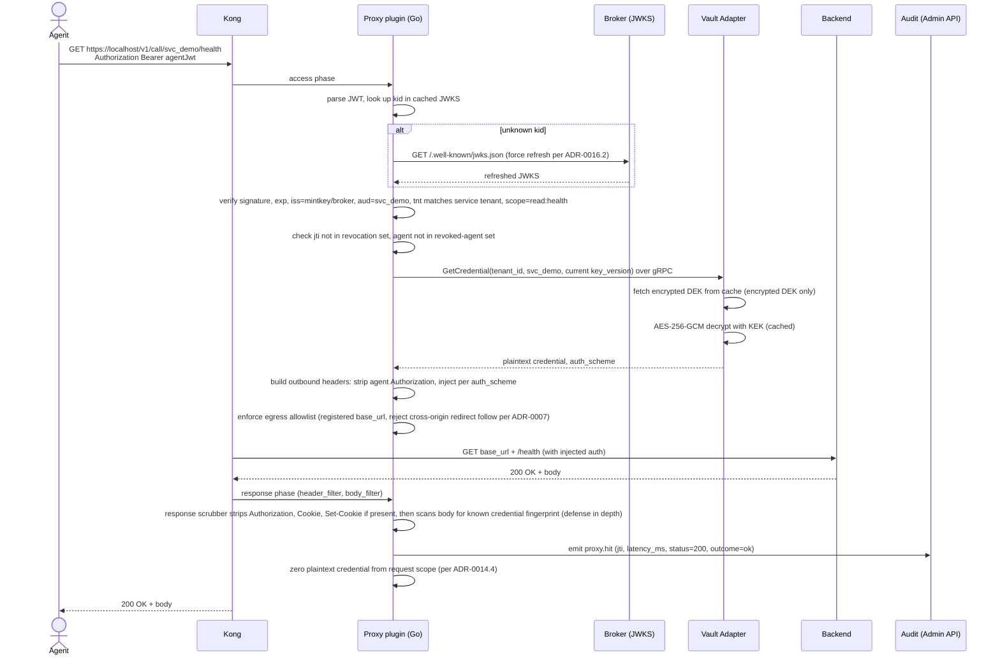

# F‑AG‑02 — Agent: brokered call (happy path)

## Goal
With a valid JWT in hand, the agent calls the backend service through Kong; the proxy plugin validates the token, fetches the credential, injects it, forwards to the backend, scrubs the response, and emits audit + OTel data.

## Actors
- **Agent** (machine).
- **Kong Gateway** (DB‑less, with the JWT plugin and our custom Go plugin).
- **Egress Proxy plugin** (Go, `go-pdk`).
- **Credential Broker** — JWKS endpoint only (consulted on cache miss).
- **Vault Adapter** (Go) — `GetCredential` over gRPC.
- **Backend service** — the registered API.
- **Audit Service** — emits `proxy.hit`.

## Pre‑conditions
- [F‑AG‑01](F-AG-01-discover-and-request-token.md) complete: agent has a valid JWT.
- Service is registered (F‑OP‑02) with a current credential (F‑OP‑03).
- Permission grant covers the `(service, action)` and ABAC constraints.
- Kong's declarative config has the route for the service (Kong‑syncer pushed it after F‑OP‑02).

## Post‑conditions
- The backend service received the request with the **real credential injected** per its `auth_scheme` and **without** the agent's JWT.
- The agent received the backend's response, scrubbed of any echoed credential.
- One `proxy.hit` audit event with `(jti, agent_id, service_id, action, latency_ms, status, outcome)`.
- One end‑to‑end OTel trace from the agent's request through the Kong plugin, vault decrypt, backend call, and scrubber.

## Sequence diagram

## Quality attribute scenarios touched
- [S‑PERF‑1](../01-architecture/03-quality-attributes.md) — proxy added p50 ≤ 10 ms, p99 ≤ 30 ms.
- [S‑SEC‑1](../01-architecture/03-quality-attributes.md) — agent never sees the real credential.
- [S‑SEC‑3](../01-architecture/03-quality-attributes.md) — bounded blast radius.
- [S‑AUD‑1](../01-architecture/03-quality-attributes.md) — every proxy hit audited.
- [S‑OBS‑1](../01-architecture/03-quality-attributes.md) — end‑to‑end OTel trace.
- [S‑MT‑1](../01-architecture/03-quality-attributes.md) — `tnt` mismatch denies; cross‑tenant token replay impossible.
- [S‑AVAIL‑1](../01-architecture/03-quality-attributes.md) — control plane outage doesn't break in‑flight tokens.

## Failure modes (for the happy‑path doc; deeper coverage in F‑AG‑03 / F‑AG‑04 future)
| Failure | Detection | Behavior |
|---------|-----------|----------|
| JWT expired | exp check | 401 with `token_expired`; agent SDK refreshes (per [ADR‑0014.9](../01-architecture/adr/0014-iter-1-2-corrections.md)) |
| JWT revoked (jti or agent) | revocation set in plugin | 401 with `token_revoked` |
| `tnt` mismatch with service tenant | claim check | 401 with `tenant_mismatch` |
| `aud` mismatch with route service | claim check | 401 with `audience_mismatch` |
| `scope` doesn't cover requested action | path‑to‑action mapping | 403 with `action_not_granted` |
| Vault Adapter unreachable | gRPC error | 503; agent retries |
| Backend 5xx | upstream | passed through to agent |
| Backend 401 (real credential rejected) | upstream | passed through; operator sees `service.credential_rejected` audit (separate flow) |
| Cross‑origin redirect from backend | Kong follow‑redirect policy off | redirect returned to agent unchanged |
| Response body contains credential signature | response scrubber match | scrubber strips known fields + emits high‑severity audit `proxy.credential_echo_detected` |

## Test plan

### Unit tests
- `proxy_plugin.verify_jwt` — every claim check (iss, aud, scope, tnt, exp, jti); JWKS cache hit + miss + force‑refresh.
- `proxy_plugin.build_outbound_request` — every auth_scheme variant; redirect policy; header smuggling protection.
- `proxy_plugin.scrub_response` — known credential fingerprints in headers and body; idempotent.
- `proxy_plugin.zero_plaintext` — best‑effort zero of byte slices.

### Integration tests (testcontainers — Postgres + Kong + plugin + Vault Adapter + a stub backend)
- Happy path: JWT issued by broker → Kong → plugin → backend → response. Assert backend log shows the real API key (not the JWT); audit row has matching `jti`; OTel pipeline shows the trace.
- Latency benchmark: 100 RPS sustained, measure p50 and p99 added latency. Assert ≤ 10 ms p50, ≤ 30 ms p99 ([S‑PERF‑1](../01-architecture/03-quality-attributes.md)).
- Each `auth_scheme`: api_key_header, api_key_query, bearer_token, basic_auth, oauth2_client_credentials, oidc_client_secret, mtls. Each gets its own integration test against a stub that asserts the expected header/query was injected.
- Force JWKS refresh: rotate broker key during test; assert plugin recovers within one request.
- `tnt` mismatch: forge a JWT with wrong `tnt` (impossible normally; manufactured in test) → 401.
- Response scrubber: stub backend echoes `Authorization: Bearer <real-cred>` in response; assert scrubber strips it AND emits `proxy.credential_echo_detected` audit.

### Live smoke
- Part of E2E‑01 Phase 8.

### Red‑team / security tests
- Plaintext credential search across plugin's logs and stdout: zero matches.
- Plaintext in OTel span attributes: assert redaction policy (per [`docs/contracts/events/span-attributes.md`](../contracts/events/span-attributes.md)) catches any disallowed attribute.
- Coredump simulation: trigger SIGABRT in the plugin during a request; assert no plaintext appears in the dumped memory beyond a bounded set of single‑request bytes (informational; not a hard guarantee given Go GC).

## Kiro spec inputs
- **Components**: `proxy-plugin/internal/...` (Go go‑pdk), `vault-adapter/internal/...` (Go), `kong-syncer/internal/...` (Go), `broker/internal/jwks_endpoint.go`.
- **Contracts**: Kong route shape (declarative YAML produced by Kong‑syncer); `vault.proto` `GetCredential`; `proxy.hit` audit event; OTel span attributes.
- **Tasks** (TDD):
  1. Write integration test for the happy path against a stub backend; implement plugin until pass.
  2. Write each auth_scheme test; implement injection.
  3. Write JWKS force‑refresh test; implement.
  4. Write `tnt` mismatch test; implement (already in claim verifier).
  5. Write response‑scrubber test for each known echo location.
  6. Write latency benchmark test as a CI threshold check.
  7. Write red‑team plaintext‑in‑logs test; tighten redaction.
  8. Write OTel attribute redaction test; integrate with the contract's allowlist.
