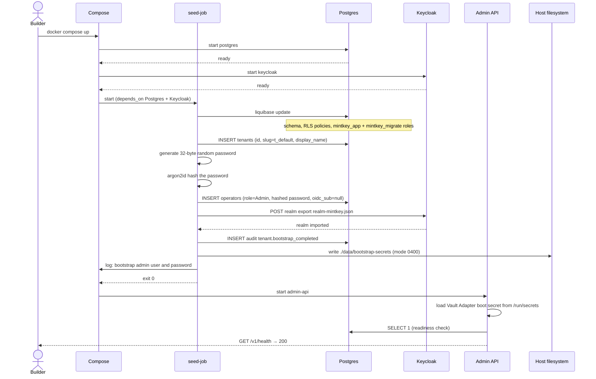
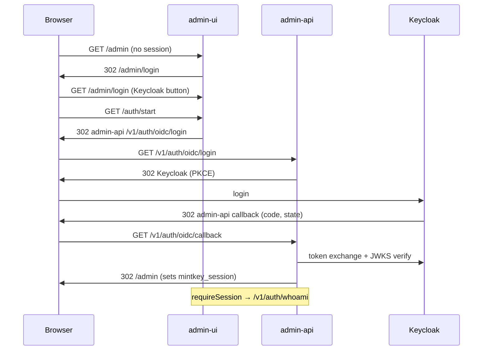
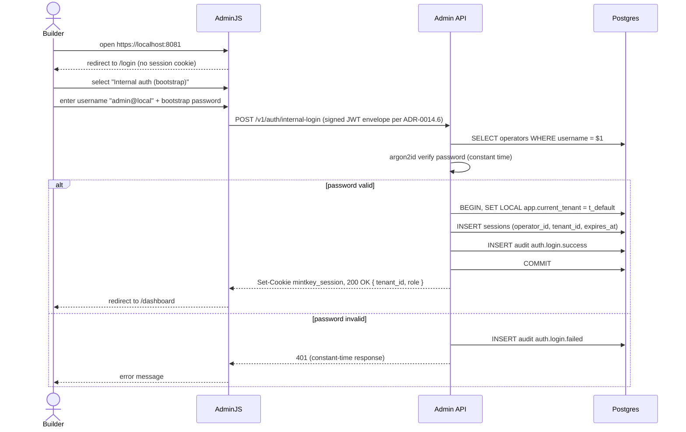

# F‑OP‑01 — Operator bootstrap and first login

## Goal
A new Mintkey deployment provisions a default tenant, a bootstrap admin operator (with internal auth), and a Keycloak realm; the operator logs in and reaches the AdminJS dashboard.

## Actors
- **Builder / Operator** (human, browser)
- **Compose runtime** (`docker compose up`)
- **seed‑job** (one‑shot container)
- **Postgres**, **Keycloak**, **AdminJS**, **Admin API**

## Pre‑conditions
- Docker + compose installed.
- Repo cloned; `.env` defaults (or operator‑provided overrides) present.
- No prior state on Postgres volume or `./data/bootstrap-secrets` host file.

## Post‑conditions
- DB schema applied via Liquibase ([ADR‑0015](../01-architecture/adr/0015-liquibase-schema-source-of-truth.md)).
- Tenant `t_default` row created.
- Operator row with `role=Admin` + Argon2id‑hashed password.
- Keycloak realm `mintkey` imported with the `mintkey-admin` client.
- Bootstrap password printed to compose logs and written to `./data/bootstrap-secrets` (mode 0400).
- `tenant.bootstrap_completed` audit event emitted.
- Admin API health endpoint returns 200.
- Operator successfully logs in via Keycloak OIDC (ADR-0020); internal-login is the break-glass path only.

## Sequence diagram — bootstrap

## Sequence diagram — First login — Keycloak OIDC (primary)

> Full OIDC flow detail and token-validation sequence: [`docs/AUTH.md`](../../AUTH.md).

## Sequence diagram — Break-glass login (internal-auth)

> Requires `mintkey admin reset-password` to enable. Use only when Keycloak is unavailable.

## Quality attribute scenarios touched
- [S‑SEC‑1](../01-architecture/03-quality-attributes.md) — bootstrap password is shown only on first run; written to `./data/bootstrap-secrets` 0400.
- [S‑AUD‑1](../01-architecture/03-quality-attributes.md) — all login attempts (success + failure) audited.
- [S‑MT‑2](../01-architecture/03-quality-attributes.md) — tenant onboarding timing (compose up to operator dashboard) ≤ 60 s on a warm cache.

## Failure modes
| Failure | Detection | Behavior |
|---------|-----------|----------|
| Liquibase migration syntax error | seed‑job exits non‑zero | compose halts; operator inspects logs and fixes the changelog |
| Postgres unreachable when seed starts | seed connection retry then fail | `depends_on: condition: service_healthy` ensures DB ready first |
| Keycloak realm import fails | seed log | seed continues (internal auth works); OIDC unavailable until repair |
| Bootstrap password file already exists | seed detects, refuses | operator must rotate via the `seed --rotate-bootstrap` subcommand to avoid silent overwrite |
| Wrong password on login | Argon2id verify | `auth.login.failed` audit; 401 with constant‑time delay |
| Argon2id parameters too high | login slow | doc the recommended params (memory 64 MiB, iterations 3, parallelism 4) |

## Test plan

### Unit tests
- `seed.generate_bootstrap_password` returns 32 random bytes; Argon2id hashing roundtrip.
- `auth.internal_login` handler: valid/invalid password, locked operator, deleted operator.
- Liquibase changelog hash stable.
- RLS policy applied on every domain table (the architecture test from [ADR‑0014.8](../01-architecture/adr/0014-iter-1-2-corrections.md)).

### Integration tests (testcontainers)
- Spin Postgres + run Liquibase → assert all expected tables, columns, RLS policies, roles.
- Spin Postgres + Keycloak + admin‑api + seed‑job → assert seed completes, operator row exists, audit event emitted, Keycloak realm imported.
- Spin everything + admin‑ui → POST `/v1/auth/internal-login` with bootstrap creds → assert 200 + cookie + audit row.

### Live smoke
- Part of E2E‑01 Phase 1 + Phase 2.

## Kiro spec inputs

Contracts touched:
- OpenAPI: `POST /v1/auth/internal-login`, `GET /v1/auth/whoami`, `POST /v1/auth/logout` ([`docs/contracts/rest/openapi.yaml`](../contracts/rest/openapi.yaml)).
- Audit events: `tenant.bootstrap_completed`, `auth.login.success`, `auth.login.failed.user_unknown`, `auth.login.failed.bad_password`, `auth.login.failed.account_locked`, `auth.logout` ([`docs/contracts/events/audit-event.schema.json`](../contracts/events/audit-event.schema.json)).
- Internal: Liquibase changelogs at `admin-api/db/changelog/`; Keycloak realm export at `seed/keycloak/realm-mintkey.json`.

Components implementing this flow:
- `seed-job` (Python or Go small one‑shot)
- `admin-api` (Python, FastAPI handlers `auth.internal_login`)
- `admin-ui` (AdminJS, login page + Custom Action to call FastAPI)

For each, Kiro generates:
- **Requirements** — derived from "Goal" + "Pre/Post‑conditions" above. Acceptance criteria mapped to S‑SEC‑1, S‑AUD‑1, S‑MT‑2.
- **Design** — internal modules: `seed.bootstrap`, `seed.keycloak_import`, `auth.internal_login`. References [ADR‑0005](../01-architecture/adr/0005-admin-tech-stack.md), [ADR‑0008](../01-architecture/adr/0008-multi-tenancy-row-level-with-db-tier.md), [ADR‑0012](../01-architecture/adr/0012-python-stack-pin.md), [ADR‑0014](../01-architecture/adr/0014-iter-1-2-corrections.md), [ADR‑0015](../01-architecture/adr/0015-liquibase-schema-source-of-truth.md), [ADR‑0016](../01-architecture/adr/0016-round-2-corrections.md).
- **Tasks** — TDD sequence:
  1. Write seed‑job test asserting Liquibase migrations apply and tables exist.
  2. Implement `seed.bootstrap` to make the test pass.
  3. Write integration test for Keycloak realm import.
  4. Implement `seed.keycloak_import`.
  5. Write `auth.internal_login` failing test (returns 401 for unknown user).
  6. Implement until pass.
  7. Add audit‑emission tests (success and failure).
  8. Add the architecture test (RLS coverage) and the migration‑driven SQLAlchemy diff test.
  9. Refactor for shared logger / OTel.
