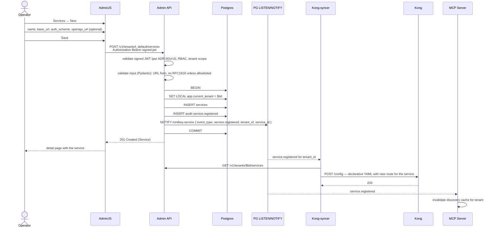

# F‑OP‑02 — Register a service (with optional OpenAPI link)

## Goal
A logged‑in operator registers a new backend service in the active tenant; an optional OpenAPI URL is attached for downstream agent discovery.

## Actors
- **Operator** (browser, AdminJS).
- **Admin API**, **Postgres**, **change channel** (Postgres LISTEN/NOTIFY).
- Subscribers consuming the resulting `service.registered` event: **Kong‑syncer**, **MCP Server**.

## Pre‑conditions
- [F‑OP‑01](F-OP-01-bootstrap-and-login.md) complete; operator logged in with `role >= AgentOwner`.
- The operator has an active tenant (or `is_platform_admin` and a chosen tenant).

## Post‑conditions
- New row in `services` with `tenant_id`, `name`, `base_url`, `auth_scheme`, optional `openapi_url`, optional `openapi_etag`, `created_by = operator_id`.
- `service.registered` audit event with payload referencing the new service.
- `service.registered` change event published on `mintkey:service` channel.
- Kong‑syncer pushes updated declarative YAML to Kong.
- MCP Server invalidates its discovery cache for the tenant.

## Sequence diagram

## Quality attribute scenarios touched
- [S‑AUD‑1](../01-architecture/03-quality-attributes.md) — service registration audited.
- [S‑MT‑1](../01-architecture/03-quality-attributes.md) — tenant scoping enforced via RLS + middleware.
- [S‑OPS‑2](../01-architecture/03-quality-attributes.md) — change propagation to Kong via the syncer.

## Failure modes
| Failure | Detection | Behavior |
|---------|-----------|----------|
| Invalid `base_url` (non‑https in non‑dev mode) | Pydantic validator | 422 with field error |
| Internal IP without explicit allowlist | server‑side check (per [ADR‑0007](../01-architecture/adr/0007-proxy-deployment-topology.md)) | 422 |
| Duplicate service name within tenant | Postgres unique constraint | 409 with `mintkey:code = service_name_taken` |
| Operator lacks `AgentOwner+` role | RBAC check | 403 |
| `openapi_url` unreachable (validation only — best‑effort) | optional probe times out | warning; service still saved |
| Change channel publish fails | inside the same transaction → rollback | DB has no row, no audit, no notification — caller gets 500 |
| Kong‑syncer push fails | retry with backoff; alarm after N failures | service is in DB but Kong has stale config — reconciliation job catches it on next pull |

## Test plan

### Unit tests
- `service.input_validator` — base_url URL form, scheme (`http` rejected outside dev), private IP rejection, name uniqueness pre‑check.
- `service.create_handler` — call sequence: validate → INSERT → INSERT audit → NOTIFY → COMMIT.
- Pydantic model coverage: every field, every constraint.

### Integration tests (testcontainers — Postgres + Kong + admin‑api + kong‑syncer)
- Happy path: POST → assert row + audit + NOTIFY received by a subscriber stub.
- Concurrent: two operators register two services with the same name → one succeeds, one fails with 409.
- Cross‑tenant: an `AgentOwner` in tenant A cannot create a service in tenant B (URL form: 403; implicit form: targets A).
- Kong‑syncer integration: register service → assert Kong's declarative config has the new route within 2 s.

### Live smoke
- Part of E2E‑01 Phase 3.

## Kiro spec inputs
- **Components**: `admin-api/services/services_handlers.py`, `kong-syncer/internal/syncer.go`, `mintkey-models/Service` schemas.
- **Contract**: `POST /v1/tenants/{tid}/services` in `docs/contracts/rest/openapi.yaml`; `service.registered` in `docs/contracts/events/audit-event.schema.json` and `change-event.schema.json`.
- **Tasks**:
  1. Write integration test asserting the row + audit + NOTIFY pipeline.
  2. Implement Pydantic model + validator.
  3. Implement handler.
  4. Implement Kong‑syncer change‑channel listener and push.
  5. Add concurrent‑duplicate test; fix race if any.
  6. Add cross‑tenant test.
