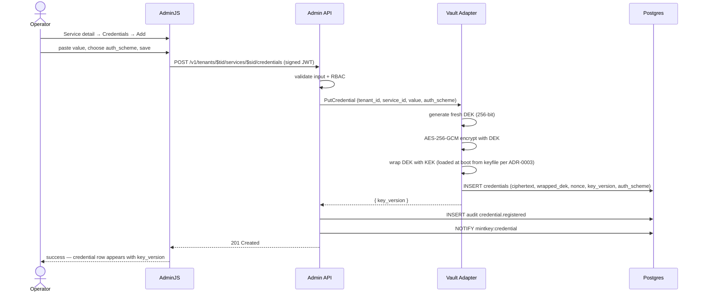
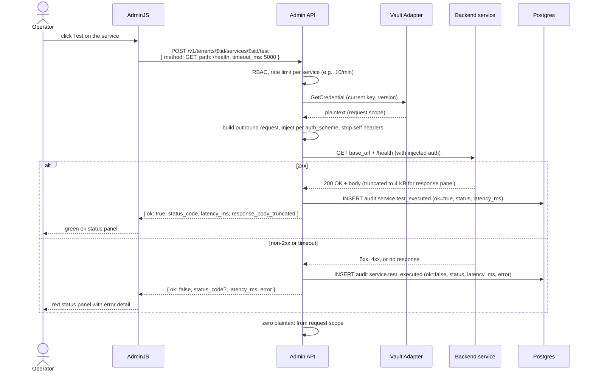

# F‑OP‑03 — Register a credential and test it

## Goal
The operator stores a credential for a registered service (envelope‑encrypted via the Vault Adapter) and verifies it works against the backend by clicking the **Test** button — without ever seeing the credential plaintext after submission.

## Actors
- **Operator** (browser, AdminJS).
- **Admin API**, **Vault Adapter**, **Postgres**, **change channel**, **Backend service**.

## Pre‑conditions
- [F‑OP‑02](F-OP-02-register-service.md) complete; service `svc_demo` exists.
- Operator has the credential value (an API key, OAuth client secret, basic‑auth pair, or PEM bundle for mTLS).

## Post‑conditions
- New row in `credentials` for `(tenant_id, service_id, key_version=N+1)` storing AES‑256‑GCM ciphertext + nonce + key_version.
- `credential.registered` audit event.
- `credential.rotated` change event (when this is not the first credential — semantic equivalence: a new key_version is "rotation").
- Optional: a `service.test_executed` audit event with `ok=true|false`, status_code, latency_ms (if the operator clicked Test).

## Sequence diagram — register credential

## Sequence diagram — test the service

## Quality attribute scenarios touched
- [S‑SEC‑1](../01-architecture/03-quality-attributes.md) — operator's plaintext only appears in the request body to the FastAPI; never in any response after save; never in audit logs.
- [S‑SEC‑2](../01-architecture/03-quality-attributes.md) — credential at rest is AES‑256‑GCM ciphertext; KEK is in keyfile per [ADR‑0003](../01-architecture/adr/0003-credential-storage-strategy.md).
- [S‑OPS‑2](../01-architecture/03-quality-attributes.md) — credential rotation propagates to subscribers via the change channel.
- [S‑AUD‑1](../01-architecture/03-quality-attributes.md) — registration and tests audited.

## Failure modes
| Failure | Detection | Behavior |
|---------|-----------|----------|
| Vault Adapter unreachable | gRPC error | API returns 503; UI shows retry; no DB write |
| KEK not loaded (boot failure) | Vault Adapter readiness probe | `/v1/ready` is failing; API rejects with 503 |
| Service doesn't exist or is in another tenant | RLS or 404 | 404; audit `auth.access.denied`? *(audit on access denial — covered in [F‑OP‑05](#) future)* |
| Test‑run target returns 401 | downstream auth wrong | `service.test_executed` ok=false; UI surfaces 401 with the actual upstream response code |
| Test‑run target times out | configurable per‑request timeout (default 5 s) | ok=false with `error: timeout`; latency_ms = timeout duration |
| Test‑run hits a host on the deny list | proxy refuses (RFC1918, link‑local, metadata IP) | 422 with `mintkey:code = forbidden_destination` |
| Test‑run abused for SSRF probing | per‑service rate limit | 429 |

## Contract additions (iteration 4 backlog)
- `POST /v1/tenants/{tid}/services/{sid}/test` request and response schemas.
- `service.test_executed` audit event schema with payload `{ method, path, status_code, latency_ms, ok, error }` (no body content; that stays in the synchronous response only).

## Test plan

### Unit tests
- `vault_adapter.encrypt_credential` — AES‑256‑GCM with a fresh DEK; round‑trip identity.
- `vault_adapter.wrap_dek` — KEK from keyfile path; failure if absent.
- `service.test_run.build_request` — header injection per `auth_scheme` (api_key_header, api_key_query, bearer_token, basic_auth, oauth2, oidc, mtls — every variant covered).
- `service.test_run.timeout` — request honors the configured timeout.
- `service.test_run.host_allowlist` — RFC1918, link‑local, metadata IP, opt‑in mode.

### Integration tests (testcontainers)
- Register a credential; assert ciphertext stored; decrypt via Vault Adapter; assert plaintext matches.
- Register two credentials in sequence; assert key_versions monotonically increase; only the latest is "current".
- Test‑run against a stub backend that returns 200; assert ok=true, audit event present.
- Test‑run against a stub backend that returns 401; assert ok=false, audit event present.
- Test‑run against a stub that times out; assert ok=false with `error: timeout` and latency_ms = timeout.
- Cross‑tenant: operator in A cannot register credential for service in B (RLS rejects).

### Live smoke
- Part of E2E‑01 Phase 4.

### Red‑team / security tests
- Plaintext in logs: full‑text search on emitted logs (control‑plane and data‑plane) for known plaintext fingerprints; assert zero matches.
- Plaintext in audit payload: assert `service.test_executed` audit doesn't contain the credential value.
- Replay: re‑POST the same `jti` AdminJS→FastAPI signed envelope; assert 401 due to denylist ([ADR‑0016.1](../01-architecture/adr/0016-round-2-corrections.md)).

## Kiro spec inputs
- **Components**: `apps/vault-adapter` (Go), `apps/admin-api/services/credentials_handlers.py`, `apps/admin-api/services/test_run_handler.py`.
- **Contract additions**: noted above.
- **Tasks** (TDD):
  1. Write Vault Adapter integration test asserting envelope encryption + roundtrip.
  2. Implement Vault Adapter `PutCredential` and `GetCredential`.
  3. Write API integration test: register credential → audit emitted → change event published.
  4. Implement FastAPI handler.
  5. Write test‑run integration test (happy path against stub, 401, timeout).
  6. Implement test‑run handler (rate limit per service, host allowlist).
  7. Write red‑team plaintext‑in‑logs test; tighten redaction in logging middleware until pass.
  8. Add the per‑auth‑scheme injection variants.
