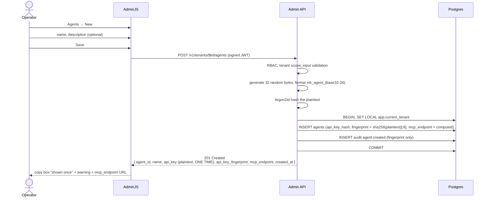
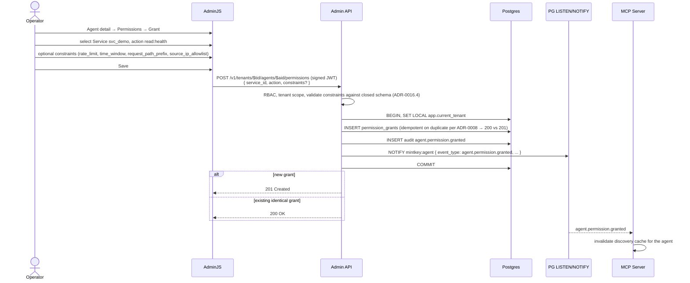

# F‑OP‑04 — Create an agent and grant permissions

## Goal
Operator creates an agent identity (gets the API key plaintext **once**) and grants it permission to perform a specific `(service, action)` — optionally with ABAC constraints (rate limit, time window, path prefix, IP allowlist).

## Actors
- **Operator** (browser, AdminJS).
- **Admin API**, **Postgres**, **change channel**.
- Subscribers consuming the resulting events: **MCP Server** (invalidate discovery cache), **Egress Proxy plugin** (accept the agent's tokens).

## Pre‑conditions
- [F‑OP‑02](F-OP-02-register-service.md) and [F‑OP‑03](F-OP-03-register-credential-and-test.md) complete.
- Operator has `role >= AgentOwner` for the active tenant.

## Post‑conditions
- New row in `agents` with Argon2id‑hashed `api_key_hash`, `created_by`, `mcp_endpoint` (computed: `${MINTKEY_MCP_PUBLIC_URL}/v1`), `tenant_id`.
- The plaintext Agent API Key is returned **once** in the create response and never again.
- `agent.created` audit event with payload containing the API key fingerprint (last 4 chars + truncated SHA‑256 prefix), **not the key itself**.
- New row in `permission_grants` with `(agent_id, service_id, action, constraints)`.
- `agent.permission.granted` audit event.
- `service.* / agent.*` change events published as appropriate.

## Sequence diagram — create agent

## Sequence diagram — grant a permission

## Quality attribute scenarios touched
- [S‑SEC‑3](../01-architecture/03-quality-attributes.md) — permission grant carries `(agent, service, action)` and bounded constraints.
- [S‑AUD‑1](../01-architecture/03-quality-attributes.md) — agent creation and permission grants audited.
- [S‑MT‑1](../01-architecture/03-quality-attributes.md) — agent and grant rows are tenant‑scoped; RLS prevents cross‑tenant access.
- [S‑OPS‑1](../01-architecture/03-quality-attributes.md) — granted permissions are revocable in seconds (covered in F‑OP‑06 future).

## Failure modes
| Failure | Detection | Behavior |
|---------|-----------|----------|
| Agent name already exists in tenant | unique constraint | 409 |
| Constraint validation fails (closed schema per [ADR‑0016.4](../01-architecture/adr/0016-round-2-corrections.md)) | Pydantic | 422 |
| Operator lacks `AgentOwner+` for the target service's tenant | RBAC | 403 |
| Granting permission for a service that doesn't exist or in another tenant | RLS / 404 | 404 |
| Concurrent grant of the same `(agent, service, action)` | unique constraint + idempotency | 200 OK with the existing record |
| Plaintext API key leaked into a log | red‑team test | catastrophic — must be impossible by construction; redaction middleware enforced |

## Contract considerations
- The Agent create response is the **only** place the plaintext API key appears. The OpenAPI schema marks `api_key` with `x-mintkey-sensitive: true` and explicitly notes "returned once at create time, never again" in the description.
- The mcp_endpoint URL is computed from `MINTKEY_MCP_PUBLIC_URL` env var + agent ID (shape: `${MINTKEY_MCP_PUBLIC_URL}/v1/agents/{agent_id}`); not persisted (always the current value).

## Test plan

### Unit tests
- `agent.generate_api_key` — 32 random bytes, ULID encoding, prefix `mk_agent_`.
- `agent.argon2id_hash` — fast verify path; constant‑time compare.
- `permission.constraints_validator` — every constraint shape (rate_limit, time_window, request_path_prefix, source_ip_allowlist); rejects unknown keys.
- Idempotency: duplicate `(agent, service, action, constraints)` returns 200; differing constraints returns 409.

### Integration tests (testcontainers)
- Create agent → assert hash row + fingerprint audit + plaintext returned exactly once.
- Subsequent GET on the agent returns no `api_key` field.
- Grant permission → assert row + audit + change event received by an MCP Server stub that invalidates its cache.
- Cross‑tenant: operator in A cannot create an agent in B; cannot grant permission for service in B (URL form 403; implicit form scopes to A).
- Audit fingerprint test: creating the same agent twice (would fail uniqueness, but in a fresh case) → audit fingerprint is repeatable; plaintext is not in audit.

### Live smoke
- Part of E2E‑01 Phase 5.

### Red‑team / security tests
- Plaintext API key search across all logs after agent creation: zero matches.
- Audit `agent.created` payload examined: only the fingerprint and last‑4 chars present, never the plaintext.

## Kiro spec inputs
- **Components**: `apps/admin-api/services/agents_handlers.py`, `apps/admin-api/services/permissions_handlers.py`, `packages/python/mintkey-models/Agent` and `PermissionGrant`.
- **Contracts**: `POST /v1/tenants/{tid}/agents`, `POST /v1/tenants/{tid}/agents/{aid}/permissions` in OpenAPI; `agent.created`, `agent.permission.granted` in audit‑event schema; `Constraints` object from [ADR‑0016.4](../01-architecture/adr/0016-round-2-corrections.md).
- **Tasks** (TDD):
  1. Write integration test for agent creation including the "plaintext returned once" property.
  2. Implement handler.
  3. Add red‑team plaintext‑in‑logs test.
  4. Implement constraint validator + tests against the closed schema.
  5. Implement permission grant handler with idempotency.
  6. Add change‑channel publish test using a subscriber stub.
