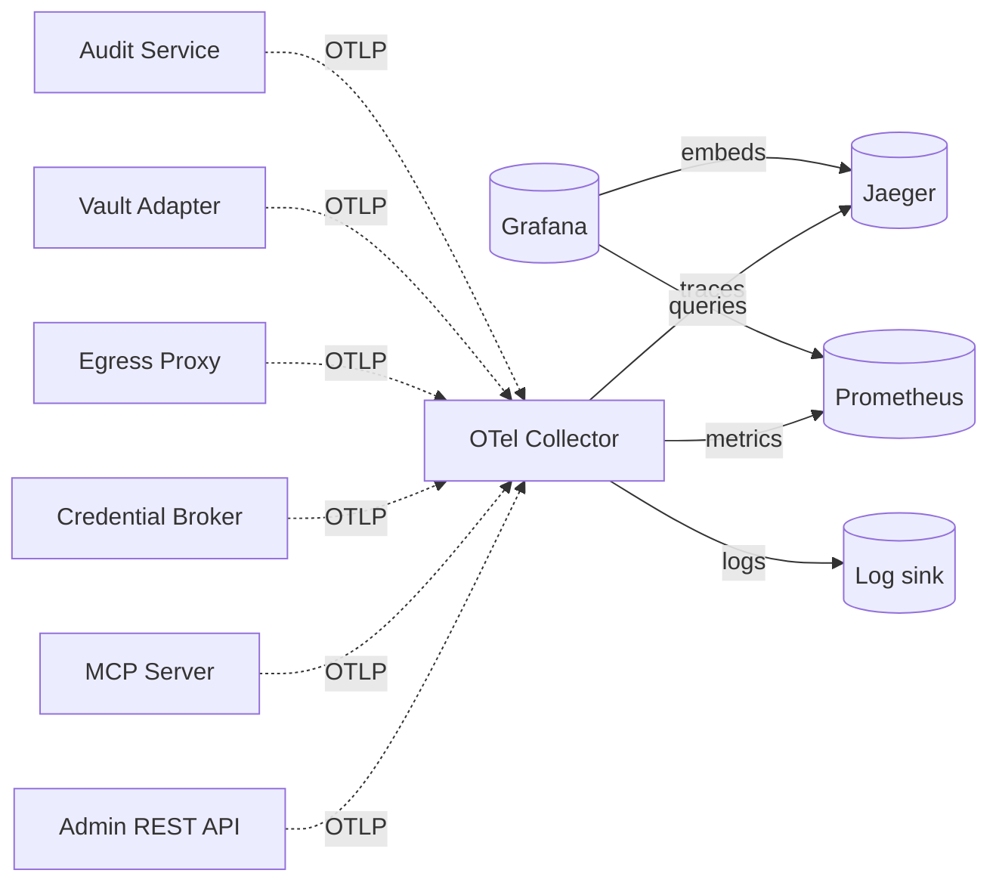

# Observability strategy

The observability stack is a first‑class deliverable, not an afterthought. Goal: from any one symptom (operator complaint, agent error, latency spike) we can navigate to the offending span in under three clicks.

## High‑level intent (iteration 1)

- **Traces**: OpenTelemetry, OTLP/gRPC, exported to Jaeger. End‑to‑end correlation across MCP discovery → token issuance → proxy → backend.
- **Metrics**: OpenTelemetry, exported to Prometheus. RED metrics (Rate, Errors, Duration) per container; per‑service drill‑downs.
- **Logs**: structured JSON via OTel logs pipeline; correlated to traces via `trace_id`/`span_id`.
- **Dashboards**: Grafana, with pre‑baked dashboards shipped in the repo.

## Required signals (preview)

| Signal                                  | Type    | Per‑label dimensions                                  |
|------------------------------------------|---------|--------------------------------------------------------|
| `mintkey.token.issued.total`             | counter | `agent`, `service`, `action`, `outcome`               |
| `mintkey.proxy.request.duration_seconds` | hist    | `service`, `action`, `outcome`                        |
| `mintkey.proxy.upstream.duration_seconds`| hist    | `service`                                              |
| `mintkey.vault.decrypt.duration_seconds` | hist    | `backend` (`vault`/`sql_kms`)                          |
| `mintkey.audit.events.total`             | counter | `event_type`                                           |
| `mintkey.identity.revocation_lag_seconds`| gauge   | per propagation hop                                    |

## Coming in iteration 2 (detail)
- Span naming conventions.
- Required metric set per container (full list).
- PII / credential redaction policy in spans (mandatory CI assertion — see threat model S‑INF‑*).
- Sampling strategy (head‑based, plus tail‑sampling on slow / error traces).
- Retention and storage sizing for the Docker Compose MVP.

## Non‑goals
- We do not own the observability backends; we *emit* OTLP and ship reasonable defaults.
- We do not optimize for observability cost at scale — that's a deployment concern.
