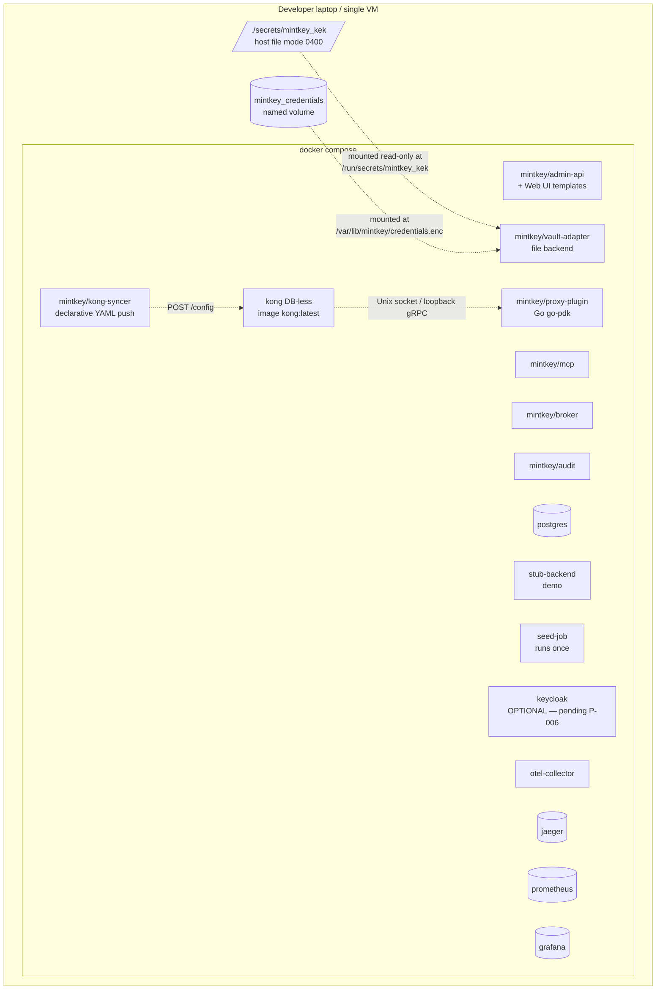

# Deployment — Docker Compose for MVP, with a forward path

## High‑level intent (iteration 1)

- MVP target: a single `docker compose up` that starts the full stack on a developer laptop, including the observability stack and a stubbed backend service for end‑to‑end demo.
- A `seed` service runs once and creates the initial admin operator account and (optionally) a demo service + agent.
- Each container in [`../01-architecture/02-container-view.md`](../01-architecture/02-container-view.md) maps to one service in compose, with the exception that the Audit Service may run in‑process with the Admin REST API for the MVP (with a clean migration to a separate service later).

## Sketch

The data‑plane node hosts **Kong Gateway (DB‑less)** plus our **Go proxy plugin** (per [ADR‑0004](../01-architecture/adr/0004-egress-proxy-kong.md)). The control‑plane node hosts the **Kong‑syncer** that translates our service registry into Kong declarative YAML and pushes to Kong's `/config` endpoint on operator events. **Keycloak** is shown as optional pending the outcome of [P‑006](../proposal/P-006-admin-tech-stack-and-auth.md).

The KEK keyfile and the encrypted credentials volume are mounted from the host into the Vault Adapter container. The credentials volume is a Docker named volume so it survives `docker compose down` and image rebuilds; the KEK keyfile is a host file with restrictive permissions (0400, owned by the user running compose). v1 has no KMS dependency; the upgrade path to v2 (HashiCorp Vault) and v3 (SQL+KMS) is purely a backend swap behind the same Vault Adapter interface ([ADR‑0003](../01-architecture/adr/0003-credential-storage-strategy.md)).

## Coming in iteration 2 (detail)
- Concrete `docker-compose.yml` with images, ports, volumes, and env contracts.
- Network topology (control plane and data plane on separate user‑defined networks).
- Secret bootstrap (KMS emulator vs. real cloud KMS via local credentials).
- Seed script details and idempotency.
- Forward path to Kubernetes (Helm chart sketch, where the proxy lives, etc.) — *spec only, not built*.

## Why Docker Compose first
- Fastest iteration loop for the architecture–implementation handoff.
- Closest to the way self‑hosters will run it on day one.
- Forces us to think about per‑container observability hooks early.

## Forward path (sketch — iteration 2 will detail)
- Same container images, deployed by Helm chart.
- Control plane and data plane as separate Deployments with separate HPA targets.
- KMS via cloud KMS (AWS KMS / GCP KMS / Azure Key Vault) — same Vault Adapter abstraction.
- Audit log archived to S3‑compatible immutable storage with object lock.
