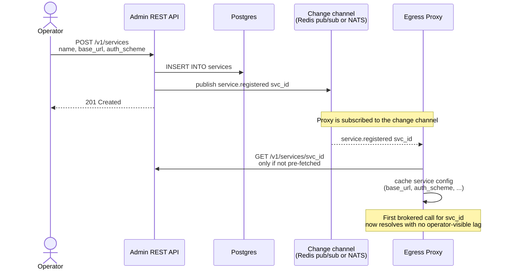
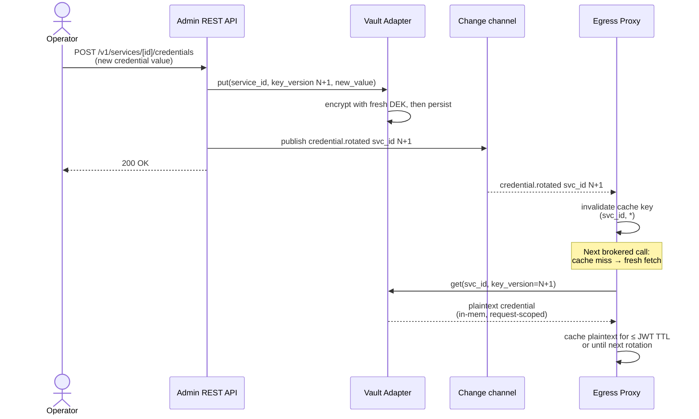
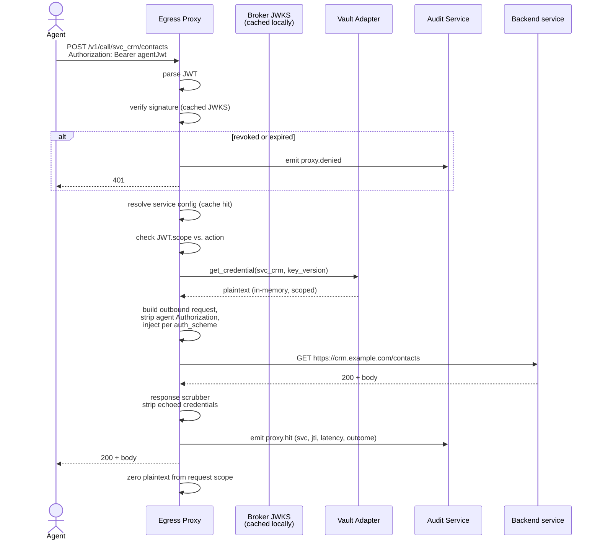

# P‑005 — Egress Proxy implementation

**Status**: Accepted (→ [ADR‑0004](../01-architecture/adr/0004-egress-proxy-kong.md)) — 2026-05-10. Selected Option G (Kong DB‑less + Go plugin).

> **Outcome**: Selected **Option G — Kong Gateway (DB‑less) + Go plugin via go‑pdk**. The proposal's primary recommendation was J (Envoy + ext_authz); G was selected for its larger off‑the‑shelf surface, lower operational complexity, and stronger plugin ecosystem at v1 scale. J is preserved as the documented upgrade path. See [ADR‑0004](../01-architecture/adr/0004-egress-proxy-kong.md) for the rationale.

## Question
What software runs the **Egress Proxy** (D1 in [`02-container-view.md`](../01-architecture/02-container-view.md))? Specifically:
- Can we use NGINX (or NGINX + OpenResty)?
- Can it switch credentials on the fly when an operator rotates one?
- Can it pick up a newly registered service without a restart?

## Context

### What the proxy actually has to do (the function we're choosing an implementation for)
1. Terminate inbound HTTPS from the agent.
2. Extract the brokered JWT (from `Authorization: Bearer …` or a custom header).
3. Verify the JWT signature against the broker's JWKS (cached, refreshed, ≤ 5 min TTL).
4. Reject if the JWT is revoked (consult the revocation channel — see [P‑003](P-003-token-format-and-binding.md)).
5. Resolve `service_id = JWT.aud` to a registered service (base URL, auth scheme, allowed actions, OpenAPI metadata).
6. Validate the request path/method against `JWT.scope`.
7. Fetch the credential for the service via the Vault Adapter, cached on `(service_id, key_version)` with plaintext lifetime ≤ JWT TTL.
8. **Mutate the outbound request**: strip the agent's `Authorization`, inject the credential per the service's auth scheme.
9. Forward the request to the **registered** base URL of the service. **No agent‑supplied routing.**
10. Stream the response back. Scrub known credential locations from the response (`Authorization`, `Cookie`, body fields).
11. Emit OTel spans + audit events (token use, latency, outcome).
12. Zero plaintext credentials after request scope.

### Quality‑attribute constraints
- [S‑PERF‑1](../01-architecture/03-quality-attributes.md#sperf1--proxy-latency-overhead-is-bounded) — p50 added latency ≤ 10 ms; p99 ≤ 30 ms; under 100 RPS per instance.
- [S‑OPS‑1](../01-architecture/03-quality-attributes.md) — agent revoke ≤ 5 s.
- [S‑OPS‑2](../01-architecture/03-quality-attributes.md) — credential rotation propagated ≤ 30 s.
- [S‑MOD‑1](../01-architecture/03-quality-attributes.md) — adding a new auth scheme touches ≤ 3 files in the proxy.
- [S‑AVAIL‑1](../01-architecture/03-quality-attributes.md) — control plane outage doesn't break in‑flight (proxy must verify JWTs locally).

### Threat‑model constraints
The proxy is the **highest blast‑radius component** — it sees plaintext credentials in process memory. Therefore:
- Small attack surface, hardened image, no plugin loading at runtime.
- Auditable codebase.
- Minimal dependency tree (every transitive dep is part of the credential‑sees memory boundary).

## Options

We surveyed plain proxies, OSS API gateways, cloud‑native data planes, and a from‑scratch implementation. Options are grouped by where the work lives.

### Ruled out
- **A. Plain NGINX OSS** — static config, no JWT verification in OSS, no per‑request credential fetch. Wrong shape.
- **F. HAProxy + Lua/SPOE** — sweet spot is L4/L7 load balancing; SPOE is awkward for header‑mutation patterns. Wrong shape.

### Heavy custom code (de‑recommended given the off‑the‑shelf preference)

#### B. NGINX + OpenResty (raw)
Build the whole thing in Lua on top of OpenResty primitives. ~1500–3000 lines of Lua; separate testing toolchain (busted); awkward memory hygiene for plaintext credentials in `ngx.shared.dict`. Battle‑tested pattern (Kong was originally this) but **you reinvent what Kong/APISIX already give you**. Drop in favor of G or I.

#### D. Custom Go proxy *(was the previous draft's recommendation)*
A Go binary on `net/http` and `httputil.ReverseProxy`. ~500–800 lines of Go. Smallest *trusted memory* footprint; same language as the rest of the stack; full control over zeroization and HTTP semantics. Cost: we own HTTP edges (timeouts, slowloris, h2, redirects, connection pooling). **Still valid if smallest‑attack‑surface trumps everything**, but no longer recommended now that off‑the‑shelf options are in scope.

### Off‑the‑shelf gateway + small plugin / module *(recommended direction)*

#### E. Caddy + custom Go module
Caddy is a single Go binary with a clean admin API and a Go module system. The `caddy-jwt` plugin handles JWT validation. We write a small custom HTTP handler module (~150–250 lines Go) that fetches the credential from the Vault Adapter and sets the appropriate header, then delegates to Caddy's built‑in `reverse_proxy`. The module is compiled into the binary via `xcaddy build`. Dynamic services are pushed via Caddy's admin API on operator events.
- **Pros**: simplest ops (one Go binary, one Go runtime); minimal custom code; clean live‑reload model.
- **Cons**: smaller "API gateway" ecosystem than Kong/APISIX; modules are compiled‑in (no runtime plugin loading); fewer ready‑made plugins for rate limiting, audit, etc.

#### G. Kong Gateway (DB‑less) + Go plugin via `go-pdk`
Kong is the most‑deployed OSS API gateway. **DB‑less mode** reads a YAML manifest at startup and via the admin `/config` endpoint — Kong itself needs no Postgres. JWT validation is a stock plugin. Per‑request credential injection is a Go plugin (~200–300 lines using `go-pdk`). On operator events we push updated YAML to Kong's `/config` endpoint via a small "kong‑syncer" component (~100–150 lines Go).
- **Pros**: most documented for this exact pattern; mature plugin ecosystem (Prometheus, OTel, Jaeger plugins out of the box); rate limiting, ACL, request transformation all stock.
- **Cons**: Kong's core is Lua/OpenResty (large dependency surface in trusted memory); Go plugins via `go-pdk` run as a separate process; declarative‑config push is the propagation channel — eventually consistent.

#### H. Tyk Gateway + Go gRPC plugin
Tyk is a Go‑based OSS API gateway. Built‑in JWT validation. Plugins via gRPC (out‑of‑process) or Go native (compiled‑in). Custom plugin: ~200–300 lines Go.
- **Pros**: Go all the way down; clean ops; plugin model fits our stack.
- **Cons**: Tyk OSS has trended toward feature gating over time (corporate‑direction risk); smaller community than Kong/APISIX.

#### I. Apache APISIX + custom plugin
APISIX is the Apache‑foundation OSS gateway, built on OpenResty, **etcd‑backed for dynamic config** (the strongest dynamic‑config story of the bunch — etcd watches push immediately). Built‑in JWT plugin. Custom plugin in Lua, Wasm, or external (Go via gRPC `ext-plugin`).
- **Pros**: most rigorous dynamic‑config propagation (etcd watch); active Apache project; ext‑plugin lets us write the plugin in Go.
- **Cons**: requires etcd as an additional component; OpenResty core (same dependency‑surface concern as Kong); plugin ecosystem younger than Kong's.

### Cloud‑native data plane

#### C. Envoy + `ext_proc`
Envoy as the proxy with our logic in a gRPC `ExternalProcessor` server (Go). xDS pushes dynamic config. `ext_proc` is heavyweight: full request‑and‑response streaming.
- **Verdict**: defer; revisit only if we need response‑body mutation or full bidirectional inspection.

#### J. Envoy + `ext_authz` + xDS via `go-control-plane`  *(the leaner Envoy variant)*
Same cloud‑native foundation, **simpler interface**. `ext_authz` is the canonical Envoy filter for "ask an external service for OK/DENY plus headers to add" — which is **literally** our problem. We write:
- A small Go `ext_authz` gRPC service (~250–400 lines): validates JWT, looks up service, fetches credential, returns OK with `headers_to_add`.
- A small Go xDS server using `go-control-plane` (~200–300 lines): turns our service registry into Envoy CDS/RDS resources; pushes on operator events.
- An Envoy bootstrap config (~100 lines YAML).

Total custom code: ~450–700 lines Go + YAML.

- **Pros**: `ext_authz` is the **de‑facto cloud‑native pattern** for header injection / authorization (Istio, OPA, Authelia, many enterprise stacks all implement or consume this exact interface). Envoy gives us best‑in‑class HTTP machinery, native OTel, rich observability. xDS is the gold standard for dynamic config.
- **Cons**: more total components than Caddy or Kong; Envoy is a heavyweight C++ dependency in trusted memory; YAML config is verbose; running an xDS control plane needs deliberate ops practice. Operationally non‑trivial but extensively documented.

## Comparison matrix

Most differentiating dimensions only. ✓✓ = strong, ✓ = adequate, ⚠ = caveat, ✗ = no.

| Dimension                                          | B. OpenResty | C. Envoy+ext_proc | D. Custom Go | E. Caddy+module | G. Kong+plugin | H. Tyk+plugin | I. APISIX+plugin | **J. Envoy+ext_authz** |
|----------------------------------------------------|:------------:|:-----------------:|:------------:|:---------------:|:--------------:|:-------------:|:----------------:|:----------------------:|
| OSS / self‑host friendly                           | ✓✓           | ✓✓                | ✓✓           | ✓✓              | ✓✓             | ⚠              | ✓✓                | ✓✓                     |
| JWT validation off‑the‑shelf                       | lib only     | ✓ filter         | lib only     | ✓ caddy‑jwt    | ✓ jwt plugin   | ✓             | ✓ jwt plugin      | ✓ jwt_authn            |
| Per‑request credential fetch (out of the box)      | custom Lua   | custom ext_proc  | custom Go    | custom module   | custom plugin  | custom plugin | custom plugin     | **canonical ext_authz**|
| Dynamic service config (no restart)                | shared dict  | xDS              | in‑proc       | admin API       | /config push   | admin API     | etcd watch        | xDS                    |
| Lines of new code we own                           | ~2000 Lua    | ~1000 Go + xDS   | ~500–800 Go  | **~250 Go**     | ~300–450 Go    | ~250 Go       | ~250–400 Go       | ~450–700 Go            |
| Binaries on a data‑plane node                      | 1            | 2–3              | **1**        | **1**           | 2              | 2             | 1–2               | 2                      |
| Added p50 latency (rough)                          | ~5 ms        | ~5–10 ms         | ~3–8 ms      | ~3–8 ms         | ~5–8 ms        | ~5–8 ms       | ~5 ms             | ~5–10 ms (UDS hop)     |
| Trusted‑memory dependency surface                  | medium       | huge (C++)       | **small**    | medium (Go)     | large (OpenResty) | medium (Go) | large (OpenResty) | huge (C++)             |
| Operator skill to debug                            | nginx + Lua  | Envoy + Go       | Go           | Caddy + Go      | Kong + Go      | Tyk + Go      | APISIX + Lua/Go   | Envoy + Go             |
| Maturity for our exact pattern                     | ✓✓ Kong‑style| ✓✓ Istio‑style   | we own it    | ⚠ less docs     | ✓✓             | ✓             | ✓✓                | ✓✓ canonical            |
| Suits S‑PERF‑1 (≤ 10 ms p50)                       | ✓            | ⚠                | ✓            | ✓               | ✓              | ✓             | ✓                 | ⚠ borderline           |
| Suits S‑MOD‑1 (≤ 3 files for new auth)             | ✗            | ✓                | ✓            | ✓               | ✓              | ✓             | ✓                 | ✓                      |

## Direct answers to the asked questions

### Can we use NGINX?
- **Plain NGINX (OSS)**: no — static config, no JWT in OSS, no per‑request credential fetch.
- **NGINX + OpenResty (Lua, raw)**: technically yes (Kong was originally built on it). For our scope, you reinvent what Kong/APISIX already give you. **Recommend using Kong (G) or APISIX (I) instead of raw OpenResty.**
- **NGINX Plus**: would satisfy more, but commercial; rejected on OSS grounds.

### Can it be off‑the‑shelf with mostly configuration?
Yes — **the four off‑the‑shelf candidates are E (Caddy+module), G (Kong+plugin), H (Tyk+plugin), and I (APISIX+plugin), plus J (Envoy+ext_authz) as the cloud‑native variant.** All five accept "configure the gateway, write a small plugin/module/service for the credential‑injection bit". Custom code in each ranges from ~250 to ~700 lines of Go.

The credential injection itself is **not a stock feature** in any gateway (it requires a per‑request fetch from our Vault Adapter that the gateway doesn't natively know about). The gateway gives us:
- HTTP edge handling (timeouts, slowloris, h2, redirects, connection pooling).
- JWT validation (stock plugin).
- Dynamic service config (admin API, /config push, or xDS).
- Observability (Prometheus, OTel, Jaeger plugins or native).
- Rate limiting, ACL, etc. (stock plugins, free if/when we want them).

We supply: the credential fetch + header injection + audit emission, as a plugin/module/sidecar.

### Can it switch credentials on the fly?
Yes — for any non‑ruled‑out option. The proxy (or its plugin) holds a small in‑memory cache of plaintext credentials keyed by `(service_id, key_version)`. On rotation, an event invalidates the cache; the next request fetches the new credential from the Vault Adapter. Worst‑case lag is bounded by `min(cache TTL, change‑channel latency)` — sub‑second in normal operation; bounded by cache TTL (default 5 min) if the change channel is unavailable.

### Can it auto‑detect a new service we configure?
Yes — for any non‑ruled‑out option. Two patterns combined:
- **Pull**: short‑TTL service cache. First call for an unseen service fetches from the admin API or registry.
- **Push**: the change channel (which we already need for token revocation per [P‑003](P-003-token-format-and-binding.md)) carries `service.registered` / `service.updated` events. The propagation channel is gateway‑specific:
  - **Caddy / Kong / Tyk**: push to the gateway's admin API.
  - **APISIX**: write to etcd; APISIX watches.
  - **Envoy + xDS**: push to xDS, Envoy subscribes.

If the change channel is down, the system degrades to pure pull with a small lag. No failure.

## Flows

### Service auto‑detection flow (pattern is the same for any chosen proxy)

### Credentials switching (rotation) flow

Properties:
- The proxy never holds two versions of the credential simultaneously. On rotation, the old plaintext is invalidated; the next request fetches the new one.
- Worst‑case lag: `min(cache TTL, change‑channel latency)`. Sub‑second in normal operation.
- If the change channel is unavailable, cache TTL bounds the lag (default ≤ 5 min, configurable per service).

### Per‑request lifecycle (illustrative — same shape regardless of which proxy we pick)

## Recommendation

The previous draft of this proposal recommended **D (custom Go proxy)** on the grounds of smallest attack surface and tightest control. With the operator preference *"off‑the‑shelf with configuration, not too much custom code"*, the recommendation shifts.

Three off‑the‑shelf options stand out as defensible primary picks. They differ on operational philosophy, not on whether they can do the job (all three can).

### Primary pick — **J. Envoy + `ext_authz` + xDS via `go-control-plane`**
**Why**: `ext_authz` is the canonical cloud‑native pattern for *exactly* our problem ("ask an external service for OK/DENY plus headers to add"). Istio, OPA, Authelia, and many enterprise stacks already implement this interface; we'd be the umpteenth one. xDS is the gold standard for dynamic config — the propagation story is rigorous and well‑documented. Envoy itself gives us best‑in‑class HTTP machinery, native OTel, retries/circuit breakers/connection pooling out of the box.

Our custom code is bounded and *standard‑shaped* — one Go `ext_authz` gRPC service (~300 lines) + a thin xDS server using `go-control-plane` (~250 lines) + ~100 lines Envoy bootstrap YAML. Total ~550 lines we own.

**Cost**: more components on a data‑plane node (Envoy + ext_authz process); Envoy is a heavyweight C++ dependency in trusted memory; YAML config is verbose; xDS ops needs deliberate practice. Operationally non‑trivial **but** every cloud‑native engineer has seen this pattern, so onboarding is straightforward.

### Strong alternative — **G. Kong Gateway (DB‑less) + Go plugin via `go-pdk`**
**Why**: most‑deployed OSS API gateway for this exact pattern. Kong handles HTTP edges, JWT validation, observability plugins (Prometheus, OTel, Jaeger), rate limiting, ACL — all stock. Our custom code is a Go plugin (~250 lines) plus a small kong‑syncer (~150 lines) that pushes declarative config to Kong's `/config` endpoint on operator events. Total ~400 lines we own.

**Cost**: Kong's core is Lua/OpenResty — large dependency surface in trusted memory; declarative‑config push is the propagation channel (eventually consistent); two binaries on the data‑plane node (Kong + plugin server).

### Simplest alternative — **E. Caddy + custom Go module**
**Why**: single Go binary, simplest ops, ~250 lines of custom Go module that integrates with Caddy's admin API and `caddy-jwt`. Best fit if "operational simplicity" weighs more than "industry‑standard pattern".

**Cost**: smaller "API gateway" ecosystem than Kong/APISIX/Envoy; modules compiled in (no runtime plugin loading); fewer ready‑made plugins for advanced features (rate limiting, audit) — though Caddy can do those, just less out‑of‑the‑box.

### Defer — **D. custom Go proxy**
Still architecturally valid. It's the smallest *trusted memory* footprint, which matters for the threat model. Becomes the right answer if and only if a future security review concludes the dependency surface of every off‑the‑shelf gateway is unacceptable.

### Honest trade table

| If your top concern is …                   | Pick |
|---------------------------------------------|------|
| Industry‑standard pattern, future‑proof     | **J — Envoy + ext_authz** |
| Maximum off‑the‑shelf docs and stock plugins| **G — Kong** |
| Simplest ops, single Go binary              | **E — Caddy** |
| Tightest dynamic‑config propagation         | **I — APISIX** (etcd watch) |
| Smallest trusted‑memory footprint           | **D — custom Go** |

### My pick
**J (Envoy + ext_authz)**, with **G (Kong)** as the falling‑back‑gracefully alternative if the Envoy operational complexity is judged too expensive for an early‑stage project. **E (Caddy)** is the least‑effort path and a perfectly good answer if simplicity outweighs pattern conformity.

I would rather defer the J / G / E choice to a 30‑minute conversation with someone who'll operate it than guess from here. If forced to commit now: **J**.

## Implications (depend on the chosen option, but common across J / G / E)
- The proxy gets two channels of config from us:
  1. **Service registry**: pushed via xDS (J), via `/config` push (G), or via admin API (E). Carries `service.registered`, `service.updated`, `service.removed`.
  2. **Credentials/revocation**: the change channel from [P‑003](P-003-token-format-and-binding.md), consumed by our plugin/ext_authz/module to invalidate the in‑plugin credential cache.
- The Vault Adapter exposes a typed `get_credential(service_id, key_version)` over gRPC — same regardless of which gateway we choose.
- The plaintext credential cache (in the plugin / ext_authz) has a hard TTL (≤ JWT TTL, default 5 min, max 10 min) and event‑driven invalidation.
- The container view ([`02-container-view.md`](../01-architecture/02-container-view.md)) gets a follow‑up update once a chosen option lands as an ADR.

## Open follow‑ups (iteration 2)
- **Decide between J / G / E** with operator input. *That decision becomes the next ADR after this proposal.*
- For **J**: which xDS protocol versions to support; SOTW vs. delta‑xDS; whether `ext_authz` runs as a sidecar to Envoy or as a co‑located service.
- For **G**: Kong DB‑less vs. DB mode for v1; `go-pdk` API stability; Kong plugin deployment ergonomics in the docker‑compose MVP.
- For **E**: `xcaddy` build pipeline in CI; Caddy admin API authentication.
- Common to all: choice of change‑channel transport (Redis pub/sub vs. NATS vs. Postgres `LISTEN/NOTIFY`) — its own proposal in iteration 2.
- Common to all: response credential scrubbing implementation (small inline filter? body inspection? skip for v1 and rely on backend hygiene?).
