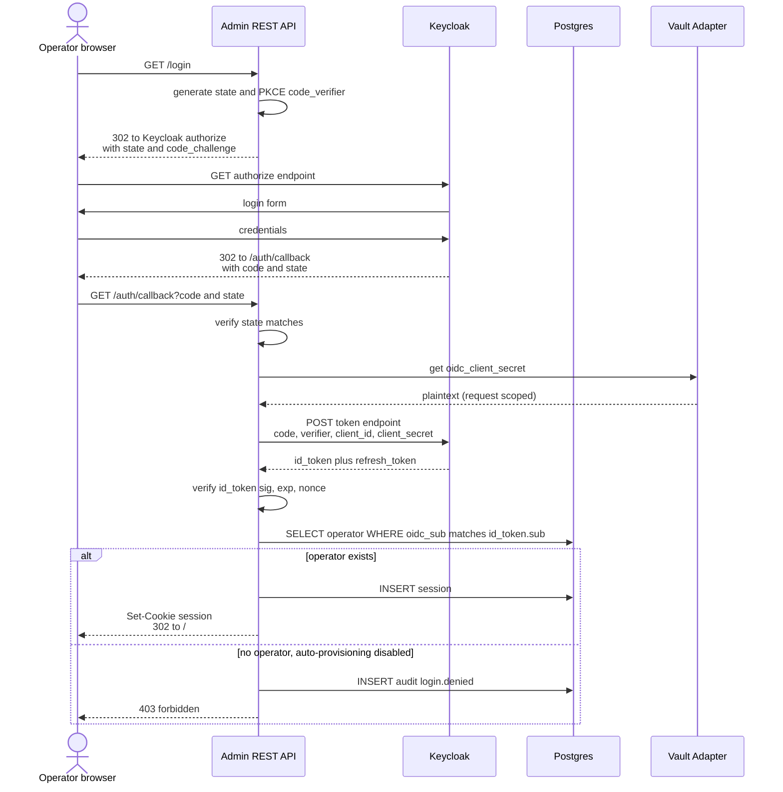
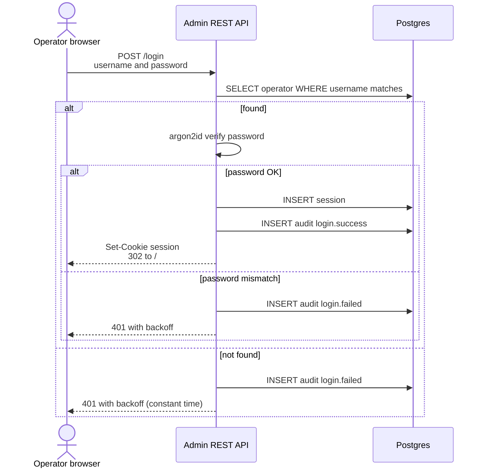

# P‑006 — Admin REST API, Admin Web UI, and Operator Authentication (with Keycloak)

**Status**: Accepted (→ [ADR‑0005](../01-architecture/adr/0005-admin-tech-stack.md)) — 2026-05-10.

> **Outcome**: Selected **6A‑2 (Python + FastAPI)** + **Liquibase migrations** + **PostgreSQL 16** as default DB; **6B AdminJS** (COTS Node.js admin framework) as the Admin Web UI; **6C‑4** Generic OIDC + internal fallback **with Keycloak as the default out‑of‑the‑box IdP** (bundled in compose). The proposal's primary recommendation was 6A‑1 (Go) + 6B‑1 (HTMX); the accepted set differs to maximize off‑the‑shelf surface and minimize custom UI code. See [ADR‑0005](../01-architecture/adr/0005-admin-tech-stack.md) for the full rationale and trade‑offs.

## Question
Three coupled decisions:
- **6A.** What technology powers the **Admin REST API** (C2 in [`02-container-view.md`](../01-architecture/02-container-view.md))?
- **6B.** What technology powers the **Admin Web UI** (C1)?
- **6C.** How do **operators** authenticate, and how does that integrate **Keycloak** (or any OIDC provider)?

## Quick summary (recommendations)

| Decision                     | Recommendation                                                                                  |
|------------------------------|-------------------------------------------------------------------------------------------------|
| **6A.** Admin REST API       | **Go** + `chi` + `sqlc` + `oapi-codegen` + `validator/v10`                                      |
| **6B.** Admin Web UI         | **HTMX + Go `html/template` + Tailwind**, served by the same Admin API binary                   |
| **6C.** Operator auth        | **Generic OIDC** (Keycloak as the documented default IdP) **+ internal user/password fallback** for bootstrap and self‑host MVP |

If you accept all three, this proposal can be promoted to one ADR (or three small ones — your call).

## Context

### Functional surface
The Admin REST API is the only thing operators (and operator‑facing tooling) talk to. It owns:
- CRUD for `Service`, `Credential`, `Agent`, `PermissionGrant`.
- Audit query endpoint.
- Health + readiness.
- The session/auth surface for operators.
- Serving the Admin Web UI HTML.

The Admin Web UI is operator‑only; *not* customer‑facing. The user has been explicit since the vision doc that it is to be **minimalistic**.

### Quality‑attribute pressure
- **Spec‑first development friendliness** — iteration 4 will produce the OpenAPI doc; the API stack must let us round‑trip from the contract to server stubs and types cleanly.
- **Audit chokepoint** — every state‑change handler must emit an audit event. The framework needs to make that easy, not invite drift.
- **Stack cohesion** — Egress Proxy plugin is Go (per [ADR‑0004](../01-architecture/adr/0004-egress-proxy-kong.md)). The Vault Adapter is most likely Go (envelope encryption, KMS clients are best in Go in our ecosystem).
- **Operability** — single `docker compose up` story; no extra build pipelines if avoidable.
- **Threat model** — OIDC integration must satisfy our spoofing/repudiation mitigations; sessions must be HttpOnly Secure SameSite=Strict.

### What's *not* this proposal
- The **MCP Server** (C4): different audience (agents), different authn (Agent API Key), different evolution cadence. Tech stack for the MCP server is a separate ADR in iteration 2.
- **Agent authentication**: Agent API Keys, unchanged by this proposal.

---

## 6A. Admin REST API stack

### Decision drivers
- Stack cohesion (Go is already chosen for the proxy plugin; likely for the Vault Adapter).
- OpenAPI‑first / spec‑driven (Kiro‑friendly, iteration 4 contracts).
- Type‑safe DB access (we want compile‑time safety for the audit + permission flows).
- Good OIDC and OAuth2 client libraries.
- Native OTel instrumentation.
- Test ergonomics (in‑process integration tests against a stubbed Vault Adapter).

### Options

#### 6A‑1. Go + `chi` + `sqlc` + `oapi-codegen` + `validator/v10`  ★ recommended
- `chi` — minimal, idiomatic HTTP router; middleware composition is clean for auth/audit/OTel.
- `sqlc` — generates type‑safe Go from raw SQL; pairs naturally with spec‑first DB schemas.
- `oapi-codegen` — generates server stubs and types from `contracts/rest/openapi.yaml`; pure spec‑first round trip.
- `validator/v10` — input validation declared on the generated types.
- `coreos/go-oidc/v3` + `golang.org/x/oauth2` — OIDC.
- `pgx/v5` — Postgres driver (also used by `sqlc`).
- `go.opentelemetry.io/otel` — OTel SDK.
- **Pros**: cohesion with the rest of the stack; smallest deployable unit (single Go binary serving REST + HTML); excellent TDD story; mature ecosystem.
- **Cons**: less DX‑rich than FastAPI for OpenAPI exploration.

#### 6A‑2. Python + FastAPI + SQLAlchemy + Pydantic v2
- Best‑in‑class OpenAPI‑first DX; auto‑generated docs at `/docs`.
- **Pros**: arguably the fastest spec‑first iteration loop in any language.
- **Cons**: introduces Python to the stack; multi‑process worker model adds ops complexity; less natural for embedding HTMX templates served alongside JSON.

#### 6A‑3. TypeScript (Node.js) + Fastify + Prisma
- Fastify has strong OpenAPI support; Prisma is type‑safe ORM.
- **Pros**: same language as a SPA UI if we went that route.
- **Cons**: introduces Node to the control plane (in addition to Go); Prisma schema is a separate authoritative source; weaker for HTMX‑first UI than option 1.

#### 6A‑4. Rust + Axum + sqlx
- Best raw performance; type system gives strong guarantees.
- **Cons**: slower iteration cycles; smaller team familiarity assumed.

#### 6A‑5. Java/Kotlin + Spring Boot or Ktor
- Mature ecosystem for RBAC + OIDC (Spring Security + Keycloak adapter).
- **Cons**: heavyweight runtime; cohesion break with the rest of the stack.

### Recommendation: 6A‑1 (Go)
Cohesion with the Egress Proxy plugin (ADR‑0004) and the Vault Adapter is the deciding factor. We get a single Go binary serving `JSON` + HTMX‑rendered HTML, generated from the OpenAPI contract, with type‑safe DB access from raw SQL.

**Honest alternative**: 6A‑2 (Python + FastAPI) if the OpenAPI iteration loop weighs more than stack cohesion. For a small team that values one DX above all else, FastAPI is defensible.

---

## 6B. Admin Web UI

### Decision drivers
- Original requirement: **minimalistic**.
- Forms (CRUD), audit log viewer with filters/pagination, basic dashboards (live status indicators).
- Build pipeline complexity in compose.
- Operator‑only audience; SEO and accessibility are nice‑to‑have not load‑bearing.

### Options

#### 6B‑1. HTMX + Go `html/template` + Tailwind  ★ recommended
- Server‑rendered HTML, augmented with HTMX for dynamic partials (audit table filtering, modals, live status polling).
- Same Go binary serves both `application/json` and `text/html` from the same handlers (content negotiation).
- Tailwind via a pre‑built CSS file (no PostCSS toolchain required for v1 — `tailwindcss` standalone CLI).
- **Pros**: zero separate build pipeline; one binary in compose; simplest ops; no `node_modules` in CI; spec‑first remains intact (the JSON API is primary, HTML rendering is a thin BFF layer).
- **Cons**: less interactive than a full SPA; complex client state (e.g., a wizard) takes more thought; smaller talent pool than React.

#### 6B‑2. SvelteKit + Tailwind + shadcn‑svelte
- Small, fast SPA. Lower complexity than React with Tailwind‑native UI primitives (shadcn‑svelte ports of Radix UI).
- **Pros**: best fit if the UI grows beyond admin (rich dashboards, real‑time monitoring).
- **Cons**: separate frontend deployment; build pipeline; node toolchain.

#### 6B‑3. React + Vite + Tailwind + shadcn/ui
- The "popular default" stack.
- **Pros**: deepest talent pool.
- **Cons**: most complex; not a great fit for "minimalistic"; heavy state management for a CRUD admin.

#### 6B‑4. Refine.dev (admin‑panel‑specific React framework)
- Lots of CRUD scaffolding for free; built‑in support for OpenAPI as a data source.
- **Pros**: shortest path to a working admin if we accept React.
- **Cons**: opinionated to the point of being a leaky abstraction when our needs diverge.

### Recommendation: 6B‑1 (HTMX + templates)
"Minimalistic" was stated explicitly. HTMX served from the same Go binary is the smallest deployable unit that meets the requirement, with no separate frontend pipeline. The audit log viewer is the most complex piece — and HTMX handles paginated, filtered tables comfortably (server‑rendered table with form‑driven filter, paginated via query params).

**Honest alternative**: 6B‑2 (SvelteKit) if we expect the UI to grow into rich dashboards or real‑time monitoring views beyond admin scope. We do not yet expect this — Grafana already owns observability dashboards.

### Project layout for the Admin API + UI binary

```
admin-api/
  cmd/admin-api/main.go
  internal/
    server/        # chi setup, middleware (auth, audit, OTel)
    handlers/      # generated by oapi-codegen + thin business glue
    services/      # calls into vault-adapter (gRPC), identity, audit
    db/            # sqlc-generated queries
    auth/          # OIDC client, session store, internal-auth fallback
    audit/         # audit event emission helpers
    web/           # HTMX handlers + content-negotiated rendering
  templates/       # html/template files (layouts, partials, pages)
  static/          # tailwind.css (pre-built), htmx.min.js, small JS helpers
  contracts/ -> ../contracts (symlink at build time)
```

A single `go build` produces one binary. A single `docker run` brings up the whole API + UI.

---

## 6C. Operator authentication (with Keycloak)

### Decision drivers
- Operators are humans; need login.
- **Self‑host MVP** must work without provisioning Keycloak — the docker‑compose default cannot require an external IdP.
- **Enterprise** users want to federate to their existing IdP (Keycloak, Auth0, Okta, Azure AD, AWS Cognito).
- **Threat model**: spoofing (session hijack), repudiation (operator denies a state change), info disclosure (refresh tokens at rest).
- Agents are NOT in scope here — they continue using Agent API Keys.

### Options

#### 6C‑1. Internal auth only
Username + password (bcrypt or argon2id), our own session cookie.
- **Pros**: simplest; no IdP to provision.
- **Cons**: no federation; operators can't reuse their org's IdP; everyone has yet another credential.

#### 6C‑2. Keycloak required
Always use Keycloak as the OIDC provider; no internal auth path.
- **Pros**: cleanest security model; one auth path.
- **Cons**: punishes self‑hosters who want `docker compose up` to "just work"; over‑prescriptive (some users have Auth0 or Okta and don't want Keycloak).

#### 6C‑3. Keycloak optional, internal auth as fallback
Toggle by env var.
- **Pros**: flexible.
- **Cons**: "Keycloak" is too narrow — we should accept *any* OIDC provider.

#### 6C‑4. Generic OIDC + internal auth fallback  ★ recommended
We speak **OIDC** (any conformant IdP). Keycloak is the **documented default** because it's the canonical OSS IdP and aligns with self‑hosted setups. Internal auth (username/password) is the **bootstrap and dev mode**, automatically created by the seed job and disabled at runtime once OIDC is configured (operator‑toggleable).
- **Pros**: covers all real deployments (Keycloak, Auth0, Okta, Azure AD, …); self‑hosters have a one‑command path; enterprise users wire up their existing IdP.
- **Cons**: more code than 6C‑1; auto‑provisioning policy needs deliberate design.

### Recommendation: 6C‑4

### Authorization model — separation of authn and authz
- **Keycloak (or any OIDC IdP) holds identity** — who the user is.
- **Mintkey holds authorization** — what they can do.

Roles live in our `operator` table:
- `Admin` — full CRUD + audit + RBAC management.
- `Auditor` — read‑only + audit query.
- `AgentOwner` — manage their own agents and the agents' permission grants. Cannot create services or modify global config.

When OIDC is enabled, login flow is:
1. Authenticate via OIDC.
2. Verify ID token.
3. Look up local `operator` by `oidc_sub` (preferred) or `email` (fallback if `link_by_email = true`).
4. If no operator exists and **auto‑provisioning is disabled** (default), deny with audit event.
5. If auto‑provisioning is enabled, create an operator with role `AgentOwner` (least‑privileged) and require an Admin to upgrade.

This keeps Keycloak‑held roles entirely out of our authorization decisions. Operators in regulated environments often want this separation explicitly.

### Session management
- HttpOnly, Secure, SameSite=Strict session cookie.
- Server‑side sessions in Postgres: `(session_id, operator_id, expires_at, oidc_refresh_token_encrypted, last_used_at, ip, user_agent)`.
- The OIDC refresh token (when applicable) is stored **encrypted via the Vault Adapter** with a session‑local DEK; it is decrypted only when refreshing the access token in the background.
- Logout: invalidate session row + (when OIDC) issue a Keycloak end‑session redirect.
- Idle timeout: 30 min default; absolute timeout: 12 h default; both configurable.

### Bootstrap flow (seed job)
1. `seed` container runs once at first startup.
2. Creates an `operator` row with role `Admin`, username `admin@local`, and a random 24‑byte password.
3. Writes the random password to a host file (e.g., `./data/admin-bootstrap-password`) with mode 0600 and prints to compose logs.
4. Operator logs in via internal auth, changes password, optionally configures OIDC.
5. Once OIDC is configured and tested, internal auth can be **disabled** in admin settings (a soft toggle — internal auth records remain for the bootstrap admin until manually deleted).

### What goes in the Keycloak realm (when used)
- A `mintkey` realm (or you may use an existing realm with a dedicated client).
- One **confidential client**: `mintkey-admin` with `Standard Flow` enabled, `Direct Access Grants` disabled.
- Client authentication: client‑id + client‑secret. Secret stored encrypted in our Vault Adapter under credential type `oidc_client_secret`.
- Valid redirect URIs: `https://<admin>/auth/callback`.
- Required scopes: `openid`, `profile`, `email`.
- Optional: `offline_access` for refresh tokens (we only request it if session refresh is configured).

We do **not** rely on Keycloak roles, groups, or user attributes for authorization. The OIDC contract is purely "tell me who this is".

### OIDC login flow (recommended path, with PKCE)



### Internal auth flow (bootstrap and dev mode)



### Threat‑model effects
- **Spoofing — session hijack**: HttpOnly Secure SameSite=Strict cookie + server‑side sessions; CSRF tokens on state‑changing calls (Go `gorilla/csrf` or equivalent). Already covered in [`05-threat-model.md`](../01-architecture/05-threat-model.md).
- **Spoofing — OIDC token replay**: `nonce` checked on ID token; `state` checked on callback; PKCE prevents code interception.
- **Repudiation**: every login (success or failure), state change, and logout emits an audit event with `operator_id`, `timestamp`, `ip`, `user_agent`.
- **Info disclosure — refresh token at rest**: refresh tokens are encrypted via Vault Adapter, not stored in plaintext.

---

## Cross‑cutting decisions

### Does Auth get its own container?
**No** for v1. Auth lives inside the Admin REST API binary as a middleware + handler set. The `Identity & Authorization` container (C3) remains the source of truth for `operator`, `agent`, and `permission_grant` records; the Admin API talks to it as a library or RPC depending on the iteration‑2 split decision.

If we ever need a standalone auth gateway (e.g., to authenticate other admin tooling besides the UI), we promote it then.

### Does the Web UI live in its own container?
**No** for the HTMX path (6B‑1). The Admin API binary serves both API and HTML. If we change to a SPA later (6B‑2 / 6B‑3), the UI splits into its own container.

### How does the Vault Adapter store the OIDC client secret?
As a credential of type `oidc_client_secret` — same envelope encryption as any other credential. This **is** dogfooding: Mintkey's auth integration is itself a credential Mintkey manages.

### Where are RBAC checks enforced?
On every Admin REST API endpoint, via middleware. The UI is *not* the security boundary; the API is. Tests mirror UI calls directly to the API to verify authz behavior (already noted in the threat model).

---

## Implications

### Container view ([`02-container-view.md`](../01-architecture/02-container-view.md))
- C2 (Admin REST API) gains the OIDC middleware + session management responsibility (already implied; documenting it).
- C1 (Admin Console) is realized as templates served by C2 in this proposal — no separate container.
- The Identity service (C3) gains the `oidc_sub`, `oidc_provider` columns on the `operator` table.

### Deployment ([`05-deployment/`](../05-deployment/))
- Compose adds an **optional** `keycloak` service with a sensible default realm and client config (commented out by default; enabled via a `compose.keycloak.yml` override file).
- The Admin API container reads OIDC config from env vars; absence ⇒ internal auth only.
- Compose retains the `seed` service that creates the bootstrap admin operator.

### Contracts ([`contracts/`](../contracts/))
- `contracts/rest/` will gain auth endpoints in iteration 4: `POST /v1/login`, `GET /v1/auth/login` (OIDC redirect), `GET /v1/auth/callback`, `POST /v1/logout`, `GET /v1/auth/whoami`.
- `contracts/events/` will gain `auth.login.success`, `auth.login.failed`, `auth.logout`.

### Threat model ([`05-threat-model.md`](../01-architecture/05-threat-model.md))
- The Spoofing section's "Operator session hijack" mitigation already covers HttpOnly + SameSite + CSRF; iteration 2 adds explicit notes on OIDC `state`, `nonce`, and PKCE.

### Quality attributes
- The OIDC flow is on the operator critical path; we add an SLO scenario in iteration 2 for "operator login p99 ≤ 1.5 s when OIDC is up; degrades to internal auth path within 5 s if OIDC is unavailable" (with operator notification).

---

## Tech stack table (if accepted)

| Concern                | Choice                                                         |
|------------------------|----------------------------------------------------------------|
| Language               | Go (1.22+)                                                     |
| HTTP router            | `chi`                                                          |
| OpenAPI server stubs   | `oapi-codegen` (from `contracts/rest/openapi.yaml`)            |
| DB driver              | `pgx/v5`                                                       |
| Type‑safe queries      | `sqlc`                                                         |
| Validation             | `go-playground/validator/v10`                                  |
| OIDC                   | `coreos/go-oidc/v3` + `golang.org/x/oauth2`                    |
| Sessions               | server‑side, Postgres‑backed; cookie via `securecookie`         |
| Password hashing       | `argon2id` (`golang.org/x/crypto/argon2`)                       |
| CSRF                   | `gorilla/csrf` or equivalent                                   |
| OTel                   | `go.opentelemetry.io/otel` + `otelhttp` + `otelpgx`            |
| Templating             | stdlib `html/template` (with HTMX layouts and partials)         |
| CSS                    | Tailwind CSS standalone CLI (no Node dependency)               |
| HTMX                   | `htmx.min.js` shipped as static asset                          |
| Test framework         | stdlib `testing` + `testify` + `dockertest` for integration    |
| OIDC provider (default)| Keycloak (any OIDC‑compliant provider works)                   |

---

## Open follow‑ups (iteration 2)
- Pinning specific versions of every library above.
- Whether the Identity service (C3) is a separate process or a package inside the Admin API binary for v1. *Leaning: package; promote to process when warranted.*
- Tailwind config: ship a minimal pre‑built CSS or run the Tailwind CLI at build time.
- HTMX patterns library: pick 3‑4 standard interactions (form submit, table refresh, modal, live status) and template them.
- Auto‑provisioning policy when OIDC is enabled: opt‑in vs. opt‑out, role to assign on first login.
- Whether to support SAML in addition to OIDC. *Leaning: defer; OIDC covers our targeted IdPs.*
- Account lockout on repeated failed internal logins (rate limit + temporary lockout).
- Two‑factor for internal auth (TOTP) — defer to a follow‑up; OIDC + IdP MFA covers it for the production path.

## Related
- [ADR‑0004](../01-architecture/adr/0004-egress-proxy-kong.md) — Egress Proxy is Kong + Go plugin (cohesion driver for choosing Go here).
- [ADR‑0003](../01-architecture/adr/0003-credential-storage-strategy.md) — Vault Adapter (used to store the OIDC client secret).
- [`05-threat-model.md`](../01-architecture/05-threat-model.md) — spoofing/repudiation mitigations relevant to session and OIDC handling.
