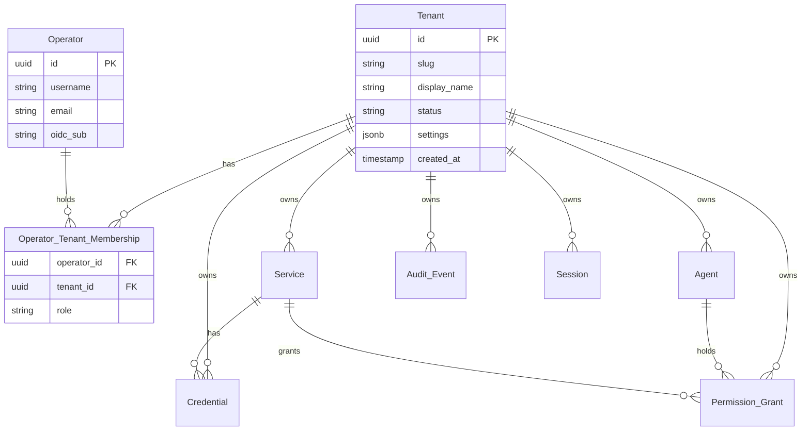

# P‑007 — Multi‑tenancy strategy

**Status**: Accepted (→ [ADR‑0008](../01-architecture/adr/0008-multi-tenancy-row-level-with-db-tier.md)) — 2026-05-10. Selected the recommended **Option E** (row‑level + RLS by default; DB‑per‑tenant opt‑in).

> **Outcome**: Accepted as recommended. Row‑level isolation with Postgres RLS is the default; DB‑per‑tenant is an opt‑in deployment configuration for the high‑isolation tier. ADR‑0008 captures the full decision and the cross‑cutting amendments to ADRs 0003–0007 (JWT `tnt` claim, Vault Adapter contract change, plugin cache key change, sessions become (operator, tenant), AdminJS tenant selector, Keycloak realm‑per‑tenant opt‑in). Phase 1 milestone 1.0 already requires tenant scaffolding; milestone 1.12 verifies cross‑tenant isolation. See [ADR‑0008](../01-architecture/adr/0008-multi-tenancy-row-level-with-db-tier.md).

## Question
Mintkey must support **multi‑tenancy by architecture** (one Mintkey instance can host multiple tenants) while keeping **single‑tenant the primary use case**. What isolation model do we use, and how does it ripple through every component, ADR, and quality‑attribute scenario?

## Context

### What "multi‑tenant by architecture, single‑tenant by default" means
- Every domain entity is tenant‑scoped.
- The default `docker compose up` deploys with **one tenant** (`t_default`), and the UI hides tenant selection so single‑tenant users never see the concept.
- Multi‑tenant deployments turn the tenant selector on; new tenants are provisioned via the Admin REST API or AdminJS by a platform‑admin operator.
- Existing architecture (single‑tenant) is a *degenerate case* of the multi‑tenant model, not a different code path.

### Why this is hard, and why it must be decided now
Adding tenant‑scoping after the fact is significantly more expensive than baking it in from the start:
- Every domain table needs `tenant_id`; retrofitting requires a multi‑step Liquibase migration with backfill and RLS bring‑up.
- Every API endpoint needs a tenant filter; missing one is a cross‑tenant data leak.
- Every cache key, every audit event, every JWT claim, every credential lookup carries `tenant_id`.
- Tests must use multi‑tenant fixtures from day one, or single‑tenant assumptions creep into the codebase.

The user's call to do this in iteration 1 is correct and timely.

### Quality attributes affected
Existing security guarantees ([S‑SEC‑1](../01-architecture/03-quality-attributes.md), [S‑SEC‑2](../01-architecture/03-quality-attributes.md), [S‑SEC‑3](../01-architecture/03-quality-attributes.md)) apply per‑tenant. Three new scenarios are introduced below: **S‑MT‑1** (strict isolation), **S‑MT‑2** (onboarding speed), **S‑MT‑3** (noisy‑neighbor).

### Decisions already made that this proposal touches
- [ADR‑0003](../01-architecture/adr/0003-credential-storage-strategy.md) credential storage — tagged with `tenant_id`; per‑tenant KEK becomes an opt‑in.
- [ADR‑0004](../01-architecture/adr/0004-egress-proxy-kong.md) Egress Proxy plugin — cache keys gain `tenant_id`; JWT `tnt` claim enforced.
- [ADR‑0005](../01-architecture/adr/0005-admin-tech-stack.md) Admin stack — sessions are tenant‑scoped; Keycloak realm‑per‑tenant becomes an opt‑in.
- [ADR‑0006](../01-architecture/adr/0006-token-format-and-binding.md) Token format — JWT gains a `tnt` claim; an addendum or superseding ADR is required after this proposal lands.
- [ADR‑0007](../01-architecture/adr/0007-proxy-deployment-topology.md) Proxy topology — virtual host can optionally include the tenant slug.

## Options

### Option A — Row‑level isolation (`tenant_id` column + Postgres RLS)
Every domain table gets `tenant_id UUID NOT NULL`. Postgres Row Level Security policies enforce tenant filtering at the database layer. Application code always passes `tenant_id`; RLS is the safety net.
- **Pros**: lowest cost; standard SaaS pattern; single Postgres instance, single Liquibase changelog set; operationally simple (backups, upgrades, scaling); RLS catches code bugs at the DB layer.
- **Cons**: largest theoretical blast radius if both code *and* RLS are bypassed; per‑tenant query performance can be tricky at extreme scale; backup‑restore of one tenant requires logical export.

### Option B — Schema‑per‑tenant
Each tenant gets its own Postgres schema (`tenant_<id>`). Same database; same Liquibase changelog applied per schema. Application connects with `search_path` set to the tenant's schema.
- **Pros**: strong DB‑layer isolation; per‑tenant `pg_dump --schema` works; staged migrations possible per tenant.
- **Cons**: schema sprawl; connection pool complexity (per‑tenant pools or `SET search_path` per request); tooling sometimes struggles past a few thousand schemas.

### Option C — Database‑per‑tenant
Each tenant gets its own Postgres database in a shared cluster.
- **Pros**: strongest DB‑level isolation short of separate clusters; per‑tenant `pg_dump`/`pg_restore`; per‑tenant resource limits possible.
- **Cons**: more operational moving pieces; per‑tenant connection pool sizing; harder cross‑tenant analytics (rare for our use case); Liquibase runs against each DB.

### Option D — Instance‑per‑tenant (deployment‑time isolation only)
No multi‑tenancy in code; operators run separate Mintkey instances per tenant.
- **Pros**: zero architectural change; maximum isolation.
- **Cons**: doesn't satisfy the user's stated requirement; higher infrastructure cost; per‑tenant upgrade orchestration.

### Option E — Hybrid: A by default, opt‑in C as "high‑isolation tier"  ★ recommended
Application code is written for Option A (row‑level + RLS). The same code can run in DB‑per‑tenant mode (Option C) by switching `MINTKEY_TENANT_ISOLATION=database` and providing a per‑tenant DB connection map. Most operators never use the high‑isolation mode.
- **Pros**: one codebase covers both cases; default is simple; high‑isolation is an upgrade path, not a fork; matches the user's stance.
- **Cons**: connection management has two modes (single shared pool vs. per‑tenant pool); Liquibase invocation differs (run once vs. per‑tenant); engineers must remember the abstraction.

## Recommendation

**Option E.** Default to row‑level isolation (Option A) with Postgres RLS as the safety net. Provide DB‑per‑tenant (Option C) as an opt‑in deployment configuration for regulated/high‑isolation tenants.

Specific defaults:
- **Default isolation mode**: row‑level (`MINTKEY_TENANT_ISOLATION=row`).
- **Default tenant**: `t_default` created by the seed job; UI hides tenant selection unless the operator has multi‑tenant memberships.
- **Per‑request tenant context**: set `SET LOCAL app.current_tenant = '<uuid>'` at the start of each DB transaction; RLS reads it.
- **High‑isolation tier**: same code, opt‑in deployment.

## Architectural implications (across every container)

### Domain model — `tenant_id` everywhere



Every domain entity gets `tenant_id UUID NOT NULL`. IDs remain ULIDs; tenant scoping is by column, not by ID prefix (avoids ID collisions across tenants).

### Identity service
- New entity **`Tenant`** (id, slug, display_name, status, settings, created_at).
- New entity **`OperatorTenantMembership`** (operator_id, tenant_id, role) — one operator can belong to multiple tenants with different roles per tenant.
- **Sessions** are bound to a single (operator, tenant) pair at a time. Switching tenants either replaces the active tenant in the session or creates a new session.
- **Agents** are owned by exactly one tenant; multi‑tenant agents are explicitly out of scope.
- New role: **`PlatformAdmin`** — operates above tenants, can create/delete tenants, can read cross‑tenant audit. Implementation: a boolean column on `Operator`, not a fake "platform tenant".

### Admin REST API
- Two URL conventions, both supported:
  - **Explicit (canonical)**: `/v1/tenants/{tenant_id}/services` — used in OpenAPI, audit, documentation, machine‑to‑machine calls.
  - **Implicit (convenience)**: `/v1/services` — resolves to the explicit form via the session's active tenant.
- New top‑level resource: `/v1/tenants` (CRUD; only `PlatformAdmin` can create).
- All authorization checks include the active tenant.

### Admin UI (AdminJS)
- Tenant selector in the top nav; visible only when the operator has > 1 tenant membership.
- AdminJS resource queries gain a `where: { tenant_id }` filter applied automatically by middleware based on the active session's tenant.
- New AdminJS resource: `Tenant` (visible to `PlatformAdmin` only).

### MCP Server
- The Agent API Key is **tenant‑scoped** by virtue of the agent's tenant ownership.
- `list_services()` returns only services in the agent's tenant.
- `request_token(service_id, action)` issues a JWT with `tnt = agent.tenant_id`.
- Cross‑tenant tool calls are impossible by construction.

### Credential Broker — JWT `tnt` claim
JWT structure (extends [ADR‑0006](../01-architecture/adr/0006-token-format-and-binding.md)):

```json
{
  "iss": "mintkey/broker",
  "sub": "agent_01HX…",
  "aud": "svc_crm",
  "tnt": "t_acme",
  "scope": "read:contacts",
  "jti": "01HX…",
  "iat": 1715000000,
  "exp": 1715000600
}
```

- Proxy validates `tnt` matches the registered service's `tenant_id` on every request.
- Signing keys: **shared across tenants** in the default deployment. The `tnt` claim is the tenant separator. Per‑tenant signing keys are an opt‑in for high‑isolation tier (Phase 2).

### Vault Adapter (extends [ADR‑0003](../01-architecture/adr/0003-credential-storage-strategy.md))
- Credentials are tagged with `tenant_id`; the Vault Adapter contract becomes `get_credential(tenant_id, service_id, key_version)`.
- KEK strategy:
  - **Default**: shared KEK across tenants; DEK per credential as today.
  - **Opt‑in (Phase 2)**: per‑tenant KEK — each tenant has its own KEK source (separate keyfile, env var, or KMS key); cryptographic tenant isolation.

### Egress Proxy plugin (extends [ADR‑0004](../01-architecture/adr/0004-egress-proxy-kong.md))
- Plugin reads JWT `tnt` claim, looks up service's `tenant_id`, denies on mismatch.
- Cache key changes from `(service_id, key_version)` to `(tenant_id, service_id, key_version)`.
- Audit events tagged with `tenant_id`.
- Kong‑syncer pushes per‑tenant declarative YAML or scopes routes by tenant slug.

### Audit Service
- Every event has `tenant_id`. Audit query is tenant‑scoped (an `Auditor` in tenant A cannot see tenant B's events).
- `PlatformAdmin` can query cross‑tenant audit (for support/forensics) — every such query emits its own audit event with reason.

### Keycloak / OIDC
- **Default**: single Keycloak realm `mintkey`. Tenant membership lives in our DB, not in Keycloak. After OIDC login, we look up the operator's tenant memberships and prompt for tenant selection (or auto‑select if there's only one).
- **Opt‑in high‑isolation**: realm‑per‑tenant. Mintkey detects the realm from the OIDC `iss` claim and maps to the corresponding tenant. Different `OIDC_*` env vars per realm.
- **Per‑tenant external IdP**: enterprise pattern; tenant `t_acme` federates to Acme's Auth0; tenant `t_globex` federates to Globex's Azure AD. Each tenant has its own OIDC config stored in the Vault Adapter.

### Postgres Row Level Security (RLS)
Every domain table:
```sql
ALTER TABLE services ENABLE ROW LEVEL SECURITY;
CREATE POLICY tenant_isolation_services ON services
  USING (tenant_id = current_setting('app.current_tenant')::uuid);
```
Every Admin REST API request issues `SET LOCAL app.current_tenant = '<uuid>';` at the start of its DB transaction (via FastAPI middleware). Same for Vault Adapter, MCP server, etc.

A separate Postgres role `mintkey_app` is the only role used by application code; superuser is reserved for migrations. Even a query that forgets the tenant filter returns no rows from another tenant.

## New quality attribute scenarios

### S‑MT‑1 — Strict tenant isolation
- **Source**: a malicious operator or a coding bug in tenant A.
- **Stimulus**: tries to query/modify tenant B's data via API or via direct DB access from a compromised admin‑api.
- **Environment**: shared‑DB (default) deployment.
- **Artifact**: any Mintkey container with DB access.
- **Response**: query returns zero rows from tenant B; modification rejected with audit event.
- **Response measure**: integration test fuzzes API endpoints with cross‑tenant IDs and asserts 0 leakage; RLS policies cover 100% of domain tables (asserted by an architecture test).

### S‑MT‑2 — Tenant onboarding speed
- **Source**: `PlatformAdmin` operator.
- **Stimulus**: creates a new tenant via API or UI.
- **Environment**: existing Mintkey instance with N existing tenants.
- **Artifact**: Admin REST API, seed job equivalent.
- **Response**: new tenant created, default `Admin` operator provisioned, ready for service registration.
- **Response measure**: ≤ 60 seconds end‑to‑end; tenant count up to 1000 doesn't change this.

### S‑MT‑3 — Noisy‑neighbor isolation (application layer)
- **Source**: tenant A floods Mintkey with 1000 token requests/sec.
- **Stimulus**: high load from one tenant.
- **Environment**: tenant B has normal load.
- **Artifact**: Credential Broker, Egress Proxy.
- **Response**: tenant B's p99 token‑issuance and proxy latency unchanged.
- **Response measure**: p99 broker latency for tenant B ≤ 1.2× baseline under tenant A's flood; per‑tenant rate limits configurable; per‑tenant Postgres `statement_timeout` tunable.

## Threat model additions
- **Cross‑tenant data leakage** (Information Disclosure): mitigated by RLS + code‑level tenant filter + integration tests + architecture test asserting every query gains `tenant_id`.
- **Cross‑tenant token replay**: JWT `tnt` claim + proxy validation prevent a token from tenant A working on tenant B.
- **Privilege escalation across tenants**: an operator's `Admin` role in tenant A grants no access to tenant B; only `PlatformAdmin` spans tenants and is heavily audited.
- **Backup snooping across tenants** (high‑isolation tier): solved by DB‑per‑tenant backup or by per‑tenant KEK so an offline DB read of one tenant's ciphertext doesn't reveal another's plaintext.

## Implications for in‑flight work

| Area | Change |
|---|---|
| [ADR‑0003](../01-architecture/adr/0003-credential-storage-strategy.md) credential storage | Add `tenant_id` to credential rows; Phase 2 opt‑in per‑tenant KEK. |
| [ADR‑0004](../01-architecture/adr/0004-egress-proxy-kong.md) egress proxy | Plugin cache key gains `tenant_id`; JWT `tnt` claim enforced; audit emits `tenant_id`. |
| [ADR‑0005](../01-architecture/adr/0005-admin-tech-stack.md) admin stack | Sessions are (operator, tenant); Keycloak realm‑per‑tenant becomes an opt‑in; new `tenants` resource. |
| [ADR‑0006](../01-architecture/adr/0006-token-format-and-binding.md) token format | JWT gains `tnt`; superseding ADR or amendment after P‑007 lands. |
| [ADR‑0007](../01-architecture/adr/0007-proxy-deployment-topology.md) proxy topology | Optional virtual host: `<service-slug>.<tenant-slug>.proxy.local`. |
| [Container view](../01-architecture/02-container-view.md) | All containers are tenant‑aware; Identity gains `Tenant` and `OperatorTenantMembership`. |
| [Glossary](../00-vision/04-glossary.md) | Add `Tenant`, `OperatorTenantMembership`, `PlatformAdmin`; replace single‑tenant note. |
| [Quality attributes](../01-architecture/03-quality-attributes.md) | Add S‑MT‑1, S‑MT‑2, S‑MT‑3. |
| [Threat model](../01-architecture/05-threat-model.md) | Add cross‑tenant section. |
| [Roadmap](../00-vision/06-roadmap.md) Phase 1 | Tenant scaffolding from milestone 1.0. |

## Open follow‑ups (after acceptance)
- `PlatformAdmin` role implementation: boolean on `operator` (recommended) or a special "platform" tenant.
- Tenant slug vs. tenant UUID in URLs (recommend slug for UX, UUID for stable references; both accepted).
- Per‑tenant Keycloak realm switch: which env vars and config layout.
- Per‑tenant resource limits (rate limits on token issuance, credential count, agent count) — Phase 2.
- Tenant deletion / soft‑delete / data retention policy.
- Tenant data export (GDPR‑style portability).
- Cross‑tenant audit query for `PlatformAdmin` — UI, audit‑of‑audit semantics.

## Related
- All current ADRs (0003, 0004, 0005, 0006, 0007) — receive amendments after this proposal lands.
- [Roadmap](../00-vision/06-roadmap.md) Phase 1 — must include tenant scaffolding.
- [Kiro readiness](../00-vision/07-kiro-readiness.md) — patterns and fixtures must include multi‑tenant scenarios.
